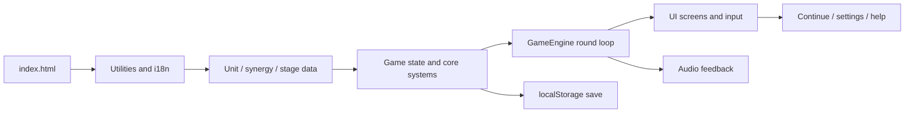
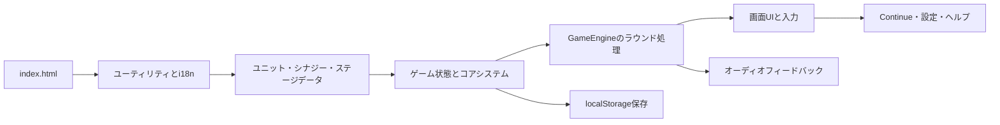
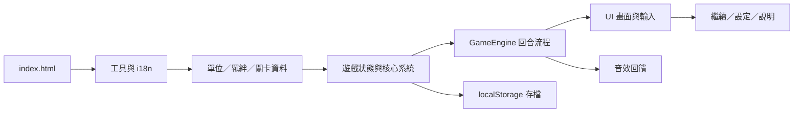

<a id="top"></a>

# 🌟 Starry Sprouts Auto Battler


## 🌍 Opening Summary

### 🇬🇧 English

Starry Sprouts is a cozy, offline, browser-native auto battler built with plain HTML, CSS, and JavaScript. Recruit little creatures, arrange them on the board, feed duplicate cards for experience, trigger synergies, and watch each round resolve automatically.

### 🇯🇵 日本語

『Starry Sprouts』は、HTML・CSS・JavaScriptだけで作られた、オフラインで遊べるブラウザ向けオートバトラーです。小さな仲間を集めて盤面に配置し、重複カードを経験値に変え、シナジーを発動させながら、各ラウンドの自動戦闘を見届けます。

### 🇹🇼 繁體中文

《Starry Sprouts》是一款以純 HTML、CSS 與 JavaScript 製作、可離線遊玩的瀏覽器自走棋。玩家要招募可愛的生物、安排戰鬥位置、餵食同名卡牌取得經驗、啟動羈絆，並觀察每回合自動結算的戰鬥結果。

[🇬🇧 English](#english) · [🇯🇵 日本語](#japanese) · [🇹🇼 繁體中文](#traditional-chinese)

## 🧭 Contents

- [🇬🇧 English](#english)
  - [🎮 Game introduction & features](#english-introduction)
  - [🔁 Gameplay, controls & card economy](#english-gameplay)
  - [⚡ Quick start](#english-quick-start)
  - [🧩 Program overview](#english-architecture)
  - [🗂️ Code organization](#english-files)
  - [🛠️ Supporting systems](#english-systems)
  - [🧪 Testing](#english-testing)
  - [🚧 Status & limitations](#english-status)
- [🇯🇵 日本語](#japanese)
  - [🎮 ゲーム紹介と特徴](#japanese-introduction)
  - [🔁 遊び方・操作・カード経済](#japanese-gameplay)
  - [⚡ クイックスタート](#japanese-quick-start)
  - [🧩 プログラム概要](#japanese-architecture)
  - [🗂️ コード構成](#japanese-files)
  - [🛠️ 周辺システム](#japanese-systems)
  - [🧪 テスト](#japanese-testing)
  - [🚧 現状と制限](#japanese-status)
- [🇹🇼 繁體中文](#traditional-chinese)
  - [🎮 遊戲介紹與特色](#chinese-introduction)
  - [🔁 玩法、操作與卡牌經濟](#chinese-gameplay)
  - [⚡ 快速開始](#chinese-quick-start)
  - [🧩 程式總覽](#chinese-architecture)
  - [🗂️ 程式碼結構](#chinese-files)
  - [🛠️ 周邊系統](#chinese-systems)
  - [🧪 測試](#chinese-testing)
  - [🚧 目前狀態與限制](#chinese-status)

<a id="english"></a>

## 🇬🇧 English

<a id="english-introduction"></a>

### 🎮 Game introduction & features

Starry Sprouts is a small, single-player auto battler designed to run directly from <code>index.html</code>. The game focuses on readable preparation decisions and a compact card economy.

| Feature | What it does |
| --- | --- |
| 🐾 Creature roster | Ten unit types live in <code>js/data/units.js</code>, with base stats, race, class, and a one-star shop price. |
| 🧱 Board building | Place units on the battle area, move them back to the bench, and manage up to eight bench slots. |
| 🌈 Synergies | Ten race/class synergies use thresholds of two and three units; the strongest active threshold is displayed. |
| ⚔️ Auto battle | Units choose targets, attack, spend mana, and use skills while the battle simulation advances in small time steps. |
| ⭐ Card progression | Same-name cards across the board and bench feed the selected keeper, regardless of their current star. |
| 💰 Economy | Buy cards, refresh the shop, earn round income and interest, and purchase a global card-EXP offer. |
| 🎨 Presentation | Six themes, three locales, responsive layouts, generated Web Audio feedback, and mobile-friendly controls are included. |

<a id="english-gameplay"></a>

### 🔁 Gameplay, controls & card economy

#### Round loop

1. During preparation, inspect the shop and board, buy or sell cards, and arrange units.
2. Select a card and choose a board tile to place it. Desktop also supports drag-and-drop through <code>js/ui/dragDrop.js</code>.
3. Board capacity is <code>min(8, level + 2)</code> and the bench holds up to eight cards.
4. Start the round when the preparation timer is ready. Battle resolves up to 360 simulation ticks at a <code>0.1</code>-second step.
5. After combat, collect settlement income and review the result. While waiting for Continue/Resume, the next preparation countdown stays paused.

#### Five-star EXP rules

The project-local [<code>card-experience-economy</code> skill](.agents/skills/card-experience-economy/SKILL.md) is the canonical maintenance guide for these rules.

| Rule | Current behavior |
| --- | --- |
| Same-name grouping | Group by <code>typeId</code> across both the battle board and bench. |
| Keeper selection | Keep the highest-star copy; tie-break with highest EXP, then prefer a board copy. |
| Feeding | Consume every other same-name copy and grant the keeper <code>+1</code> card EXP, regardless of consumed star. |
| Star-up thresholds | <code>1★ → 2★: 2 EXP</code>, <code>2★ → 3★: 3 EXP</code>, <code>3★ → 4★: 4 EXP</code>, <code>4★ → 5★: 5 EXP</code>. |
| Maximum | Five stars is the cap. Extra duplicates remain distinct instead of creating an illegal sixth star. |
| Overflow | A threshold raises one star and resets stored EXP for the new tier. |
| Purchase EXP | The global offer adds EXP to every owned card, then runs the same merge pipeline. |

The card coefficient is <code>1</code>, <code>1.8</code>, <code>3.2</code>, <code>4.8</code>, and <code>6.8</code> for one through five stars. Shop prices use <code>1×</code>, <code>2×</code>, <code>4×</code>, <code>7×</code>, and <code>11×</code> star multipliers; the unit base price remains the one-star value.

| Highest owned star | Gold cost | EXP added to every card |
| ---: | ---: | ---: |
| 1★ | 4 | 4 |
| 2★ | 6 | 3 |
| 3★ | 8 | 2 |
| 4★ | 10 | 1 |
| 5★ | 12 | 1 |

#### Battle and economy basics

- Damage uses <code>max(1, attack × (1 - defense / (defense + 100)))</code>.
- Dead units immediately become <code>alive = false</code>, <code>dead = true</code>, and zero health.
- The shop contains five offers; refreshing costs two gold.
- Settlement starts with five gold, adds one interest gold per ten saved gold up to five, and adds streak bonuses at three and five wins or losses.
- Stage data has seven patterns. After stage seven, patterns repeat; enemy scale grows by <code>1 + (round - 1) × 0.055</code>.

<a id="english-quick-start"></a>

### ⚡ Quick start

```powershell
# From the repository root
npm test
```

Then open [<code>index.html</code>](index.html) in a modern browser. There is no bundler, build step, CDN dependency, or server requirement for the basic offline experience.

1. Choose a theme and language from Settings if desired.
2. Buy cards from the shop and place them on the board.
3. Check the capacity indicator before adding another unit.
4. Collect same-name cards across board and bench and let automatic feeding raise EXP and stars.
5. Buy the card-EXP offer when its displayed cost and reward fit the economy.
6. Continue to the next round after checking the battle result.

<a id="english-architecture"></a>

### 🧩 Program overview

The application is dependency-light: <code>index.html</code> loads utilities and language data, then game data, core systems, audio, UI modules, and <code>js/main.js</code>.



<code>GameEngine</code> coordinates central state and the round lifecycle. <code>BoardSystem</code>, <code>ShopSystem</code>, <code>EconomySystem</code>, <code>SynergySystem</code>, and <code>BattleSystem</code> keep responsibilities separated, while UI modules render state and dispatch player actions.

<a id="english-files"></a>

### 🗂️ Code organization

| Path | Responsibility |
| --- | --- |
| [<code>index.html</code>](index.html) | Screen markup, responsive layout hooks, script loading, and UI data attributes. |
| [<code>js/core/gameState.js</code>](js/core/gameState.js) | Default state, normalization, player health/level/round data, and safe state shape. |
| [<code>js/core/gameEngine.js</code>](js/core/gameEngine.js) | Round lifecycle, preparation countdown, battle transition, result pause, Continue flow, and autosave. |
| [<code>js/core/boardSystem.js</code>](js/core/boardSystem.js) | Board/bench placement, capacity checks, duplicate feeding, star-up events, and movement. |
| [<code>js/core/shopSystem.js</code>](js/core/shopSystem.js) | Shop generation, calculated star prices, buying, selling, refreshing, and EXP offers. |
| [<code>js/core/economySystem.js</code>](js/core/economySystem.js) | Gold income, interest, streak rewards, and round settlement. |
| [<code>js/core/battleSystem.js</code>](js/core/battleSystem.js) | Target selection, attacks, skills, mana, damage, ticks, and immediate death handling. |
| [<code>js/core/synergySystem.js</code>](js/core/synergySystem.js) | Board-only race/class counts and active synergy effects. |
| [<code>js/data/*.js</code>](js/data/units.js) | Units, synergies, items, and seven-stage encounter patterns. |
| [<code>js/ui/*.js</code>](js/ui/gameUI.js) | Menus, board/shop rendering, help/settings screens, drag-and-drop, and messages. |
| [<code>js/i18n/*.js</code>](js/i18n/i18n.js) | Traditional Chinese, English, Japanese translations, and locale lookup. |
| [<code>js/audio/audioManager.js</code>](js/audio/audioManager.js) | Web Audio API tones, BGM state, SFX, mute, and volume controls. |
| [<code>js/utils/storage.js</code>](js/utils/storage.js) | <code>autobattler_save</code>, <code>autobattler_settings</code>, and memory fallback. |
| [<code>tests/core.test.js</code>](tests/core.test.js) | Node regression tests for data, economy, board, battle, save, and round flow. |
| [<code>.agents/skills/card-experience-economy/SKILL.md</code>](.agents/skills/card-experience-economy/SKILL.md) | Maintainer guidance for card EXP, stars, prices, and purchase economy. |

<a id="english-systems"></a>

### 🛠️ Supporting systems

- **Localization:** <code>zh-TW</code>, <code>en</code>, and <code>ja</code> share UI keys. New economy labels belong in all three language files.
- **Themes and settings:** Cute, ocean, sunset, forest, galaxy, and dark themes are selectable. Battle speed supports <code>1×</code>/<code>2×</code>; targeting supports nearest and lowest-health strategies.
- **Audio:** The audio manager creates oscillator-based tones rather than relying on external sound files. It tracks menu, preparation, battle, and result music plus click, buy, place, merge, victory, and defeat effects.
- **Persistence:** Saves use <code>autobattler_save</code>; settings use <code>autobattler_settings</code>. Load paths normalize incomplete state and fall back to memory when storage is unavailable.
- **Responsive input:** Desktop placement supports drag-and-drop, while select-then-place also works on touch-sized layouts.
- **Data-driven encounters:** Units, synergy thresholds, items, and stage patterns live outside the engine so balance changes stay localized.

<a id="english-testing"></a>

### 🧪 Testing

Run the regression suite with:

```powershell
npm test
```

The current suite contains eight tests covering unit data and prices, five-star thresholds, cross-board/bench feeding, maximum-star behavior, shop and economy rules, global card-EXP offers, synergies, immediate death, return-to-bench, countdown pause, save/load, and Continue behavior. For a broader local check, validate every JavaScript file with <code>node --check</code> and run the skill validator against <code>.agents/skills/card-experience-economy</code>.

<a id="english-status"></a>

### 🚧 Status & limitations

The core offline loop is implemented and documented: prepare, buy, place, merge, fight, settle, save, and continue. This is intentionally a single-player browser prototype with no backend, account service, online multiplayer, matchmaking, or network save synchronization. Stage patterns repeat after the seventh pattern, and there is no production bundler or deployment pipeline; the browser loads source files directly.
<a id="japanese"></a>

## 🇯🇵 日本語

<a id="japanese-introduction"></a>

### 🎮 ゲーム紹介と特徴

『Starry Sprouts』は、<code>index.html</code>を直接開いて遊べる小規模なシングルプレイ・オートバトラーです。準備フェーズでの判断と、分かりやすいカード経済を中心に設計されています。

| 機能 | 内容 |
| --- | --- |
| 🐾 仲間の種類 | <code>js/data/units.js</code>に10種類のユニットがあり、基礎ステータス、種族、クラス、1つ星価格を持ちます。 |
| 🧱 盤面構築 | 戦闘エリアへの配置、ベンチへの回収、最大8枠のベンチ管理に対応します。 |
| 🌈 シナジー | 10種類の種族・クラスシナジーがあり、2体と3体のしきい値を使います。最も強い有効しきい値が表示されます。 |
| ⚔️ 自動戦闘 | ユニットが対象を選び、攻撃し、マナを使い、スキルを発動しながらシミュレーションを進めます。 |
| ⭐ カード成長 | 盤面とベンチにある同名カードを自動的にまとめ、星に関係なく経験値として育成できます。 |
| 💰 経済システム | カード購入、ショップ更新、ラウンド収入、利子、全カード経験値購入を管理します。 |
| 🎨 表現 | 6種類のテーマ、3言語、レスポンシブ画面、Web Audioによる効果音、モバイル向け操作を備えています。 |

<a id="japanese-gameplay"></a>

### 🔁 遊び方・操作・カード経済

#### ラウンドの流れ

1. 準備中にショップと盤面を確認し、カードを購入・売却して配置を整えます。
2. カードを選んで盤面のタイルを選択します。デスクトップでは<code>js/ui/dragDrop.js</code>のドラッグ＆ドロップも利用できます。
3. 盤面の配置可能数は<code>min(8, level + 2)</code>、ベンチは最大8枚です。
4. 準備時間が終わったらラウンドを開始します。戦闘は<code>0.1</code>秒刻みで最大360ティックまで進みます。
5. 戦闘後に報酬を受け取り、結果を確認します。Continue/Resumeを押して次へ進むまでは、次の準備カウントダウンは停止します。

#### 5つ星までの経験値ルール

このルールの保守基準は、プロジェクト内の[<code>card-experience-economy</code> skill](.agents/skills/card-experience-economy/SKILL.md)にまとめています。

| ルール | 現在の動作 |
| --- | --- |
| 同名グループ | <code>typeId</code>単位で、盤面とベンチの両方からカードをまとめます。 |
| 残すカード | 星が高いもの、次に現在経験値が高いもの、最後に盤面にあるものを優先します。 |
| 経験値化 | 残りの同名カードをすべて消費し、星に関係なく1枚につき<code>+1</code>経験値を残すカードへ加えます。 |
| 星上げ条件 | <code>1★ → 2★: 2 EXP</code>、<code>2★ → 3★: 3 EXP</code>、<code>3★ → 4★: 4 EXP</code>、<code>4★ → 5★: 5 EXP</code>です。 |
| 上限 | 5つ星が上限です。余った重複カードは不正な6つ星を作らず、別カードとして残ります。 |
| 超過処理 | 条件を満たすと1段階上がり、新しい星の経験値は0に戻ります。 |
| 購入経験値 | カード経験値を購入すると、所持する全カードへ経験値を加え、その後に同じ統合処理を実行します。 |

星ごとの係数は1、1.8、3.2、4.8、6.8です。ショップ価格は星に応じて<code>1×</code>、<code>2×</code>、<code>4×</code>、<code>7×</code>、<code>11×</code>となり、ユニットの基礎価格は1つ星価格として使われます。

| 所持最高星 | ゴールド | 全カードへの追加EXP |
| ---: | ---: | ---: |
| 1★ | 4 | 4 |
| 2★ | 6 | 3 |
| 3★ | 8 | 2 |
| 4★ | 10 | 1 |
| 5★ | 12 | 1 |

#### 戦闘と経済の基本

- ダメージは<code>max(1, attack × (1 - defense / (defense + 100)))</code>で計算します。
- 倒れたユニットはすぐに<code>alive = false</code>、<code>dead = true</code>、体力0となり、戦闘から外れます。
- ショップは常に5枠で、更新費用は2ゴールドです。
- ラウンド収入は5ゴールドから始まり、10ゴールドごとに利子1、最大5ゴールドまで加算されます。3連勝・3連敗と5連勝・5連敗にはストリーク報酬があります。
- ステージパターンは7種類あり、7を超えると繰り返します。敵の倍率は<code>1 + (round - 1) × 0.055</code>で上昇します。

<a id="japanese-quick-start"></a>

### ⚡ クイックスタート

```powershell
# リポジトリのルートで実行
npm test
```

その後、モダンブラウザで[<code>index.html</code>](index.html)を開いてください。基本的なオフライン体験にバンドラー、ビルド工程、CDN、サーバーは必要ありません。

1. 必要ならSettingsでテーマと言語を選びます。
2. ショップでカードを購入し、盤面へ配置します。
3. 新しいユニットを置く前に配置数インジケーターを確認します。
4. 盤面とベンチで同名カードを集め、自動統合で経験値と星を上げます。
5. 表示された費用と報酬を見て、全カード経験値を購入します。
6. 戦闘結果を確認してから、次のラウンドへ進みます。

<a id="japanese-architecture"></a>

### 🧩 プログラム概要

依存を最小限にした構成です。<code>index.html</code>がユーティリティと言語データ、ゲームデータ、コアシステム、オーディオ、UI、最後に<code>js/main.js</code>を順番に読み込みます。



<code>GameEngine</code>が中央の状態とラウンドを調整します。<code>BoardSystem</code>、<code>ShopSystem</code>、<code>EconomySystem</code>、<code>SynergySystem</code>、<code>BattleSystem</code>は責務を分担し、UIモジュールが状態を描画してプレイヤー操作を伝えます。

<a id="japanese-files"></a>

### 🗂️ コード構成

| パス | 役割 |
| --- | --- |
| [<code>index.html</code>](index.html) | 画面のHTML、レスポンシブ用フック、スクリプト読み込み、UI用データ属性。 |
| [<code>js/core/gameState.js</code>](js/core/gameState.js) | 初期状態、状態の正規化、体力・レベル・ラウンド情報、安全な状態構造。 |
| [<code>js/core/gameEngine.js</code>](js/core/gameEngine.js) | ラウンド、準備カウントダウン、戦闘遷移、結果停止、Continue、オートセーブ。 |
| [<code>js/core/boardSystem.js</code>](js/core/boardSystem.js) | 盤面・ベンチ配置、容量確認、重複カード統合、星上げ、移動。 |
| [<code>js/core/shopSystem.js</code>](js/core/shopSystem.js) | ショップ生成、星別価格、購入・売却・更新、経験値オファー。 |
| [<code>js/core/economySystem.js</code>](js/core/economySystem.js) | ゴールド収入、利子、ストリーク報酬、ラウンド精算。 |
| [<code>js/core/battleSystem.js</code>](js/core/battleSystem.js) | 対象選択、攻撃、スキル、マナ、ダメージ、ティック、即時死亡。 |
| [<code>js/core/synergySystem.js</code>](js/core/synergySystem.js) | 盤面にいるユニットの種族・クラス数と有効効果。 |
| [<code>js/data/*.js</code>](js/data/units.js) | ユニット、シナジー、アイテム、7種類のステージ遭遇パターン。 |
| [<code>js/ui/*.js</code>](js/ui/gameUI.js) | メニュー、盤面・ショップ、ヘルプ・設定、ドラッグ＆ドロップ、メッセージ。 |
| [<code>js/i18n/*.js</code>](js/i18n/i18n.js) | 繁体字中国語、英語、日本語の翻訳とロケール検索。 |
| [<code>js/audio/audioManager.js</code>](js/audio/audioManager.js) | Web Audio APIの音、BGM状態、効果音、ミュート、音量。 |
| [<code>js/utils/storage.js</code>](js/utils/storage.js) | <code>autobattler_save</code>と<code>autobattler_settings</code>の保存、メモリフォールバック。 |
| [<code>tests/core.test.js</code>](tests/core.test.js) | データ、経済、盤面、戦闘、保存、ラウンド処理のNode回帰テスト。 |
| [<code>.agents/skills/card-experience-economy/SKILL.md</code>](.agents/skills/card-experience-economy/SKILL.md) | カード経験値、星、価格、購入経済の保守ガイド。 |

<a id="japanese-systems"></a>

### 🛠️ 周辺システム

- **多言語:** <code>zh-TW</code>、<code>en</code>、<code>ja</code>は同じUIキーを共有します。経済に関する表示を追加するときは3言語すべてを更新します。
- **テーマと設定:** Cute、Ocean、Sunset、Forest、Galaxy、Darkの6テーマ、戦闘速度<code>1×</code>/<code>2×</code>、Nearest/Lowestの対象戦略を選択できます。
- **オーディオ:** 外部音声ファイルではなくオシレーター音を生成します。メニュー、準備、戦闘、結果のBGM状態と、クリック・購入・配置・統合・勝利・敗北の効果音を管理します。
- **保存:** <code>autobattler_save</code>にゲーム、<code>autobattler_settings</code>に設定を保存します。古い状態や不足した値を正規化し、ブラウザ保存が使えない場合はメモリへ退避します。
- **レスポンシブ入力:** デスクトップのドラッグ＆ドロップに加え、タッチサイズの画面でも選択して配置する操作が使えます。
- **データ駆動:** ユニット、シナジー、アイテム、ステージパターンをエンジンから分離し、バランス調整を局所化しています。

<a id="japanese-testing"></a>

### 🧪 テスト

回帰テストは次のコマンドで実行します。

```powershell
npm test
```

現在の8テストは、ユニットデータと価格、5つ星までの条件、盤面とベンチをまたぐ統合、最大星、ショップと経済、全カード経験値オファー、シナジー、即時死亡、ベンチ回収、カウントダウン停止、保存・読み込み、Continueを確認します。追加のローカル確認として、全JavaScriptに<code>node --check</code>を実行し、<code>.agents/skills/card-experience-economy</code>をskill validatorで検証できます。

<a id="japanese-status"></a>

### 🚧 現状と制限

準備、購入、配置、統合、戦闘、精算、保存、Continueまでのオフラインコアループを実装・文書化しています。これはシングルプレイのブラウザプロトタイプで、バックエンド、アカウント、オンライン対戦、マッチメイキング、ネットワーク同期セーブはありません。ステージパターンは7種類目以降に繰り返され、プロダクション用のバンドラーやデプロイ工程はなく、ブラウザがソースを直接読み込みます。

<a id="traditional-chinese"></a>

## 🇹🇼 繁體中文

<a id="chinese-introduction"></a>

### 🎮 遊戲介紹與特色

《Starry Sprouts》是一款可以直接開啟<code>index.html</code>遊玩的單人自走棋。核心體驗放在準備階段的配置判斷，以及清楚易懂的卡牌經濟循環。

| 功能 | 說明 |
| --- | --- |
| 🐾 生物陣容 | <code>js/data/units.js</code>定義10種單位，包含基礎能力、種族、職業與一星商店價格。 |
| 🧱 盤面建構 | 可以將單位放上戰鬥區、收回備戰區，備戰區最多8格。 |
| 🌈 羈絆 | 共有10種種族／職業羈絆，啟動門檻為2與3隻，畫面顯示目前最高有效門檻。 |
| ⚔️ 自動戰鬥 | 單位會選擇目標、攻擊、消耗法力並施放技能，戰鬥由模擬器自動推進。 |
| ⭐ 卡牌成長 | 戰鬥區與備戰區的同名卡牌會自動集中處理，不論星數都能轉成經驗。 |
| 💰 經濟系統 | 管理購牌、刷新商店、回合收入、利息，以及購買全卡牌經驗。 |
| 🎨 視覺與操作 | 提供6種主題、3種語言、響應式畫面、Web Audio 音效與適合手機的操作。 |

<a id="chinese-gameplay"></a>

### 🔁 玩法、操作與卡牌經濟

#### 回合流程

1. 準備階段查看商店與盤面，購買／出售卡牌並整理配置。
2. 點選卡牌後選擇盤面格子即可放置；桌面版也支援<code>js/ui/dragDrop.js</code>提供的拖放操作。
3. 可上場數量為<code>min(8, level + 2)</code>，備戰區最多8張卡牌。
4. 準備時間結束後開始回合；戰鬥以<code>0.1</code>秒為一步，最多模擬360個 tick。
5. 戰鬥結束後領取結算收入並查看結果。在玩家按下繼續／恢復以前，下一回合的準備倒數會維持暫停。

#### 五星經驗規則

這套規則的維護基準整理在專案內的[<code>card-experience-economy</code> skill](.agents/skills/card-experience-economy/SKILL.md)。

| 規則 | 目前行為 |
| --- | --- |
| 同名分組 | 以<code>typeId</code>為單位，同時搜尋戰鬥區與備戰區。 |
| 保留卡牌 | 先保留星數最高者；同星時保留目前經驗較高者；再同分則優先保留戰鬥區卡牌。 |
| 吃卡 | 其餘同名卡牌全部被吃掉，不論被吃卡牌星數為何，每張提供保留卡牌<code>+1</code>經驗。 |
| 升星門檻 | <code>1★ → 2★：2 EXP</code>、<code>2★ → 3★：3 EXP</code>、<code>3★ → 4★：4 EXP</code>、<code>4★ → 5★：5 EXP</code>。 |
| 最高星數 | 最高為5星；多出的重複卡牌會保留成獨立卡牌，不會產生非法的6星。 |
| 經驗溢出 | 達到門檻後升一星，並將新星級的目前經驗重設為0。 |
| 購買經驗 | 購買卡牌經驗會提升所有持有卡牌的經驗，接著執行相同的自動合併流程。 |

一到五星的卡牌係數依序為1、1.8、3.2、4.8、6.8。商店價格依星數套用<code>1×</code>、<code>2×</code>、<code>4×</code>、<code>7×</code>、<code>11×</code>倍率，單位的基礎價格就是一星價格。

| 目前最高星數 | 金幣價格 | 所有卡牌增加經驗 |
| ---: | ---: | ---: |
| 1★ | 4 | 4 |
| 2★ | 6 | 3 |
| 3★ | 8 | 2 |
| 4★ | 10 | 1 |
| 5★ | 12 | 1 |

#### 戰鬥與經濟基礎

- 傷害公式為<code>max(1, attack × (1 - defense / (defense + 100)))</code>。
- 單位倒下後會立即設為<code>alive = false</code>、<code>dead = true</code>並將生命值設為0，不再參與戰鬥。
- 商店同時提供5個商品，刷新商店需要2金幣。
- 回合結算基本收入為5金幣；每存有10金幣增加1利息，最多5金幣；三連勝／三連敗與五連勝／五連敗會提供連勝獎勵。
- 關卡資料有7種戰鬥模式，第7種之後會循環；敵人倍率依<code>1 + (round - 1) × 0.055</code>成長。

<a id="chinese-quick-start"></a>

### ⚡ 快速開始

```powershell
# 在專案根目錄執行
npm test
```

接著用現代瀏覽器開啟[<code>index.html</code>](index.html)。基本離線玩法不需要 bundler、建置步驟、CDN 或伺服器。

1. 需要時先到設定選擇主題與語言。
2. 從商店購買幾張卡牌並放到戰鬥區。
3. 再放置單位前先確認畫面上的可上場數量。
4. 讓戰鬥區與備戰區的同名卡牌集中，自動合併會提升經驗與星數。
5. 根據畫面顯示的價格與獎勵，決定是否購買全卡牌經驗。
6. 查看戰鬥結果後，再繼續下一回合。

<a id="chinese-architecture"></a>

### 🧩 程式總覽

專案刻意維持低依賴：<code>index.html</code>先載入工具與語言資料，再載入遊戲資料、核心系統、音效、UI 模組，最後進入<code>js/main.js</code>。



<code>GameEngine</code>負責協調中央狀態與回合生命週期；<code>BoardSystem</code>、<code>ShopSystem</code>、<code>EconomySystem</code>、<code>SynergySystem</code>、<code>BattleSystem</code>各自負責獨立領域，UI 模組則負責呈現狀態並傳遞玩家操作。

<a id="chinese-files"></a>

### 🗂️ 程式碼結構

| 路徑 | 職責 |
| --- | --- |
| [<code>index.html</code>](index.html) | 畫面 HTML、響應式版面掛勾、腳本載入，以及 UI 使用的資料屬性。 |
| [<code>js/core/gameState.js</code>](js/core/gameState.js) | 初始狀態、狀態正規化、生命／等級／回合資料與安全狀態結構。 |
| [<code>js/core/gameEngine.js</code>](js/core/gameEngine.js) | 回合生命週期、準備倒數、戰鬥切換、結果暫停、繼續流程與自動存檔。 |
| [<code>js/core/boardSystem.js</code>](js/core/boardSystem.js) | 戰鬥區／備戰區放置、容量檢查、同名吃卡、升星事件與單位移動。 |
| [<code>js/core/shopSystem.js</code>](js/core/shopSystem.js) | 商店生成、星級價格、購買／出售／刷新，以及卡牌經驗商品。 |
| [<code>js/core/economySystem.js</code>](js/core/economySystem.js) | 金幣收入、利息、連勝獎勵與回合結算。 |
| [<code>js/core/battleSystem.js</code>](js/core/battleSystem.js) | 目標選擇、攻擊、技能、法力、傷害、tick 與立即死亡處理。 |
| [<code>js/core/synergySystem.js</code>](js/core/synergySystem.js) | 只計算戰鬥區單位的種族／職業數量與啟動效果。 |
| [<code>js/data/*.js</code>](js/data/units.js) | 單位、羈絆、道具與7種關卡遭遇模式。 |
| [<code>js/ui/*.js</code>](js/ui/gameUI.js) | 選單、盤面／商店、說明／設定、拖放操作與玩家訊息。 |
| [<code>js/i18n/*.js</code>](js/i18n/i18n.js) | 繁體中文、英文、日文翻譯與語系查找。 |
| [<code>js/audio/audioManager.js</code>](js/audio/audioManager.js) | Web Audio API 音調、BGM 狀態、音效、靜音與音量控制。 |
| [<code>js/utils/storage.js</code>](js/utils/storage.js) | <code>autobattler_save</code>與<code>autobattler_settings</code>持久化，以及記憶體備援。 |
| [<code>tests/core.test.js</code>](tests/core.test.js) | 資料、經濟、盤面、戰鬥、存檔與回合流程的 Node 回歸測試。 |
| [<code>.agents/skills/card-experience-economy/SKILL.md</code>](.agents/skills/card-experience-economy/SKILL.md) | 卡牌經驗、星數、價格與購買經濟的維護指南。 |

<a id="chinese-systems"></a>

### 🛠️ 周邊系統

- **多語系:** <code>zh-TW</code>、<code>en</code>、<code>ja</code>共用同一組 UI key；新增經濟相關文字時，三份語言檔都要同步更新。
- **主題與設定:** 可選 Cute、Ocean、Sunset、Forest、Galaxy、Dark 六種主題；戰鬥速度為<code>1×</code>／<code>2×</code>；目標策略為最近或最低生命值。
- **音效:** 不依賴外部音檔，而是用振盪器產生 Web Audio 音效；管理選單、準備、戰鬥、結果 BGM 狀態，以及點擊、購買、放置、合併、勝利、失敗音效。
- **持久化:** 遊戲存檔使用<code>autobattler_save</code>，設定使用<code>autobattler_settings</code>；載入時會正規化舊版或不完整狀態，瀏覽器儲存不可用時改用記憶體備援。
- **響應式輸入:** 桌面支援拖放，觸控尺寸畫面也可以使用先選取、再放置的流程。
- **資料驅動:** 單位、羈絆、道具與關卡模式和引擎分離，平衡調整可以集中在對應資料檔。

<a id="chinese-testing"></a>

### 🧪 測試

使用以下指令執行回歸測試：

```powershell
npm test
```

目前共8項測試，涵蓋單位資料與價格、五星門檻、跨戰鬥區／備戰區吃卡、最高星數、商店與經濟規則、全卡牌經驗商品、羈絆、立即死亡、收回備戰區、倒數暫停、存檔／讀檔與繼續流程。若要做更完整的本機檢查，可對所有 JavaScript 執行<code>node --check</code>，並用 skill validator 驗證<code>.agents/skills/card-experience-economy</code>。

<a id="chinese-status"></a>

### 🚧 目前狀態與限制

目前已完成並記錄準備、購買、放置、合併、戰鬥、結算、存檔與繼續的離線核心循環。本專案定位是單人瀏覽器原型，不包含後端、帳號、線上多人、配對、網路同步存檔或伺服器服務。第7種關卡模式之後會循環，且沒有正式產品用 bundler 或部署流程，瀏覽器會直接載入原始檔案。

## 🌟 Closing Summary

### 🇬🇧 English

The project is ready to be explored as a lightweight offline auto battler and maintained through the new card-economy skill. Keep the five-star rules, price curve, localization keys, save compatibility, and regression tests aligned whenever the economy changes.

### 🇯🇵 日本語

このプロジェクトは、軽量なオフライン・オートバトラーとして遊べる状態になっており、新しいカード経済skillを使って保守できます。経済を変更するときは、5つ星ルール、価格曲線、翻訳キー、保存互換性、回帰テストを一緒に更新してください。

### 🇹🇼 繁體中文

本專案已具備可直接體驗的輕量離線自走棋循環，也透過新的卡牌經濟 skill 建立後續維護依據。未來調整經濟時，請同步維護五星規則、價格曲線、語系 key、存檔相容性與回歸測試。

[🔝 Back to top](#top)
