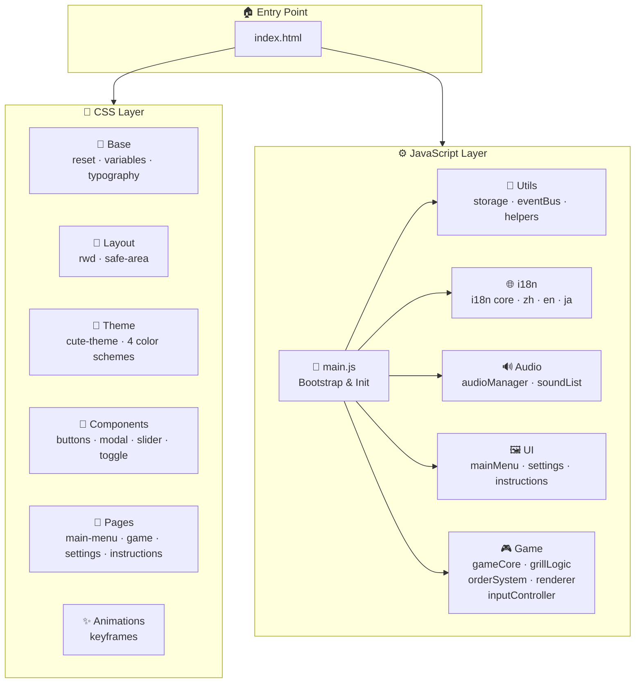

<p align="center">
  
  
  
  
</p>

<h1 align="center">🍖 Barbecue Party 烤肉樂園 バーベキューパーティー</h1>

<p align="center">
  <b>A kawaii cooking arcade game — grill, flip, and serve! 🎮</b><br/>
  可愛風休閒烤肉模擬遊戲 ── 翻面、控火、出餐！<br/>
  かわいいクッキングアーケードゲーム ── 焼いて、ひっくり返して、提供しよう！
</p>

<p align="center">
  🌐 <a href="#-english">English</a> ｜ <a href="#-日本語">日本語</a> ｜ <a href="#-繁體中文">繁體中文</a>
</p>

---

<!-- ============================================================ -->
<!-- ENGLISH -->
<!-- ============================================================ -->

# 🇺🇸 English

## 📑 Table of Contents

| 🏷️ Section | 📌 Quick Jump |
|---|---|
| 🎮 Game Introduction | [Jump ↓](#-game-introduction) |
| 🕹️ How to Play | [Jump ↓](#️-how-to-play) |
| 🚀 Quick Start | [Jump ↓](#-quick-start) |
| 🏗️ Project Architecture | [Jump ↓](#️-project-architecture) |
| 📁 File Structure | [Jump ↓](#-file-structure) |
| 🧩 Module Categories | [Jump ↓](#-module-categories) |
| 🎨 Color Themes | [Jump ↓](#-color-themes) |
| 🌐 Internationalization | [Jump ↓](#-internationalization) |
| 📱 Responsive Design | [Jump ↓](#-responsive-design) |
| 🔊 Audio System | [Jump ↓](#-audio-system) |
| 💾 Save System | [Jump ↓](#-save-system) |
| 📜 License | [Jump ↓](#-license) |

---

### 🎮 Game Introduction

> **Barbecue Party** is a **kawaii-style casual cooking simulation game** built entirely with vanilla HTML5, CSS3, and JavaScript — **zero dependencies, zero build tools**. Just double-click `index.html` and start grilling! 🔥

| 📋 Item | 📝 Details |
|---|---|
| 🏷️ Name | Barbecue Party 烤肉樂園 |
| 🎯 Genre | Casual Simulation / Cooking Arcade |
| 🎨 Art Style | Kawaii + Semi-realistic grill textures |
| 💻 Tech Stack | HTML5 Canvas + CSS3 + Vanilla JS (ES6+) |
| 📦 Dependencies | **None!** Zero npm, zero build |
| 🌐 Languages | 🇹🇼 Traditional Chinese · 🇺🇸 English · 🇯🇵 Japanese |
| 📱 Platforms | Desktop & Mobile browsers |
| 🎵 Music | Procedurally generated piano BGM via Web Audio API |

#### ✨ Key Features

- 🍖 **5 Types of Food** — Pork belly, corn, mushroom, shrimp, sausage
- 🔥 **5-Stage Doneness** — Raw → Searing → Ready → Perfect → Burnt
- 📋 **Order System** — Fulfill customer orders for bonus points & combos
- 🎨 **4 Color Themes** — Charcoal, Marshmallow, Night Market, Ocean Breeze
- 💾 **Auto-Save** — Progress saved to LocalStorage automatically
- 🌐 **Trilingual i18n** — Switch languages in real-time
- 😊 **Cute Faces on Food** — Food items have adorable expressions!
- 🎵 **Procedural BGM** — No audio files needed, generated with oscillators

---

### 🕹️ How to Play

#### 🔰 Basic Flow

```
🥩 Place food    →    🔥 Wait & watch    →    ↺ Flip    →    ⭐ Serve!
   on the grill        the doneness bar        at right time     when perfect
```

#### 📖 Step-by-Step Guide

| Step | Action | 💡 Tip |
|:---:|---|---|
| 1️⃣ | **Select food** from the bottom tray (🥩🌽🍄🦐🌭) | Choose based on the current order! |
| 2️⃣ | **Tap an empty grill slot** to place the food | You have 6 slots (3×2 grid) |
| 3️⃣ | **Watch the progress bars** — each side has its own bar | Green = ready, keep watching! |
| 4️⃣ | **Tap the food** to select it, then press **↺ Flip** | Flip when the first side turns green |
| 5️⃣ | **Wait for the 2nd side** to also turn green | Both sides green = ⭐ PERFECT |
| 6️⃣ | Press **★ Serve** to complete the order item | Match the food to the order! |

#### 🥩 Doneness Stages

| Stage | Visual | Bar Color | Points |
|---|---|---|---|
| 🟡 Raw | Light colored, cute smile | 🟡 Yellow (low) | ❌ Cannot serve |
| 🟠 Searing | Slightly darker | 🟡 Yellow (mid) | ❌ Cannot serve |
| 🟢 Ready | One side cooked | 🟢 Green (one bar) | ❌ Flip needed |
| ⭐ Perfect | Both sides cooked | 🟢 Green (both bars) | ✅ **+100~125 pts** |
| 💀 Burnt | Very dark, sad face | ⬛ Dark | ❌ **-45 pts** |

#### 📋 Order & Scoring System

| Event | Score |
|---|---|
| ⭐ Perfect serve | +100 ~ +125 (varies by food) |
| 🏆 Complete order | +50 base + time bonus + combo bonus |
| 🔥 Combo multiplier | +12 per consecutive order |
| ❌ Wrong food served | -25 |
| ⏰ Order expired | -35 |
| 🗑️ Discard food | -8 |
| 💀 Serve burnt food | -45 |

#### ⌨️ Controls

| Platform | Action | Control |
|---|---|---|
| 🖥️ Desktop | Select/Place food | Mouse click on slot |
| 🖥️ Desktop | Flip food | Click food + Flip button |
| 📱 Mobile | Select/Place food | Tap on slot |
| 📱 Mobile | Actions | Bottom action tray buttons |
| ⌨️ Keyboard | Close modals | `Escape` key |

---

### 🚀 Quick Start

```bash
# No installation needed! 🎉

# Option 1: Simply double-click
📂 Open the project folder → 🖱️ Double-click index.html

# Option 2: Open with browser
🌐 Right-click index.html → Open with → Your browser

# Option 3: Use a local server (optional)
npx serve .
```

> 💡 **No npm install, no build step, no server required!** Works completely offline.

---

### 🏗️ Project Architecture



#### 🔄 Game Loop Architecture

```
requestAnimationFrame
        │
        ▼
   ┌─────────┐
   │  Loop   │ ◄── 60 FPS target
   └────┬────┘
        │
   ┌────▼────┐
   │ Update  │ ── Cook foods (GrillLogic)
   │         │ ── Check orders (OrderSystem)
   │         │ ── Update timer
   │         │ ── Auto-save every 3.5s
   └────┬────┘
        │
   ┌────▼────┐
   │ Render  │ ── Background (gradient + clouds)
   │         │ ── Grill (charcoal + grid lines)
   │         │ ── Food items (with cute faces!)
   │         │ ── Progress bars
   │         │ ── Mascot + messages
   └─────────┘
```

---

### 📁 File Structure

```
🍖 Barbecue/
├── 📄 index.html                    # 🏠 Single entry point
│
├── 🎨 css/
│   ├── 📐 base/
│   │   ├── reset.css               # CSS Reset / Normalize
│   │   ├── variables.css           # 🎛️ CSS custom properties (colors, spacing, fonts)
│   │   └── typography.css          # ✏️ Global large-font rules
│   ├── 📱 layout/
│   │   ├── rwd.css                 # 📐 Responsive breakpoints & grid
│   │   └── safe-area.css           # 📱 iPhone notch / gesture bar safe areas
│   ├── 🎨 theme/
│   │   ├── cute-theme.css          # 🧸 Kawaii visual style (stickers, rounded)
│   │   ├── color-classic.css       # 🔥 Charcoal Orange
│   │   ├── color-pastel.css        # 🍬 Marshmallow Pastel
│   │   ├── color-night.css         # 🌙 Night Market
│   │   └── color-ocean.css         # 🌊 Ocean Breeze
│   ├── 🧩 components/
│   │   ├── buttons.css             # 🔘 Button styles
│   │   ├── modal.css               # 💬 Dialog / modal styles
│   │   ├── slider.css              # 🎚️ Volume slider styles
│   │   ├── toggle.css              # 🔀 Toggle switch styles
│   │   └── icons.css               # ⭐ Icon styles
│   ├── 📄 pages/
│   │   ├── main-menu.css           # 🏠 Main menu page
│   │   ├── game.css                # 🎮 Game screen
│   │   ├── settings.css            # ⚙️ Settings panel
│   │   └── instructions.css        # 📖 Help / tutorial panel
│   └── ✨ animations/
│       └── keyframes.css           # 🎬 Shared CSS keyframe animations
│
├── ⚙️ js/
│   ├── 🚀 main.js                  # Application bootstrap & initialization
│   ├── 🌐 i18n/
│   │   ├── i18n.js                 # 🔄 Language switching core logic
│   │   ├── lang-zh.js              # 🇹🇼 Traditional Chinese strings
│   │   ├── lang-en.js              # 🇺🇸 English strings
│   │   └── lang-ja.js              # 🇯🇵 Japanese strings
│   ├── 🔊 audio/
│   │   ├── audioManager.js         # 🎵 BGM + SFX playback (Web Audio API)
│   │   └── soundList.js            # 📋 Sound frequency presets
│   ├── 🖼️ ui/
│   │   ├── mainMenu.js             # 🏠 Main menu interactions
│   │   ├── settingsPanel.js        # ⚙️ Settings panel logic
│   │   └── instructionsPanel.js    # 📖 Instructions / help panel
│   ├── 🎮 game/
│   │   ├── gameCore.js             # 🔄 Game loop, state machine, core logic
│   │   ├── grillLogic.js           # 🔥 Cooking, doneness, flip, score
│   │   ├── orderSystem.js          # 📋 Orders, combos, level progression
│   │   ├── renderer.js             # 🖌️ Canvas 2D rendering (food, grill, mascot)
│   │   └── inputController.js      # 🕹️ Touch / mouse / keyboard input
│   └── 🔧 utils/
│       ├── storage.js              # 💾 LocalStorage wrapper
│       ├── eventBus.js             # 📡 Simple pub-sub event system
│       └── helpers.js              # 🛠️ Utility functions (clamp, format, etc.)
│
├── 🖼️ assets/
│   ├── 🎨 images/
│   │   ├── ui/                     # 🔘 UI graphics (buttons, frames)
│   │   ├── characters/             # 👨‍🍳 Chef & customer illustrations
│   │   ├── food/                   # 🍖 Food illustrations (raw → burnt stages)
│   │   ├── backgrounds/            # 🏞️ Scene backgrounds
│   │   └── icons/                  # ⭐ Decorative icons
│   ├── 🔊 audio/
│   │   ├── bgm/                    # 🎵 Background music (procedurally generated)
│   │   └── sfx/                    # 🔔 Sound effects
│   └── ✏️ fonts/                    # Custom rounded cute fonts (.woff2)
│
└── 🧪 tests/
    └── run-tests.mjs               # 🧪 Test runner script
```

---

### 🧩 Module Categories

#### 🎮 Game Engine Modules

| Module | File | Description |
|---|---|---|
| 🔄 Game Core | `gameCore.js` | Main game loop (`requestAnimationFrame`), state machine (menu/playing/paused/gameover), coordinates all systems |
| 🔥 Grill Logic | `grillLogic.js` | Food creation, cooking progress per-side, doneness calculation (5 stages), flip mechanics, score calculation |
| 📋 Order System | `orderSystem.js` | Random order generation based on level, serving validation, combo tracking, time-based bonuses, level progression |
| 🖌️ Renderer | `renderer.js` | Canvas 2D drawing — background gradients, charcoal grill with grid lines, food items with cute faces, progress bars, mascot character |
| 🕹️ Input Controller | `inputController.js` | Unified touch/mouse/keyboard input → hit-test on grill slots |

#### 🖼️ UI Modules

| Module | File | Description |
|---|---|---|
| 🏠 Main Menu | `mainMenu.js` | 4 action buttons: Start, Continue, Help, Settings. Detects save data for continue button state |
| ⚙️ Settings Panel | `settingsPanel.js` | BGM/SFX volume sliders, theme switcher (4 themes), language selector, accessibility toggles, data reset |
| 📖 Instructions | `instructionsPanel.js` | Tabbed tutorial: Flow, Doneness, Orders, Scoring |

#### 🔧 Infrastructure Modules

| Module | File | Description |
|---|---|---|
| 🌐 i18n | `i18n.js` | `setLanguage()` / `t(key)` translation engine, scans `data-i18n` attributes, supports `{placeholder}` interpolation |
| 🔊 Audio Manager | `audioManager.js` | Web Audio API oscillator-based BGM generation, procedural SFX, scene-aware volume (game = 10× BGM), AudioContext unlock handling |
| 💾 Storage | `storage.js` | LocalStorage wrapper for game saves & settings persistence |
| 📡 Event Bus | `eventBus.js` | Simple publish-subscribe event system for decoupled module communication |
| 🛠️ Helpers | `helpers.js` | `clamp()`, `formatSeconds()`, `randomChoice()` utility functions |

---

### 🎨 Color Themes

| Theme | Preview | Primary | Secondary | Accent | Mood |
|---|---|---|---|---|---|
| 🔥 Charcoal (Default) | `███` | `#FF7A45` | `#FFF3E0` | `#E85D2C` | Warm charcoal grill |
| 🍬 Marshmallow | `███` | `#FFB6C1` | `#FFF0F5` | `#7FC8A9` | Sweet & cute pastel |
| 🌙 Night Market | `███` | `#2C3E50` | `#F1C40F` | `#E67E22` | Starry night BBQ |
| 🌊 Ocean Breeze | `███` | `#00B4D8` | `#CAF0F8` | `#FF9F1C` | Summer beach party |

---

### 🌐 Internationalization

The game supports **real-time language switching** with zero page reload:

| 🌍 Language | 🏷️ Code | 📄 File | 🔑 Sample Keys |
|---|---|---|---|
| 🇹🇼 繁體中文 | `zh-Hant` | `lang-zh.js` | 開始遊戲 · 翻面 · 完美熟度！ |
| 🇺🇸 English | `en` | `lang-en.js` | Start Game · Flip · Perfect! |
| 🇯🇵 日本語 | `ja` | `lang-ja.js` | ゲーム開始 · ひっくり返す · パーフェクト！ |

- All UI text uses `data-i18n="key"` attributes
- Supports `{placeholder}` interpolation (e.g. `"{food} x{count}"`)
- Language preference persisted in LocalStorage

---

### 📱 Responsive Design

| 📱 Device | 📏 Width | 📐 Layout |
|---|---|---|
| 📱 Phone (Portrait) | ≤ 480px | Single column, full-width game, bottom action bar |
| 📱 Phone (Landscape) | 481–768px | Centered game, split controls on sides |
| 📋 Tablet | 769–1024px | Enlarged game area, side-by-side panels |
| 🖥️ Desktop | ≥ 1025px | Centered fixed-ratio game, decorative margins |

- 🔒 Canvas aspect ratio locked (no distortion)
- 📱 Touch targets ≥ 48×48px
- 📱 `safe-area-inset` support for iPhone notch
- 🔄 Instant re-layout on orientation change

---

### 🔊 Audio System

The game uses **Web Audio API oscillators** to procedurally generate all music — **no audio files required!**

| 🎵 Feature | 📝 Details |
|---|---|
| 🎹 BGM | Procedural piano-style music using triangle & sine waves |
| 🎵 Menu BGM | 92 BPM, gentle and relaxing |
| 🎵 Game BGM | 116 BPM, upbeat and energetic |
| 🔊 Game Volume | **10× multiplier** during gameplay (clamped to safe levels) |
| 🔔 SFX | Click, flip, serve, perfect, warning — all synthesized |
| 🔓 Auto-unlock | AudioContext unlocked on first user interaction |

---

### 💾 Save System

| 📋 Item | 💾 Saved |
|---|---|
| 🎮 Game progress | Food positions, cooking state, timer, score, orders |
| ⚙️ Settings | BGM/SFX volume, theme, language, accessibility |
| ⏱️ Auto-save | Every 3.5 seconds during gameplay |
| 💾 Storage | Browser `LocalStorage` (no server needed) |

---

### 📜 License

This project is part of the **Games Workshop** collection.

---

<!-- ============================================================ -->
<!-- JAPANESE -->
<!-- ============================================================ -->

# 🇯🇵 日本語

## 📑 目次

| 🏷️ セクション | 📌 ジャンプ |
|---|---|
| 🎮 ゲーム紹介 | [ジャンプ ↓](#-ゲーム紹介) |
| 🕹️ 遊び方 | [ジャンプ ↓](#️-遊び方) |
| 🚀 クイックスタート | [ジャンプ ↓](#-クイックスタート) |
| 🏗️ プロジェクト構成 | [ジャンプ ↓](#️-プロジェクト構成) |
| 📁 ファイル構成 | [ジャンプ ↓](#-ファイル構成) |
| 🧩 モジュール分類 | [ジャンプ ↓](#-モジュール分類) |
| 🎨 カラーテーマ | [ジャンプ ↓](#-カラーテーマ) |
| 🌐 多言語対応 | [ジャンプ ↓](#-多言語対応) |
| 📱 レスポンシブデザイン | [ジャンプ ↓](#-レスポンシブデザイン) |
| 🔊 オーディオシステム | [ジャンプ ↓](#-オーディオシステム) |
| 💾 セーブシステム | [ジャンプ ↓](#-セーブシステム) |

---

### 🎮 ゲーム紹介

> **Barbecue Party（バーベキューパーティー）** は、HTML5・CSS3・バニラJavaScriptだけで作られた**かわいい系カジュアルクッキングゲーム**です。**依存パッケージゼロ、ビルド不要** ── `index.html` をダブルクリックするだけですぐ遊べます！🔥

| 📋 項目 | 📝 詳細 |
|---|---|
| 🏷️ ゲーム名 | Barbecue Party バーベキューパーティー |
| 🎯 ジャンル | カジュアルシミュレーション / クッキングアーケード |
| 🎨 アートスタイル | かわいい系 + ちょっとリアルなグリル質感 |
| 💻 技術スタック | HTML5 Canvas + CSS3 + Vanilla JS (ES6+) |
| 📦 依存関係 | **なし！** npm不要、ビルド不要 |
| 🌐 対応言語 | 🇹🇼 繁体字中国語 · 🇺🇸 英語 · 🇯🇵 日本語 |
| 📱 対応端末 | デスクトップ＆モバイルブラウザ |
| 🎵 BGM | Web Audio APIによるプロシージャル生成ピアノBGM |

#### ✨ 主な特徴

- 🍖 **5種類の食材** ── 豚バラ肉、とうもろこし、しいたけ、エビ、ソーセージ
- 🔥 **5段階の焼き加減** ── 生 → 加熱中 → 片面焼き → パーフェクト → 焦げ
- 📋 **注文システム** ── お客さんの注文をこなしてボーナス＆コンボをゲット
- 🎨 **4つのカラーテーマ** ── 炭火、マシュマロ、夜市、海風
- 💾 **オートセーブ** ── LocalStorageに自動保存
- 🌐 **3か国語対応** ── リアルタイムで言語切り替え可能
- 😊 **食材にかわいいお顔** ── 食べ物たちが愛らしい表情に！
- 🎵 **プロシージャルBGM** ── 音声ファイル不要、オシレーターで生成

---

### 🕹️ 遊び方

#### 🔰 基本の流れ

```
🥩 食材を置く    →    🔥 焼き加減を見守る    →    ↺ ひっくり返す    →    ⭐ 出す！
   グリルに            進捗バーを確認            タイミング良く          パーフェクトで
```

#### 📖 ステップガイド

| ステップ | アクション | 💡 コツ |
|:---:|---|---|
| 1️⃣ | 下のトレイから**食材を選択**（🥩🌽🍄🦐🌭） | 注文に合わせて選ぼう！ |
| 2️⃣ | **空いたグリルスロットをタップ**して食材を置く | 6スロット（3×2グリッド） |
| 3️⃣ | **進捗バーを確認** ── 各面に独立したバーがある | 緑 = 焼けた！注目して |
| 4️⃣ | **食材をタップ**して選択、**↺ ひっくり返す**ボタン | 最初の面が緑になったら返す |
| 5️⃣ | **2面目も緑**になるまで待つ | 両面緑 = ⭐ パーフェクト！ |
| 6️⃣ | **★ 出す**ボタンで注文アイテム完成 | 注文と食材を合わせよう！ |

#### 🥩 焼き加減一覧

| 段階 | 見た目 | バーの色 | ポイント |
|---|---|---|---|
| 🟡 生 | 明るい色、にっこり笑顔 | 🟡 黄色（低） | ❌ 出せない |
| 🟠 加熱中 | 少し濃い色 | 🟡 黄色（中） | ❌ 出せない |
| 🟢 片面焼き | 片面が焼けた | 🟢 緑（片面） | ❌ ひっくり返そう |
| ⭐ パーフェクト | 両面焼けた | 🟢 緑（両面） | ✅ **+100〜125点** |
| 💀 焦げ | 真っ黒、悲しい顔 | ⬛ ダーク | ❌ **-45点** |

#### 📋 注文＆スコアリング

| イベント | スコア |
|---|---|
| ⭐ パーフェクト提供 | +100 〜 +125（食材により変動） |
| 🏆 注文完了 | +50基本 + 時間ボーナス + コンボボーナス |
| 🔥 コンボ倍率 | 連続注文完了ごとに+12 |
| ❌ 間違った食材 | -25 |
| ⏰ 注文期限切れ | -35 |
| 🗑️ 食材を捨てる | -8 |
| 💀 焦げた食材を出す | -45 |

---

### 🚀 クイックスタート

```bash
# インストール不要！ 🎉

# 方法1：ダブルクリック
📂 プロジェクトフォルダを開く → 🖱️ index.html をダブルクリック

# 方法2：ブラウザで開く
🌐 index.html を右クリック → プログラムから開く → ブラウザ

# 方法3：ローカルサーバー（任意）
npx serve .
```

> 💡 **npm install 不要、ビルド不要、サーバー不要！** 完全オフラインで動作します。

---

### 🏗️ プロジェクト構成

| レイヤー | 役割 | 主要ファイル |
|---|---|---|
| 🏠 エントリ | 単一HTML入口 | `index.html` |
| 🎨 CSS | スタイル（Base → Layout → Theme → Components → Pages） | `css/` 配下 |
| ⚙️ JS | ロジック（Utils → i18n → Audio → UI → Game） | `js/` 配下 |
| 🖼️ Assets | 画像・音声・フォント | `assets/` 配下 |

---

### 📁 ファイル構成

```
🍖 Barbecue/
├── 📄 index.html                    # 🏠 唯一のエントリポイント
├── 🎨 css/                          # スタイルシート
│   ├── 📐 base/                     # リセット・変数・タイポグラフィ
│   ├── 📱 layout/                   # レスポンシブ・セーフエリア
│   ├── 🎨 theme/                    # かわいいテーマ・4色スキーム
│   ├── 🧩 components/               # ボタン・モーダル・スライダー等
│   ├── 📄 pages/                    # ページ別スタイル
│   └── ✨ animations/               # アニメーション定義
├── ⚙️ js/                           # ロジック
│   ├── 🚀 main.js                   # アプリケーション初期化
│   ├── 🌐 i18n/                     # 多言語対応
│   ├── 🔊 audio/                    # BGM・効果音管理
│   ├── 🖼️ ui/                       # UI操作ロジック
│   ├── 🎮 game/                     # ゲームエンジン
│   └── 🔧 utils/                    # ユーティリティ
├── 🖼️ assets/                       # 静的リソース
│   ├── 🎨 images/                   # UI・キャラ・食材・背景・アイコン
│   ├── 🔊 audio/                    # BGM・効果音
│   └── ✏️ fonts/                     # カスタムフォント
└── 🧪 tests/                        # テスト
```

---

### 🧩 モジュール分類

#### 🎮 ゲームエンジン

| モジュール | ファイル | 説明 |
|---|---|---|
| 🔄 ゲームコア | `gameCore.js` | メインループ、ステートマシン、全システム統括 |
| 🔥 グリルロジック | `grillLogic.js` | 食材作成、両面焼き計算、5段階判定、スコア計算 |
| 📋 注文システム | `orderSystem.js` | ランダム注文生成、提供判定、コンボ、レベル進行 |
| 🖌️ レンダラー | `renderer.js` | Canvas 2D描画 ── 背景・グリル・食材（顔付き）・進捗バー |
| 🕹️ 入力 | `inputController.js` | タッチ/マウス/キーボード入力の統一処理 |

#### 🖼️ UI モジュール

| モジュール | ファイル | 説明 |
|---|---|---|
| 🏠 メインメニュー | `mainMenu.js` | 開始・続き・ヘルプ・設定の4ボタン |
| ⚙️ 設定パネル | `settingsPanel.js` | 音量・テーマ・言語・アクセシビリティ |
| 📖 説明パネル | `instructionsPanel.js` | タブ式チュートリアル |

#### 🔧 基盤モジュール

| モジュール | ファイル | 説明 |
|---|---|---|
| 🌐 i18n | `i18n.js` | 言語切替エンジン、`{placeholder}` 補間対応 |
| 🔊 オーディオ | `audioManager.js` | プロシージャルBGM生成、シーン別音量制御 |
| 💾 ストレージ | `storage.js` | LocalStorageのラッパー |
| 📡 イベントバス | `eventBus.js` | Pub-Sub方式のイベントシステム |
| 🛠️ ヘルパー | `helpers.js` | 汎用ユーティリティ関数 |

---

### 🎨 カラーテーマ

| テーマ | メインカラー | サブカラー | アクセント | 雰囲気 |
|---|---|---|---|---|
| 🔥 炭火（デフォルト） | `#FF7A45` | `#FFF3E0` | `#E85D2C` | 暖かい炭火焼き |
| 🍬 マシュマロ | `#FFB6C1` | `#FFF0F5` | `#7FC8A9` | 甘くてかわいいパステル |
| 🌙 夜市 | `#2C3E50` | `#F1C40F` | `#E67E22` | 星空の下のBBQ |
| 🌊 海風 | `#00B4D8` | `#CAF0F8` | `#FF9F1C` | 夏のビーチパーティー |

---

### 🌐 多言語対応

| 🌍 言語 | 🏷️ コード | 📄 ファイル |
|---|---|---|
| 🇹🇼 繁体字中国語 | `zh-Hant` | `lang-zh.js` |
| 🇺🇸 英語 | `en` | `lang-en.js` |
| 🇯🇵 日本語 | `ja` | `lang-ja.js` |

- すべてのUI文字に `data-i18n="key"` 属性を使用
- `{placeholder}` 補間に対応（例：`"{food} x{count}"`）
- 言語設定はLocalStorageに自動保存

---

### 📱 レスポンシブデザイン

| 📱 端末 | 📏 横幅 | 📐 レイアウト |
|---|---|---|
| 📱 スマホ（縦） | ≤ 480px | 1カラム、全幅ゲーム、下部アクションバー |
| 📱 スマホ（横） | 481–768px | 中央配置、左右にコントロール |
| 📋 タブレット | 769–1024px | 拡大ゲーム画面、パネル並列 |
| 🖥️ デスクトップ | ≥ 1025px | 固定比率で中央配置 |

---

### 🔊 オーディオシステム

Web Audio APIのオシレーターで**すべての音楽をプロシージャル生成** ── 音声ファイル不要！

| 🎵 機能 | 📝 詳細 |
|---|---|
| 🎹 BGM | 三角波・正弦波によるピアノ風プロシージャル音楽 |
| 🎵 メニューBGM | 92 BPM、穏やかでリラックス |
| 🎵 ゲームBGM | 116 BPM、アップテンポで元気 |
| 🔊 ゲーム音量 | プレイ中は**10倍**（安全な範囲にクランプ） |
| 🔔 効果音 | クリック・ひっくり返す・提供・パーフェクト・警告 |

---

### 💾 セーブシステム

| 📋 項目 | 💾 保存内容 |
|---|---|
| 🎮 ゲーム進行 | 食材位置、焼き状態、タイマー、スコア、注文 |
| ⚙️ 設定 | BGM/SFX音量、テーマ、言語、アクセシビリティ |
| ⏱️ オートセーブ | ゲーム中3.5秒ごと |
| 💾 保存先 | ブラウザの `LocalStorage` |

---

<!-- ============================================================ -->
<!-- TRADITIONAL CHINESE -->
<!-- ============================================================ -->

# 🇹🇼 繁體中文

## 📑 目錄

| 🏷️ 章節 | 📌 快速跳轉 |
|---|---|
| 🎮 遊戲介紹 | [跳轉 ↓](#-遊戲介紹) |
| 🕹️ 遊戲玩法 | [跳轉 ↓](#️-遊戲玩法) |
| 🚀 快速開始 | [跳轉 ↓](#-快速開始) |
| 🏗️ 專案架構 | [跳轉 ↓](#️-專案架構) |
| 📁 檔案結構 | [跳轉 ↓](#-檔案結構) |
| 🧩 模組分類 | [跳轉 ↓](#-模組分類-1) |
| 🎨 配色主題 | [跳轉 ↓](#-配色主題) |
| 🌐 多國語系 | [跳轉 ↓](#-多國語系) |
| 📱 響應式設計 | [跳轉 ↓](#-響應式設計) |
| 🔊 音效系統 | [跳轉 ↓](#-音效系統) |
| 💾 存檔系統 | [跳轉 ↓](#-存檔系統) |

---

### 🎮 遊戲介紹

> **Barbecue Party（烤肉樂園）** 是一款以 HTML5、CSS3 與原生 JavaScript 打造的**可愛風休閒烤肉模擬遊戲** ── **零依賴、零建置工具**，雙擊 `index.html` 即可開始遊玩！🔥

| 📋 項目 | 📝 說明 |
|---|---|
| 🏷️ 遊戲名稱 | Barbecue Party 烤肉樂園 |
| 🎯 遊戲類型 | 休閒模擬 / 烹飪街機 |
| 🎨 美術風格 | 可愛療癒風 + 半擬真烤肉架質感 |
| 💻 技術堆疊 | HTML5 Canvas + CSS3 + Vanilla JS (ES6+) |
| 📦 依賴套件 | **完全沒有！** 不需要 npm，不需要建置 |
| 🌐 語系支援 | 🇹🇼 繁體中文 · 🇺🇸 英文 · 🇯🇵 日文 |
| 📱 支援平台 | 桌機 & 行動裝置瀏覽器 |
| 🎵 背景音樂 | Web Audio API 程式化生成鋼琴 BGM |

#### ✨ 核心特色

- 🍖 **5 種食材** ── 五花肉、玉米、香菇、蝦子、香腸
- 🔥 **5 階段熟度** ── 生 → 加熱中 → 可出餐 → 完美 → 燒焦
- 📋 **訂單系統** ── 完成客人訂單獲得加分與連擊獎勵
- 🎨 **4 組配色主題** ── 炭火、棉花糖、夜市、海風
- 💾 **自動存檔** ── 進度自動存入 LocalStorage
- 🌐 **三語即時切換** ── 中文、英文、日文隨時切換
- 😊 **食材有可愛表情** ── 食物們有超萌的笑臉！
- 🎵 **程式化 BGM** ── 不需音訊檔案，由振盪器即時生成

---

### 🕹️ 遊戲玩法

#### 🔰 基本流程

```
🥩 放食材      →    🔥 觀察熟度     →    ↺ 翻面      →    ⭐ 出餐！
   到烤架上           看進度條             時機正確時         兩面全熟時
```

#### 📖 詳細步驟

| 步驟 | 動作 | 💡 小技巧 |
|:---:|---|---|
| 1️⃣ | 從底部托盤**選擇食材**（🥩🌽🍄🦐🌭） | 根據訂單選擇對應食材！ |
| 2️⃣ | **點擊空的爐位**放上食材 | 共有 6 個爐位（3×2 格子） |
| 3️⃣ | **觀察進度條** ── 每一面有獨立的進度條 | 變綠 = 這面烤好了！ |
| 4️⃣ | **點擊食材**選取，再按 **↺ 翻面** | 第一面變綠時要翻面 |
| 5️⃣ | **等待第二面**也變綠 | 兩面都綠 = ⭐ 完美！ |
| 6️⃣ | 按 **★ 出餐** 完成訂單項目 | 出的食材要符合訂單喔！ |

#### 🥩 熟度階段說明

| 階段 | 外觀 | 進度條顏色 | 得分 |
|---|---|---|---|
| 🟡 生 | 淡色，可愛笑臉 | 🟡 黃色（低） | ❌ 無法出餐 |
| 🟠 加熱中 | 顏色略深 | 🟡 黃色（中） | ❌ 無法出餐 |
| 🟢 可出餐 | 一面已烤好 | 🟢 綠色（單面） | ❌ 需要翻面 |
| ⭐ 完美 | 兩面都烤好 | 🟢 綠色（雙面） | ✅ **+100～125 分** |
| 💀 燒焦 | 顏色很深，悲傷臉 | ⬛ 深色 | ❌ **-45 分** |

#### 📋 訂單與計分系統

| 事件 | 分數 |
|---|---|
| ⭐ 完美出餐 | +100 ～ +125（依食材不同） |
| 🏆 完成整筆訂單 | +50 基底 + 時間獎勵 + 連擊獎勵 |
| 🔥 連擊加成 | 每次連續完成訂單 +12 |
| ❌ 出錯食材 | -25 |
| ⏰ 訂單逾時 | -35 |
| 🗑️ 丟棄食材 | -8 |
| 💀 出燒焦食材 | -45 |

#### ⌨️ 操作方式

| 平台 | 動作 | 操作 |
|---|---|---|
| 🖥️ 桌機 | 選擇/放食材 | 滑鼠點擊爐位 |
| 🖥️ 桌機 | 翻面食材 | 點擊食材 + 翻面按鈕 |
| 📱 手機 | 選擇/放食材 | 觸控點擊爐位 |
| 📱 手機 | 操作動作 | 底部操作按鈕列 |
| ⌨️ 鍵盤 | 關閉彈窗 | `Escape` 鍵 |

---

### 🚀 快速開始

```bash
# 不需要安裝任何東西！ 🎉

# 方法一：直接雙擊
📂 打開專案資料夾 → 🖱️ 雙擊 index.html

# 方法二：用瀏覽器開啟
🌐 右鍵 index.html → 開啟方式 → 選擇瀏覽器

# 方法三：用本地伺服器（選用）
npx serve .
```

> 💡 **不需要 npm install，不需要建置，不需要伺服器！** 完全離線即可運作。

---

### 🏗️ 專案架構

| 層級 | 職責 | 主要檔案 |
|---|---|---|
| 🏠 入口 | 唯一的 HTML 進入點 | `index.html` |
| 🎨 CSS 層 | 樣式管理（Base → Layout → Theme → Components → Pages） | `css/` 資料夾 |
| ⚙️ JS 層 | 邏輯管理（Utils → i18n → Audio → UI → Game） | `js/` 資料夾 |
| 🖼️ 素材 | 圖片、音訊、字型 | `assets/` 資料夾 |

#### 🔄 遊戲主迴圈

```
requestAnimationFrame
        │
        ▼
   ┌──────────┐
   │  主迴圈   │ ◄── 目標 60 FPS
   └────┬─────┘
        │
   ┌────▼─────┐
   │  更新邏輯  │ ── 烹煮食材（GrillLogic）
   │           │ ── 檢查訂單（OrderSystem）
   │           │ ── 更新計時器
   │           │ ── 每 3.5 秒自動存檔
   └────┬─────┘
        │
   ┌────▼─────┐
   │  畫面渲染  │ ── 背景（漸層 + 雲朵）
   │           │ ── 烤架（木炭 + 鐵網）
   │           │ ── 食材（附可愛表情！）
   │           │ ── 進度條
   │           │ ── 吉祥物 + 訊息
   └──────────┘
```

---

### 📁 檔案結構

```
🍖 Barbecue/
├── 📄 index.html                    # 🏠 唯一進入點
├── 🎨 css/                          # 樣式表
│   ├── 📐 base/                     # 重置、變數、字體規範
│   ├── 📱 layout/                   # 響應式、安全區域
│   ├── 🎨 theme/                    # 可愛主題、4 組配色
│   ├── 🧩 components/               # 按鈕、彈窗、滑桿等
│   ├── 📄 pages/                    # 各頁面專屬樣式
│   └── ✨ animations/               # 動畫定義
├── ⚙️ js/                           # 程式邏輯
│   ├── 🚀 main.js                   # 應用程式初始化
│   ├── 🌐 i18n/                     # 多國語系
│   ├── 🔊 audio/                    # BGM 與音效管理
│   ├── 🖼️ ui/                       # UI 互動邏輯
│   ├── 🎮 game/                     # 遊戲引擎
│   └── 🔧 utils/                    # 工具函式
├── 🖼️ assets/                       # 靜態資源
│   ├── 🎨 images/                   # UI、角色、食材、背景、圖示
│   ├── 🔊 audio/                    # BGM、音效
│   └── ✏️ fonts/                     # 自訂字型
└── 🧪 tests/                        # 測試
```

---

### 🧩 模組分類

#### 🎮 遊戲引擎模組

| 模組 | 檔案 | 說明 |
|---|---|---|
| 🔄 遊戲核心 | `gameCore.js` | 主迴圈（`requestAnimationFrame`）、狀態機（menu/playing/paused/gameover）、統籌所有子系統 |
| 🔥 烤肉邏輯 | `grillLogic.js` | 食材建立、雙面烹煮進度、5 階段熟度判定、翻面機制、分數計算 |
| 📋 訂單系統 | `orderSystem.js` | 依關卡等級隨機產生訂單、出餐判定、連擊追蹤、時間獎勵、難度遞增 |
| 🖌️ 畫面渲染 | `renderer.js` | Canvas 2D 繪製 ── 漸層背景、木炭烤架鐵網、食材（附可愛表情）、進度條、吉祥物角色 |
| 🕹️ 輸入控制 | `inputController.js` | 統一處理觸控/滑鼠/鍵盤輸入 → 爐位碰撞偵測 |

#### 🖼️ UI 模組

| 模組 | 檔案 | 說明 |
|---|---|---|
| 🏠 主選單 | `mainMenu.js` | 4 個操作按鈕：開始、繼續、說明、設定。偵測存檔資料決定「繼續」按鈕狀態 |
| ⚙️ 設定面板 | `settingsPanel.js` | BGM/音效音量滑桿、主題切換（4 組）、語言選擇、無障礙切換、資料重置 |
| 📖 說明面板 | `instructionsPanel.js` | 分頁式教學：流程、熟度、訂單、評分 |

#### 🔧 基礎建設模組

| 模組 | 檔案 | 說明 |
|---|---|---|
| 🌐 多國語系 | `i18n.js` | `setLanguage()` / `t(key)` 翻譯引擎，掃描 `data-i18n` 屬性，支援 `{placeholder}` 插值 |
| 🔊 音訊管理 | `audioManager.js` | Web Audio API 振盪器 BGM 生成、程式化音效、場景感知音量（遊戲中 BGM 10 倍）、AudioContext 解鎖處理 |
| 💾 儲存管理 | `storage.js` | LocalStorage 封裝，處理遊戲存檔與設定永久保存 |
| 📡 事件匯流排 | `eventBus.js` | 簡易發布-訂閱事件系統，解耦模組間通訊 |
| 🛠️ 工具函式 | `helpers.js` | `clamp()`、`formatSeconds()`、`randomChoice()` 等通用工具 |

---

### 🎨 配色主題

| 主題 | 主色 | 輔色 | 強調色 | 情境氛圍 |
|---|---|---|---|---|
| 🔥 炭火（預設） | `#FF7A45` | `#FFF3E0` | `#E85D2C` | 溫暖的炭火烤肉感 |
| 🍬 棉花糖 | `#FFB6C1` | `#FFF0F5` | `#7FC8A9` | 甜美可愛粉彩風 |
| 🌙 夜市 | `#2C3E50` | `#F1C40F` | `#E67E22` | 星空下的夜間燒烤 |
| 🌊 海風 | `#00B4D8` | `#CAF0F8` | `#FF9F1C` | 夏日海邊烤肉趴 |

---

### 🌐 多國語系

| 🌍 語言 | 🏷️ 代碼 | 📄 檔案 | 🔑 範例 |
|---|---|---|---|
| 🇹🇼 繁體中文 | `zh-Hant` | `lang-zh.js` | 開始遊戲 · 翻面 · 完美熟度！ |
| 🇺🇸 英文 | `en` | `lang-en.js` | Start Game · Flip · Perfect! |
| 🇯🇵 日文 | `ja` | `lang-ja.js` | ゲーム開始 · ひっくり返す · パーフェクト！ |

- 所有 UI 文字使用 `data-i18n="key"` 屬性標記
- 支援 `{placeholder}` 插值（例如 `"{food} x{count}"`）
- 語言偏好自動存入 LocalStorage

---

### 📱 響應式設計

| 📱 裝置 | 📏 寬度 | 📐 版面配置 |
|---|---|---|
| 📱 手機（直式） | ≤ 480px | 單欄、全版遊戲畫面、底部操作列 |
| 📱 手機（橫式） | 481–768px | 遊戲置中、操作按鍵分列兩側 |
| 📋 平板 | 769–1024px | 加大遊戲區域、面板並排 |
| 🖥️ 桌機 | ≥ 1025px | 固定比例置中、裝飾性留白 |

- 🔒 Canvas 比例鎖定（不會變形）
- 📱 觸控熱區 ≥ 48×48px
- 📱 支援 `safe-area-inset`（iPhone 瀏海適配）
- 🔄 螢幕旋轉即時重新排版

---

### 🔊 音效系統

使用 **Web Audio API 振盪器**程式化生成所有音樂 ── **不需要任何音訊檔案！**

| 🎵 功能 | 📝 說明 |
|---|---|
| 🎹 BGM | 以三角波和正弦波生成鋼琴風格音樂 |
| 🎵 主選單 BGM | 92 BPM，溫柔放鬆 |
| 🎵 遊戲中 BGM | 116 BPM，輕快活潑 |
| 🔊 遊戲音量 | 遊戲進行中 **BGM 音量 ×10**（含防爆音保護） |
| 🔔 音效 | 點擊、翻面、出餐、完美、警告 ── 全部即時合成 |
| 🔓 自動解鎖 | 首次使用者互動時解鎖 AudioContext |

---

### 💾 存檔系統

| 📋 項目 | 💾 保存內容 |
|---|---|
| 🎮 遊戲進度 | 食材位置、烹煮狀態、計時器、分數、訂單 |
| ⚙️ 設定 | BGM/音效音量、主題、語言、無障礙設定 |
| ⏱️ 自動存檔 | 遊戲中每 3.5 秒自動存檔 |
| 💾 儲存位置 | 瀏覽器 `LocalStorage`（不需伺服器） |

---

<p align="center">
  <br/>
  <b>🍖 Happy Grilling! 烤肉快樂！バーベキュー楽しんで！🔥</b>
  <br/><br/>
  Made with ❤️ and 🔥
</p>
