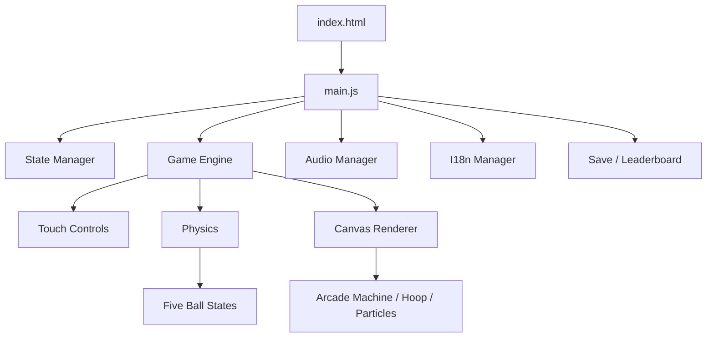

<a id="top"></a>

<div align="center">

# 🏀 Basketball Shoot!

### Fast Break Arcade Basketball Game

五球連投、三關挑戰、移動籃框與最後十秒雙倍得分的純前端街機投籃遊戲。

**[English](#en) · [日本語](#ja) · [繁體中文](#zh)**

</div>

---

## 🧭 Quick Navigation / 快速導覽 / クイックナビ

| Language | Start | Gameplay | Stages & Scoring | Program | File Structure | Tests |
|---|---|---|---|---|---|---|
| 🇺🇸 English | [Quick Start](#en-start) | [How to Play](#en-gameplay) | [Stages & Scoring](#en-stages) | [Program Guide](#en-program) | [Code Structure](#en-structure) | [Tests](#en-tests) |
| 🇯🇵 日本語 | [クイックスタート](#ja-start) | [遊び方](#ja-gameplay) | [ステージと得点](#ja-stages) | [プログラム紹介](#ja-program) | [コード構成](#ja-structure) | [テスト](#ja-tests) |
| 🇹🇼 繁體中文 | [快速開始](#zh-start) | [遊戲玩法](#zh-gameplay) | [關卡與計分](#zh-stages) | [程式介紹](#zh-program) | [程式分類](#zh-structure) | [測試](#zh-tests) |

---

<a id="en"></a>

# 🇺🇸 English

> [⬆️ Back to quick navigation](#top)

## 🎮 Game Overview

**Basketball Shoot!** is a browser-based arcade basketball machine. Grab any of five independent balls, flick it toward the hoop, and reach the required score before each stage timer expires.

The game is built with native HTML, CSS, JavaScript, Canvas 2D, Web Audio, and localStorage. It requires no framework, server, build command, external asset, or network connection.

### ✨ Highlights

| Feature | Description |
|---|---|
| 🏀 Five live balls | Up to five balls may fly, collide, or return at the same time |
| 🔁 Slow ball return | Each fallen ball follows a return rail for roughly 1.65 seconds |
| 🎯 Arcade physics | Gravity, drag, rim normals, cage boundaries, and ball-to-ball impacts |
| 🕹️ Three stages | Fixed hoop, slow moving hoop, then a faster moving hoop |
| ⏱️ Double time | Every score is doubled during the final 10 seconds of each stage |
| 🔥 Combo system | Consecutive baskets increase the score multiplier |
| 🏆 Local Top 10 | Device-local leaderboard with nickname, score, and best combo |
| 🎨 Five themes | Classic, Cute, Dark, Ocean, and Sunset |
| 🌐 Three languages | Traditional Chinese, English, and Japanese |
| 📱 Responsive | Desktop, phone portrait, phone landscape, and tablet layouts |

<a id="en-start"></a>

## 🚀 Quick Start

1. Download or clone the complete project folder.
2. Double-click `index.html`.
3. Select **TOUCH TO START** to unlock browser audio.
4. Choose **Start Game**.

No installation or local server is required.

> 💡 Browsers block audio before the first user gesture. The start gate exists to unlock the AudioContext safely.

<a id="en-gameplay"></a>

## 🏀 How to Play

### Controls

| Device | Action |
|---|---|
| 🖱️ Desktop | Hold a ball on the rack, drag quickly toward the hoop, and release |
| 📱 Touch device | Grab a ball, flick upward, and release your finger |
| ⏸️ All devices | Use the pause button to resume, restart, or return to the menu |

### Flick calculation

- Gestures shorter than roughly 35 Canvas units are ignored.
- A longer flick produces greater launch power.
- Horizontal displacement controls horizontal velocity.
- Upward displacement controls vertical velocity.
- Launch power is capped at `1950` to preserve reliable collision detection.
- The optional trajectory guide can be toggled in Settings.

### Five-ball lifecycle

```text
rack → held → flying → returning → rack
```

All five balls are independent. You can launch the next ball while earlier balls are still airborne. Flying balls collide with one another, while scored or missed balls travel along a cubic return path before becoming available again.

### Collision behavior

| Object | Result |
|---|---|
| Rim endpoints | Normal-based reflection with a softer `0.64` restitution |
| Moving hoop | A portion of hoop velocity is transferred to the ball |
| Side cage | The ball rebounds inward with reduced speed |
| Ceiling | The ball rebounds downward |
| Other balls | Overlap is resolved and momentum is partially exchanged |
| Return ramp | The ball changes to the returning state |

Core geometry uses a `40` ball radius, `190` hoop width, and `5` rim-collision radius, leaving an approximately `100px` playable center opening.

<a id="en-stages"></a>

## 🏁 Stages & Scoring

Each stage lasts 35 seconds. The score target is cumulative. The stage intro freezes the timer and input.

| Stage | Cumulative Target | Hoop | Speed | Range |
|---|---:|---|---:|---:|
| 1️⃣ Stage 1 | 12 | Stationary | `0` | `0` |
| 2️⃣ Stage 2 | 30 | Slow horizontal movement | `0.9` | `105` |
| 3️⃣ Stage 3 | 52 | Faster horizontal movement | `1.75` | `145` |

### Base score

| Shot | Points |
|---|---:|
| 🎯 Clean swish | 3 |
| 🏀 Rim basket | 2 |

### Combo multiplier

| Consecutive baskets | Multiplier |
|---|---:|
| 0–1 | ×1.0 |
| 2–3 | ×1.2 |
| 4–5 | ×1.5 |
| 6+ | ×2.0 |

During the final 10 seconds:

```text
Final points = round(base points × combo multiplier × 2)
```

## 🏆 Leaderboard, Saves, and Settings

- Open the leaderboard from the 🏆 button in the upper-left corner of the main menu.
- Only the device-local Top 10 is retained.
- Nicknames are escaped before rendering.
- Progress saves the score, combo, best combo, time, and stage.
- Settings and saves use versioned localStorage records.

| Storage key | Purpose |
|---|---|
| `bb_shoot_settings` | Theme, language, volume, and control preferences |
| `bb_shoot_save` | Versioned interrupted-game progress |
| `bb_shoot_leaderboard` | Local Top 10 scores |

Settings include five themes, BGM volume, SFX volume, trajectory guide, ball appearance, language, and data reset.

<a id="en-program"></a>

## 💻 Program Guide

### Technology

| Technology | Responsibility |
|---|---|
| HTML5 | Screens, HUD, menus, dialogs, and accessibility semantics |
| CSS3 | Themes, arcade cabinet presentation, animation, and RWD |
| JavaScript ES6+ | Engine, physics, storage, audio, and UI orchestration |
| Canvas 2D | Court, balls, hoop, net, particles, and return animation |
| Web Audio API | Generated BGM and sound effects |
| localStorage | Preferences, saves, and leaderboard |
| Pointer Events | Unified mouse, pen, and touch input |

Scripts use the `window.BB` namespace and traditional ordered `<script src>` tags, ensuring direct `file://` compatibility without ES Module CORS issues.

<a id="en-structure"></a>

## 🗂️ Code Structure

| Area | Important files | Purpose |
|---|---|---|
| Entry | `index.html`, `js/main.js` | Resource loading and module integration |
| Engine | `core/game-engine.js` | Five balls, stages, score, collisions, and rendering |
| Physics | `core/physics.js` | Gravity, trajectory, reflection, and flick mapping |
| State | `core/state-manager.js` | MENU / PLAYING / PAUSED / ENDED transitions |
| Save | `core/save-manager.js` | Versioned localStorage access |
| Input | `ui/touch-controls.js` | Pointer capture, drag, and release |
| Audio | `audio/*.js` | Generated music, SFX, tracks, gain, and compression |
| Languages | `i18n/*.js` | Chinese, English, and Japanese dictionaries |
| Data | `data/*.js` | Leaderboard and settings validation |
| Utilities | `utils/*.js` | Constants and math helpers |
| Styles | `css/base`, `themes`, `components`, `pages`, `layout` | Layered visual system and responsive rules |
| Tests | `tests/unit`, browser runner, Node runner, Playwright | Logic, interaction, and visual validation |

### Runtime flow

```text
index.html
  └─ main.js
      ├─ StateManager
      ├─ GameEngine ── Physics + TouchControls + Canvas
      ├─ AudioManager
      ├─ I18nManager
      └─ SaveManager + Leaderboard
```

### Audio design

- Separate BGM and SFX gain channels.
- Four synthesized melodic arrangements.
- Menu, gameplay, and victory tempo modes.
- Required 10× BGM gain formula with a hard safety cap of `3`.
- Compressor protection to reduce clipping.

### Responsive layout

| Device | Layout |
|---|---|
| Phone portrait | Full-width HUD/control strip with centered gameplay crop |
| Phone landscape | Court centered in the left play area; control strip on the right |
| Tablet | Full cabinet with larger touch targets |
| Desktop | Complete cabinet scaled to available viewport height |

<a id="en-tests"></a>

## 🧪 Tests

Open `tests/test-runner.html` directly to run all browser tests.

Current result: **34/34 passing**.

```powershell
# Dependency-free headless logic check
node tests/node-verify.js

# Optional Playwright interaction/RWD suite
npm install --no-save playwright-core
$env:PLAYWRIGHT_CORE="$PWD\node_modules\playwright-core"
node tests/playwright-visual-test.js
```

The Playwright suite verifies nine screenshots and automatically removes them from the operating-system temporary directory after completion.

> [⬆️ Back to top](#top)

---

<a id="ja"></a>

# 🇯🇵 日本語

> [⬆️ クイックナビへ戻る](#top)

## 🎮 ゲーム紹介

**Basketball Shoot!** は、ブラウザだけで遊べるアーケード風バスケットボールゲームです。返球ラックにある5個のボールをつかみ、リングへ向かってフリックし、制限時間内に各ステージの目標スコアを達成します。

HTML、CSS、JavaScript、Canvas 2D、Web Audio API、localStorageだけで実装されています。フレームワーク、ビルド、サーバー、外部素材、インターネット接続は不要です。

### ✨ 主な特徴

| 機能 | 内容 |
|---|---|
| 🏀 5ボール同時処理 | 5個のボールが独立して飛行、衝突、返球します |
| 🔁 ゆっくり返球 | 落ちたボールは約1.65秒かけて返球レールを戻ります |
| 🎯 アーケード物理 | 重力、空気抵抗、リング反射、ケージ境界、ボール同士の衝突 |
| 🕹️ 3ステージ | 固定リング、低速移動、高速移動の3段階 |
| ⏱️ ラスト10秒2倍 | 各ステージの最後10秒はすべての得点が2倍 |
| 🔥 コンボ | 連続成功で得点倍率が上昇します |
| 🏆 ローカルTop 10 | ニックネーム、得点、最高コンボを端末内に保存 |
| 🎨 5テーマ | クラシック、キュート、ダーク、オーシャン、サンセット |
| 🌐 3言語 | 繁體中文、English、日本語 |
| 📱 RWD対応 | PC、スマートフォン縦／横、タブレット |

<a id="ja-start"></a>

## 🚀 クイックスタート

1. プロジェクトフォルダー全体をダウンロードします。
2. ルートの `index.html` をダブルクリックします。
3. **TOUCH TO START** を押して音声を有効にします。
4. **ゲーム開始** を選択します。

インストール、ローカルサーバー、npmコマンドは必要ありません。

> 💡 ブラウザはユーザー操作前の音声再生を禁止しています。そのため最初に音声開始ボタンを表示しています。

<a id="ja-gameplay"></a>

## 🏀 遊び方

### 操作

| デバイス | 操作方法 |
|---|---|
| 🖱️ PC | ラックのボールを押したままリング方向へ素早くドラッグし、離してシュート |
| 📱 スマートフォン | ボールをつかみ、上方向へフリックして指を離す |
| ⏸️ 共通 | 右上の一時停止ボタンから再開、リスタート、メニュー移動 |

### フリック計算

- 約35 Canvas単位未満の短い操作は誤入力として無視されます。
- フリック距離が長いほど初速が大きくなります。
- 横方向の移動量が左右速度を決定します。
- 上方向の移動量が垂直速度を決定します。
- 最大パワーは安定した衝突判定のため `1950` に制限されます。
- 設定で放物線ガイドを表示／非表示にできます。

### 5ボールの状態

```text
ラック rack → 保持 held → 飛行 flying → 返球 returning → ラック rack
```

5個のボールはすべて独立しています。前のボールが飛んでいる間に次のボールを投げられます。飛行中のボール同士も衝突し、落下後は左右の返球ルートをゆっくり戻ります。

### 衝突

| 対象 | 動作 |
|---|---|
| リング端 | 入射角と法線に基づいて反射 |
| 移動リング | リングの水平速度の一部をボールへ加算 |
| 左右ケージ | 速度を落として機械内へ反射 |
| 上端 | 下方向へ反射 |
| 他のボール | 重なりを解消し、運動量の一部を交換 |
| 返球スロープ | returning状態へ移行 |

ボール半径は `40`、リング幅は `190`、リング衝突半径は `5` です。ボール中心が通れる有効幅は約 `100px` で、厳しすぎない判定になっています。

<a id="ja-stages"></a>

## 🏁 ステージと得点

各ステージは35秒です。目標は累積スコアで、時間終了時に目標へ到達していれば次へ進みます。ステージ表示中は時間が減りません。

| ステージ | 累積目標 | リング | 速度 | 移動範囲 |
|---|---:|---|---:|---:|
| 1️⃣ Stage 1 | 12点 | 固定 | `0` | `0` |
| 2️⃣ Stage 2 | 30点 | 低速左右移動 | `0.9` | `105` |
| 3️⃣ Stage 3 | 52点 | 高速左右移動 | `1.75` | `145` |

### 基本得点

| ショット | 得点 |
|---|---:|
| 🎯 スウィッシュ | 3点 |
| 🏀 リングに触れて成功 | 2点 |

### コンボ倍率

| 連続成功 | 倍率 |
|---|---:|
| 0–1 | ×1.0 |
| 2–3 | ×1.2 |
| 4–5 | ×1.5 |
| 6以上 | ×2.0 |

最後10秒の計算：

```text
最終得点 = 四捨五入（基本得点 × コンボ倍率 × 2）
```

## 🏆 ランキング・セーブ・設定

- メインメニュー左上の 🏆 ボタンからランキングを表示できます。
- 端末内のTop 10だけを保存します。
- ニックネーム、得点、最高コンボを表示します。
- ニックネームはHTMLエスケープされます。
- 中断時は得点、コンボ、最高コンボ、残り時間、ステージを保存します。

| localStorage Key | 用途 |
|---|---|
| `bb_shoot_settings` | テーマ、言語、音量、操作設定 |
| `bb_shoot_save` | バージョン付き進行データ |
| `bb_shoot_leaderboard` | ローカルTop 10 |

設定画面では5テーマ、BGM音量、効果音音量、軌道ガイド、ボール表示、言語、データ削除を変更できます。

<a id="ja-program"></a>

## 💻 プログラム紹介

### 使用技術

| 技術 | 用途 |
|---|---|
| HTML5 | 画面、HUD、メニュー、Modal、アクセシビリティ |
| CSS3 | テーマ、アニメーション、アーケード筐体、RWD |
| JavaScript ES6+ | エンジン、物理、保存、音声、UI統合 |
| Canvas 2D | コート、ボール、リング、ネット、パーティクル、返球 |
| Web Audio API | BGMと効果音のリアルタイム生成 |
| localStorage | 設定、セーブ、ランキング |
| Pointer Events | マウス、ペン、タッチの共通入力 |

`file://` でも確実に動作するよう、ES Modulesではなく順序付きの `<script src>` と `window.BB` 名前空間を使用しています。

<a id="ja-structure"></a>

## 🗂️ コード構成

| 分類 | 主なファイル | 役割 |
|---|---|---|
| エントリー | `index.html`, `js/main.js` | リソース読み込み、初期化、画面統合 |
| ゲーム | `core/game-engine.js` | 5ボール、ステージ、得点、衝突、描画 |
| 物理 | `core/physics.js` | 重力、軌道、反射、フリック変換 |
| 状態 | `core/state-manager.js` | MENU / PLAYING / PAUSED / ENDED |
| セーブ | `core/save-manager.js` | バージョン付きlocalStorage管理 |
| 入力 | `ui/touch-controls.js` | Pointer Eventsとシュート操作 |
| 音声 | `audio/*.js` | BGM、SFX、旋律、Gain、Compressor |
| 多言語 | `i18n/*.js` | 中国語、英語、日本語辞書 |
| データ | `data/*.js` | ランキングと設定値検証 |
| 共通 | `utils/*.js` | 定数と数学関数 |
| CSS | `base`, `themes`, `components`, `pages`, `layout` | 段階化されたデザインとRWD |
| テスト | `tests/*` | 単体、Node、Playwrightテスト |

### 処理の流れ

```text
index.html
  └─ main.js
      ├─ StateManager
      ├─ GameEngine ── Physics + TouchControls + Canvas
      ├─ AudioManager
      ├─ I18nManager
      └─ SaveManager + Leaderboard
```

### 音声

- BGMとSFXは独立したGainNodeを使用します。
- 4種類の合成メロディーがあります。
- メニュー、ゲーム、勝利でテンポが変化します。
- BGMは仕様の10倍ゲイン式を使用します。
- 実出力は安全上限 `3` とCompressorで保護されます。

### RWD

| デバイス | レイアウト |
|---|---|
| スマートフォン縦 | HUDと操作帯を全幅表示し、中央のプレイ領域を優先 |
| スマートフォン横 | 左側にコート、右側に操作帯 |
| タブレット | 筐体全体と大きなタッチ領域 |
| PC | 画面高に合わせて筐体全体を拡大縮小 |

<a id="ja-tests"></a>

## 🧪 テスト

`tests/test-runner.html` を直接開くと、ブラウザ単体テストを実行できます。

現在の結果：**34/34 成功**。

```powershell
# 依存関係なしのNode確認
node tests/node-verify.js

# 任意のPlaywright操作・RWDテスト
npm install --no-save playwright-core
$env:PLAYWRIGHT_CORE="$PWD\node_modules\playwright-core"
node tests/playwright-visual-test.js
```

Playwrightは5ボール、返球、ランキング、衝突、2倍時間、3ステージ、4種類の画面サイズを確認します。9枚の検証スクリーンショットはOSの一時フォルダーへ保存され、テスト終了後に自動削除されます。

> [⬆️ ページ上部へ](#top)

---

<a id="zh"></a>

# 🇹🇼 繁體中文

> [⬆️ 回到快速導覽](#top)

## 🎮 遊戲介紹

**Basketball Shoot!** 是一款模擬街機投籃機的瀏覽器遊戲。玩家從五球回球架抓起籃球，利用滑鼠或手指快速向籃框方向甩出，在每關限定時間內達成目標分數。

遊戲不需要後端、框架、建置工具或安裝程序；直接開啟 `index.html` 即可離線遊玩。畫面使用 Canvas 即時繪製，聲音使用 Web Audio API 合成，因此不依賴外部圖片、音效或 CDN。

### ✨ 主要特色

| 功能 | 說明 |
|---|---|
| 🏀 五球並行 | 五顆籃球擁有獨立狀態，可同時飛行、互撞或沿軌道回球 |
| 🔁 慢速回球 | 落下的球沿左右回球軌道移動，約 `1.65` 秒後回到球架 |
| 🎯 擬真碰撞 | 包含重力、空氣阻力、框端反彈、護網邊界與球體互撞 |
| 🕹️ 三關挑戰 | 第一關固定籃框；第二、第三關依序提高移動速度 |
| ⏱️ 最後十秒雙倍 | 每關最後 10 秒所有得分自動乘以 2 |
| 🔥 連擊倍率 | 連續命中會依連擊數提高得分倍率 |
| 🏆 本機排行榜 | 保留裝置內前 10 名，包含分數與最高連擊 |
| 🎨 五套主題 | 經典、可愛、深色、海洋與夕陽主題可即時切換 |
| 🌐 三語系 | 繁體中文、English、日本語即時切換 |
| 📱 完整 RWD | 支援桌機、手機直向、手機橫向與平板 |
| 🎵 動態音訊 | 主畫面、遊戲與結算使用不同節奏的合成 BGM |

<a id="zh-start"></a>

## 🚀 快速開始

### 一般玩家

1. 下載或複製整個專案資料夾。
2. 直接雙擊根目錄的 `index.html`。
3. 點擊 **TOUCH TO START** 開啟音訊。
4. 選擇 **開始遊戲**。

```text
Basketball_Shoot/
└── index.html  ← 直接開啟這個檔案
```

> 💡 瀏覽器禁止網頁在使用者互動前自動播放聲音，因此必須先點擊一次 **TOUCH TO START**。這不是載入錯誤。

### 開發者預覽

遊戲不需要伺服器。若開發時偏好使用本機伺服器，也可以使用任意靜態檔案伺服器，但不是必要條件。

<a id="zh-gameplay"></a>

## 🏀 遊戲玩法

### 基本操作

| 裝置 | 操作方式 |
|---|---|
| 🖱️ 桌機 | 在球架上的籃球按住滑鼠，往籃框方向快速拖曳，放開滑鼠出手 |
| 📱 手機／平板 | 用手指抓住籃球，向上甩動並放開 |
| ⏸️ 全裝置 | 點擊右上角暫停鍵，可繼續、重玩或回主選單 |

### 投籃手勢

- 手勢至少需要約 `35` 個 Canvas 座標單位，避免誤觸。
- 拖曳距離越長，出手力量越大。
- 水平偏移會改變球的左右速度。
- 向上的幅度決定垂直初速。
- 最大投籃力量限制為 `1950`，避免球體穿透碰撞區。
- 可在設定中開啟／關閉拋物線輔助線。

### 五球循環

每一顆球都會在以下狀態間獨立切換：

```text
球架 rack
   ↓ 抓取
手持 held
   ↓ 放開
飛行 flying
   ↓ 進球／落下
回球 returning
   ↓ 約 1.65 秒
球架 rack
```

玩家可以在第一顆球仍在飛行時立刻拿起第二顆，因此最多可同時投出五顆球。飛行中的球彼此接觸時也會產生碰撞與速度交換。

### 邊界與碰撞

| 碰撞物 | 行為 |
|---|---|
| 籃框兩端 | 依碰撞法線與入射角反彈，擦框後仍可能進球 |
| 移動籃框 | 反彈會帶入一部分籃框水平速度 |
| 左右護網 | 球會減速反彈回機台內，不會直接消失 |
| 上方邊界 | 球會向下反彈 |
| 其他籃球 | 兩球分離並交換部分動量 |
| 回球斜坡 | 球進入回球狀態，沿左右軌道返回球架 |

目前物理參數：

| 參數 | 數值 |
|---|---:|
| Canvas 尺寸 | `900 × 1120` |
| 重力 | `1800` |
| 空氣阻力 | `0.035` |
| 籃球半徑 | `40` |
| 籃框寬度 | `190` |
| 框端碰撞半徑 | `5` |
| 框端反彈係數 | `0.64` |
| 有效中心通過寬度 | 約 `100px` |

<a id="zh-stages"></a>

## 🏁 關卡與計分

### 三關規則

每關時間為 35 秒。時間結束時必須達到累積目標分數，才能進入下一關。關卡提示顯示期間不會扣除時間。

| 關卡 | 累積目標 | 籃框行為 | 移動速度 | 移動範圍 |
|---|---:|---|---:|---:|
| 1️⃣ Stage 1 | 12 分 | 固定 | `0` | `0` |
| 2️⃣ Stage 2 | 30 分 | 慢速左右移動 | `0.9` | `105` |
| 3️⃣ Stage 3 | 52 分 | 快速左右移動 | `1.75` | `145` |

- 第一、二關時間結束且達標：進入下一關。
- 第一、二關未達標：遊戲結束。
- 第三關時間結束：進入結算畫面。
- 進入新關卡時，五顆球會重新回到球架。

### 基礎得分

| 投籃結果 | 基礎分數 |
|---|---:|
| 🎯 空心球 | 3 分 |
| 🏀 擦框進球 | 2 分 |

### 連擊倍率

| 連續命中 | 倍率 |
|---|---:|
| 0–1 球 | ×1.0 |
| 2–3 球 | ×1.2 |
| 4–5 球 | ×1.5 |
| 6 球以上 | ×2.0 |

### ⏱️ 最後 10 秒雙倍

每關剩餘時間小於或等於 10 秒時，啟動 `DOUBLE SCORE ×2`：

```text
最終得分 = 四捨五入（基礎分數 × 連擊倍率 × 最後十秒倍率）
```

範例：最後 10 秒內，以 4 連擊投進空心球：

```text
3 × 1.5 × 2 = 9 分
```

## 🏆 排行榜與存檔

### 排行榜

- 主畫面左上角的 🏆 按鈕可隨時查看排行榜。
- 排行榜儲存在目前裝置的 `localStorage`。
- 依分數由高至低排序，只保留前 10 名。
- 顯示暱稱、分數與最高連擊。
- 前三名使用 🥇、🥈、🥉 標示。
- 暱稱會進行 HTML 特殊字元轉義，避免 XSS。

### 自動存檔

暫停、回主選單或關閉頁面時，會保存：

- 目前分數
- 目前連擊與最高連擊
- 剩餘時間
- 目前關卡

「繼續遊戲」會讀取上述資料；五顆球會安全地重新放回球架。

### localStorage 鍵值

| Key | 用途 |
|---|---|
| `bb_shoot_settings` | 主題、語言、音量與操作設定 |
| `bb_shoot_save` | 中斷遊戲進度與版本資訊 |
| `bb_shoot_leaderboard` | 本機前十名排行榜 |

## ⚙️ 設定功能

| 分類 | 可調整項目 |
|---|---|
| 🎨 外觀 | 經典、可愛、深色、海洋、夕陽五套主題 |
| 🔊 BGM | 0–100% 音量調整 |
| 🔔 SFX | 0–100% 音效調整 |
| 🕹️ 操作 | 拋物線輔助線、可愛球體設定 |
| 🌐 語言 | 繁體中文、English、日本語 |
| 🗑️ 資料 | 清除存檔與排行榜，具二次確認 |

<a id="zh-program"></a>

## 💻 程式介紹

### 技術選擇

| 技術 | 用途 |
|---|---|
| HTML5 | 畫面容器、HUD、選單、Modal 與可及性標記 |
| CSS3 | 主題、動畫、機台外觀與 RWD |
| JavaScript ES6+ | 狀態管理、物理、音訊、存檔與 UI 控制 |
| Canvas 2D | 球場、籃框、籃球、粒子與回球動畫 |
| Web Audio API | BGM 節奏、出手、擦框、得分與倒數音效 |
| localStorage | 設定、進度與排行榜 |
| Pointer Events | 統一滑鼠、觸控筆與手指操作 |

### 執行架構



遊戲使用傳統 `<script src>` 按相依順序載入，所有模組掛載在 `window.BB` 命名空間下。這樣可避開部分瀏覽器在 `file://` 協定下對 ES Modules 的 CORS 限制。

<a id="zh-structure"></a>

## 🗂️ 程式分類與檔案結構

```text
Basketball_Shoot/
├── index.html
├── README.md
├── Basketball_Shoot-spec.md
├── css/
│   ├── base/          # Reset、變數與字體
│   ├── themes/        # 五套色彩主題
│   ├── layout/        # RWD 斷點與橫向配置
│   ├── components/    # 按鈕、Modal、排行榜等共用元件
│   └── pages/         # 主畫面、遊戲與街機視覺
├── js/
│   ├── main.js
│   ├── core/          # 遊戲引擎、物理、狀態與存檔
│   ├── ui/            # Pointer／觸控操作
│   ├── audio/         # BGM、音效與曲目資料
│   ├── i18n/          # 中、英、日字典與切換器
│   ├── data/          # 設定驗證與排行榜
│   └── utils/         # 常數與數學工具
└── tests/
    ├── test-runner.html
    ├── node-verify.js
    ├── playwright-visual-test.js
    ├── lib/           # 自製輕量測試框架
    └── unit/          # 各模組單元測試
```

### JavaScript 模組

| 分類 | 檔案 | 職責 |
|---|---|---|
| 進入點 | `js/main.js` | 初始化模組、綁定 DOM、切換畫面與整合事件 |
| 遊戲核心 | `core/game-engine.js` | 五球狀態、主迴圈、關卡、計分、碰撞與 Canvas 繪製 |
| 物理 | `core/physics.js` | 重力、拋物線、反射、圓形框端碰撞與手勢轉換 |
| 狀態 | `core/state-manager.js` | MENU、PLAYING、PAUSED、ENDED 狀態轉換 |
| 存檔 | `core/save-manager.js` | 版本化進度存取與錯誤容錯 |
| 操作 | `ui/touch-controls.js` | Pointer Events、抓球、拖曳與放開出手 |
| 音訊 | `audio/audio-manager.js` | AudioContext、BGM、SFX、增益與壓縮器 |
| 曲目 | `audio/sound-library.js` | 四組鋼琴／街機旋律音高資料 |
| 語系 | `i18n/i18n-manager.js` | `t(key)`、即時 DOM 更新與 fallback |
| 字典 | `i18n/lang-*.js` | 繁中、英文與日文完整文案 |
| 排行榜 | `data/leaderboard-manager.js` | 排序、前十名裁切、暱稱安全處理 |
| 設定 | `data/settings-schema.js` | 預設值、音量邊界與非法值修復 |
| 常數 | `utils/constants.js` | 物理、球體、籃框、關卡與時間參數 |
| 數學 | `utils/math-utils.js` | clamp、distance、lerp 等共用函式 |

### CSS 分類

| 分類 | 檔案 | 職責 |
|---|---|---|
| 基礎 | `base/reset.css` | Box model、元素重設與隱藏工具 |
| 變數 | `base/variables.css` | 色彩、圓角、陰影與字體變數 |
| 字體 | `base/typography.css` | 全站標題與內文字級 |
| 主題 | `themes/themes.css` | 五套主題變數與背景裝飾 |
| 元件 | `components/ui.css` | 按鈕、Modal、設定、排行榜 |
| 基本頁面 | `pages/app.css` | 選單、HUD、Canvas 容器與操作帶 |
| 街機頁面 | `pages/arcade.css` | 機台燈光、入口、LED、Double 與 RWD 微調 |
| 響應式 | `layout/rwd.css` | 手機、橫向、平板與桌機斷點 |

## 🔊 音訊系統

- 首次互動後建立 `AudioContext`。
- 主選單、遊戲、勝利畫面使用不同節奏。
- 四組旋律資料定義於 `sound-library.js`。
- BGM 與 SFX 使用獨立 `GainNode`。
- BGM 依規格套用 10 倍增益公式。
- 實際輸出以 `GAIN_HARD_CAP = 3` 限制，並通過 compressor 保護。
- 所有聲音皆為即時合成，不需要外部音訊檔案。

## 📱 RWD 設計

| 裝置 | 版面策略 |
|---|---|
| 手機直向 | HUD 與操作帶滿版，球場維持比例並中央裁切兩側非必要區域 |
| 手機橫向 | HUD 位於上方，球場置中於左側可玩區，操作帶位於右側 |
| 平板 | 完整顯示機台，放大觸控區與 HUD |
| 桌機 | 依可用高度縮放完整機台，保持 `900:1120` Canvas 比例 |

已測試尺寸：`390×844`、`844×390`、`820×1180`、`1180×900`。

<a id="zh-tests"></a>

## 🧪 測試

### 瀏覽器單元測試

直接開啟：

```text
tests/test-runner.html
```

目前共有 **34 個測試，34/34 通過**，涵蓋：

- 拋物線、重力與框端反彈
- 投籃幅度與最大力道
- 五球數量與慢速回球
- 三關門檻與籃框速度
- 最後十秒雙倍
- 狀態機與版本化存檔
- 三語系 key 完整性
- BGM 10 倍增益與安全上限
- 排行榜排序、前十名與 XSS 防護
- 設定值邊界修復

### Node 快速驗證

```powershell
node tests/node-verify.js
```

### Playwright 視覺與互動測試（選用）

Playwright 測試涵蓋五球並行、回球、排行榜、進球、Double、三關與四種 RWD 尺寸。

```powershell
npm install --no-save playwright-core
$env:PLAYWRIGHT_CORE="$PWD\node_modules\playwright-core"
node tests/playwright-visual-test.js
```

測試會建立 9 張暫存截圖並在完成後自動刪除。截圖位置使用系統暫存資料夾，避免 OneDrive 鎖定。

## 🌍 瀏覽器與離線支援

- Chrome／Edge／Firefox／Safari 最新版本
- iOS Safari 與 Android Chrome
- 不需要網路連線
- 不需要 npm、Node.js 或建置工具即可遊玩
- 測試工具才會選用 Node.js／Playwright

> [⬆️ 回到頁首](#top)
