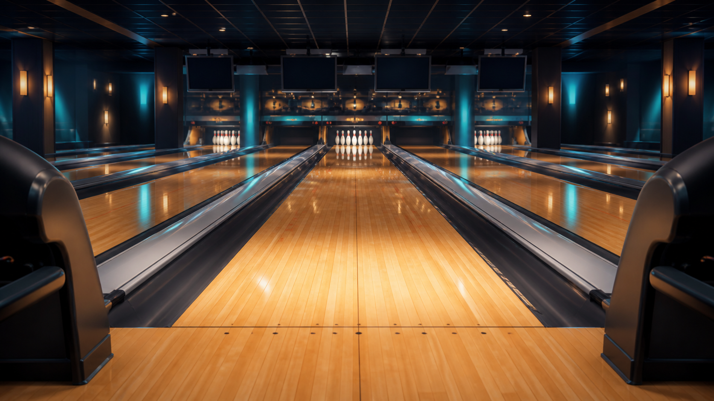
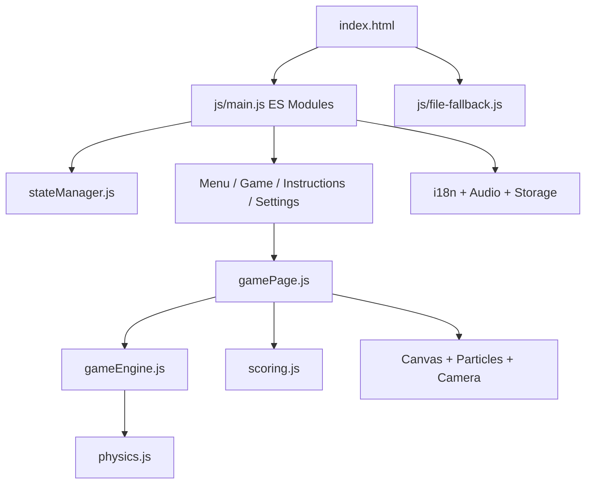
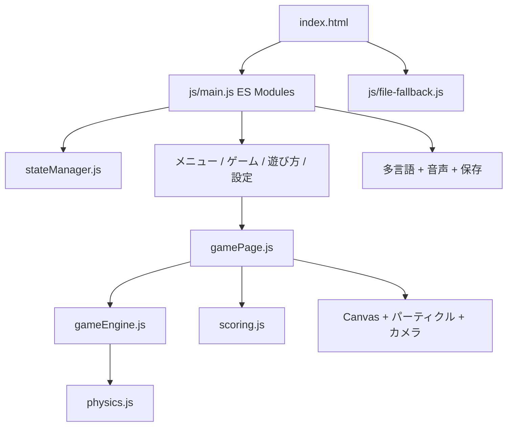
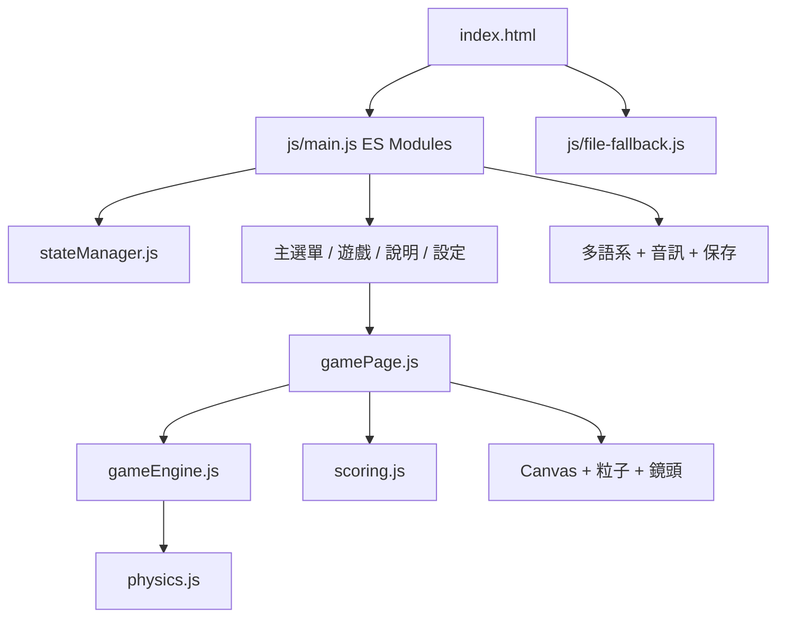

<a id="top"></a>

# 🎳 Cute Bowling

**A zero-build, offline-friendly ten-frame bowling game built with Vanilla HTML, CSS, JavaScript, Canvas, and Web Audio.**

<p align="center">
  
</p>

<p align="center">
  
  
</p>

## 🌍 Opening Summary

### 🇬🇧 English

Cute Bowling combines an approachable Bobo-and-Pingping presentation with a complete ten-frame scoring system, direction-and-power-based ball physics, collision-timed pin reactions, synthesized music and sound effects, responsive controls, and local progress saving—all without a build step or runtime dependency.

### 🇯🇵 日本語

Cute Bowling は、ボボとピンピンの親しみやすい世界観に、10フレームの正式なスコア計算、方向とパワーに基づくボール物理、衝突タイミングに合わせたピンの反応、合成BGM・効果音、レスポンシブ操作、ローカル保存を組み合わせた、ビルド不要のブラウザゲームです。

### 🇹🇼 繁體中文

Cute Bowling 以波波和平平的親切風格，結合完整十局計分、依方向與力道計算的球路、碰撞後才觸發的球瓶反應、合成 BGM 與音效、響應式操作及本機進度保存；整個遊戲不需要建置流程或執行期套件。

[🇬🇧 English](#english) · [🇯🇵 日本語](#japanese) · [🇹🇼 繁體中文](#traditional-chinese)

## 🧭 Contents

- [🇬🇧 English](#english)
  - [🎮 Game Introduction](#english-game)
  - [🕹️ Gameplay and Controls](#english-gameplay)
  - [🚀 Quick Start](#english-quick-start)
  - [🏗️ Program Overview](#english-program)
  - [🗂️ Code Organization](#english-code)
  - [🧩 Supporting Systems](#english-systems)
  - [🧪 Testing](#english-testing)
  - [📌 Status and Limitations](#english-status)
- [🇯🇵 日本語](#japanese)
  - [🎮 ゲーム紹介](#japanese-game)
  - [🕹️ 遊び方と操作](#japanese-gameplay)
  - [🚀 クイックスタート](#japanese-quick-start)
  - [🏗️ プログラム概要](#japanese-program)
  - [🗂️ コード構成](#japanese-code)
  - [🧩 補助システム](#japanese-systems)
  - [🧪 テスト](#japanese-testing)
  - [📌 状態と制限](#japanese-status)
- [🇹🇼 繁體中文](#traditional-chinese)
  - [🎮 遊戲介紹](#traditional-chinese-game)
  - [🕹️ 玩法與操作](#traditional-chinese-gameplay)
  - [🚀 快速開始](#traditional-chinese-quick-start)
  - [🏗️ 程式架構](#traditional-chinese-program)
  - [🗂️ 程式碼分類](#traditional-chinese-code)
  - [🧩 支援系統](#traditional-chinese-systems)
  - [🧪 測試](#traditional-chinese-testing)
  - [📌 狀態與限制](#traditional-chinese-status)

---

<a id="english"></a>

## 🇬🇧 English

<a id="english-game"></a>

### 🎮 Game Introduction

Cute Bowling is a single-player browser bowling game starring Bobo and Pingping. The player completes ten frames, aims each throw, chooses its power, and tries to build the highest possible score through strikes, spares, and accurate follow-up shots.

#### ✨ Implemented Features

- 🎳 A complete ten-frame game with strike, spare, open-frame, and tenth-frame bonus-ball rules.
- 🧭 Direction and power controls that determine travel speed, reachable pins, and knockdown chains.
- 💥 Pins fall only after the ball reaches them; impact sparks, camera shake, vibration, and pin-hit audio occur at collision time.
- 🎯 A trajectory guide aligned with the same lateral scale used by the live ball path.
- 🏟️ A local realistic bowling-alley background with procedural fallback scenery and responsive Canvas rendering.
- 🎵 Four offline synthesized BGM melodies plus button, roll, pin, strike, and spare sound effects.
- 💾 Automatic progress saving and a Continue option backed by validated `localStorage` data.
- 🌐 Traditional Chinese, English, and Japanese interfaces.
- 🎨 Five color themes: Cute, Ocean, Sunset, Forest, and Night.
- 📱 Desktop, tablet, landscape, and mobile layouts with safe-area support.
- ♿ ARIA labels, live announcements, keyboard controls, focusable dialogs, and reduced-motion CSS.
- 📄 A classic-script `file://` fallback when a browser blocks local ES Module imports.

<a id="english-gameplay"></a>

### 🕹️ Gameplay and Controls

#### Core Loop

1. Choose **Start Game**, or use **Continue** when valid saved progress exists.
2. Aim with the direction slider, a mouse/touch drag on the lane, or the arrow keys.
3. Set power from `0%` to `100%`; more power shortens travel time and increases impact reach.
4. Press **Roll!** or Space. A longer press on the Roll button can raise the selected power before release.
5. Watch the ball follow the locked throw direction. Controls remain disabled while it is rolling.
6. The score, current frame, current ball, collision effects, and saved progress update after the roll settles.
7. Complete all ten frames and choose **Play again** to start over.

#### 🎛️ Controls

| Platform | Aim | Power | Roll | Pause |
|---|---|---|---|---|
| Desktop | Drag on the lane, direction slider, or Left/Right arrows | Power slider or hold Roll before release | Roll button or Space | Pause icon |
| Mobile / touch | Swipe left or right on the lane, or use the direction slider | Bottom-dock power slider | Bottom-dock Roll button | Pause icon |

#### 🧠 Throw Model

- Direction is clamped to the lane and represented as approximately `-30°` to `+30°` in the UI.
- Power changes speed and collision reach without making a fixed aim path wander.
- Throw parameters are snapshotted at launch, so changing controls cannot redirect a ball already in motion.
- The current tuning intentionally avoids an automatic strike for a centered `100%` throw. A slight pocket angle can create a stronger ten-pin chain.
- Every selected pin has an impact time based on its lane depth; its fall animation cannot begin before contact.

#### 🧮 Scoring

| Result | Rule |
|---|---|
| Strike | Knock down all ten pins on the first ball; add the next two balls as bonus. |
| Spare | Clear all ten pins in two balls; add the next one ball as bonus. |
| Open frame | Add the two rolls directly. |
| Tenth frame | A strike or spare grants the standard bonus balls. |
| Perfect game | Twelve strikes produce the tested maximum score of `300`. |

#### ⏸️ Pause, Resume, and Save

- The pause dialog supports Resume, Home, Restart, and Settings.
- Returning from Settings can resume an in-progress physics simulation.
- A settled roll is saved under `bowling_save_v1`; settings use `bowling_settings_v1`.
- Starting a new game or restarting clears prior game progress while preserving normalized settings.
- Invalid or impossible saved roll sequences are rejected instead of being loaded.

<a id="english-quick-start"></a>

### 🚀 Quick Start

#### Play

No installation or build command is required.

1. Download or clone the repository.
2. Open `Bowling/index.html` in a modern browser.
3. Interact with the page once to unlock Web Audio, then choose **Start Game**.

`index.html` loads `js/main.js` as an ES Module. If local module imports are blocked, `js/file-fallback.js` starts a classic-script version so the directly opened game remains playable.

#### Run Tests

Node.js with the built-in test runner is required only for development checks.

```bash
npm test
```

There is no `npm install` requirement because the project declares no package dependencies.

<a id="english-program"></a>

### 🏗️ Program Overview

The application is a zero-build, state-driven front end. `js/main.js` wires screen navigation, localization, audio, storage, and page modules. During play, `gamePage.js` coordinates the animation engine, deterministic physics, scoring, Canvas renderer, effects, and persistence.



#### Runtime Data Flow

1. `stateManager.js` activates one of four screen sections.
2. The game page snapshots angle and power and creates a rolling physics state.
3. `gameEngine.js` advances `stepPhysics()` with `requestAnimationFrame`.
4. Physics updates the ball, trail, pin impact order, and settled result.
5. The renderer draws cached scenery, aim guide, ball, pins, particles, and camera shake.
6. Scoring validates the roll, updates the ten-frame record, and persistence saves progress.

<a id="english-code"></a>

### 🗂️ Code Organization

| Area | Representative files | Responsibility |
|---|---|---|
| Entry | `index.html`, `js/main.js`, `js/file-fallback.js` | CSS/JS loading, screen assembly, ES Module startup, direct-file fallback. |
| Core | `js/core/gameEngine.js`, `physics.js`, `scoring.js`, `stateManager.js` | Animation loop, deterministic throw model, legal bowling scoring, screen state. |
| Rendering | `js/render/canvasRenderer.js`, `particleEffects.js`, `cameraController.js` | Responsive Canvas scene, ball/pin drawing, impact particles, camera shake. |
| UI | `js/ui/gamePage.js`, `mainMenu.js`, `hud.js`, `touchControls.js` | Screens, controls, HUD/scoreboard, pause flow, pointer gestures. |
| Audio | `js/audio/audioManager.js`, `soundLibrary.js` | Web Audio unlock, synthesized looping melodies, oscillator SFX, volume control. |
| Localization | `js/i18n/i18n.js`, `lang-zh.js`, `lang-en.js`, `lang-ja.js` | Runtime language switching, interpolation, translated text and ARIA labels. |
| Utilities | `js/utils/storage.js`, `constants.js`, `helpers.js` | Save validation, settings normalization, layouts/constants, shared helpers. |
| Styling | `css/base/`, `layout/`, `components/`, `pages/`, `themes/` | Tokens, RWD, reusable UI, page layouts, five themes. |
| Assets | `assets/images/backgrounds/`, `characters/`, `icons/` | Local alley image, mascots, and interface SVGs. |
| Tests | `tests/*.test.js` | Audio, i18n, physics, scoring, storage, and structural regression tests. |

<a id="english-systems"></a>

### 🧩 Supporting Systems

| System | Implemented behavior |
|---|---|
| Localization 🌐 | `zh`, `en`, and `ja`; language changes update document language, title, visible text, labels, and saved preference. |
| Themes 🎨 | Cute, Ocean, Sunset, Forest, and high-contrast Night themes switch CSS files and Canvas ball palettes. |
| Persistence 💾 | Saves valid roll arrays and normalized settings; gracefully handles missing, corrupt, private, or unavailable storage. |
| Audio 🔊 | Web Audio begins after user interaction, rotates four synthesized melodies, and generates five SFX types offline. |
| Accessibility ♿ | Semantic buttons, ARIA labels, live status announcements, keyboard play, modal focus, and reduced-motion rules. |
| Responsive design 📱 | Canvas pixel-ratio scaling, orientation resize handling, mobile fixed controls, safe-area insets, and compact short-screen layouts. |
| Performance ⚡ | Cached static Canvas background, capped device pixel ratio, capped particles, and one animation loop per active roll. |
| Offline/direct-file use 📄 | Local assets, no fetch calls, no runtime packages, and a classic fallback for local module restrictions. |

<a id="english-testing"></a>

### 🧪 Testing

The project uses Node's built-in `node:test` runner through `npm test`. The current suite contains **29 passing tests**, last executed against the working implementation documented here.

| Test file | Coverage |
|---|---|
| `tests/audio.test.js` | BGM/SFX definitions, gain rules, AudioContext startup. |
| `tests/i18n.test.js` | Interpolation, language switching, Traditional Chinese fallback. |
| `tests/physics.test.js` | Ready state, angle/power results, stable path, delayed collision, settled output. |
| `tests/scoring.test.js` | Perfect game, spares, gutters, pending bonuses, legal rolls, tenth frame. |
| `tests/storage.test.js` | Progress round-trip, corrupt data rejection, settings normalization. |
| `tests/structure.test.js` | Zero-build entry, direct-file fallback, assets, impact timing, control locks, aim-guide alignment, repository instructions. |

Run the suite after changing physics, scoring, storage, audio, localization, or either rendering path:

```bash
npm test
```

<a id="english-status"></a>

### 📌 Status and Limitations

- ✅ The full ten-frame single-player loop is implemented and locally playable.
- ✅ The ES Module and direct-file fallback paths both include the current gameplay, audio, collision, settings, and reset behavior.
- ⚠️ Web Audio still depends on the browser allowing audio after a user gesture.
- ⚠️ Vibration depends on `navigator.vibrate` support, and persistence depends on available `localStorage`.
- ⚠️ Visual, responsive, and audible behavior should receive a short manual browser check after related changes.
- ℹ️ Online leaderboards, accounts, multiplayer, and network synchronization are not implemented.

---

<a id="japanese"></a>

## 🇯🇵 日本語

<a id="japanese-game"></a>

### 🎮 ゲーム紹介

Cute Bowling は、ボボとピンピンが登場する1人用ブラウザボウリングゲームです。プレイヤーは10フレームを通して投球方向とパワーを調整し、ストライク、スペア、正確なフォローショットでハイスコアを目指します。

#### ✨ 実装済み機能

- 🎳 ストライク、スペア、オープンフレーム、第10フレームのボーナス投球を含む完全な10フレーム制。
- 🧭 速度、到達可能なピン、連鎖倒しを決める方向・パワー操作。
- 💥 ボールが到達してからピンが倒れ、衝突時に火花、カメラ振動、端末振動、ヒット音を再生。
- 🎯 実際のボール軌道と同じ横方向スケールを使うガイドライン。
- 🏟️ ローカルのリアルなボウリング場背景、手続き型の代替背景、レスポンシブCanvas描画。
- 🎵 オフライン合成BGM 4曲と、ボタン、投球、ピン、ストライク、スペアの効果音。
- 💾 検証済み `localStorage` データによる自動保存と「続きから」。
- 🌐 繁體中文、English、日本語の3言語UI。
- 🎨 Cute、Ocean、Sunset、Forest、Night の5テーマ。
- 📱 デスクトップ、タブレット、横画面、モバイルに対応したセーフエリア付きレイアウト。
- ♿ ARIAラベル、ライブ通知、キーボード操作、フォーカス可能なダイアログ、動き軽減CSS。
- 📄 ローカルES Moduleが制限された場合に使う `file://` 向けクラシックスクリプト版。

<a id="japanese-gameplay"></a>

### 🕹️ 遊び方と操作

#### 基本ループ

1. **ゲーム開始**を選ぶか、有効な保存データがある場合は**続きから**を選びます。
2. 方向スライダー、レーン上のマウス／タッチドラッグ、または矢印キーで狙います。
3. パワーを `0%`～`100%` に設定します。パワーが高いほど移動時間が短く、衝突範囲が広がります。
4. **投げる！**またはSpaceを押します。投球ボタンを長めに押すと、離す前に選択パワーを高められます。
5. ボールは投球時に固定された方向へ進みます。転がっている間は操作項目が無効になります。
6. 投球完了後にスコア、フレーム、投球数、衝突演出、保存データが更新されます。
7. 10フレーム終了後、**もう一度遊ぶ**で新しいゲームを開始できます。

#### 🎛️ 操作方法

| 環境 | 狙い | パワー | 投球 | 一時停止 |
|---|---|---|---|---|
| デスクトップ | レーンをドラッグ、方向スライダー、左右矢印キー | パワースライダー、または投球ボタンを長押し | 投球ボタン、またはSpace | 一時停止アイコン |
| モバイル／タッチ | レーンを左右にスワイプ、または方向スライダー | 下部ドックのパワースライダー | 下部ドックの投球ボタン | 一時停止アイコン |

#### 🧠 投球モデル

- 方向はレーン内に制限され、UIでは約 `-30°`～`+30°` として表示されます。
- パワーは速度と衝突範囲を変えますが、同じ狙いの軌道を途中で乱しません。
- 投球時に方向とパワーを保存するため、移動中のボールが操作変更で曲がることはありません。
- 現在の調整では、中央 `100%` が必ずストライクになる設計ではありません。わずかなポケット角度で10ピンの連鎖を狙えます。
- 各ピンの衝突時刻はレーン上の奥行きから計算され、接触前に倒れ始めることはありません。

#### 🧮 スコア

| 結果 | ルール |
|---|---|
| ストライク | 1投目で10本すべてを倒し、次の2投をボーナスとして加算。 |
| スペア | 2投で10本を倒し、次の1投をボーナスとして加算。 |
| オープンフレーム | フレーム内の2投をそのまま加算。 |
| 第10フレーム | ストライクまたはスペアで規定のボーナス投球を獲得。 |
| パーフェクトゲーム | 12連続ストライクで、テスト済み最大スコア `300`。 |

#### ⏸️ 一時停止・再開・保存

- 一時停止ダイアログから再開、ホーム、最初から、設定を選べます。
- 設定画面から戻ると、進行中の物理シミュレーションを再開できます。
- 確定した投球は `bowling_save_v1`、設定は `bowling_settings_v1` に保存されます。
- 新規ゲームと再スタートはゲーム進行を消去しますが、正規化された設定は維持します。
- 不正または成立しない投球列の保存データは読み込みません。

<a id="japanese-quick-start"></a>

### 🚀 クイックスタート

#### プレイ

インストールやビルドは不要です。

1. リポジトリをダウンロードまたはクローンします。
2. モダンブラウザで `Bowling/index.html` を開きます。
3. 一度ページを操作してWeb Audioを有効化し、**ゲーム開始**を選びます。

`index.html` は `js/main.js` をES Moduleとして読み込みます。ローカルのModule importが制限された場合は `js/file-fallback.js` のクラシックスクリプト版が起動し、直接開いた状態でもプレイできます。

#### テスト実行

Node.jsの組み込みテストランナーは開発時の確認にのみ必要です。

```bash
npm test
```

パッケージ依存関係がないため、`npm install` は不要です。

<a id="japanese-program"></a>

### 🏗️ プログラム概要

このアプリは、ビルド不要の状態駆動型フロントエンドです。`js/main.js` が画面遷移、多言語、音声、保存、各ページを接続します。ゲーム中は `gamePage.js` がアニメーションエンジン、決定論的物理、スコア、Canvas描画、演出、保存を統合します。



#### 実行時データフロー

1. `stateManager.js` が4つの画面セクションから1つを有効化します。
2. ゲーム画面が方向とパワーを固定し、転動中の物理状態を作ります。
3. `gameEngine.js` が `requestAnimationFrame` で `stepPhysics()` を進めます。
4. 物理処理がボール、軌跡、ピンの衝突順序、確定結果を更新します。
5. 描画処理がキャッシュ済み背景、ガイド、ボール、ピン、パーティクル、カメラ振動を描きます。
6. スコア処理が投球を検証し、10フレーム記録と保存データを更新します。

<a id="japanese-code"></a>

### 🗂️ コード構成

| 分類 | 主なファイル | 役割 |
|---|---|---|
| エントリー | `index.html`, `js/main.js`, `js/file-fallback.js` | CSS/JS読込、画面構築、ES Module起動、直接ファイル版。 |
| コア | `js/core/gameEngine.js`, `physics.js`, `scoring.js`, `stateManager.js` | アニメーション、決定論的投球、正しいボウリング計算、画面状態。 |
| 描画 | `js/render/canvasRenderer.js`, `particleEffects.js`, `cameraController.js` | レスポンシブCanvas、ボール／ピン、衝突パーティクル、カメラ振動。 |
| UI | `js/ui/gamePage.js`, `mainMenu.js`, `hud.js`, `touchControls.js` | 画面、操作、HUD、スコアボード、一時停止、ポインター操作。 |
| 音声 | `js/audio/audioManager.js`, `soundLibrary.js` | Web Audio有効化、合成ループBGM、発振器SFX、音量。 |
| 多言語 | `js/i18n/i18n.js`, `lang-zh.js`, `lang-en.js`, `lang-ja.js` | 言語切替、変数展開、画面文言、ARIAラベル。 |
| ユーティリティ | `js/utils/storage.js`, `constants.js`, `helpers.js` | 保存検証、設定正規化、定数、共通処理。 |
| CSS | `css/base/`, `layout/`, `components/`, `pages/`, `themes/` | デザイントークン、RWD、共通UI、ページ、5テーマ。 |
| アセット | `assets/images/backgrounds/`, `characters/`, `icons/` | ボウリング場、マスコット、SVGアイコン。 |
| テスト | `tests/*.test.js` | 音声、多言語、物理、スコア、保存、構造の回帰テスト。 |

<a id="japanese-systems"></a>

### 🧩 補助システム

| システム | 実装内容 |
|---|---|
| 多言語 🌐 | `zh`、`en`、`ja`。言語変更時に文書言語、タイトル、表示文言、ラベル、保存設定を更新。 |
| テーマ 🎨 | Cute、Ocean、Sunset、Forest、高コントラストNight。CSSとCanvasボール配色を切替。 |
| 保存 💾 | 正しい投球列と正規化設定を保存し、欠損・破損・プライベート環境・保存不可を安全に処理。 |
| 音声 🔊 | 初回操作後にWeb Audioを開始し、4つの合成メロディーと5種類のSFXをオフライン生成。 |
| アクセシビリティ ♿ | セマンティックボタン、ARIA、ライブ通知、キーボード、一時停止フォーカス、動き軽減。 |
| RWD 📱 | Canvasのpixel ratio調整、向き変更、モバイル固定操作、セーフエリア、低い画面向けレイアウト。 |
| パフォーマンス ⚡ | 静的Canvas背景のキャッシュ、pixel ratio上限、パーティクル数上限、投球ごとの単一ループ。 |
| オフライン／直接起動 📄 | ローカルアセット、fetchなし、実行時パッケージなし、Module制限時のクラシック版。 |

<a id="japanese-testing"></a>

### 🧪 テスト

`npm test` からNode.js組み込みの `node:test` を使用します。現在のスイートは、このREADMEが説明する作業中実装に対して実行済みの **29件すべて成功** です。

| テストファイル | 対象 |
|---|---|
| `tests/audio.test.js` | BGM/SFX定義、ゲイン規則、AudioContext起動。 |
| `tests/i18n.test.js` | 変数展開、言語切替、繁體中文フォールバック。 |
| `tests/physics.test.js` | 待機状態、方向／パワー結果、安定軌道、衝突遅延、確定結果。 |
| `tests/scoring.test.js` | パーフェクト、スペア、ガター、未確定ボーナス、合法投球、第10フレーム。 |
| `tests/storage.test.js` | 保存往復、破損拒否、設定正規化。 |
| `tests/structure.test.js` | ゼロビルド、直接ファイル版、アセット、衝突、操作ロック、ガイド整合、リポジトリ指示。 |

物理、スコア、保存、音声、多言語、どちらかの描画経路を変更した後に実行してください。

```bash
npm test
```

<a id="japanese-status"></a>

### 📌 状態と制限

- ✅ 10フレームの1人用ゲームループは実装済みで、ローカルでプレイできます。
- ✅ ES Module版と直接ファイル版の両方に、現在のゲーム、音声、衝突、設定、リセット動作があります。
- ⚠️ Web Audioは、ユーザー操作後の再生をブラウザが許可する必要があります。
- ⚠️ 振動は `navigator.vibrate`、保存は利用可能な `localStorage` に依存します。
- ⚠️ 見た目、RWD、音声を変更した場合は、短い手動ブラウザ確認が必要です。
- ℹ️ オンラインランキング、アカウント、マルチプレイ、ネットワーク同期は未実装です。

---

<a id="traditional-chinese"></a>

## 🇹🇼 繁體中文

<a id="traditional-chinese-game"></a>

### 🎮 遊戲介紹

Cute Bowling 是以波波和平平為主角的單人瀏覽器保齡球遊戲。玩家要完成十局，為每一球調整方向與力道，透過全倒、補中及準確的後續投球挑戰最高分。

#### ✨ 已實作功能

- 🎳 完整十局制，支援全倒、補中、未補中及第十局獎勵球規則。
- 🧭 方向與力道會決定球速、可碰到的球瓶及連鎖倒瓶結果。
- 💥 球抵達後球瓶才會倒下，撞擊當下同步出現火花、鏡頭震動、裝置震動及撞擊聲。
- 🎯 瞄準線與實際球路使用相同的橫向偏移比例。
- 🏟️ 本機寫實保齡球場背景、程序式備援場景及響應式 Canvas 繪製。
- 🎵 四首離線合成 BGM，以及按鈕、滾球、球瓶、全倒、補中的音效。
- 💾 自動保存進度，並以驗證過的 `localStorage` 資料提供「繼續遊戲」。
- 🌐 繁體中文、English、日本語三種介面語言。
- 🎨 可愛、海洋、夕陽、森林、夜間五套色彩主題。
- 📱 支援桌面、平板、橫向及行動裝置，並處理安全區域。
- ♿ 提供 ARIA 標籤、即時播報、鍵盤操作、可聚焦對話框及減少動態效果 CSS。
- 📄 瀏覽器阻擋本機 ES Module 時，可使用 `file://` 經典腳本備援版。

<a id="traditional-chinese-gameplay"></a>

### 🕹️ 玩法與操作

#### 核心流程

1. 選擇**開始遊戲**；若有有效存檔，也可選擇**繼續遊戲**。
2. 使用方向滑桿、在球道上以滑鼠／觸控拖曳，或按方向鍵瞄準。
3. 將力道設定在 `0%`～`100%`；力道越大，移動時間越短、撞擊範圍越大。
4. 按下**發球！**或 Space。長按發球按鈕時，可在放開前提高所選力道。
5. 球會沿著出手瞬間鎖定的方向前進；滾動期間控制項會停用。
6. 球停止後更新分數、局數、球次、碰撞效果及保存進度。
7. 完成十局後，可按**再玩一局**重新開始。

#### 🎛️ 操作方式

| 平台 | 瞄準 | 力道 | 發球 | 暫停 |
|---|---|---|---|---|
| 桌面 | 拖曳球道、方向滑桿或左右方向鍵 | 力道滑桿，或在放開前長按發球 | 發球按鈕或 Space | 暫停圖示 |
| 行動／觸控 | 在球道左右滑動，或使用方向滑桿 | 底部控制區力道滑桿 | 底部控制區發球按鈕 | 暫停圖示 |

#### 🧠 投球模型

- 方向會限制在球道範圍，介面約顯示為 `-30°`～`+30°`。
- 力道會改變速度及撞擊範圍，但不會讓固定方向的球路途中亂飄。
- 方向與力道會在出手時保存，因此球滾動期間調整操作不會改變當前球路。
- 目前調校刻意避免「中央 `100%` 必定全倒」；略帶口袋角度可形成更好的十瓶連鎖。
- 每支目標球瓶依球道深度計算撞擊時間，接觸前不會先開始倒下。

#### 🧮 計分規則

| 結果 | 規則 |
|---|---|
| 全倒 | 第一球打倒十瓶，並加計後續兩球作為獎勵分。 |
| 補中 | 兩球合計打倒十瓶，並加計後續一球作為獎勵分。 |
| 未補中 | 直接加總該局兩球。 |
| 第十局 | 全倒或補中可取得標準獎勵球。 |
| 完美球局 | 連續十二次全倒，經測試最高總分為 `300`。 |

#### ⏸️ 暫停、繼續與保存

- 暫停對話框提供繼續、回主畫面、重新開始及遊戲設定。
- 從設定返回時，可接續尚未完成的物理模擬。
- 已結束的投球存於 `bowling_save_v1`，設定存於 `bowling_settings_v1`。
- 開始新遊戲或重新開始會清除舊進度，但保留正規化後的設定。
- 無效或不可能成立的投球存檔會被拒絕，不會載入遊戲。

<a id="traditional-chinese-quick-start"></a>

### 🚀 快速開始

#### 開始遊玩

不需要安裝或建置。

1. 下載或複製此儲存庫。
2. 使用現代瀏覽器開啟 `Bowling/index.html`。
3. 先與頁面互動一次以解鎖 Web Audio，再選擇**開始遊戲**。

`index.html` 會以 ES Module 載入 `js/main.js`。若瀏覽器阻擋本機 Module import，`js/file-fallback.js` 會啟動經典腳本版本，讓直接點開的遊戲仍可遊玩。

#### 執行測試

只有開發驗證需要具備內建測試執行器的 Node.js。

```bash
npm test
```

專案沒有套件相依，因此不需要執行 `npm install`。

<a id="traditional-chinese-program"></a>

### 🏗️ 程式架構

本程式是零建置、狀態驅動的前端應用。`js/main.js` 負責串接畫面切換、多語系、音訊、保存及頁面模組。遊戲進行時，`gamePage.js` 統籌動畫引擎、可重現的物理計算、計分、Canvas 繪製、特效及保存。



#### 執行期資料流程

1. `stateManager.js` 從四個畫面區塊中啟用目前畫面。
2. 遊戲頁面鎖定方向與力道，建立滾動中的物理狀態。
3. `gameEngine.js` 透過 `requestAnimationFrame` 推進 `stepPhysics()`。
4. 物理模組更新球、軌跡、球瓶撞擊順序及最終結果。
5. 繪製模組呈現快取背景、瞄準線、球、球瓶、粒子及鏡頭震動。
6. 計分模組驗證投球，更新十局紀錄，並保存遊戲進度。

<a id="traditional-chinese-code"></a>

### 🗂️ 程式碼分類

| 分類 | 代表檔案 | 職責 |
|---|---|---|
| 入口 | `index.html`、`js/main.js`、`js/file-fallback.js` | 載入 CSS/JS、組裝畫面、啟動 ES Module、直接開檔備援。 |
| 核心 | `js/core/gameEngine.js`、`physics.js`、`scoring.js`、`stateManager.js` | 動畫迴圈、可重現投球、合法保齡球計分、畫面狀態。 |
| 繪製 | `js/render/canvasRenderer.js`、`particleEffects.js`、`cameraController.js` | 響應式 Canvas、球與球瓶、撞擊粒子、鏡頭震動。 |
| 介面 | `js/ui/gamePage.js`、`mainMenu.js`、`hud.js`、`touchControls.js` | 畫面、操作、HUD、計分板、暫停流程、指標手勢。 |
| 音訊 | `js/audio/audioManager.js`、`soundLibrary.js` | 解鎖 Web Audio、合成循環 BGM、振盪器音效、音量。 |
| 多語系 | `js/i18n/i18n.js`、`lang-zh.js`、`lang-en.js`、`lang-ja.js` | 語言切換、參數插值、畫面文字及 ARIA 標籤。 |
| 工具 | `js/utils/storage.js`、`constants.js`、`helpers.js` | 存檔驗證、設定正規化、常數及共用函式。 |
| 樣式 | `css/base/`、`layout/`、`components/`、`pages/`、`themes/` | 設計變數、RWD、共用 UI、頁面版面、五套主題。 |
| 素材 | `assets/images/backgrounds/`、`characters/`、`icons/` | 球場背景、角色及 SVG 介面圖示。 |
| 測試 | `tests/*.test.js` | 音訊、多語系、物理、計分、保存及結構回歸測試。 |

<a id="traditional-chinese-systems"></a>

### 🧩 支援系統

| 系統 | 已實作行為 |
|---|---|
| 多語系 🌐 | `zh`、`en`、`ja`；切換時更新文件語言、標題、文字、標籤及保存偏好。 |
| 主題 🎨 | 可愛、海洋、夕陽、森林及高對比夜間主題，同步切換 CSS 與 Canvas 球體配色。 |
| 保存 💾 | 保存合法投球陣列及正規化設定，安全處理遺失、損壞、隱私模式或無法使用的儲存空間。 |
| 音訊 🔊 | 使用者互動後啟動 Web Audio，離線產生四首合成旋律及五類音效。 |
| 無障礙 ♿ | 語意按鈕、ARIA、即時播報、鍵盤遊玩、暫停焦點及減少動態效果規則。 |
| 響應式 📱 | Canvas 像素比調整、方向變更、手機固定控制區、安全範圍及矮螢幕版面。 |
| 效能 ⚡ | 快取靜態 Canvas 背景、限制像素比、限制粒子數，每次投球只使用一個動畫迴圈。 |
| 離線／直接開檔 📄 | 本機素材、無 fetch、無執行期套件，Module 受限時使用經典腳本備援。 |

<a id="traditional-chinese-testing"></a>

### 🧪 測試

專案透過 `npm test` 使用 Node.js 內建的 `node:test`。目前測試套件共有 **29 項且全部通過**，已針對本 README 所描述的工作中實作執行。

| 測試檔案 | 涵蓋範圍 |
|---|---|
| `tests/audio.test.js` | BGM／音效定義、增益規則、AudioContext 啟動。 |
| `tests/i18n.test.js` | 參數插值、語言切換、繁體中文備援。 |
| `tests/physics.test.js` | 待機狀態、方向／力道結果、穩定球路、延遲碰撞及最終結果。 |
| `tests/scoring.test.js` | 完美球局、補中、洗溝、待定獎勵、合法投球及第十局。 |
| `tests/storage.test.js` | 進度存取、損壞資料拒絕及設定正規化。 |
| `tests/structure.test.js` | 零建置入口、直接開檔備援、素材、碰撞時序、控制鎖定、瞄準線一致性及專案指令。 |

修改物理、計分、保存、音訊、多語系或任一繪製路徑後，請執行：

```bash
npm test
```

<a id="traditional-chinese-status"></a>

### 📌 狀態與限制

- ✅ 完整十局單人遊戲流程已實作，可在本機遊玩。
- ✅ ES Module 與直接開檔備援路徑都包含目前的玩法、音訊、碰撞、設定及重置行為。
- ⚠️ Web Audio 仍需瀏覽器允許在使用者互動後播放音訊。
- ⚠️ 震動依賴 `navigator.vibrate`，保存依賴可用的 `localStorage`。
- ⚠️ 變更視覺、RWD 或音訊後，仍應進行簡短的人工瀏覽器確認。
- ℹ️ 尚未實作線上排行榜、帳號、多人遊戲及網路同步。

---

## 🌟 Closing Summary

### 🇬🇧 English

Cute Bowling is ready as a compact but complete local browser game: open the page, aim thoughtfully, use power with purpose, and let the collision-timed pins decide whether Bobo and Pingping celebrate a strike.

### 🇯🇵 日本語

Cute Bowling は、小さくても完成度の高いローカルブラウザゲームです。ページを開き、方向とパワーを考えて投げ、衝突タイミングに沿って倒れるピンと一緒に、ボボとピンピンのストライクを目指してください。

### 🇹🇼 繁體中文

Cute Bowling 已是一款精簡但完整的本機瀏覽器遊戲：直接開啟頁面，仔細瞄準、妥善控制力道，讓依碰撞時序倒下的球瓶決定波波和平平能否慶祝全倒。

[⬆️ Back to top](#top)
