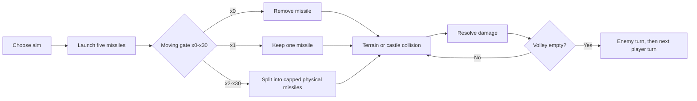
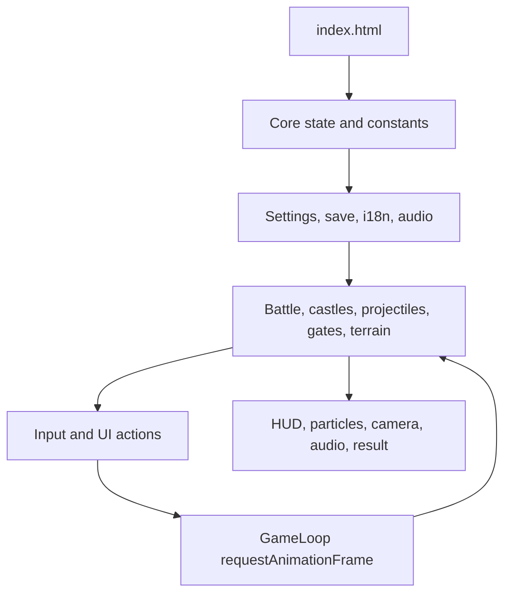
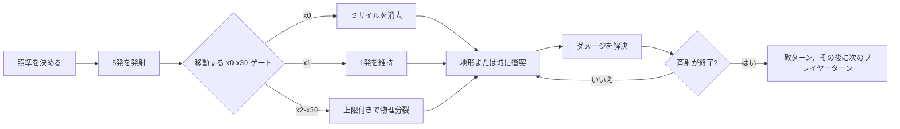
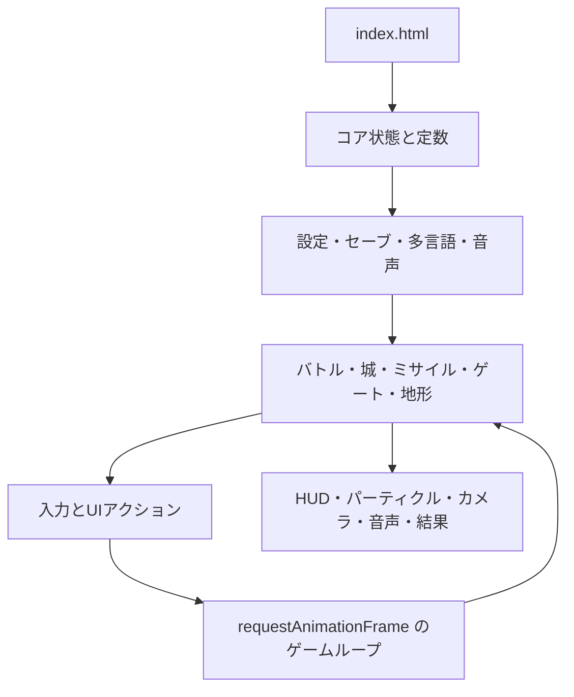
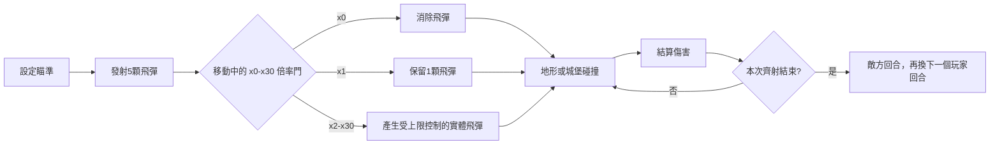
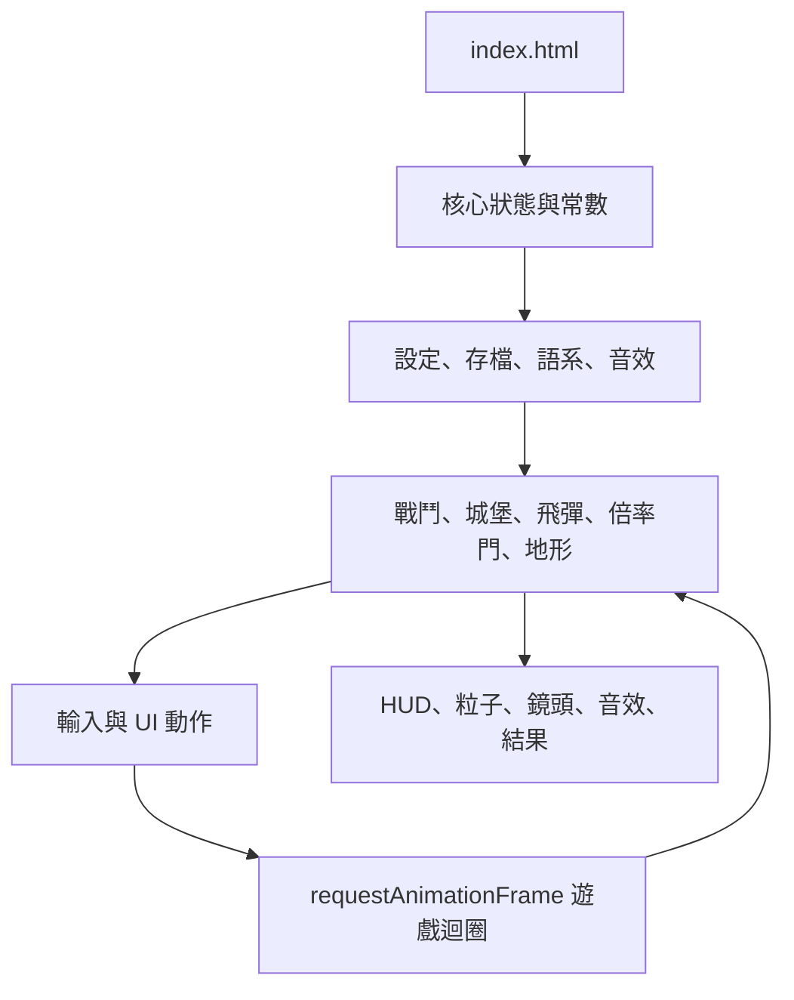

<a id="top"></a>

# 🏰 Castle Multiplier Defense

A browser-based, turn-based castle duel where ballistic missiles cross moving multiplier gates before striking the rival fortress.

## ✨ Opening Summary

### 🇬🇧 English

Castle Multiplier Defense is an offline-friendly Canvas 2D battle game about reading an arc, choosing a gate lane, and turning a five-missile volley into a controlled storm. Moving x0-x30 gates, random terrain cover, camera follow, three languages, synthesized audio, and persistent campaign progress make every shot a tactical decision.

### 🇯🇵 日本語

Castle Multiplier Defense は、弾道を読み、ゲートの通過位置を選び、5発のミサイルを制御された嵐へ変えるオフライン対応の Canvas 2D バトルゲームです。移動する x0～x30 倍率ゲート、ランダムな地形カバー、追従カメラ、3言語、合成オーディオ、保存されるキャンペーン進行によって、一発ごとに戦術的な判断が生まれます。

### 🇹🇼 繁體中文

Castle Multiplier Defense 是一款可離線遊玩的 Canvas 2D 回合制城堡對戰遊戲，核心是讀懂彈道、選擇倍率門路線，將 5 顆飛彈轉化為可控的攻擊風暴。移動中的 x0～x30 倍率門、隨機地形掩護、跟隨鏡頭、三種語系、合成音效與持久化戰役進度，讓每一發都成為戰術決策。

[🇬🇧 English](#english) · [🇯🇵 日本語](#japanese) · [🇹🇼 繁體中文](#traditional-chinese)

## 🧭 Contents

- [English](#english)
  - [Game Introduction](#english-game-introduction)
  - [Gameplay and Usage](#english-gameplay-and-usage)
  - [Quick Start](#english-quick-start)
  - [Program Overview](#english-program-overview)
  - [Code Organization](#english-code-organization)
  - [Supporting Systems](#english-supporting-systems)
  - [Testing](#english-testing)
  - [Status and Limitations](#english-status-and-limitations)
- [日本語](#japanese)
  - [ゲーム紹介](#japanese-game-introduction)
  - [ゲームプレイと使い方](#japanese-gameplay-and-usage)
  - [クイックスタート](#japanese-quick-start)
  - [プログラム概要](#japanese-program-overview)
  - [コード構成](#japanese-code-organization)
  - [補助システム](#japanese-supporting-systems)
  - [テスト](#japanese-testing)
  - [状態と制約](#japanese-status-and-limitations)
- [繁體中文](#traditional-chinese)
  - [遊戲介紹](#traditional-chinese-game-introduction)
  - [遊戲玩法與操作](#traditional-chinese-gameplay-and-usage)
  - [快速開始](#traditional-chinese-quick-start)
  - [程式概要](#traditional-chinese-program-overview)
  - [程式碼分類](#traditional-chinese-code-organization)
  - [支援系統](#traditional-chinese-supporting-systems)
  - [測試](#traditional-chinese-testing)
  - [專案狀態與限制](#traditional-chinese-status-and-limitations)

<a id="english"></a>

## 🇬🇧 English

<a id="english-game-introduction"></a>

### 🎮 Game Introduction

Castle Multiplier Defense runs entirely in the browser with HTML, CSS, vanilla JavaScript, the Canvas 2D API, Web Audio, and `localStorage`. The player and enemy castles trade turns across a long battlefield. Every missile follows a visible ballistic arc; the challenge is to make the path pass through useful gates without losing the shot to cover or an x0 gate.

#### 🌟 Core Features

| Feature | Implemented behavior |
| --- | --- |
| Turn-based battle | Player and enemy alternate volleys. A normal volley launches exactly five missiles. |
| Ballistic physics | Launch velocity, gravity, flight time, upward apex, swept collision, and orientation-aware trajectories are calculated in `assets/js/game/battle.js`. |
| Moving multiplier gates | Every battle creates five non-overlapping gates. Values are selected randomly from the complete x0-x30 table and move inside the upper playfield. |
| Gate effects | x0 removes a missile, x1 keeps one, and x2-x30 split into physical missiles with a maximum split limit and render-pool cap. |
| Random cover | Four to six rocks, trees, or crystals can intercept missiles. Cover avoids castles and gates and has durability 2-3. |
| Castle defense | Player base HP is 420, enemy base HP is 520 before level and difficulty scaling, and both castles receive a 75% damage reduction shield during round one. |
| Camera control | The view follows an active missile, returns to the current side after a volley, and supports manual pan, zoom, overview, and reset. |
| Campaign | Twenty level records define weather, enemy pace, and HP scaling. Winning advances the level and can unlock themes. |
| Presentation | Six CSS themes, three locales, responsive portrait/landscape layout, HUD toasts, particles, and synthesized music/SFX. |

<a id="english-gameplay-and-usage"></a>

### 🕹️ Gameplay and Usage

#### 🔁 Core Loop



#### ⚔️ Rules and Interactions

| Topic | Rule |
| --- | --- |
| Objective | Reduce the rival castle's HP to zero before your own castle falls. |
| Aim | Drag on the battlefield, use the keyboard aim controls, or adjust the on-screen aim target. The target is clamped to a safe play area. |
| Missile path | Missiles begin at the active castle, arc upward and forward, then descend toward the selected target. Gate and terrain checks use the previous and current positions as a segment. |
| Gate selection | Five gates are randomly selected from x0 through x30, placed without initial overlap, kept separated while moving, and constrained to the upper region. |
| Gate crossing | A projectile records each consumed gate ID, so the same projectile cannot repeatedly trigger one gate. |
| Damage | Castle defense reduces impact damage. A multiplier increases the missile's logical damage and then distributes the result into capped physical projectiles. |
| Cover | An active terrain object absorbs a missile, flashes, loses durability, and disappears after enough hits. |
| First round | `turnNumber <= 1` keeps the shield active; damage is multiplied by `1 - 0.75`. |
| Skill | `E` or the Skill button activates Slow Time for 4.8 seconds; the simulation runs at 46% speed until the 12-second cooldown returns. |
| Pause | `Escape`, the pause button, hidden-page handling, and the pause overlay stop simulation updates while preserving the current battle state. |
| Result | Enemy HP `<= 0` wins; player HP `<= 0` loses. Result cards show time, best multiplier, damage, shots, hit rate, and best combo. |

#### 🎯 Controls

| Action | Mouse / touch | Keyboard / UI |
| --- | --- | --- |
| Aim and fire | Drag to aim; release on touch or left-click with a mouse | `Space` fires; `A`/`D` or arrow keys fine-tune aim |
| Camera pan | Shift-drag or secondary/middle-button drag; use the camera pad | Camera pad buttons |
| Camera zoom | Use the on-screen `+` and `-` controls | `+` / `-` or numpad add/subtract |
| Full view / reset | Overview and home camera buttons | `V` overview, `C` reset to the active side |
| Skill | Press the Skill button | `E` |
| Pause / resume | Pause overlay buttons | `Escape` |
| Menus | Buttons and focusable controls | `Tab`, `Enter`, and `Space` work in menus |

#### 📈 Progression and Difficulty

- Levels 1-20 rotate through clear, cloudy, sunset, rain, snow, and night weather states while enemy pace and HP scale over the campaign.
- Easy, Normal, and Hard change enemy HP, firing pace, aim error, and gate bias; difficulty is stored with the campaign.
- A win unlocks the next level. Sunset, forest, and night themes unlock after winning levels 3, 5, and 7 respectively. Default, ocean, and kawaii are included in a fresh save.
- Continue restores the latest saved level and difficulty. Retry restarts the current level without deleting unlocked content.

<a id="english-quick-start"></a>

### 🚀 Quick Start

#### Requirements

- A modern browser with Canvas 2D, Pointer Events, Web Audio, `requestAnimationFrame`, and `localStorage` support.
- Python 3 or another static-file server is recommended for a predictable browser origin. No npm install or build step is required.

#### Launch locally

From this project directory, run:

```powershell
python -m http.server 8000
```

Open [http://localhost:8000/](http://localhost:8000/) in the browser. The first pointer or keyboard interaction unlocks Web Audio because browsers block unsolicited audio playback. Choose **Start Game**, aim through the moving gates, and use **Continue** after progress has been saved.

<a id="english-program-overview"></a>

### 🧩 Program Overview

The runtime is a dependency-free collection of browser scripts. Each file is an IIFE that adds a module to `window.CastleGame`; `window.GameState` stores global screen, settings, locale, save, and battle references.



The script order in `index.html` is significant: constants and state load first; storage, locales, and audio follow; game data and simulation load before input and UI; `game-loop.js` and `app.js` finish initialization. The main data path is:

`Input -> App -> Battle -> Projectile/Gate/Terrain/Collision -> Castle -> HUD/Particles/Audio/SaveManager`

The simulation clamps frame delta to `Constants.MAX_DELTA`, updates at `requestAnimationFrame` cadence, and separates world coordinates from Canvas rendering. `Projectile.Pool` and particle/render limits keep large multiplier events bounded.

<a id="english-code-organization"></a>

### 🗂️ Code Organization

| Path | Responsibility | Representative files |
| --- | --- | --- |
| `index.html` | Screen markup, Canvas, controls, localized attributes, and script order | `index.html` |
| `assets/css/base/`, `layout/`, `components/` | Reset, tokens, typography, responsive layout, buttons, cards, modals, sliders, tabs, toasts | `variables.css`, `responsive.css`, `toast.css` |
| `assets/css/screens/` and `themes/` | Menu, battle, help, settings, pause, results, and six visual themes | `game.css`, `kawaii.css` |
| `assets/js/core/` | Application actions, state, constants, utilities, and frame loop | `app.js`, `constants.js`, `game-loop.js` |
| `assets/js/game/` | Battle rules, ballistic missiles, castles, gates, terrain, AI, levels, particles, camera, and collision | `battle.js`, `multiplier-gate.js`, `terrain.js` |
| `assets/js/input/` | Keyboard, pointer, touch, aiming, firing, and camera gestures | `keyboard.js`, `pointer.js` |
| `assets/js/ui/` | Screen transitions, HUD, menu, settings, help, results, and toast stacking | `screen-manager.js`, `hud.js`, `settings.js` |
| `assets/js/i18n/` | Locale dictionaries and DOM translation application | `i18n.js`, `en-US.js`, `ja-JP.js`, `zh-TW.js` |
| `assets/js/audio/` | Web Audio graph, generated BGM sequences, and generated SFX tones | `audio-manager.js`, `bgm.js`, `sfx.js` |
| `assets/js/storage/` | Sanitized settings and versioned campaign persistence | `settings-storage.js`, `save-manager.js` |
| `Castle_Multiplier_Defense_spec.md` | Design and delivery reference; verify its plans against the running source | `Castle_Multiplier_Defense_spec.md` |

<a id="english-supporting-systems"></a>

### 🛠️ Supporting Systems

| System | Current behavior |
| --- | --- |
| Localization | `zh-TW`, `en-US`, and `ja-JP` dictionaries share 186 keys. `data-i18n`, title, and ARIA attributes are updated together. |
| Settings | Theme, quality, difficulty, language, volume, mute, BGM/SFX toggles, reduced motion, camera shake, and high contrast are applied immediately and saved. |
| Themes | Classic/default, ocean, sunset, forest, night, and kawaii are CSS variable themes. |
| Audio | Web Audio creates oscillator-based BGM and SFX, starts after a user gesture, separates BGM/SFX/master gains, and limits simultaneous SFX to 16. |
| Accessibility | Semantic buttons, focusable controls, localized labels, high-contrast markers, reduced-motion handling, and keyboard menu operation are present. |
| Responsive rendering | Portrait and landscape use different world axes, gate geometry, gravity, castle spacing, and reflow behavior. Canvas DPR is capped at 2. |
| Performance | Projectile pooling, logical-vs-visual counts, desktop/mobile projectile limits, particle limits, delta clamping, and quality presets prevent multiplier explosions from creating unbounded objects. |
| Persistence and privacy | `castleGame_save` and `castleGame_settings` use browser `localStorage`; there is no current server, account, upload, tracking, or analytics path. |

<a id="english-testing"></a>

### 🧪 Testing

This project currently has no `package.json`, automated test runner, or committed `tests/` directory. The following lightweight checks were run during the current implementation:

```powershell
Get-ChildItem -Recurse assets/js -Filter *.js | ForEach-Object { node --check $_.FullName }
git diff --check
```

The development VM regression harness also verified 200 portrait/landscape gate scenes, five gates per scene, all 31 values in the x0-x30 range, no initial or moving overlap, upper-zone bounds, x0 removal, x1 one-projectile behavior, and x30 producing 30 physical projectiles. A separate 2,000-run terrain check kept random cover between four and six objects. HTML reference checks found 60 local references, and all three locale dictionaries matched at 186 keys with no missing or extra keys.

For a visual smoke test, launch the local server and check both orientations: fire a volley, watch the upward arc and camera follow, observe gates moving without overlap, use manual pan/zoom/overview, switch turns, pause/resume, change language/theme/quality, and complete a win or loss result.

<a id="english-status-and-limitations"></a>

### 📌 Status and Limitations

- The current playable scope is a local browser campaign with 20 levels and a single enemy AI opponent.
- The `assets/audio/`, `assets/images/`, and `assets/fonts/` directories contain placeholders; castles, gates, terrain, particles, and scenery are drawn with Canvas/CSS, while audio is synthesized rather than loaded from files.
- The design specification contains broader ideas and checklists. This README intentionally documents only behavior confirmed in the current source.
- Because saves live in browser `localStorage`, clearing site data removes campaign progress. There is no cloud synchronization.
- Contributions should preserve the IIFE namespace style, update all three locale dictionaries, validate both orientations, and keep logical projectile counts separate from rendered objects.

<a id="japanese"></a>

## 🇯🇵 日本語

<a id="japanese-game-introduction"></a>

### 🎮 ゲーム紹介

Castle Multiplier Defense は、HTML、CSS、Vanilla JavaScript、Canvas 2D API、Web Audio、`localStorage` だけで動作するブラウザゲームです。プレイヤー城と敵城が長い戦場で交互に攻撃します。すべてのミサイルは見える弾道を描くため、ゲートを通す軌道を選び、地形カバーや x0 ゲートで弾を失わないことが重要です。

#### 🌟 主な機能

| 機能 | 実装内容 |
| --- | --- |
| ターン制バトル | プレイヤーと敵が交互に一斉射撃し、通常の一斉射撃は必ず5発です。 |
| 弾道物理 | 発射速度、重力、飛行時間、上向きの頂点、掃引衝突、向き別の軌道を `assets/js/game/battle.js` で計算します。 |
| 移動倍率ゲート | 各バトルで重ならないゲートを5つ生成し、x0～x30からランダムに選び、上空のプレイフィールド内で移動させます。 |
| ゲート効果 | x0 はミサイルを消し、x1 は1発を維持し、x2～x30 は物理ミサイルへ分裂します。分裂上限と描画プール上限があります。 |
| ランダムカバー | 岩、木、クリスタルを4～6個配置します。城とゲートを避け、耐久値は2～3です。 |
| 城の防御 | プレイヤーの基礎HPは420、敵の基礎HPは520で、レベルと難易度で変化します。両方の城は1ラウンド目に75%ダメージ軽減シールドを持ちます。 |
| カメラ操作 | 飛行中のミサイルを追従し、斉射後は現在の陣営へ戻ります。手動パン、ズーム、全体表示、リセットにも対応します。 |
| キャンペーン | 天候、敵の速度、HP倍率を持つ20レベルを進み、勝利でテーマを解放できます。 |
| 表現 | 6テーマ、3言語、縦横レスポンシブ、HUDトースト、パーティクル、合成音楽と効果音を備えます。 |

<a id="japanese-gameplay-and-usage"></a>

### 🕹️ ゲームプレイと使い方

#### 🔁 基本ループ



#### ⚔️ ルールと操作

| 項目 | ルール |
| --- | --- |
| 目的 | 自分の城が落ちる前に敵城のHPを0にします。 |
| 照準 | 戦場をドラッグ、キーボードの照準操作、画面上の照準ターゲットで調整します。安全な範囲に制限されます。 |
| ミサイルの軌道 | 現在の城から上向きに前進し、選択した目標へ下降します。ゲートと地形は前フレームから現フレームまでの線分で判定します。 |
| ゲート | x0～x30から5つをランダムに選び、初期配置と移動中の重なりを防ぎ、上側の領域に限定します。 |
| ゲート通過 | 各ミサイルは消費したゲートIDを記録し、同じゲートを何度も発動しません。 |
| ダメージ | 城の防御力が衝撃ダメージを減らします。倍率は論理ダメージを増やし、上限付きの物理ミサイルへ配分します。 |
| カバー | 有効な地形がミサイルを受け止め、点滅し、耐久値を失います。耐久値が尽きると消滅します。 |
| 1ラウンド目 | `turnNumber <= 1` の間はシールドが有効で、ダメージは `1 - 0.75` 倍です。 |
| スキル | `E` またはスキルボタンで4.8秒間 Slow Time を発動し、シミュレーション速度を46%にします。クールダウンは12秒です。 |
| 一時停止 | `Escape`、一時停止ボタン、非表示ページ処理、ポーズ画面で更新を止め、現在の戦闘状態を維持します。 |
| 結果 | 敵HPが0以下なら勝利、プレイヤーHPが0以下なら敗北です。時間、最高倍率、ダメージ、発射数、命中率、最高コンボを表示します。 |

#### 🎯 操作一覧

| 操作 | マウス / タッチ | キーボード / UI |
| --- | --- | --- |
| 照準と発射 | ドラッグで照準し、タッチは離す、マウスは左クリックで発射 | `Space`、`A`/`D` または矢印キーで照準調整 |
| カメラ移動 | Shiftドラッグ、右/中ボタンのドラッグ、カメラパッド | カメラパッドのボタン |
| ズーム | 画面上の `+` / `-` | `+` / `-` またはテンキー |
| 全体表示 / リセット | 全体表示・ホームボタン | `V` 全体表示、`C` 現在側へリセット |
| スキル | スキルボタン | `E` |
| 一時停止 / 再開 | ポーズ画面のボタン | `Escape` |
| メニュー | ボタンとフォーカス可能なコントロール | `Tab`、`Enter`、`Space` |

#### 📈 進行と難易度

- レベル1～20は晴れ、曇り、夕焼け、雨、雪、夜の天候を巡り、キャンペーン後半ほど敵の速度とHP倍率が変化します。
- Easy、Normal、Hard は敵HP、発射間隔、照準誤差、ゲートバイアスを変更し、難易度はキャンペーンに保存されます。
- 勝利すると次のレベルが解放されます。レベル3、5、7の勝利で夕焼け、森、夜のテーマを順に解放します。新規セーブには Classic、Ocean、Kawaii が含まれます。
- Continue は最新の保存レベルと難易度を復元します。Retry は解放済みコンテンツを削除せず、現在のレベルを再開します。

<a id="japanese-quick-start"></a>

### 🚀 クイックスタート

#### 必要環境

- Canvas 2D、Pointer Events、Web Audio、`requestAnimationFrame`、`localStorage` に対応する現代的なブラウザ。
- 安定したブラウザオリジンのため、Python 3などの静的ファイルサーバーを推奨します。npmのインストールやビルドは不要です。

#### ローカル起動

プロジェクトディレクトリで次を実行します。

```powershell
python -m http.server 8000
```

ブラウザで [http://localhost:8000/](http://localhost:8000/) を開きます。自動再生制限のため、最初のポインターまたはキーボード操作で Web Audio が有効になります。**Start Game** を選び、移動するゲートを通して発射してください。保存後は **Continue** で再開できます。

<a id="japanese-program-overview"></a>

### 🧩 プログラム概要

ランタイムは依存関係のないブラウザスクリプト群です。各ファイルは IIFE で、共有名前空間 `window.CastleGame` にモジュールを登録します。`window.GameState` は画面、設定、言語、セーブ、バトルへの参照を保持します。



`index.html` の読み込み順は重要です。定数と状態、ストレージ・言語・音声、ゲームデータとシミュレーション、入力とUIの順に読み込み、最後に `game-loop.js` と `app.js` が初期化を完了します。主なデータ経路は次のとおりです。

`Input -> App -> Battle -> Projectile/Gate/Terrain/Collision -> Castle -> HUD/Particles/Audio/SaveManager`

フレーム差分は `Constants.MAX_DELTA` で制限し、`requestAnimationFrame` に合わせて更新します。`Projectile.Pool`、パーティクル上限、描画上限により、大倍率でもオブジェクト数が無制限に増えません。

<a id="japanese-code-organization"></a>

### 🗂️ コード構成

| パス | 役割 | 代表ファイル |
| --- | --- | --- |
| `index.html` | 画面マークアップ、Canvas、操作、翻訳属性、スクリプト順 | `index.html` |
| `assets/css/base/`、`layout/`、`components/` | リセット、トークン、文字、レスポンシブ、ボタン、カード、モーダル、スライダー、トースト | `variables.css`、`responsive.css`、`toast.css` |
| `assets/css/screens/`、`themes/` | メニュー、バトル、ヘルプ、設定、ポーズ、結果、6テーマ | `game.css`、`kawaii.css` |
| `assets/js/core/` | アクション、状態、定数、ユーティリティ、フレームループ | `app.js`、`constants.js`、`game-loop.js` |
| `assets/js/game/` | バトル、弾道、城、ゲート、地形、AI、レベル、パーティクル、カメラ、衝突 | `battle.js`、`multiplier-gate.js`、`terrain.js` |
| `assets/js/input/` | キーボード、ポインター、タッチ、照準、発射、カメラジェスチャー | `keyboard.js`、`pointer.js` |
| `assets/js/ui/` | 画面遷移、HUD、メニュー、設定、ヘルプ、結果、トースト | `screen-manager.js`、`hud.js`、`settings.js` |
| `assets/js/i18n/` | 言語辞書とDOM翻訳の適用 | `i18n.js`、`en-US.js`、`ja-JP.js`、`zh-TW.js` |
| `assets/js/audio/` | Web Audio グラフ、BGMシーケンス、SFXトーン | `audio-manager.js`、`bgm.js`、`sfx.js` |
| `assets/js/storage/` | 設定とバージョン付きキャンペーン保存 | `settings-storage.js`、`save-manager.js` |
| `Castle_Multiplier_Defense_spec.md` | 設計・納品の参照資料。実装と照合して使用 | `Castle_Multiplier_Defense_spec.md` |

<a id="japanese-supporting-systems"></a>

### 🛠️ 補助システム

| システム | 現在の動作 |
| --- | --- |
| 多言語 | `zh-TW`、`en-US`、`ja-JP` の辞書は186キーで一致し、表示文、title、ARIA属性を同時に更新します。 |
| 設定 | テーマ、画質、難易度、言語、音量、ミュート、BGM/SFX、減少モーション、カメラシェイク、高コントラストを即時適用して保存します。 |
| テーマ | Classic/default、Ocean、Sunset、Forest、Night、KawaiiをCSS変数で切り替えます。 |
| 音声 | Web AudioでオシレーターBGM/SFXを生成し、ユーザー操作後に開始します。BGM/SFX/マスターを分離し、同時SFXは16音に制限します。 |
| アクセシビリティ | セマンティックボタン、フォーカス可能な操作、翻訳済みラベル、高コントラスト、減少モーション、キーボード操作に対応します。 |
| レスポンシブ | 縦横でワールド軸、ゲート形状、重力、城の距離、リフロー処理を切り替えます。CanvasのDPRは2までです。 |
| パフォーマンス | ミサイルプール、論理数と表示数の分離、デスクトップ/モバイル上限、パーティクル上限、差分制限、画質プリセットで大倍率を制御します。 |
| 保存とプライバシー | `castleGame_save` と `castleGame_settings` をブラウザの `localStorage` に保存します。サーバー、アカウント、アップロード、追跡、分析の処理はありません。 |

<a id="japanese-testing"></a>

### 🧪 テスト

現在、`package.json`、自動テストランナー、コミット済みの `tests/` ディレクトリはありません。今回の実装では次の軽量チェックを実行しました。

```powershell
Get-ChildItem -Recurse assets/js -Filter *.js | ForEach-Object { node --check $_.FullName }
git diff --check
```

開発用Node VM回帰ハーネスでは、縦横200シーン、各シーン5ゲート、x0～x30の全31値、初期・移動中の重なりなし、上側の範囲、x0消去、x1の1発、x30の30発を確認しました。別の地形2,000回チェックでは、地形数が4～6に維持されました。HTMLのローカル参照は60件で、3言語辞書は186キーで一致し、欠落や余分なキーはありませんでした。

画面確認では、両方の向きで発射し、上向きの弧とカメラ追従、重ならずに動くゲート、手動パン/ズーム/全体表示、ターン変更、一時停止/再開、言語・テーマ・画質変更、勝敗画面を確認してください。

<a id="japanese-status-and-limitations"></a>

### 📌 状態と制約

- 現在のプレイ範囲は、20レベルと1体の敵AIによるローカルブラウザキャンペーンです。
- `assets/audio/`、`assets/images/`、`assets/fonts/` はプレースホルダーです。城、ゲート、地形、パーティクル、背景はCanvas/CSSで描画し、音声はファイルではなく合成します。
- 仕様書には広いアイデアとチェックリストが含まれます。このREADMEは現在のソースで確認できる動作だけを説明します。
- セーブはブラウザの `localStorage` にあるため、サイトデータを消すと進行も消えます。クラウド同期はありません。
- 貢献時はIIFE名前空間の形式、3言語辞書、両方向の検証、論理ミサイル数と描画オブジェクト数の分離を維持してください。

<a id="traditional-chinese"></a>

## 🇹🇼 繁體中文

<a id="traditional-chinese-game-introduction"></a>

### 🎮 遊戲介紹

Castle Multiplier Defense 使用 HTML、CSS、原生 JavaScript、Canvas 2D API、Web Audio 與 `localStorage` 在瀏覽器中運作。玩家城堡與敵方城堡會在拉長的戰場上交替攻擊。每顆飛彈都會呈現可觀察的彈道，因此重點是選擇能穿過有利倍率門的路徑，同時避免被地形掩護或 x0 倍率門消耗。

#### 🌟 主要功能

| 功能 | 實作內容 |
| --- | --- |
| 回合制戰鬥 | 玩家與敵方輪流齊射，正常回合固定發射 5 顆飛彈。 |
| 彈道物理 | `assets/js/game/battle.js` 計算發射速度、重力、飛行時間、向上拋物線頂點、掃掠碰撞與方向專用彈道。 |
| 移動倍率門 | 每場生成 5 個不重疊倍率門，從完整 x0～x30 表格隨機取值，並在上方遊戲區域內移動。 |
| 倍率效果 | x0 會消除飛彈、x1 保留 1 顆、x2～x30 會分裂成實體飛彈，並受分裂上限與繪製池上限控制。 |
| 隨機掩護 | 隨機放置 4～6 個岩石、樹木或水晶；會避開城堡與倍率門，耐久度為 2～3。 |
| 城堡防禦 | 玩家基礎血量為 420，敵方基礎血量為 520，之後再依關卡與難度調整；雙方第一回合都有降低 75% 傷害的護盾。 |
| 鏡頭控制 | 飛行中跟隨飛彈，回合齊射結束後回到目前陣營，並支援手動拉動、縮放、全景與重置。 |
| 戰役 | 20 筆關卡資料定義天氣、敵方速度與血量倍率，勝利後可解鎖主題。 |
| 表現層 | 6 種 CSS 主題、3 種語系、直式/橫式響應式版面、HUD 提示、粒子效果與合成音樂/音效。 |

<a id="traditional-chinese-gameplay-and-usage"></a>

### 🕹️ 遊戲玩法與操作

#### 🔁 核心流程



#### ⚔️ 規則與互動

| 項目 | 規則 |
| --- | --- |
| 目標 | 在自己的城堡被摧毀前，先將敵方城堡血量降到 0。 |
| 瞄準 | 拖曳戰場、使用鍵盤瞄準，或調整畫面上的瞄準目標；目標會限制在安全遊戲範圍內。 |
| 飛彈路徑 | 飛彈從目前城堡出發，先向上並向前，再下降至選定目標；倍率門、地形與城堡都使用前後位置線段判定。 |
| 倍率門 | 從 x0～x30 隨機選出 5 個倍率門，初始配置與移動期間都避免重疊，並限制在上方區域。 |
| 穿越倍率門 | 每顆飛彈會記錄已消耗的倍率門 ID，避免同一顆飛彈重複觸發同一個門。 |
| 傷害 | 城堡防禦力會降低命中傷害；倍率先提升邏輯傷害，再分配到受上限控制的實體飛彈。 |
| 地形掩護 | 啟用中的地形會攔截飛彈、閃爍並扣除耐久度，耐久度耗盡後才會消失。 |
| 第一回合 | `turnNumber <= 1` 時護盾啟用，傷害會乘上 `1 - 0.75`。 |
| 技能 | 按 `E` 或技能按鈕啟動 4.8 秒緩速時間，模擬速度降為 46%，冷卻時間為 12 秒。 |
| 暫停 | `Escape`、暫停按鈕、頁面隱藏處理與暫停畫面會停止模擬更新，但保留目前戰鬥狀態。 |
| 結果 | 敵方血量小於等於 0 為勝利；玩家血量小於等於 0 為失敗。結果頁顯示時間、最高倍率、傷害、發射數、命中率與最高連擊。 |

#### 🎯 操作表

| 操作 | 滑鼠 / 觸控 | 鍵盤 / UI |
| --- | --- | --- |
| 瞄準與發射 | 拖曳瞄準；觸控放開或滑鼠左鍵發射 | `Space` 發射；`A`/`D` 或方向鍵微調瞄準 |
| 拉動鏡頭 | Shift 拖曳、右鍵/中鍵拖曳、鏡頭控制盤 | 鏡頭控制盤按鈕 |
| 鏡頭縮放 | 畫面上的 `+` / `-` | `+` / `-` 或數字鍵盤加減 |
| 全景 / 重置 | 全景與首頁鏡頭按鈕 | `V` 全景、`C` 重置到目前陣營 |
| 技能 | 技能按鈕 | `E` |
| 暫停 / 繼續 | 暫停畫面按鈕 | `Escape` |
| 選單 | 按鈕與可聚焦控制項 | 選單支援 `Tab`、`Enter`、`Space` |

#### 📈 進度與難度

- 第 1～20 關會輪替晴朗、多雲、夕陽、下雨、下雪與夜晚天氣，並逐步調整敵方速度與血量倍率。
- Easy、Normal、Hard 會改變敵方血量、射擊速度、瞄準誤差與倍率門偏移，難度會跟戰役一起保存。
- 勝利會解鎖下一關；完成第 3、5、7 關後依序解鎖夕陽、森林、夜境主題。新存檔預設包含經典、海洋與可愛主題。
- 「繼續」會還原最近保存的關卡與難度；「再來一次」重新開始目前關卡，但不會刪除已解鎖內容。

<a id="traditional-chinese-quick-start"></a>

### 🚀 快速開始

#### 執行需求

- 支援 Canvas 2D、Pointer Events、Web Audio、`requestAnimationFrame` 與 `localStorage` 的現代瀏覽器。
- 建議使用 Python 3 或其他靜態檔案伺服器，以確保瀏覽器來源一致；不需要 npm 安裝或建置流程。

#### 在本機啟動

在本專案目錄執行：

```powershell
python -m http.server 8000
```

接著開啟 [http://localhost:8000/](http://localhost:8000/)。瀏覽器通常會阻擋未經互動的音效，因此第一次點擊或按鍵操作後才會解鎖 Web Audio。選擇「開始遊戲」，瞄準會移動的倍率門；進度保存後可使用「繼續遊戲」。

<a id="traditional-chinese-program-overview"></a>

### 🧩 程式概要

這是一組不依賴套件的瀏覽器腳本。每個檔案都是 IIFE，將模組掛到共享命名空間 `window.CastleGame`；`window.GameState` 保存畫面、設定、語系、存檔與戰鬥參照。



`index.html` 的載入順序不可任意調整：先載入常數與狀態，再載入儲存、語系與音效，接著載入遊戲資料與模擬、輸入與 UI，最後由 `game-loop.js` 與 `app.js` 完成初始化。主要資料流如下：

`Input -> App -> Battle -> Projectile/Gate/Terrain/Collision -> Castle -> HUD/Particles/Audio/SaveManager`

每幀差值會由 `Constants.MAX_DELTA` 限制，並以 `requestAnimationFrame` 更新；`Projectile.Pool`、粒子上限與繪製上限，避免高倍率造成無限制的物件數量。

<a id="traditional-chinese-code-organization"></a>

### 🗂️ 程式碼分類

| 路徑 | 負責內容 | 代表檔案 |
| --- | --- | --- |
| `index.html` | 畫面標記、Canvas、操作、翻譯屬性與腳本順序 | `index.html` |
| `assets/css/base/`、`layout/`、`components/` | 重置、設計變數、字體、響應式版面、按鈕、卡片、彈窗、滑桿、提示 | `variables.css`、`responsive.css`、`toast.css` |
| `assets/css/screens/`、`themes/` | 選單、戰鬥、說明、設定、暫停、結果與 6 種主題 | `game.css`、`kawaii.css` |
| `assets/js/core/` | 動作路由、狀態、常數、工具與畫面迴圈 | `app.js`、`constants.js`、`game-loop.js` |
| `assets/js/game/` | 戰鬥規則、彈道、城堡、倍率門、地形、AI、關卡、粒子、鏡頭與碰撞 | `battle.js`、`multiplier-gate.js`、`terrain.js` |
| `assets/js/input/` | 鍵盤、指標、觸控、瞄準、發射與鏡頭手勢 | `keyboard.js`、`pointer.js` |
| `assets/js/ui/` | 畫面切換、HUD、選單、設定、說明、結果與提示堆疊 | `screen-manager.js`、`hud.js`、`settings.js` |
| `assets/js/i18n/` | 語系字典與 DOM 翻譯套用 | `i18n.js`、`en-US.js`、`ja-JP.js`、`zh-TW.js` |
| `assets/js/audio/` | Web Audio 音訊圖、BGM 序列與 SFX 音調 | `audio-manager.js`、`bgm.js`、`sfx.js` |
| `assets/js/storage/` | 設定與版本化戰役存檔 | `settings-storage.js`、`save-manager.js` |
| `Castle_Multiplier_Defense_spec.md` | 設計與交付參考；使用時需與實際程式核對 | `Castle_Multiplier_Defense_spec.md` |

<a id="traditional-chinese-supporting-systems"></a>

### 🛠️ 支援系統

| 系統 | 目前行為 |
| --- | --- |
| 多語系 | `zh-TW`、`en-US`、`ja-JP` 三份字典共 186 個鍵值，會同步更新畫面文字、title 與 ARIA 屬性。 |
| 設定 | 主題、畫質、難度、語言、音量、靜音、BGM/SFX、減少動畫、鏡頭震動與高對比會立即套用並保存。 |
| 主題 | 經典/default、海洋、夕陽、森林、夜境、可愛使用 CSS 變數切換。 |
| 音效 | 使用 Web Audio 產生振盪器 BGM/SFX，第一次互動後啟動；BGM、SFX、主音量分開控制，同時最多 16 個 SFX。 |
| 無障礙 | 提供語意化按鈕、可聚焦控制項、翻譯後標籤、高對比、減少動畫與鍵盤選單操作。 |
| 響應式 | 直式與橫式會切換世界軸向、倍率門尺寸、重力、城堡距離與重排邏輯；Canvas DPR 上限為 2。 |
| 效能 | 使用飛彈物件池、邏輯數量/畫面數量分離、桌機/行動裝置上限、粒子上限、差值限制與畫質預設，控制高倍率物件量。 |
| 存檔與隱私 | 使用瀏覽器 `localStorage` 的 `castleGame_save` 與 `castleGame_settings`；目前沒有伺服器、帳號、上傳、追蹤或分析流程。 |

<a id="traditional-chinese-testing"></a>

### 🧪 測試

目前沒有 `package.json`、自動化測試執行器或已提交的 `tests/` 目錄。本次實作執行了以下輕量檢查：

```powershell
Get-ChildItem -Recurse assets/js -Filter *.js | ForEach-Object { node --check $_.FullName }
git diff --check
```

開發用 Node VM 回歸工具另外驗證 200 個直式/橫式倍率門場景、每場 5 個門、x0～x30 全 31 種倍率、初始與移動中皆不重疊、上方區域限制、x0 消除、x1 保留 1 顆與 x30 產生 30 顆實體飛彈。另一組 2,000 次地形測試確認隨機掩護維持 4～6 個。HTML 本地引用檢查找到 60 個引用，三份語系字典皆為 186 個鍵值，沒有缺漏或多餘鍵值。

畫面冒煙測試建議在兩種方向都執行：發射並觀察向上彈道與鏡頭跟隨、倍率門移動且不重疊、手動拉動/縮放/全景、回合切換、暫停/繼續、語言/主題/畫質切換，以及勝利或失敗結果。

<a id="traditional-chinese-status-and-limitations"></a>

### 📌 專案狀態與限制

- 目前可玩的範圍是本機瀏覽器戰役、20 個關卡與 1 個敵方 AI 對手。
- `assets/audio/`、`assets/images/`、`assets/fonts/` 目前是佔位目錄；城堡、倍率門、地形、粒子與背景由 Canvas/CSS 繪製，音效由程式合成而非載入檔案。
- 規格書包含更廣泛的構想與檢查清單；本 README 只描述目前程式碼已確認的行為。
- 存檔位於瀏覽器 `localStorage`，清除網站資料就會刪除戰役進度，目前沒有雲端同步。
- 貢獻時請維持 IIFE 命名空間風格、同步更新三份語系字典、驗證直式與橫式，並分離邏輯飛彈數量與實際繪製物件數量。

## 🌠 Closing Summary

### 🇬🇧 English

The project is ready to run as a focused local browser campaign: aim through five moving x0-x30 gates, protect both castles with terrain and first-round shields, and use the camera and settings systems to make every ballistic volley readable. Extend gameplay by preserving the source-backed invariants and the lightweight validation workflow above.

### 🇯🇵 日本語

このプロジェクトは、5つの移動する x0～x30 ゲートを通して照準し、地形と1ラウンド目のシールドで城を守り、カメラと設定を使って弾道を読みやすくするローカルブラウザキャンペーンとして動作します。機能を拡張するときは、ソースで確認できるルールと上記の軽量検証手順を維持してください。

### 🇹🇼 繁體中文

本專案目前已是一個可直接執行的本機瀏覽器戰役：瞄準穿過 5 個移動中的 x0～x30 倍率門，利用地形與第一回合護盾保護雙方城堡，再透過鏡頭與設定系統讓每次彈道齊射都清楚可讀。後續擴充請維持程式中已確認的規則與上述輕量驗證流程。

[🔝 Back to top](#top)
