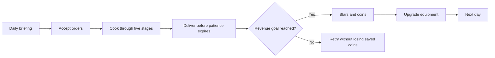
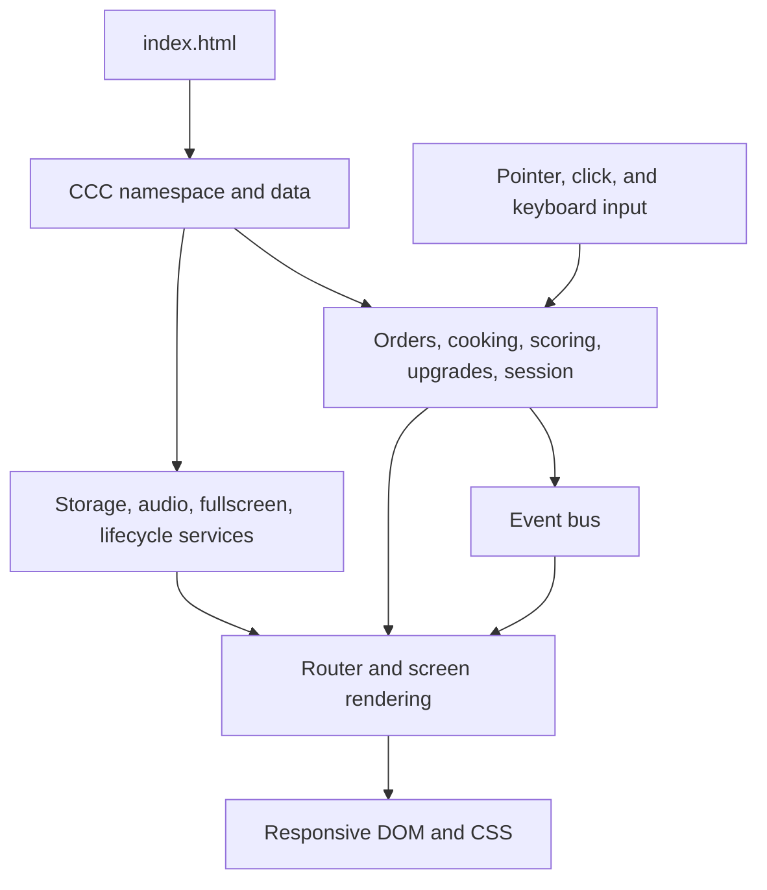
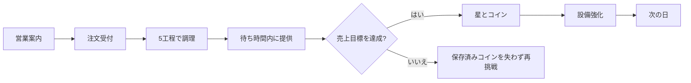
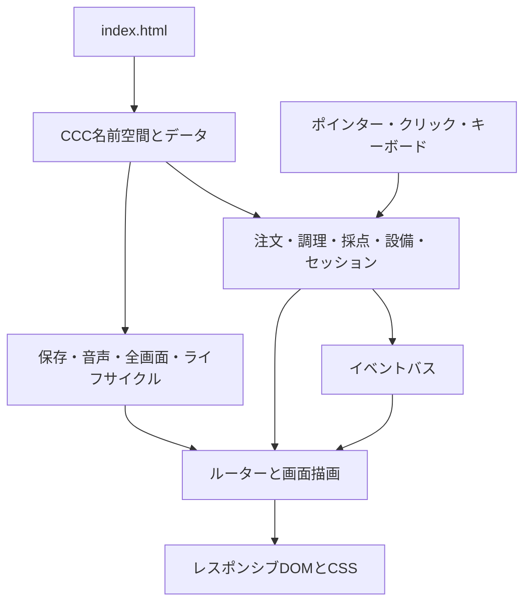
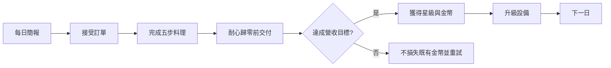
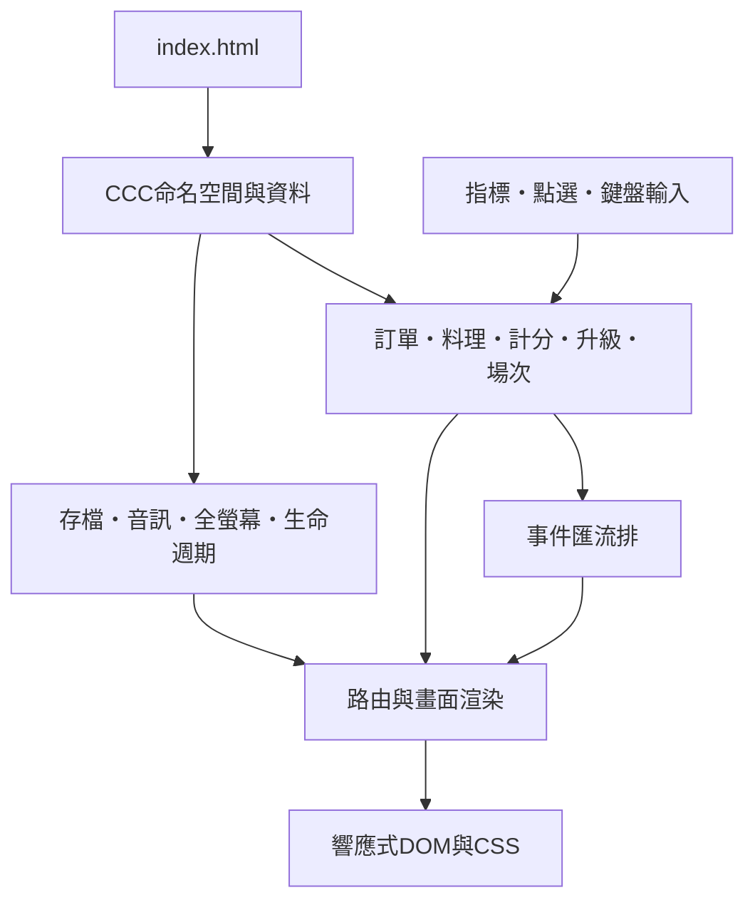

<a id="top"></a>

<p align="center">
  
</p>

# 🍗 Crispy Cutlet Corner · チキンカツ屋さん · 雞排小舖

An offline, responsive, ten-day fried-cutlet shop management game built with plain HTML, CSS, and JavaScript.

## 👋 Opening Summary

### 🇬🇧 English

Run a cheerful cutlet stall through ten increasingly busy business days. Read customer orders, prepare each cutlet through five hands-on cooking stages, protect customer patience, build combos, earn coins, and improve the shop—entirely offline and without installing anything.

### 🇯🇵 日本語

少しずつ忙しくなる10日間、かわいいチキンカツ屋を切り盛りします。注文を確認し、5つの調理工程でカツを仕上げ、待ち時間とコンボを守りながらコインを獲得して設備を強化します。インストール不要で、すべてオフラインで遊べます。

### 🇹🇼 繁體中文

經營一間逐日忙碌起來的可愛雞排攤，完成十天營業挑戰。辨認顧客訂單、走完五步料理流程、守住耐心與連擊、賺取金幣並升級設備；全程離線，不需要安裝任何套件。

[🇬🇧 English](#english) · [🇯🇵 日本語](#japanese) · [🇹🇼 繁體中文](#traditional-chinese)

## 📚 Contents

- [🇬🇧 English](#english)
  - [🎮 Game Introduction](#english-introduction)
  - [✨ Features](#english-features)
  - [🕹️ Gameplay](#english-gameplay)
  - [🚀 Quick Start](#english-quick-start)
  - [🛠️ Program Overview](#english-program)
  - [📁 Code Organization](#english-code)
  - [💾 Supporting Systems](#english-systems)
  - [🧪 Testing](#english-testing)
  - [📌 Status and Limitations](#english-status)
- [🇯🇵 日本語](#japanese)
  - [🎮 ゲーム紹介](#japanese-introduction)
  - [✨ 主な機能](#japanese-features)
  - [🕹️ 遊び方](#japanese-gameplay)
  - [🚀 クイックスタート](#japanese-quick-start)
  - [🛠️ プログラム概要](#japanese-program)
  - [📁 コード構成](#japanese-code)
  - [💾 補助システム](#japanese-systems)
  - [🧪 テスト](#japanese-testing)
  - [📌 状態と制限](#japanese-status)
- [🇹🇼 繁體中文](#traditional-chinese)
  - [🎮 遊戲介紹](#traditional-chinese-introduction)
  - [✨ 主要特色](#traditional-chinese-features)
  - [🕹️ 遊玩方式](#traditional-chinese-gameplay)
  - [🚀 快速開始](#traditional-chinese-quick-start)
  - [🛠️ 程式概覽](#traditional-chinese-program)
  - [📁 程式分類](#traditional-chinese-code)
  - [💾 支援系統](#traditional-chinese-systems)
  - [🧪 測試](#traditional-chinese-testing)
  - [📌 狀態與限制](#traditional-chinese-status)

---

<a id="english"></a>

## 🇬🇧 English

<a id="english-introduction"></a>

### 🎮 Game Introduction

**Crispy Cutlet Corner** is a single-player cooking and time-management game for modern desktop and mobile browsers. You serve customer orders before their patience runs out by choosing chicken, marinating it, coating it, controlling the fryer, seasoning the finished cutlet, bagging it, and delivering it to the matching order.

The campaign contains ten business days lasting from 120 to 270 seconds. New flavors, more simultaneous orders, shorter patience, and stronger temperature drift are introduced gradually. The first three days teach the core systems; later days reward preparation, parallel fryer use, and disciplined order priority.

<a id="english-features"></a>

### ✨ Features

- 🍳 A complete five-stage cooking workflow with quality feedback at every stage.
- 🧾 One to four simultaneous orders with customer avatars, flavor symbols, prices, and numeric patience bars.
- 🌡️ Active fryer temperature control, doneness tracking, timed flipping, and up to three parallel baskets.
- 🌶️ Six unlockable flavors: pepper salt, chili, nori, sweet plum, garlic pepper, and rich cheese.
- ⭐ Weighted quality scoring, patience-based income, combo multipliers, and one-to-three-star results.
- 🛠️ Three equipment lines with three levels each: fryer, prep table, and service counter.
- 💾 Versioned `localStorage` saves with validation, repair, safe defaults, and temporary-play fallback.
- 🌐 Complete `zh-TW`, `en`, and `ja` interface dictionaries with immediate language switching.
- 🎨 Four high-contrast themes, responsive layouts, reduced-motion support, and fullscreen controls.
- 🎹 Three original procedural BGM compositions and 17 synthesized sound effects using the Web Audio API.
- 🖱️ Mouse dragging, touch dragging, select-then-target controls, and keyboard-operable actions.
- 📦 No framework, package manager, build process, server, CDN, remote font, or network request.

<a id="english-gameplay"></a>

### 🕹️ Gameplay

#### Core loop



#### Five cooking stages

| Stage | Player action | Quality target |
|---|---|---|
| ① Choose chicken | Drag or select one raw chicken and move it to the marinade bowl. | Only one unfinished hand-held cutlet is allowed at a time. |
| ② Marinate | Hold on touch or toggle the marinating control. | Base perfect range: 70–90%; prep upgrades widen or speed it up. |
| ③ Coat | Swipe across the coating station or press the coating action repeatedly. | 90–100% is perfect; prep level 3 lowers the perfect threshold to 85%. |
| ④ Fry | Place the coated cutlet in a basket, adjust heat, and flip once. | Keep 170–180°C, flip at 45–60%, and collect at 90–100% doneness. |
| ⑤ Season and bag | Select an order, apply its flavor, bag the cutlet, and choose the matching order. | A corrected seasoning is allowed once but lowers the final quality by one grade. |

Cutlets below 80% or above 115% doneness cannot be served. Failed food must be moved to the waste bin, which adds a mistake and breaks the combo. An invalid drag simply returns the item without a penalty.

#### Quality, income, combos, and stars

| Quality component | Weight |
|---|---:|
| Marinating | 20% |
| Coating | 20% |
| Frying temperature, doneness, and flip | 45% |
| Correct seasoning and delivery | 15% |

| Final score | Grade | Quality multiplier |
|---:|---|---:|
| 90–100 | Perfect | ×1.15 |
| 75–89 | Delicious | ×1.00 |
| 60–74 | Fair | ×0.80 |
| Below 60 but deliverable | Just Passable | ×0.60 |

Income is rounded from base price × quality multiplier × remaining-patience multiplier × combo multiplier. Patience contributes ×0.70 to ×1.00. Delicious or perfect deliveries increase the combo: 3–5 orders grant ×1.05, 6–9 grant ×1.10, and 10 or more grant ×1.15.

- ⭐ One star: reach the revenue goal.
- ⭐⭐ Two stars: reach 120% of the goal and at least 75% average satisfaction.
- ⭐⭐⭐ Three stars: reach 140% of the goal, at least 90% satisfaction, and no more than one waste item.

#### Controls

| Input | Action |
|---|---|
| Mouse or touch drag | Move the current cutlet between valid stations. |
| Tap/click item, then station | Complete the same movement without dragging. |
| Station buttons | Marinate, coat, change temperature, flip, collect, season, bag, or discard. |
| Order card | Select the target flavor; when a bag is ready, deliver to that order. |
| `Tab` | Move through interactive controls. |
| `Enter` / `Space` | Activate the focused control or selected-item movement. |
| `Escape` | Open or close the pause flow; native fullscreen Escape behavior takes priority. |

The clock, customer patience, cooking progress, and animations pause when the pause panel is open, a modal is active, the page is hidden, or the browser loses focus. Mid-day state is intentionally not saved.

#### Ten-day campaign

| Day | Time | Revenue goal | Base patience | Max orders | New pressure |
|---:|---:|---:|---:|---:|---|
| 1 | 120s | 360 | 34s | 1 | Full tutorial; pepper salt only |
| 2 | 135s | 560 | 32s | 1 | Chili unlocks |
| 3 | 150s | 800 | 31s | 2 | Nori and multi-order play |
| 4 | 165s | 1,080 | 29s | 2 | Sweet plum and faster orders |
| 5 | 180s | 1,380 | 28s | 2 | Stronger heat and flip pressure |
| 6 | 195s | 1,760 | 27s | 3 | Garlic and three-order management |
| 7 | 210s | 2,160 | 26s | More even flavor distribution |
| 8 | 225s | 2,620 | 25s | Cheese and all six flavors |
| 9 | 240s | 3,150 | 24s | Four orders and faster heat drift |
| 10 | 270s | 3,900 | 23s | All systems active |

#### Equipment progression

| Equipment | Level 2 | Level 3 |
|---|---|---|
| Fryer | 900 coins: 2 baskets and 20% lower heat drift | 2,200 coins: 3 baskets and ±3°C wider ideal range |
| Prep table | 700 coins: marinade ideal range widens by 10 points | 1,800 coins: prep is 15% faster and perfect coating begins at 85% |
| Service counter | 800 coins: customer patience +10% | 2,000 coins: patience +20% and one 2-second combo rescue per day |

Upgrades are optional. Successful revenue is added to the coin balance; failed days do not remove previously saved coins.

<a id="english-quick-start"></a>

### 🚀 Quick Start

Requirements: a recent Chrome, Edge, Firefox, or Safari browser with JavaScript enabled. No terminal is needed to play.

1. Download or clone the project while preserving its folders.
2. Open the project root.
3. Double-click `index.html`.
4. Choose **New Game** and confirm the first daily briefing.

The game deliberately supports `file://` execution. Do not serve it from a CDN, install dependencies, or run a build command—none are required.

<a id="english-program"></a>

### 🛠️ Program Overview

The application is a zero-build browser program. `index.html` loads ordered classic scripts into the single `CCC` namespace. Data, rules, services, UI, and routing remain separated without ES modules so local-file browser restrictions do not block startup.



`GameSession` owns the single `requestAnimationFrame` game clock. It updates order patience, cooking progress, fryer state, countdown, and throttled UI events. The event bus decouples game rules from DOM rendering, while storage and audio remain non-blocking services.

<a id="english-code"></a>

### 📁 Code Organization

| Path | Responsibility |
|---|---|
| `index.html` | Only runtime entry point; ordered stylesheet and classic-script loading. |
| `css/base/` | Reset, typography, theme variables, focus treatment, and shared foundations. |
| `css/layout/` | Screen grids, game regions, safe areas, breakpoints, portrait, and compact landscape layouts. |
| `css/components/` | Buttons, cards, dialogs, toasts, progress bars, switches, orders, and reusable UI pieces. |
| `css/screens/` | Home, briefing, kitchen stations, results, upgrades, and completion-specific presentation. |
| `css/themes/` / `css/motion/` | Four palettes, transitions, feedback animations, and reduced-motion overrides. |
| `js/core/` | Namespace, event bus, router, application startup, and fatal startup fallback. |
| `js/data/game-data.js` | Ten levels, six recipes, upgrade definitions, customers, themes, and help section metadata. |
| `js/game/` | Pure scoring rules, order generation, cooking state machine, upgrades, and `GameSession`. |
| `js/services/` | Save repair, procedural audio, fullscreen handling, visibility, focus, and orientation lifecycle. |
| `js/i18n/` | Three dictionaries, locale detection, fallback, interpolation, and number formatting. |
| `js/ui/` | Accessible components, dialogs, drag/touch/keyboard input, screens, HUD, and responsive updates. |
| `assets/` | Original SVG artwork, procedural BGM/SFX data, and asset license records. |
| `tests/` | Node built-in tests for gameplay, rules, saves, translations, script order, and offline structure. |
| `spec.md` | Product and implementation requirements used as the source specification. |

<a id="english-systems"></a>

### 💾 Supporting Systems

| System | Implemented behavior |
|---|---|
| Localization | Browser-language detection with saved override; complete Traditional Chinese, English, and Japanese key parity. |
| Persistence | Separate versioned progress and preference records; corrupt values are bounded or replaced with safe defaults. |
| Temporary play | If `localStorage` is blocked, gameplay remains available but Continue is disabled and a warning is shown. |
| Audio | Web Audio starts after a user gesture, changes track by screen/day range, limits overlapping SFX, and suspends in the background. |
| Responsive UI | Desktop three-region layout, tablet stacked layout, compact landscape mode, portrait hint, and safe-area insets. |
| Accessibility | Visible focus, minimum readable text, large touch targets, numeric status labels, keyboard controls, modal focus trapping, and non-color cues. |
| Motion safety | Reduced-motion preference detection, manual override, no rapid flashing, and short feedback effects. |
| Reliability | Duplicate-action guards, invalid-drop recovery, pointer cancellation on rotation, one tracked clock, and safe audio/storage failures. |

All bundled artwork and note/sound definitions are original project assets. See [`LICENSES.md`](LICENSES.md) and [`assets/licenses/ORIGINAL_ASSETS.txt`](assets/licenses/ORIGINAL_ASSETS.txt).

<a id="english-testing"></a>

### 🧪 Testing

The repository uses Node's built-in test runner; there is no package manifest and no installation step.

```powershell
node --test "tests/*.test.js"
```

Additional deterministic checks used during development:

```powershell
Get-ChildItem -Path js,'assets\audio' -Recurse -Filter *.js | ForEach-Object { node --check $_.FullName }
git diff --check
```

The latest README-time verification passed **19/19 tests**. The suite covers the complete cooking pipeline, invalid seasoning, flavor repetition prevention, ten-day data, quality and income math, star thresholds, corrupt-save repair, preference sanitization, local asset references, script order, translation parity, audio definitions, and the no-module/no-network contract.

Manual browser checks remain appropriate for audio perception, fullscreen permission behavior, drag feel, and visual layout at 360×640 portrait and 640×360 landscape.

<a id="english-status"></a>

### 📌 Status and Limitations

- The implemented first version supports the complete ten-day offline campaign represented by the current source and tests.
- Progress is saved only after successful days, upgrades, tutorials, and setting changes; active cooking and timers restart at the beginning of the day.
- There is no account, cloud save, backend, multiplayer, advertising, payment, analytics, or network leaderboard.
- Music is synthesized from local note sequences through Web Audio rather than distributed as recorded audio files.
- Typography uses installed system/rounded sans-serif fallbacks; no third-party font file is redistributed.
- Browser visual and audio behavior should be checked manually because deterministic Node tests do not render or play the page.

---

<a id="japanese"></a>

## 🇯🇵 日本語

<a id="japanese-introduction"></a>

### 🎮 ゲーム紹介

**チキンカツ屋さん**は、デスクトップとモバイルの最新ブラウザで遊べる、1人用の料理・タイムマネジメントゲームです。お客様が待てなくなる前に、肉を選び、漬け、衣をつけ、油温を調整して揚げ、味付けし、袋に入れて正しい注文へ渡します。

キャンペーンは120秒から270秒までの10営業日で構成されています。新しい味、同時注文数の増加、短くなる待ち時間、強くなる温度変化が段階的に追加されます。最初の3日で基本を学び、後半では下ごしらえ、複数バスケット、注文の優先順位が重要になります。

<a id="japanese-features"></a>

### ✨ 主な機能

- 🍳 各工程で品質が変化する、完全な5段階の調理フロー。
- 🧾 アバター、味の記号、価格、数値付き待ち時間を持つ最大4件の同時注文。
- 🌡️ 油温、火の通り、裏返し時機を管理し、最大3つのバスケットで並行調理。
- 🌶️ こしょう塩、チリ、のり、梅、ガーリック、チーズの6種類を順番に解放。
- ⭐ 品質、残り待ち時間、コンボ倍率を使った売上計算と1～3星評価。
- 🛠️ フライヤー、下ごしらえ台、サービスカウンターをそれぞれ3段階強化。
- 💾 バージョン付き`localStorage`セーブ、値の検証・修復・安全な初期値・一時プレイ対応。
- 🌐 `zh-TW`、`en`、`ja`の完全な辞書と即時言語切り替え。
- 🎨 4つの高コントラストテーマ、レスポンシブ表示、動きを減らす設定、フルスクリーン。
- 🎹 Web Audio APIによる3曲のオリジナル手続き型BGMと17種類の合成効果音。
- 🖱️ マウス／タッチのドラッグ、選択後に移動先を押す操作、キーボード操作。
- 📦 フレームワーク、パッケージ管理、ビルド、サーバー、CDN、外部フォント、通信は不要。

<a id="japanese-gameplay"></a>

### 🕹️ 遊び方

#### 基本ループ



#### 5つの調理工程

| 工程 | 操作 | 品質の目標 |
|---|---|---|
| ① 肉を選ぶ | 生の鶏肉をドラッグ、または選択して漬けダレのボウルへ移します。 | 手元で未完成にできるカツは一度に1枚です。 |
| ② 漬ける | タッチでは押し続け、ボタン操作では開始／停止を切り替えます。 | 基本の完璧範囲は70～90%。設備で範囲と速度が改善します。 |
| ③ 衣をつける | 衣エリアをなぞるか、衣ボタンを繰り返し押します。 | 90～100%が完璧。下ごしらえ台レベル3では85%から完璧です。 |
| ④ 揚げる | バスケットに入れ、温度を調整し、一度裏返します。 | 170～180°C、45～60%で裏返し、90～100%で取り出すのが理想です。 |
| ⑤ 味付けと袋 | 注文を選び、指定の味をつけ、袋へ入れて正しい注文へ渡します。 | 味付けは一度だけ直せますが、最終品質が1段階下がります。 |

火の通りが80%未満または115%超のカツは提供できません。失敗品を廃棄するとミスが増え、コンボが切れます。無効な場所へのドラッグは元の位置に戻るだけで、ペナルティはありません。

#### 品質・売上・コンボ・星

| 品質項目 | 比率 |
|---|---:|
| 漬け | 20% |
| 衣 | 20% |
| 油温・火の通り・裏返し | 45% |
| 正しい味付けと提供 | 15% |

| 最終スコア | 評価 | 品質倍率 |
|---:|---|---:|
| 90–100 | 完璧 | ×1.15 |
| 75–89 | おいしい | ×1.00 |
| 60–74 | ふつう | ×0.80 |
| 60未満で提供可能 | ぎりぎり合格 | ×0.60 |

売上は「基本価格 × 品質倍率 × 残り待ち時間倍率 × コンボ倍率」を四捨五入します。待ち時間倍率は×0.70～×1.00です。「おいしい」または「完璧」でコンボが増え、3～5食で×1.05、6～9食で×1.10、10食以上で×1.15になります。

- ⭐ 1星：売上目標を達成。
- ⭐⭐ 2星：目標の120%と平均満足度75%以上。
- ⭐⭐⭐ 3星：目標の140%、満足度90%以上、廃棄1個以下。

#### 操作

| 入力 | 動作 |
|---|---|
| マウス／タッチのドラッグ | 現在のカツを有効な作業場所へ移します。 |
| 食材を押してから作業場所を押す | ドラッグせずに同じ移動を行います。 |
| 作業場所のボタン | 漬け、衣、温度変更、裏返し、取り出し、味付け、袋、廃棄。 |
| 注文カード | 対象の味を選択し、袋が完成している場合はその注文へ提供。 |
| `Tab` | 操作可能な項目へフォーカスを移動。 |
| `Enter` / `Space` | フォーカス中の操作、または選択した食材の移動を実行。 |
| `Escape` | 一時停止を開閉。フルスクリーン中はブラウザ標準のEscapeを優先。 |

一時停止、モーダル表示、ページ非表示、ブラウザのフォーカス喪失中は、時計、待ち時間、調理進行、アニメーションが止まります。営業途中の状態は保存されません。

#### 10日間のキャンペーン

| 日 | 時間 | 売上目標 | 基本待ち時間 | 最大注文 | 追加要素 |
|---:|---:|---:|---:|---:|---|
| 1 | 120秒 | 360 | 34秒 | 1 | 完全チュートリアル、こしょう塩のみ |
| 2 | 135秒 | 560 | 32秒 | 1 | チリ解放 |
| 3 | 150秒 | 800 | 31秒 | 2 | のりと複数注文 |
| 4 | 165秒 | 1,080 | 29秒 | 2 | 梅と注文速度上昇 |
| 5 | 180秒 | 1,380 | 28秒 | 2 | 油温と裏返しの難度上昇 |
| 6 | 195秒 | 1,760 | 27秒 | 3 | ガーリックと3注文管理 |
| 7 | 210秒 | 2,160 | 26秒 | 3 | 味の出現比率が均等化 |
| 8 | 225秒 | 2,620 | 25秒 | 3 | チーズと全6種類 |
| 9 | 240秒 | 3,150 | 24秒 | 4 | 4注文と速い温度変化 |
| 10 | 270秒 | 3,900 | 23秒 | 4 | 全システム有効 |

#### 設備の成長

| 設備 | レベル2 | レベル3 |
|---|---|---|
| フライヤー | 900コイン：2バスケット、温度変化20%軽減 | 2,200コイン：3バスケット、理想温度を上下3°C拡大 |
| 下ごしらえ台 | 700コイン：理想の漬け範囲を10ポイント拡大 | 1,800コイン：15%高速化、衣85%から完璧 |
| サービスカウンター | 800コイン：待ち時間+10% | 2,000コイン：待ち時間+20%、1日1回の2秒コンボ救済 |

設備強化は任意です。成功日の売上はコインに追加され、失敗しても保存済みコインは減りません。

<a id="japanese-quick-start"></a>

### 🚀 クイックスタート

必要なのはJavaScriptが有効な最新のChrome、Edge、Firefox、Safariだけです。プレイにターミナルは不要です。

1. フォルダー構成を保ったままプロジェクトをダウンロード、またはクローンします。
2. プロジェクトのルートを開きます。
3. `index.html`をダブルクリックします。
4. **はじめから**を選び、最初の営業案内を確認します。

このゲームは`file://`実行に対応しています。CDN、依存関係のインストール、ビルドコマンド、ローカルサーバーは不要です。

<a id="japanese-program"></a>

### 🛠️ プログラム概要

本作はビルド不要のブラウザアプリです。`index.html`が通常スクリプトを依存順に読み込み、すべてを単一の`CCC`名前空間へまとめます。ES Modulesを使わず、データ、ルール、サービス、UI、ルーティングを分離して、ローカルファイルの制限を回避しています。



`GameSession`が単一の`requestAnimationFrame`クロックを所有し、注文の待ち時間、調理進行、フライヤー、カウントダウン、UI更新を管理します。イベントバスでゲームルールとDOM描画を分離し、保存と音声は失敗してもゲームを止めないサービスとして動作します。

<a id="japanese-code"></a>

### 📁 コード構成

| パス | 役割 |
|---|---|
| `index.html` | 唯一の実行入口。CSSと通常スクリプトを依存順に読み込みます。 |
| `css/base/` | リセット、文字、テーマ変数、フォーカス、共通基盤。 |
| `css/layout/` | 画面グリッド、安全領域、ブレークポイント、縦向き、横向きコンパクト配置。 |
| `css/components/` | ボタン、カード、ダイアログ、通知、進捗、スイッチ、注文UI。 |
| `css/screens/` | ホーム、営業案内、調理場、結果、設備、10日達成画面。 |
| `css/themes/` / `css/motion/` | 4テーマ、画面遷移、操作反応、動きを減らす上書き。 |
| `js/core/` | 名前空間、イベントバス、ルーター、起動処理、致命的エラー表示。 |
| `js/data/game-data.js` | 10日、6レシピ、設備、顧客、テーマ、ヘルプの定義。 |
| `js/game/` | 採点ルール、注文生成、調理状態機械、設備、`GameSession`。 |
| `js/services/` | セーブ修復、手続き型音声、全画面、表示状態、フォーカス、回転処理。 |
| `js/i18n/` | 3言語辞書、言語判定、フォールバック、文字補間、数字形式。 |
| `js/ui/` | UI部品、ダイアログ、ドラッグ／タッチ／キー入力、画面、HUD更新。 |
| `assets/` | オリジナルSVG、BGM／効果音データ、素材ライセンス。 |
| `tests/` | 調理、ルール、保存、翻訳、読込順、オフライン構造のNodeテスト。 |
| `spec.md` | 製品・実装要件の基準となる仕様書。 |

<a id="japanese-systems"></a>

### 💾 補助システム

| システム | 実装内容 |
|---|---|
| 多言語 | ブラウザ言語判定、保存済み設定の優先、繁中・英語・日本語のキー完全一致。 |
| 保存 | 進行と設定を別々にバージョン管理し、壊れた値を範囲内へ修復または初期化。 |
| 一時プレイ | `localStorage`が使えなくても遊べますが、つづきからを無効化して警告を表示。 |
| 音声 | 初回操作後にWeb Audioを開始し、画面と日数で曲を切り替え、効果音重複を制限し、背景では停止。 |
| レスポンシブ | デスクトップ3領域、タブレット積層、横向きコンパクト、縦向き案内、安全領域。 |
| アクセシビリティ | 見えるフォーカス、大きなタッチ領域、数値表示、キー操作、モーダルのフォーカス制御、色以外の手掛かり。 |
| 動きへの配慮 | OS設定の検出、手動変更、急速な点滅なし、短い反応アニメーション。 |
| 安定性 | 重複操作防止、無効ドロップ復帰、回転時のドラッグ解除、単一クロック、安全な音声・保存失敗。 |

同梱する画像、音符、効果音定義はすべてプロジェクトのオリジナルです。[`LICENSES.md`](LICENSES.md)と[`assets/licenses/ORIGINAL_ASSETS.txt`](assets/licenses/ORIGINAL_ASSETS.txt)を参照してください。

<a id="japanese-testing"></a>

### 🧪 テスト

Node標準テストランナーを使用します。パッケージ定義やインストール作業はありません。

```powershell
node --test "tests/*.test.js"
```

開発時に使用した追加の決定的チェック：

```powershell
Get-ChildItem -Path js,'assets\audio' -Recurse -Filter *.js | ForEach-Object { node --check $_.FullName }
git diff --check
```

README作成時点の検証は**19/19テスト成功**です。調理の全工程、味付け失敗、同じ味の3連続防止、10日分のデータ、品質・売上・星計算、壊れたセーブ修復、設定値の検証、ローカル素材参照、スクリプト順、翻訳キー一致、音声定義、モジュール／通信不使用を確認します。

音の聞こえ方、フルスクリーン許可、ドラッグ感覚、360×640縦向きと640×360横向きの表示は、実ブラウザでの手動確認が適しています。

<a id="japanese-status"></a>

### 📌 状態と制限

- 現在のコードとテストには、10日間のオフラインキャンペーンを遊ぶための初版機能が実装されています。
- 進行は成功日の結果、設備、チュートリアル、設定変更時に保存されます。営業途中の料理と時計は日初から再開します。
- アカウント、クラウド保存、バックエンド、マルチプレイ、広告、課金、分析、オンラインランキングはありません。
- 音楽は録音ファイルではなく、ローカル音符列をWeb Audioで合成します。
- 文字はOSの丸ゴシック／サンセリフ候補を使用し、第三者フォントファイルは配布しません。
- Nodeテストは画面描画や音声再生を行わないため、ブラウザの視覚・音声確認は手動で行います。

---

<a id="traditional-chinese"></a>

## 🇹🇼 繁體中文

<a id="traditional-chinese-introduction"></a>

### 🎮 遊戲介紹

**雞排小舖**是一款可在現代桌面與行動瀏覽器遊玩的單人料理時間管理遊戲。玩家必須在顧客失去耐心前，完成選雞肉、醃製、裹粉、控溫油炸、調味、裝袋與正確交付。

遊戲包含十個營業日，每日長度從120秒增加到270秒。新口味、更多同時訂單、更短耐心與更明顯的油溫漂移會逐步加入。前三日教授核心操作，後期則考驗備料、平行炸籃與訂單優先順序。

<a id="traditional-chinese-features"></a>

### ✨ 主要特色

- 🍳 完整五步料理流程，每個階段都會影響品質。
- 🧾 同時一至四張訂單，包含顧客頭像、口味符號、價格與數值耐心條。
- 🌡️ 主動調整油溫、判斷熟度與翻面時機，最多三個炸籃平行運作。
- 🌶️ 六種逐日解鎖口味：椒鹽、辣椒、海苔、梅粉、蒜香與起司。
- ⭐ 品質權重、耐心收入、連擊倍率與一至三星結算。
- 🛠️ 油炸鍋、備料台、服務櫃台三項設備，各有三級效果。
- 💾 具版本的`localStorage`存檔，包含驗證、修復、安全預設與臨時遊玩備援。
- 🌐 完整`zh-TW`、`en`、`ja`字典，切換語言立即更新。
- 🎨 四套高對比主題、響應式版面、減少動畫與全螢幕控制。
- 🎹 使用Web Audio API播放三首原創程式化BGM與17種合成音效。
- 🖱️ 支援滑鼠拖曳、觸控拖曳、先選物件再選目標，以及鍵盤操作。
- 📦 不使用框架、套件管理器、建置、伺服器、CDN、遠端字型或網路請求。

<a id="traditional-chinese-gameplay"></a>

### 🕹️ 遊玩方式

#### 核心循環



#### 五步料理

| 步驟 | 玩家操作 | 品質目標 |
|---|---|---|
| ① 選雞肉 | 拖曳或選取一份生雞肉，再移到醃料碗。 | 同一時間只能持有一份尚未完成的雞排。 |
| ② 醃製 | 觸控時按住，按鈕操作時可切換開始與停止。 | 基礎完美區為70–90%；設備可擴大範圍或加快速度。 |
| ③ 裹粉 | 在裹粉區滑動，或重複按下裹粉操作。 | 90–100%為完美；備料台三級後85%起算完美。 |
| ④ 油炸 | 放入炸籃、調整溫度並翻面一次。 | 保持170–180°C、45–60%翻面、90–100%起鍋最理想。 |
| ⑤ 調味裝袋 | 選定訂單、套用指定口味、裝袋並點選正確訂單。 | 可修正一次錯誤口味，但最終品質必定下降一級。 |

熟度低於80%或超過115%的雞排無法交付。失敗品必須丟入廚餘桶，會增加失誤並中斷連擊；拖到無效位置只會回到原位，不會受罰。

#### 品質、收入、連擊與星級

| 品質項目 | 權重 |
|---|---:|
| 醃製 | 20% |
| 裹粉 | 20% |
| 油溫、熟度與翻面 | 45% |
| 正確調味與交付 | 15% |

| 最終分數 | 等級 | 品質倍率 |
|---:|---|---:|
| 90–100 | 完美 | ×1.15 |
| 75–89 | 美味 | ×1.00 |
| 60–74 | 普通 | ×0.80 |
| 低於60但可交付 | 勉強合格 | ×0.60 |

收入以「基本價格 × 品質倍率 × 剩餘耐心倍率 × 連擊倍率」計算後四捨五入。耐心倍率介於×0.70至×1.00。美味或完美交付會增加連擊：3–5份為×1.05、6–9份為×1.10、10份以上為×1.15。

- ⭐ 一星：達成目標營收。
- ⭐⭐ 二星：營收達目標120%，平均滿意度至少75%。
- ⭐⭐⭐ 三星：營收達目標140%，滿意度至少90%，廚餘不超過一份。

#### 操作方式

| 輸入 | 動作 |
|---|---|
| 滑鼠或觸控拖曳 | 將目前雞排移到合法工作站。 |
| 先點食材，再點工作站 | 不拖曳也能完成相同移動。 |
| 工作站按鈕 | 醃製、裹粉、調溫、翻面、起鍋、調味、裝袋或丟棄。 |
| 訂單卡 | 選擇目標口味；紙袋完成時交付給該訂單。 |
| `Tab` | 在互動項目之間移動焦點。 |
| `Enter` / `Space` | 啟用焦點控制或執行所選食材的移動。 |
| `Escape` | 開關暫停流程；全螢幕時優先保留瀏覽器原生Escape行為。 |

暫停面板、對話框、頁面隱藏或瀏覽器失焦期間，營業計時、顧客耐心、料理進度與動畫都會停止。營業日進行中的狀態不會保存。

#### 十日關卡

| 日數 | 時間 | 目標營收 | 基礎耐心 | 訂單上限 | 新增壓力 |
|---:|---:|---:|---:|---:|---|
| 1 | 120秒 | 360 | 34秒 | 1 | 完整教學，只有椒鹽 |
| 2 | 135秒 | 560 | 32秒 | 1 | 解鎖辣椒 |
| 3 | 150秒 | 800 | 31秒 | 2 | 解鎖海苔與多訂單 |
| 4 | 165秒 | 1,080 | 29秒 | 2 | 解鎖梅粉，訂單加快 |
| 5 | 180秒 | 1,380 | 28秒 | 2 | 油溫與翻面要求提高 |
| 6 | 195秒 | 1,760 | 27秒 | 3 | 解鎖蒜香與三單管理 |
| 7 | 210秒 | 2,160 | 26秒 | 3 | 口味分布更加平均 |
| 8 | 225秒 | 2,620 | 25秒 | 3 | 解鎖起司與全部六種口味 |
| 9 | 240秒 | 3,150 | 24秒 | 4 | 四單管理與更快溫度漂移 |
| 10 | 270秒 | 3,900 | 23秒 | 4 | 全部系統啟用 |

#### 設備成長

| 設備 | 二級 | 三級 |
|---|---|---|
| 油炸鍋 | 900金幣：2個炸籃，溫度漂移降低20% | 2,200金幣：3個炸籃，理想溫區上下各加寬3°C |
| 備料台 | 700金幣：醃製理想區加寬10個百分點 | 1,800金幣：備料加快15%，裹粉85%起算完美 |
| 服務櫃台 | 800金幣：顧客耐心+10% | 2,000金幣：耐心+20%，每日一次2秒連擊補救 |

設備升級不是通關硬性條件。成功日的營收會加入金幣，失敗不會扣除已保存金幣。

<a id="traditional-chinese-quick-start"></a>

### 🚀 快速開始

需求只有啟用JavaScript的近期Chrome、Edge、Firefox或Safari；遊玩不需要終端機。

1. 下載或複製專案，保持原有資料夾結構。
2. 開啟專案根目錄。
3. 直接雙擊`index.html`。
4. 選擇「開始遊戲」，閱讀第一日簡報後開始營業。

遊戲特別支援`file://`模式。不需要CDN、安裝相依套件、執行建置指令或啟動本機伺服器。

<a id="traditional-chinese-program"></a>

### 🛠️ 程式概覽

本專案是零建置瀏覽器程式。`index.html`依相依順序載入傳統腳本，並收斂到單一`CCC`命名空間。資料、規則、服務、UI與路由分離，同時避免ES Modules在本機檔案模式下造成來源限制。



`GameSession`持有單一`requestAnimationFrame`遊戲時鐘，負責更新訂單耐心、料理進度、油炸狀態、倒數與節流後的UI事件。事件匯流排讓遊戲規則與DOM渲染解耦；存檔和音訊則以失敗時不阻斷遊戲的服務運作。

<a id="traditional-chinese-code"></a>

### 📁 程式分類

| 路徑 | 責任 |
|---|---|
| `index.html` | 唯一執行入口，依序載入樣式與傳統腳本。 |
| `css/base/` | 重設、字體、主題變數、焦點樣式與共用基礎。 |
| `css/layout/` | 畫面網格、安全區、斷點、直向與緊湊橫向配置。 |
| `css/components/` | 按鈕、卡片、對話框、提示、進度條、切換器與訂單元件。 |
| `css/screens/` | 主畫面、簡報、料理工作站、結算、升級與十日完成畫面。 |
| `css/themes/` / `css/motion/` | 四套色彩、轉場、回饋動畫與減少動畫覆寫。 |
| `js/core/` | 命名空間、事件匯流排、路由、啟動流程與致命錯誤備援。 |
| `js/data/game-data.js` | 十日關卡、六種食譜、設備、顧客、主題與說明資料。 |
| `js/game/` | 純計分規則、訂單生成、料理狀態機、升級與`GameSession`。 |
| `js/services/` | 存檔修復、程式化音訊、全螢幕、頁面可見性、焦點與旋轉。 |
| `js/i18n/` | 三語字典、語言判定、回退、文字插值與數字格式。 |
| `js/ui/` | 無障礙元件、對話框、拖曳／觸控／鍵盤輸入、畫面與HUD。 |
| `assets/` | 原創SVG、BGM／音效資料與素材授權紀錄。 |
| `tests/` | 料理、規則、存檔、翻譯、載入順序與離線結構的Node測試。 |
| `spec.md` | 產品與實作需求的唯一規格來源。 |

<a id="traditional-chinese-systems"></a>

### 💾 支援系統

| 系統 | 已實作行為 |
|---|---|
| 多國語系 | 偵測瀏覽器語言、保存手動選擇，繁中／英文／日文翻譯鍵完整對等。 |
| 存檔 | 進度與偏好分開保存並附版本，毀損值會限制範圍或回復安全預設。 |
| 臨時遊玩 | `localStorage`不可用時仍能遊玩，但停用繼續功能並顯示警告。 |
| 音訊 | 首次互動後啟動Web Audio，依畫面與日數換曲，限制音效重疊，背景時暫停。 |
| 響應式 | 桌面三區、平板堆疊、橫向緊湊、直向提示與系統安全區。 |
| 無障礙 | 可見焦點、大型觸控目標、數值狀態、鍵盤操作、對話框焦點限制與非純色提示。 |
| 動畫安全 | 偵測系統減少動態偏好、允許手動覆寫、不快速閃爍、回饋效果短促。 |
| 穩定性 | 防重複操作、無效拖放復位、旋轉取消拖曳、單一時鐘、音訊與存檔安全失敗。 |

所有隨附圖像、音符與音效定義都是專案原創內容，詳見[`LICENSES.md`](LICENSES.md)與[`assets/licenses/ORIGINAL_ASSETS.txt`](assets/licenses/ORIGINAL_ASSETS.txt)。

<a id="traditional-chinese-testing"></a>

### 🧪 測試

專案使用Node內建測試執行器，不需要套件清單或安裝步驟。

```powershell
node --test "tests/*.test.js"
```

開發期間使用的其他確定性檢查：

```powershell
Get-ChildItem -Path js,'assets\audio' -Recurse -Filter *.js | ForEach-Object { node --check $_.FullName }
git diff --check
```

README建立時的最新驗證為**19/19項測試通過**。涵蓋完整料理流程、錯誤調味、禁止同口味連續三次、十日資料、品質／收入／星級計算、毀損存檔修復、偏好清理、本機素材引用、腳本順序、翻譯鍵對等、音訊定義及不使用模組／網路的限制。

音訊聽感、全螢幕權限、拖曳手感，以及360×640直向與640×360橫向版面，仍適合在實際瀏覽器中手動確認。

<a id="traditional-chinese-status"></a>

### 📌 狀態與限制

- 目前程式與測試已包含十日離線流程所需的第一版功能。
- 只有成功結算、升級、教學與設定異動會保存；營業中的料理與計時會從該日開頭重來。
- 不包含帳號、雲端存檔、後端、多人、廣告、付費、分析或線上排行榜。
- 音樂使用本機音符序列透過Web Audio合成，不是錄製音訊檔。
- 字體採作業系統內建圓體／無襯線回退，不散布第三方字型檔。
- Node測試不負責畫面渲染或實際播放音訊，因此瀏覽器視覺與音訊仍需手動檢查。

---

## 🌟 Closing Summary

### 🇬🇧 English

Crispy Cutlet Corner packages a full cooking campaign, progression system, localization layer, accessible input model, responsive interface, audio engine, and resilient local save into a project that remains as simple to launch as opening one HTML file.

### 🇯🇵 日本語

チキンカツ屋さんは、10日間の料理キャンペーン、成長要素、多言語、アクセシブルな入力、レスポンシブUI、音声、壊れにくいローカル保存を、HTMLファイルを開くだけで遊べる構成にまとめています。

### 🇹🇼 繁體中文

雞排小舖把完整十日料理流程、成長系統、多國語系、無障礙輸入、響應式介面、音訊引擎與安全本機存檔，收斂成只需開啟一個HTML檔案就能遊玩的完整專案。

[⬆️ Back to top](#top)
