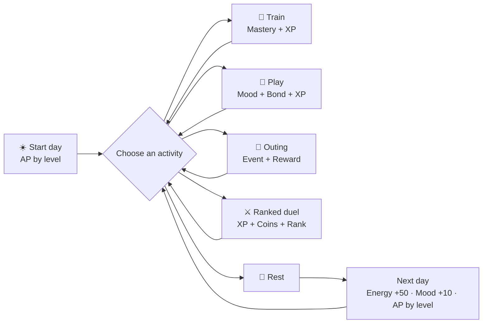
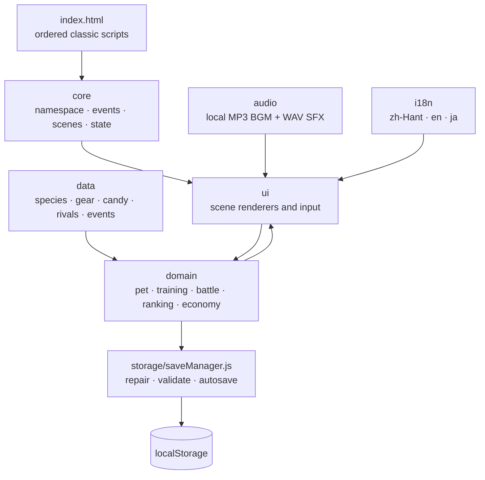
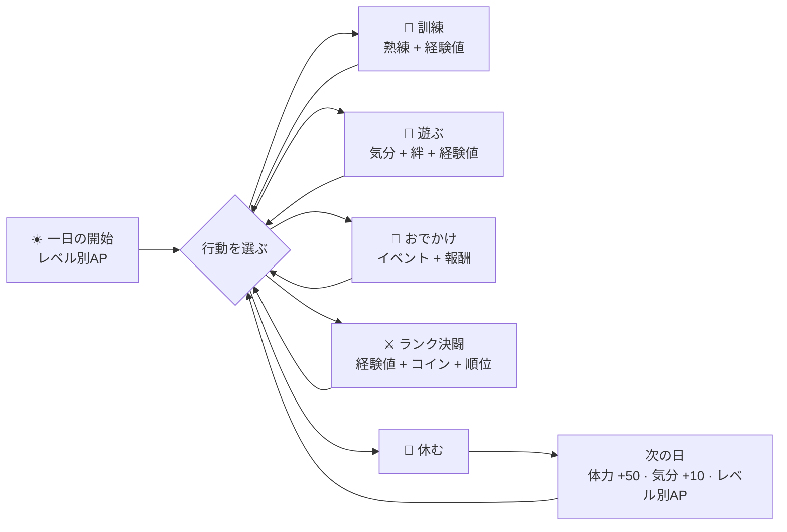
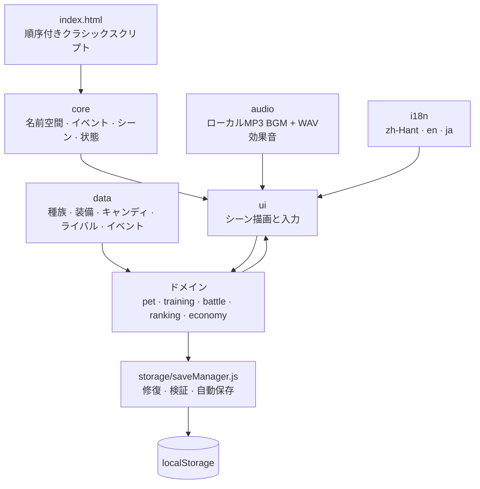
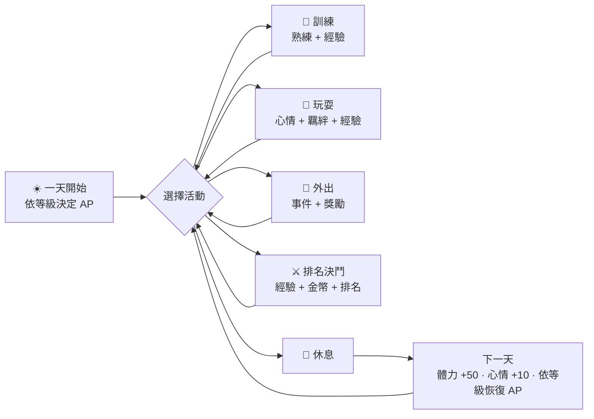
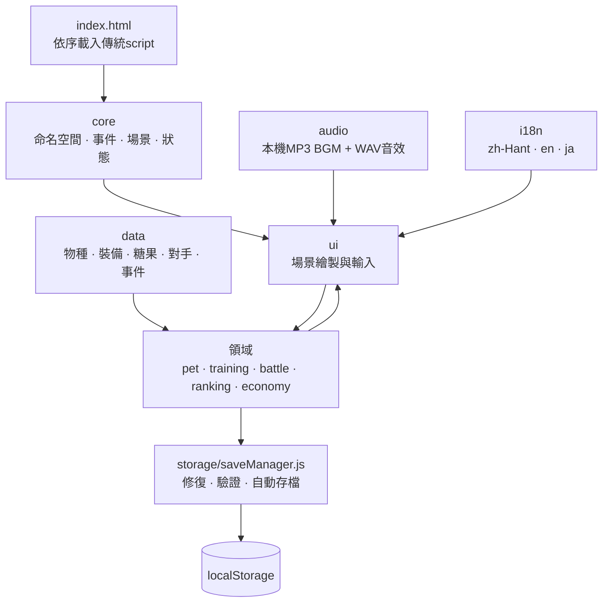

<a id="top"></a>

<div align="center">
  
  <h1>🐾 Beast Bond Arena · 萌獸羈絆競技場</h1>
  <p><strong>Offline · Single-player · Vanilla JavaScript · Direct-open browser game</strong></p>
</div>

## 👋 Opening Summary

### 🇬🇧 English

Beast Bond Arena is a fully offline pet-raising and turn-based arena game. Choose one Giant Eagle, Lion, or Crocodile as your lifelong partner, build eight stats through daily activities, and rise from rank 1,000 to the championship while your bond changes both progression and battle strength.

### 🇯🇵 日本語

Beast Bond Arena（萌獸羈絆競技場）は、完全オフラインで遊べる育成・ターン制アリーナゲームです。オオワシ、ライオン、ワニから生涯の相棒を一体選び、毎日の行動で8つの能力を育て、絆による成長と戦闘ボーナスを活かしながら1,000位から王者を目指します。

### 🇹🇼 繁體中文

《萌獸羈絆競技場》是一款可完全離線遊玩的寵物養成與回合制競技遊戲。玩家會從巨鷹、獅子、鱷魚中選擇唯一夥伴，透過每日活動培養八項能力，從第 1,000 名一路挑戰冠軍，而彼此的羈絆也會同時影響成長與戰鬥實力。

<p align="center">
  
  
  
</p>

[🇬🇧 English](#english) · [🇯🇵 日本語](#japanese) · [🇹🇼 繁體中文](#traditional-chinese)

## 📚 Contents

- [🇬🇧 English](#english)
  - [🎮 Game Introduction](#en-game-introduction)
  - [✨ Features](#en-features)
  - [🕹️ Gameplay Guide](#en-gameplay)
  - [🚀 Quick Start](#en-quick-start)
  - [🛠️ Program Overview](#en-program-overview)
  - [📁 Code Organization](#en-code-organization)
  - [💾 Supporting Systems](#en-supporting-systems)
  - [🧪 Testing](#en-testing)
  - [📌 Status and Limitations](#en-status)
- [🇯🇵 日本語](#japanese)
  - [🎮 ゲーム紹介](#ja-game-introduction)
  - [✨ 主な機能](#ja-features)
  - [🕹️ 遊び方](#ja-gameplay)
  - [🚀 クイックスタート](#ja-quick-start)
  - [🛠️ プログラム概要](#ja-program-overview)
  - [📁 コード分類](#ja-code-organization)
  - [💾 補助システム](#ja-supporting-systems)
  - [🧪 テスト](#ja-testing)
  - [📌 状況と制限](#ja-status)
- [🇹🇼 繁體中文](#traditional-chinese)
  - [🎮 遊戲介紹](#zh-game-introduction)
  - [✨ 主要特色](#zh-features)
  - [🕹️ 遊玩指南](#zh-gameplay)
  - [🚀 快速開始](#zh-quick-start)
  - [🛠️ 程式架構](#zh-program-overview)
  - [📁 程式碼分類](#zh-code-organization)
  - [💾 支援系統](#zh-supporting-systems)
  - [🧪 測試](#zh-testing)
  - [📌 狀態與限制](#zh-status)

---

<a id="english"></a>

## 🇬🇧 English

<a id="en-game-introduction"></a>

### 🎮 Game Introduction

You are a trainer raising one permanent partner in a deterministic 1,000-position arena. The experience mixes short daily activities, reflex and timing mini-games, relationship events, equipment planning, and compact turn-based duels. Defeat a higher-ranked rival to exchange positions; reach rank 1 to unlock the champion ending.

There is no pet death or destructive game-over state. A defeat still grants reduced rewards, does not lower rank, and returns the partner to full battle HP after settlement, so the journey remains about steady growth rather than save punishment.

<a id="en-features"></a>

### ✨ Features

- 🦅 **Three distinct partners:** the mobile Giant Eagle, explosive Lion, and defensive Crocodile each have unique growth and special-attack behavior.
- 📊 **Eight battle stats:** HP, Attack, Accuracy, Defense, Mobility, Special Attack, Special Defense, and Speed.
- ☀️ **Level-scaled daily AP:** the daily cap is 7 AP through LV 30, 10 through LV 50, 12 through LV 75, and 15 through LV 100.
- 💰 **Boosted daily settlement:** the daily coin reward is four times the original amount, equivalent to a +300% increase.
- 🏦 **Savings account:** deposit or withdraw coins from the home screen; each rest pays `floor(savedBalance × 0.01)` directly into available coins while preserving the saved principal.
- 💬 **Varied mood dialogue:** each mood state has four localized lines, with a seeded daily pick that stays stable while the home screen rerenders.
- 🎯 **Three training mini-games:** rhythm timing, hold-and-release endurance, and moving-target agility with ratings, combos, particles, pause protection, and reduced-motion support.
- 🌳 **Three outing locations and 24 weighted events:** park, forest, and river encounters provide XP, affection, coins, or battle items.
- ⚔️ **Turn-based duels:** normal and special attacks, energy, dodge, critical hits, shields, initiative, species effects, and a 20-round ranked tiebreak.
- 🎛️ **Battle convenience controls:** accelerated battle playback stays enabled by default and persists; Auto Battle repeats normal attacks and releases specials at 100 energy.
- 🏆 **A deterministic 1,000-entry ranking:** one player, 999 seeded AI opponents, 12 fixed milestone rivals, and five BP-near candidates per refresh.
- 🚪 **An endless Boss Gate at rank #1:** choose Lion, Crocodile, or Eagle bosses whose stats grow forever; each attempt costs only 5 Energy and 5 Mood, then reveals a random Grassland, Swamp, or Sky arena when the 80-round battle begins.
- 🎁 **Endless Boss rewards:** victories pay large coin and XP rewards while XP is available, plus a deterministic 1% chance at a random Ability Candy.
- 🛍️ **A four-category shop:** 36 permanent equipment pieces, 18 one-battle consumables, eight permanent Ability Candies, and XP supplies.
- 🍬 **Scaling permanent growth:** HP Candy grants +3; the other seven candies grant +1 and become more expensive as intrinsic stats and pet level rise. Buy up to 999 candies at once, with batch totals following each candy’s escalating price. A deterministic Candy Festival occasionally halves the current price.
- ✨ **XP supplies:** buy 100 XP packs in batches up to 999; the per-pack price rises with level but caps at 400 coins, and Candy Festival cuts it by 40%.
- 🌐 **Three complete locales:** Taiwan Traditional Chinese, English, and Japanese.
- 🎨 **Five visual themes:** Candy Garden, Ocean Sky, Verdant Forest, Sunset Arena, and Moonlit Night.
- 🎵 **Local audiovisual package:** three partner portraits, 54 item SVGs, three outing backdrops, seven BGM tracks, and 22 sound effects. Menu, home, training, outing, ranked battle, Boss battle, and champion moments each have their own track.
- 💾 **Three local save slots:** save and return to the main menu at any time, keep three partners independent, and resume gameplay with preferences preserved.

<a id="en-gameplay"></a>

### 🕹️ Gameplay Guide

#### Choose one partner

| Partner        | Primary identity                                           | Special behavior                                                                                       |
| -------------- | ---------------------------------------------------------- | ------------------------------------------------------------------------------------------------------ |
| 🦅 Giant Eagle | Highest Mobility, Accuracy, and Speed; swift physical lead | Sky Dive halves the target's dodge chance and grants two future actions with +20% Mobility after a hit |
| 🦁 Lion        | Highest Attack and Special Attack; burst damage            | Royal Roar has +10 percentage points of critical chance, capped at 30%                                 |
| 🐊 Crocodile   | Highest HP, Defense, and Special Defense; durable guard    | Tidal Guard creates a shield equal to 12% of maximum HP for two own actions after a hit                |

#### Understand the eight stats

| Stat                             | Role                                                                       |
| -------------------------------- | -------------------------------------------------------------------------- |
| HP                               | Maximum damage the partner can withstand                                   |
| Attack / Defense                 | Damage and mitigation for normal attacks                                   |
| Accuracy                         | Improves hit chance; Accuracy at least 2× target Mobility guarantees a hit |
| Special Attack / Special Defense | Damage and mitigation for special attacks                                  |
| Mobility                         | Dodge chance, with a final cap of 40%                                      |
| Speed                            | Turn order; a seeded coin flip resolves exact ties                         |

Natural stats follow `round(base + growth × (level - 1))`. Mastery scales the growth gained after level 1 from 1× at LV 0 to 3× at LV 20; its separate intrinsic-stat bonus remains +0.5% per level (+10% at maximum), followed by affection and equipment rules. Level caps at 100.

#### Follow the daily loop



| Activity    | Requirement and cost                 | Fixed impact                                                                                      |
| ----------- | ------------------------------------ | ------------------------------------------------------------------------------------------------- |
| Training    | 1 AP, at least 20 Energy             | Energy −20, Mood −5, Affection +1 before mood scaling; XP and selected Mastery XP depend on score |
| Play        | 1 AP, at least 10 Energy             | Energy −10, Mood +20, Affection +5 before mood scaling, plus XP                                   |
| Outing      | 1 AP, at least 15 Energy             | Energy −15, Mood +15, Affection +4 before mood scaling, plus a weighted event reward              |
| Ranked duel | 2 AP, at least 30 Energy and 20 Mood | Energy −25; a win gives Mood +8 and Affection +2, a loss gives Mood −8 and Affection +1           |
| Rest        | Ends the current day                 | Energy +50, Mood +10, restores the level-based AP cap and full battle HP on the next day          |

Mood changes activity rewards: below 30 uses ×0.75, 30–69 uses ×1.00, and 70–100 uses ×1.10. Affection unlocks story scenes at 20, 40, 60, 80, and 100 and gives effective-stat bonuses of +1%, +2%, +3%, and finally +5% at 100.

#### Master the training mini-games

| Template        | Assigned stats               | Control                                          | Goal                                                        |
| --------------- | ---------------------------- | ------------------------------------------------ | ----------------------------------------------------------- |
| Power Rhythm    | Attack, Special Attack       | Click, tap, Enter, or Space on the action button | Stop the moving marker near the center five times           |
| Endurance Guard | HP, Defense, Special Defense | Hold pointer, Enter, or Space, then release      | Release near the 72% safe zone four times                   |
| Agility Chase   | Accuracy, Mobility, Speed    | Click or tap the moving target                   | Land up to ten hits within 15 seconds while avoiding misses |

Scores of 85+ earn Gold, 60–84 earn Silver, and lower scores earn Bronze. Training pauses on window blur and resumes after a three-count, preventing background tabs from creating unfair misses.

#### Duel and climb the ranking

1. Open the ranking screen and select one of five opponents closest to your Battle Power. The normal mid-table mix prefers three higher ranks and two lower ranks.
2. Optionally equip one owned battle consumable: starting energy, a two-action starting shield, or added critical chance.
3. Choose a normal attack to gain 30 energy or spend 100 energy on the partner's special attack. A defender gains 10 energy after being hit and 5 after dodging.
4. Speed decides initiative. Accuracy reduces the target's Mobility-based dodge chance; Accuracy at least 2× target Mobility guarantees a hit. Damage uses level, move power, attacking and defending stats, ±5% variance, and a ×1.75 critical multiplier.
5. A knockout ends the duel. At round 20, the engine compares HP ratio, effective damage, initial Speed, then a seeded 50/50 roll.
6. Defeating a higher-ranked opponent swaps positions. Losing never lowers rank. Reaching rank 1 triggers the champion scene.

#### Enter the endless Boss Gate

After reaching rank #1, open the Boss Gate from the ranking screen and choose a Lion, Crocodile, or Eagle Boss. Boss battles consume no AP, so they can be attempted repeatedly; each attempt needs only 5 Energy and 5 Mood. The seeded random arena stays hidden until battle begins, then applies its species immunity and 3% max-HP damage rule. Boss stats grow endlessly after each clear, and the battle lasts up to 80 rounds. A Boss victory plays the champion BGM and grants large coins, available XP, and a deterministic 1% random Ability Candy chance.

#### Use the shop and permanent growth

| Tier        | Best-rank requirement | Equipment price | Battle-item price |
| ----------- | --------------------: | --------------: | ----------------: |
| I Sprout    |                 1,000 |             200 |                60 |
| II Bronze   |                   750 |             600 |               120 |
| III Silver  |                   500 |           1,200 |               200 |
| IV Gold     |                   250 |           2,200 |               320 |
| V Stellar   |                   100 |           3,800 |               500 |
| VI Champion |                    25 |           6,000 |               800 |

Equipment occupies Armor, Accessory, or Emblem slots and remains owned permanently. Battle items stack up to 99 and are consumed only after a valid duel starts. Ability Candy is used immediately: HP gains +3 and Attack, Accuracy, Special Attack, Defense, Special Defense, Mobility, or Speed gains +1.

Candy prices are rounded upward to the next ten coins:

```text
regularPrice = ceil10((120 + intrinsicStat × weight) × (1 + (LV - 1) × 0.025) × 0.60)
festivalPrice = regularPrice × 0.50
weight = 2 for HP; 8 for every other stat
intrinsicStat = natural stat + previous candy bonuses
0.60 = permanent 40% regular candy discount
0.50 = Candy Festival multiplier applied directly to the current price, active on about one day in five
```

Temporary equipment, mastery, and affection do not affect candy pricing.

<a id="en-quick-start"></a>

### 🚀 Quick Start

#### Requirements

- A modern desktop or mobile browser with JavaScript, `localStorage`, `<dialog>`, and Web Audio support.
- The complete project folder kept together. No Node.js, package installation, account, internet connection, or local server is required to play.

#### Launch

1. Download or copy the complete `Pet_Simulation_Game` directory.
2. Open `index.html` directly in the browser.
3. Choose a language or theme if desired, start a new game, name the trainer and partner, and choose one species.
4. Interact once with the page to unlock browser audio playback.

> The save belongs to the browser storage associated with the same local file path. Private browsing, clearing site data, moving the folder, or changing browsers may make that save unavailable.

<a id="en-program-overview"></a>

### 🛠️ Program Overview

The application is a zero-build HTML/CSS/JavaScript project. `index.html` loads ordered classic scripts; each file attaches a focused module to the shared `window.PSG` namespace. Scene renderers generate the current screen, domain modules validate and mutate the single save object, and `saveManager` validates a detached clone before replacing the formal `localStorage` value.



Key runtime characteristics:

- **Entry point:** `index.html`, with `js/core/app.js` loaded last.
- **Rendering:** DOM-based scene renderers; no framework or virtual DOM.
- **State:** one in-memory save mirrored to `psg.save.v1`; independent settings use `psg.settings.v1`.
- **Determinism:** seeded RNG drives AI identity, ranking composition, candidates, outings, play scenes, and battle resolution where applicable.
- **Audio:** seven local MP3 BGM tracks and local WAV SFX use two alternating BGM channels for a 600 ms crossfade; Web Audio adds the required 10× BGM pre-gain and compressor when supported, with a direct HTML-audio path for `file://` launches. Boss battles use `bgm_bossbattle.mp3`, and Boss victories switch to `bgm_champion.mp3`.
- **Offline contract:** relative local paths only; no `fetch`, remote URL, dynamic import, package runtime, or backend.

<a id="en-code-organization"></a>

### 📁 Code Organization

| Path                                                | Responsibility                                                                           | Representative files                                                |
| --------------------------------------------------- | ---------------------------------------------------------------------------------------- | ------------------------------------------------------------------- |
| `index.html`                                        | HTML shell, stylesheet registration, dependency-ordered classic scripts                  | `index.html`                                                        |
| `css/base/`, `css/layout/`                          | Tokens, typography, accessibility foundations, app and scene layout                      | `variables.css`, `accessibility.css`, `scenes.css`                  |
| `css/components/`, `css/responsive/`, `css/themes/` | Reusable controls, shop/training effects, breakpoints, five themes                       | `shop.css`, `training-effects.css`, `mobile.css`, `theme-night.css` |
| `js/core/`                                          | Shared namespace, events, current state, scene lifecycle, startup                        | `namespace.js`, `gameState.js`, `sceneManager.js`, `app.js`         |
| `js/data/`                                          | Declarative species, equipment, consumable, candy, rival, and event catalogs             | `speciesData.js`, `abilityCandyData.js`, `rivalData.js`             |
| `js/pet/`                                           | Stats, XP, mastery, affection, daily costs, play, and outings                            | `statCalculator.js`, `progression.js`, `dailyActions.js`            |
| `js/training/`                                      | Mini-game scoring and training settlement                                                | `trainingManager.js`, `strengthGame.js`, `agilityGame.js`           |
| `js/battle/`                                        | Damage, AI choices, temporary effects, ranked and endless Boss round resolution, rewards | `damageCalculator.js`, `bossManager.js`, `battleEngine.js`          |
| `js/ranking/`                                       | Seeded 1,000-entry ladder, BP-near matching, rank swaps                                  | `rankingGenerator.js`, `matchmaking.js`                             |
| `js/economy/`                                       | Equipment, inventory, shop purchase rules, Ability Candy pricing                         | `equipmentManager.js`, `abilityCandyManager.js`                     |
| `js/storage/`, `js/i18n/`, `js/audio/`              | Save repair, three-language dictionaries, local music and SFX                            | `saveManager.js`, `featureLocales.js`, `audioManager.js`            |
| `js/ui/`                                            | Menu, onboarding, home, activity, battle, shop, help, and settings scenes                | `trainingUI.js`, `shopUI.js`, `settingsUI.js`                       |
| `assets/` and `bgm/`                                | Local portraits, SVG art, seven BGM tracks, and SFX                                      | `images/pets/`, `images/equipment/`, `audio/`, `bgm/`               |
| `tests/`, `tools/`                                  | Deterministic Node tests and asset-generation utilities                                  | `unit.test.js`, `static.test.js`, `generate-audio.js`               |
| `.agents/skills/`                                   | Project-specific Codex workflows                                                         | `pet-simulation-feature-workflow/`, `safe-browser-validation/`      |

<a id="en-supporting-systems"></a>

### 💾 Supporting Systems

- 🌐 **Localization:** `zh-Hant`, `en`, and `ja` dictionaries cover scenes, events, equipment, candy, tutorials, and settings. Unit tests enforce key parity.
- 💾 **Persistence:** every meaningful activity autosaves. Repair logic clamps invalid ranges, supplies optional fields for older saves, validates the 1,000-entry ranking, and preserves corrupted raw data under a timestamped backup key when possible.
- 🎵 **Audio safety:** volume controls cover master, BGM, SFX, and mute. Browser gesture unlocking is respected, one-shot nodes disconnect after playback, and BGM pre-gain feeds a dynamics compressor. The playlist uses `bgm_menu.mp3` for menu/onboarding/instructions, `bgm_home.mp3` for home/ranking/shop/in-game settings, `bgm_training.mp3` for training, `bgm_outing.mp3` for outings, `bgm_battle.mp3` for ranked battles, `bgm_bossbattle.mp3` for Boss battles, and `bgm_champion.mp3` for the rank-1 ending or a Boss victory.
- ♿ **Accessibility:** semantic buttons and dialog behavior, focus restoration, focus trapping, a skip link, keyboard-capable training controls, 48px minimum touch targets, text scaling at 100%/115%/130%, and standard/fast/reduced motion modes.
- 📱 **Responsive layout:** dedicated mobile, tablet, desktop, and landscape styles use safe-area insets and adapt menus, battles, settings, shops, and training fields.
- 🎨 **Themes:** appearance changes only CSS tokens, so the same interface and contrast structure remain across all five themes.
- 🧰 **Development workflow:** `.agents/skills/pet-simulation-feature-workflow/SKILL.md` records the project-specific rules for load order, save-compatible feature work, deterministic formulas, trilingual UI, cleanup, and validation.

<a id="en-testing"></a>

### 🧪 Testing

The current implementation was verified with **61/61 unit tests** and **22/22 static checks**, plus JavaScript syntax and whitespace validation.

Run from the project root:

```powershell
node tests/unit.test.js
node tests/static.test.js
$files = rg --files js tests tools -g '*.js'; foreach ($file in $files) { node --check $file; if ($LASTEXITCODE -ne 0) { exit $LASTEXITCODE } }
git diff --check
```

The unit suite covers stat formulas, progression overflow and caps, level-scaled AP boundaries, mood and affection thresholds, seeded mood dialogue variants, training grades, deterministic rankings, candidates, ranked and endless Boss battle resolution, AP-free Boss entry, arena immunity and damage, Boss growth and rewards, equipment, candy pricing, batch candy purchases, XP shop pricing and level-ups, savings deposits and withdrawals, rest interest, save repair, localization parity, and local audio assets. Static checks cover direct-open script structure, relative asset existence, offline restrictions, responsive/theme requirements, touch targets, local art, README structure, reduced-motion hooks, savings wiring, home notice placement, batch candy controls, XP shop wiring, rank-one Boss loading, Boss BGM routing, level-scaled AP wiring, and trailing whitespace.

Browser interaction is intentionally left to a short manual pass when no approved integrated browser is available: open `index.html`, start or continue a save, try all three training templates, browse shop categories and tiers, buy a candy when affordable, reach rank #1 to inspect the Boss Gate, switch language/theme/motion settings, and reload to confirm persistence.

<a id="en-status"></a>

### 📌 Status and Limitations

- The core single-player journey from onboarding to rank-1 champion is implemented.
- The project has three independent local save slots and no cloud synchronization, login, multiplayer, server, analytics, ads, or external service dependency.
- Browser storage is path- and browser-dependent; clearing it removes the active save unless the browser retains a backup entry created after a read error.
- Audio cannot start before a user gesture because the game follows browser autoplay rules.
- Automated browser driving through PowerShell CDP/WebSocket methods is prohibited by the project safety workflow; deterministic tests and manual browser checks are the supported fallback.
- The large `spec.md` remains the requirements map. Implemented source and tests are the authority for current behavior when later feature requests intentionally extend the original specification.

---

<a id="japanese"></a>

## 🇯🇵 日本語

<a id="ja-game-introduction"></a>

### 🎮 ゲーム紹介

プレイヤーは、一体だけの相棒を育てながら、固定シードで構成される1,000人のアリーナに挑むトレーナーです。短い日常行動、反射・タイミング系ミニゲーム、親密イベント、装備構成、コンパクトなターン制バトルを組み合わせ、上位の相手に勝つと順位を交換します。1位に到達するとチャンピオンエンディングが解放されます。

相棒の死亡や取り返しのつかないゲームオーバーはありません。敗北しても少量の報酬を獲得でき、順位は下がらず、決着後には戦闘HPが全回復するため、セーブへの罰ではなく継続的な成長を楽しめます。

<a id="ja-features"></a>

### ✨ 主な機能

- 🦅 **個性の異なる3体の相棒：** 機動型のオオワシ、爆発力のあるライオン、防御型のワニは、成長傾向と特殊攻撃の効果が異なります。
- 📊 **8つの戦闘能力：** HP、攻撃、命中、防御、機動、特殊攻撃、特殊防御、素早さ。
- ☀️ **レベル連動の毎日AP：** LV 30までは7 AP、LV 31～50は10、LV 51～75は12、LV 76～100は15です。
- 💰 **強化されたデイリー報酬：** デイリーコインは元の4倍、つまり+300%増加します。
- 🏦 **貯金口座：** ホーム画面からコインを預け入れ・引き出しでき、休息ごとに `floor(預金残高 × 0.01)` が利息として手持ちコインに加算され、預金元本は維持されます。
- 💬 **気分に合わせた会話：** 各気分に4種類のローカライズ台詞があり、固定シードで選ばれたその日の台詞がホーム画面の再描画後も安定して表示されます。
- 🎯 **3種類の訓練ミニゲーム：** リズム、ホールド＆リリース、移動ターゲットを使い、評価、コンボ、パーティクル、一時停止保護、動きを減らす設定に対応します。
- 🌳 **3つのおでかけ先と24イベント：** 公園、森、河岸の重み付きイベントで経験値、親密度、コイン、バトルアイテムを獲得します。
- ⚔️ **ターン制決闘：** 通常・特殊攻撃、エネルギー、回避、クリティカル、シールド、行動順、種族効果、通常戦の20ラウンド判定を実装しています。
- 🎛️ **決闘の便利機能：** 高速再生は初期オンで設定を保存し、オートバトルは通常攻撃を繰り返してエネルギー100で特殊攻撃を使います。
- 🏆 **固定シードの1,000人ランキング：** プレイヤー1人、AI 999人、固定位置の節目ライバル12人、BPが近い候補5人で構成されます。
- 🚪 **1位で開く無限ボスの門：** 獅子・鰐・鷲のボスを選べ、能力は無限に上昇します。各挑戦は体力5・気分5だけを使い、80ラウンド戦の開始時に草原・沼地・空中からランダムな闘技場が初めて明かされます。
- 🎁 **無限ボス報酬：** 勝利すると大量のコインと、最大レベル未満なら経験値を獲得し、決定的な1%の確率でランダムな能力キャンディも落とします。
- 🛍️ **4分類ショップ：** 6つのアリーナ段階に、永久装備36個、1試合用消耗品18種、永久成長用の能力キャンディ8種、経験値補給があります。
- 🍬 **価格が成長する永久強化：** HPキャンディは+3、ほか7種は+1。基礎能力とペットLVが高いほど価格が上がり、一度に最大999個を購入できます。まとめ買いの合計は各キャンディの上昇価格を順番に計算し、決定的なキャンディフェスティバルでは現在価格が半額になります。
- ✨ **経験値補給：** 1セット100経験値を最大999セットまでまとめて購入でき、セット価格はレベルに応じて上がりますが400コインで上限になります。キャンディフェスティバル中は40%オフです。
- 🌐 **3言語を完全収録：** 台湾繁體中文、English、日本語。
- 🎨 **5つのテーマ：** キャンディガーデン、オーシャンスカイ、翠影の森、夕焼けアリーナ、星月夜。
- 🎵 **ローカル素材一式：** 相棒画像3枚、アイテムSVG 54個、おでかけ背景3枚、BGM 7曲、効果音22種。メニュー、ホーム、訓練、おでかけ、通常決闘、ボス戦、チャンピオン演出にそれぞれ専用曲があります。
- 💾 **3つのローカルセーブ枠：** いつでも保存してメインメニューへ戻り、3体の相棒を独立して育成できます。ゲームと設定はローカルに保存されます。

<a id="ja-gameplay"></a>

### 🕹️ 遊び方

#### 一体の相棒を選ぶ

| 相棒        | 主な役割                             | 特殊効果                                                               |
| ----------- | ------------------------------------ | ---------------------------------------------------------------------- |
| 🦅 オオワシ | 機動、命中、素早さが最も高い高速先鋒 | 天空ダイブは相手の回避率を半減し、命中後の自分の2行動だけ機動を20%上昇 |
| 🦁 ライオン | 攻撃と特殊攻撃が最も高い爆発役       | ロイヤルロアはクリティカル率を10ポイント加算し、最大30%                |
| 🐊 ワニ     | HP、防御、特殊防御が最も高い守護役   | タイダルガードは命中後、最大HPの12%分のシールドを自分の2行動分生成     |

#### 8つの能力を理解する

| 能力                | 役割                                           |
| ------------------- | ---------------------------------------------- |
| HP                  | 相棒が耐えられる最大ダメージ量                 |
| 攻撃 / 防御         | 通常攻撃のダメージと軽減                       |
| 命中                | 命中率を高め、相手の機動性の2倍以上なら必中    |
| 特殊攻撃 / 特殊防御 | 特殊攻撃のダメージと軽減                       |
| 機動                | 回避率を決定し、最終上限は40%                  |
| 素早さ              | 行動順を決定し、同値なら固定シードの抽選で解決 |

自然能力は `round(base + growth × (level - 1))` で求めます。熟練はレベル1以降の成長量をLV 0の1倍からLV 20の3倍まで高め、基礎能力には別途1レベルごとに+0.5%（最大+10%）を加算します。その後に装備と親密度を適用します。レベル上限は100です。

#### 毎日のループ



| 行動       | 条件とコスト                 | 固定効果                                                                            |
| ---------- | ---------------------------- | ----------------------------------------------------------------------------------- |
| 訓練       | 1 AP、体力20以上             | 体力−20、気分−5、気分倍率適用前の親密度+1。成績に応じて経験値と選択能力の熟練経験値 |
| 遊ぶ       | 1 AP、体力10以上             | 体力−10、気分+20、気分倍率適用前の親密度+5、さらに経験値                            |
| おでかけ   | 1 AP、体力15以上             | 体力−15、気分+15、気分倍率適用前の親密度+4、さらに重み付きイベント報酬              |
| ランク決闘 | 2 AP、体力30以上、気分20以上 | 体力−25。勝利で気分+8・親密度+2、敗北で気分−8・親密度+1                             |
| 休む       | 現在の日を終了               | 次の日に体力+50、気分+10、レベルに応じたAPへ、戦闘HPを全回復                        |

気分による報酬倍率は30未満で×0.75、30～69で×1.00、70～100で×1.10です。親密度20、40、60、80、100で物語イベントが解放され、有効能力は順に+1%、+2%、+3%、最終的に100で+5%になります。

#### 訓練ミニゲームを攻略する

| テンプレート     | 対象能力           | 操作                                             | 目標                                   |
| ---------------- | ------------------ | ------------------------------------------------ | -------------------------------------- |
| パワーリズム     | 攻撃、特殊攻撃     | アクションボタンをクリック、タップ、Enter、Space | 動くマーカーを中央付近で5回止める      |
| ガードチャージ   | HP、防御、特殊防御 | ポインター、Enter、Spaceを押し続けて離す         | 4回、72%付近の安全エリアで離す         |
| クイックチェイス | 命中、機動、素早さ | 動くターゲットをクリックまたはタップ             | 15秒以内に最大10回命中し、ミスを避ける |

85点以上はゴールド、60～84点はシルバー、それ未満はブロンズです。ウィンドウが非アクティブになると訓練は停止し、戻った後に3カウントで再開するため、バックグラウンド移動による不公平なミスを防ぎます。

#### 決闘して順位を上げる

1. ランキング画面で、BPが近い5人から相手を選びます。中間順位では通常、上位3人と下位2人を優先します。
2. 必要なら、開始エネルギー、2行動シールド、クリティカル率のいずれかを上げる所持済み消耗品を一つ選びます。
3. 通常攻撃でエネルギーを30獲得するか、100を消費して特殊攻撃を使います。防御側は命中で10、回避で5のエネルギーを得ます。
4. 素早さで先攻を決めます。命中は相手の機動による回避率を下げ、相手の機動の2倍以上なら必中です。ダメージはレベル、技威力、攻撃・防御能力、±5%の乱数、クリティカル時×1.75で計算します。
5. HPが0になると終了します。20ラウンド到達時はHP比率、有効ダメージ、初期素早さ、固定シードの50/50判定の順に勝者を決めます。
6. 上位の相手に勝つと順位を交換し、負けても順位は下がりません。1位になるとチャンピオン演出が始まります。

#### 無限ボスの門に挑戦する

ランキング1位になるとランキング画面からボスの門を開き、ライオン・ワニ・オオワシのボスを選べます。ボス戦はAPを消費せず、各挑戦は体力5と気分5だけで何度でも挑戦できます。闘技場は挑戦ごとに固定シードで決まりますが、戦闘開始まで明かされず、草原・沼地・空中のいずれかが種族免疫と毎ラウンド最大HP3%ダメージを適用します。撃破するたびにボス能力が無限に上昇し、最大80ラウンドで決着します。勝利時はチャンピオンBGM、大量コイン、取得可能な経験値、決定的な1%の能力キャンディ抽選を得ます。

#### ショップと永久成長を使う

| 段階            | 必要な最高順位 | 装備価格 | バトルアイテム価格 |
| --------------- | -------------: | -------: | -----------------: |
| I 若葉          |          1,000 |      200 |                 60 |
| II ブロンズ     |            750 |      600 |                120 |
| III シルバー    |            500 |    1,200 |                200 |
| IV ゴールド     |            250 |    2,200 |                320 |
| V 星耀          |            100 |    3,800 |                500 |
| VI チャンピオン |             25 |    6,000 |                800 |

装備は防具、アクセサリ、エンブレムのいずれかに入り、一度購入すると永久所持します。バトルアイテムは99個まで持て、有効な決闘開始後にだけ消費されます。能力キャンディは購入時に即使用され、HPは+3、攻撃、命中、特殊攻撃、防御、特殊防御、機動、素早さは+1されます。

キャンディ価格は10コイン単位で切り上げます。

```text
regularPrice = ceil10((120 + intrinsicStat × weight) × (1 + (LV - 1) × 0.025) × 0.60)
festivalPrice = regularPrice × 0.50
weight = HPは2、その他の能力は8
intrinsicStat = 自然能力 + 過去のキャンディ加算値
0.60 = 通常キャンディ価格の恒久的な40%割引係数
0.50 = 現在価格に直接適用する、およそ5日に1度のキャンディフェスティバル係数
```

一時的な装備、熟練、親密度はキャンディ価格に影響しません。

<a id="ja-quick-start"></a>

### 🚀 クイックスタート

#### 必要環境

- JavaScript、`localStorage`、`<dialog>`、Web Audioに対応する現代的なデスクトップまたはモバイルブラウザ。
- 完全なプロジェクトフォルダー。プレイにはNode.js、パッケージ導入、アカウント、ネット接続、ローカルサーバーは不要です。

#### 起動方法

1. `Pet_Simulation_Game` ディレクトリ全体をダウンロードまたはコピーします。
2. ブラウザで `index.html` を直接開きます。
3. 必要なら言語やテーマを選び、新しいゲームを開始してトレーナー名・相棒名・種族を決めます。
4. ページを一度操作して、ブラウザの音声再生を有効にします。

> セーブは同じローカルファイルパスに対するブラウザストレージへ保存されます。プライベートブラウズ、サイトデータ削除、フォルダー移動、ブラウザ変更により、そのセーブへアクセスできなくなる場合があります。

<a id="ja-program-overview"></a>

### 🛠️ プログラム概要

本作はビルド不要のHTML/CSS/JavaScriptプロジェクトです。`index.html` が順序付きのクラシックスクリプトを読み込み、各ファイルが共有の `window.PSG` 名前空間へ役割別モジュールを登録します。シーンレンダラーが現在画面を生成し、ドメインモジュールが単一セーブを検証・変更し、`saveManager` は正式な `localStorage` 値を置き換える前に分離した複製を検証します。



主な実行特性：

- **エントリーポイント：** `index.html`。`js/core/app.js` は最後に読み込みます。
- **描画：** DOMベースのシーンレンダラーで、フレームワークや仮想DOMは使用しません。
- **状態：** メモリ上の単一セーブを `psg.save.v1` へ同期し、設定は別の `psg.settings.v1` に保存します。
- **決定性：** 固定シードRNGをAI名、ランキング構成、候補、おでかけ、遊び、必要な戦闘判定に使用します。
- **音声：** ローカルMP3のBGM 7曲とWAV効果音を使用します。BGMは2チャンネル交互再生で600 msクロスフェードし、対応環境では10倍プリゲイン後にコンプレッサーを通し、`file://` では直接HTML音声へ切り替えます。ボス戦は `bgm_bossbattle.mp3`、ボス勝利は `bgm_champion.mp3` を再生します。
- **オフライン契約：** 相対ローカルパスのみを使い、`fetch`、外部URL、動的import、パッケージ実行環境、バックエンドはありません。

<a id="ja-code-organization"></a>

### 📁 コード分類

| パス                                                | 責務                                                           | 代表ファイル                                                        |
| --------------------------------------------------- | -------------------------------------------------------------- | ------------------------------------------------------------------- |
| `index.html`                                        | HTMLシェル、CSS登録、依存順クラシックスクリプト                | `index.html`                                                        |
| `css/base/`, `css/layout/`                          | トークン、文字、アクセシビリティ基盤、アプリとシーン配置       | `variables.css`, `accessibility.css`, `scenes.css`                  |
| `css/components/`, `css/responsive/`, `css/themes/` | 共通UI、ショップ・訓練演出、ブレークポイント、5テーマ          | `shop.css`, `training-effects.css`, `mobile.css`, `theme-night.css` |
| `js/core/`                                          | 共有名前空間、イベント、現在状態、シーン寿命、起動             | `namespace.js`, `gameState.js`, `sceneManager.js`, `app.js`         |
| `js/data/`                                          | 種族、装備、消耗品、キャンディ、ライバル、イベント定義         | `speciesData.js`, `abilityCandyData.js`, `rivalData.js`             |
| `js/pet/`                                           | 能力、経験値、熟練、親密度、日常コスト、遊び、おでかけ         | `statCalculator.js`, `progression.js`, `dailyActions.js`            |
| `js/training/`                                      | ミニゲーム採点と訓練精算                                       | `trainingManager.js`, `strengthGame.js`, `agilityGame.js`           |
| `js/battle/`                                        | ダメージ、AI判断、一時効果、通常・無限ボスのラウンド解決、報酬 | `damageCalculator.js`, `bossManager.js`, `battleEngine.js`          |
| `js/ranking/`                                       | 固定シード1,000人表、BP近似配対、順位交換                      | `rankingGenerator.js`, `matchmaking.js`                             |
| `js/economy/`                                       | 装備、所持品、購入規則、能力キャンディ価格                     | `equipmentManager.js`, `abilityCandyManager.js`                     |
| `js/storage/`, `js/i18n/`, `js/audio/`              | セーブ修復、3言語辞書、ローカルBGM・効果音                     | `saveManager.js`, `featureLocales.js`, `audioManager.js`            |
| `js/ui/`                                            | メニュー、導入、ホーム、活動、戦闘、ショップ、説明、設定画面   | `trainingUI.js`, `shopUI.js`, `settingsUI.js`                       |
| `assets/` と `bgm/`                                 | ローカル画像、SVG、BGM 7曲、効果音                             | `images/pets/`, `images/equipment/`, `audio/`, `bgm/`               |
| `tests/`, `tools/`                                  | 決定的Nodeテストと素材生成ツール                               | `unit.test.js`, `static.test.js`, `generate-audio.js`               |
| `.agents/skills/`                                   | プロジェクト専用Codexワークフロー                              | `pet-simulation-feature-workflow/`, `safe-browser-validation/`      |

<a id="ja-supporting-systems"></a>

### 💾 補助システム

- 🌐 **多言語：** `zh-Hant`、`en`、`ja` の辞書が画面、イベント、装備、キャンディ、チュートリアル、設定を網羅し、ユニットテストでキー一致を確認します。
- 💾 **永続化：** 重要な行動ごとに自動保存します。修復処理は不正範囲を制限し、旧セーブへ新しい任意項目を補い、1,000件ランキングを検証し、読込エラー時には可能なら元データを時刻付きバックアップキーへ残します。
- 🎵 **音声安全：** マスター、BGM、効果音、ミュートを設定できます。ブラウザの操作解禁を守り、単発ノードを再生後に切断し、BGMプリゲインをダイナミクスコンプレッサーへ接続します。`bgm_menu.mp3` はメニュー・導入・説明、`bgm_home.mp3` はホーム・ランキング・ショップ・ゲーム内設定、`bgm_training.mp3` は訓練、`bgm_outing.mp3` はおでかけ、`bgm_battle.mp3` は通常決闘、`bgm_bossbattle.mp3` はボス戦、`bgm_champion.mp3` は1位の結末またはボス勝利で使用します。
- ♿ **アクセシビリティ：** 意味のあるボタンとダイアログ、フォーカス復元・トラップ、スキップリンク、キーボード訓練、最小48pxタッチ領域、100%/115%/130%文字倍率、標準・高速・動きを減らすモードを備えます。
- 📱 **レスポンシブ：** モバイル、タブレット、デスクトップ、横向き専用CSSがセーフエリアに対応し、メニュー、戦闘、設定、ショップ、訓練を再配置します。
- 🎨 **テーマ：** 外観はCSSトークンのみを切り替え、5テーマで同じ情報構造とコントラスト設計を維持します。
- 🧰 **開発フロー：** `.agents/skills/pet-simulation-feature-workflow/SKILL.md` に、読み込み順、旧セーブ互換、決定的数式、3言語UI、後片付け、検証のプロジェクト規則を記録しています。

<a id="ja-testing"></a>

### 🧪 テスト

現在の実装は、**ユニットテスト61/61件**、**静的検証22/22件**、全JavaScript構文検査、空白検査を通過しています。

プロジェクトルートで実行します。

```powershell
node tests/unit.test.js
node tests/static.test.js
$files = rg --files js tests tools -g '*.js'; foreach ($file in $files) { node --check $file; if ($LASTEXITCODE -ne 0) { exit $LASTEXITCODE } }
git diff --check
```

ユニットテストは、能力計算、成長の繰り越しと上限、レベル連動APの境界、気分・親密度の境界、固定シードの気分会話、訓練評価、再現可能なランキング、候補相手、通常戦と無限ボス戦、APを消費しないボス入場、闘技場の免疫・ダメージ、ボス成長と報酬、装備、キャンディ価格、大量キャンディ購入、経験値ショップの価格とレベルアップ、貯金の預け入れ・引き出し、休息時の利息、セーブ修復、言語キーの一致、ローカル音声を確認します。静的検証は、直接起動用のスクリプト構造、相対素材の存在、オフライン制約、レスポンシブ／テーマ要件、タッチ領域、ローカルアート、README構造、低モーション設定のフック、貯金機能の接続、ホーム通知の位置、大量購入操作、経験値ショップと1位ボス門、ボスBGM、レベル連動APの接続、末尾空白を確認します。

承認済みの統合ブラウザがない場合、ブラウザ操作は短い手動確認を使います。`index.html` を開き、新規または継続セーブ、3種類の訓練、ショップ分類と段階、購入可能時のキャンディ、言語・テーマ・動き設定、再読み込み後の永続化を確認してください。

<a id="ja-status"></a>

### 📌 状況と制限

- 導入からランキング1位のチャンピオンまで、シングルプレイの主要進行は実装済みです。
- ローカルセーブは独立した3枠で、クラウド同期、ログイン、マルチプレイ、サーバー、分析、広告、外部サービス依存はありません。
- ブラウザ保存はパスとブラウザに依存し、データ消去後は、読込エラー時に作られたバックアップがブラウザに残っていない限り復元できません。
- ブラウザの自動再生規則に従うため、ユーザー操作前に音声は開始できません。
- プロジェクト安全手順によりPowerShell経由のCDP/WebSocket自動操作は禁止され、決定的テストと手動ブラウザ確認が代替手段です。
- 大規模な `spec.md` は要件マップです。後の機能要求が元仕様を意図的に拡張した場合、現在動作の正本は実装コードとテストです。

---

<a id="traditional-chinese"></a>

## 🇹🇼 繁體中文

<a id="zh-game-introduction"></a>

### 🎮 遊戲介紹

玩家是一名培養唯一夥伴的訓練家，會挑戰由固定種子建立的千名競技榜。遊戲結合每日短活動、反應與節奏小遊戲、親密事件、裝備配置及精簡的回合制決鬥；擊敗高位對手便能交換名次，抵達第 1 名後則會解鎖冠軍結局。

遊戲沒有寵物死亡或不可挽回的 Game Over。即使戰敗仍會獲得較少獎勵、不會掉排名，結算後夥伴的戰鬥 HP 也會恢復全滿，因此整段旅程著重持續成長，而不是懲罰存檔。

<a id="zh-features"></a>

### ✨ 主要特色

- 🦅 **三種定位鮮明的夥伴：** 高機動巨鷹、爆發型獅子與防守型鱷魚，各自擁有不同成長與特殊攻擊效果。
- 📊 **八項戰鬥能力：** HP、攻擊、命中、防禦、機動、特殊攻擊、特殊防禦與速度。
- ☀️ **隨等級提升的每日 AP：** LV 30 以下每日 7 AP、LV 31–50 為 10、LV 51–75 為 12、LV 76–100 為 15。
- 💰 **強化每日結算：** 每日獲得的金幣是原本的 4 倍，也就是增加 300%。
- 🏦 **存款帳戶：** 可在主頁設定存入或領出的金額；每次休息會將 `floor(存款餘額 × 0.01)` 的利息直接加入手上金幣，存款本金維持不變。
- 💬 **多變的心情對話：** 每種心情都有四句三語系台詞，依固定種子每日抽選，重新繪製主頁時仍會維持一致。
- 🎯 **三種訓練小遊戲：** 節奏判定、按住放開與移動目標，具備即時評價、連擊、粒子、暫停保護及降低動態效果。
- 🌳 **三個外出地點與 24 種事件：** 公園、森林、河岸的加權事件會提供經驗、親密度、金幣或戰鬥道具。
- ⚔️ **回合制決鬥：** 一般與特殊攻擊、能量、迴避、爆擊、護盾、先手、種族效果及 20 回合判定。
- 🎛️ **決鬥便利功能：** 加速播放預設開啟且會持續保存；自動戰鬥會重複一般攻擊，能量達 100 時自動施放特殊攻擊。
- 🏆 **可重現的千名排行榜：** 玩家 1 名、固定種子 AI 999 名、12 名固定里程碑強敵，每次提供 5 名 BP 接近候選。
- 🚪 **第一名開啟無限 Boss 門：** 可選擇獅子、鱷魚或鷹 Boss，能力值會無限提升；草原、沼澤與空中場地每次隨機，套用種族免疫及每回合最大 HP 3% 傷害，Boss 戰延長為 80 回合。
- 🎁 **無限 Boss 獎勵：** 勝利後獲得大量金幣；未滿等時獲得經驗，並有固定 1% 機率掉落隨機能力糖果。
- 🛍️ **四分類商店：** 包含 36 件永久裝備、18 種單場消耗品、8 種永久能力糖果，以及經驗補給。
- 🍬 **價格隨成長調整的永久強化：** HP 糖果 +3，其餘七種 +1；先天能力與寵物 LV 越高，價格越昂貴，一次最多可購買 999 顆，總價會依每顆逐步上升的價格計算；偶爾遇到糖果節時當日目前價格再打五折。
- ✨ **經驗補給：** 每組提供 100 經驗，可一次購買最多 999 組；單組價格會隨等級上升但封頂 400 金幣，糖果節期間打 6 折（折扣 40%）。
- 🌐 **三種完整語系：** 臺灣繁體中文、English、日本語。
- 🎨 **五套視覺主題：** 糖果樂園、海洋晴空、翠影森林、夕陽競技與星夜月光。
- 🎵 **完整本機影音：** 三張夥伴圖像、54 個道具 SVG、三張外出背景、七首 BGM 及 22 種音效；主畫面、主頁、訓練、外出、一般戰鬥、Boss 戰與冠軍時刻各有專屬曲目。
- 💾 **三個本機存檔格：** 可隨時存檔並回到主畫面，獨立培養三位夥伴；遊戲與偏好設定都保存在本機。

<a id="zh-gameplay"></a>

### 🕹️ 遊玩指南

#### 選擇唯一夥伴

| 夥伴    | 主要定位                         | 特殊效果                                                      |
| ------- | -------------------------------- | ------------------------------------------------------------- |
| 🦅 巨鷹 | 機動、命中與速度最高的迅捷先鋒   | 蒼穹俯衝將對手迴避率減半；命中後未來兩次自身行動的機動提高20% |
| 🦁 獅子 | 攻擊與特殊攻擊最高的爆發王者     | 王者咆擊額外增加10個百分點爆擊率，上限30%                     |
| 🐊 鱷魚 | HP、防禦與特殊防禦最高的堅壁守護 | 激流重鎧命中後產生最大HP 12%的護盾，持續自身兩次行動          |

#### 理解八項能力

| 能力                | 作用                                          |
| ------------------- | --------------------------------------------- |
| HP                  | 夥伴可承受的最大傷害量                        |
| 攻擊 / 防禦         | 一般攻擊的傷害與減傷                          |
| 命中                | 提高命中率；達到對手機動性的 2 倍以上即可必中 |
| 特殊攻擊 / 特殊防禦 | 特殊攻擊的傷害與減傷                          |
| 機動                | 決定迴避率，最終上限為40%                     |
| 速度                | 決定行動順序；完全相同時以固定種子抽籤        |

自然能力公式為 `round(base + growth × (level - 1))`。熟練會將 LV 1 之後的成長量由 LV 0 的 1 倍提高到 LV 20 的 3 倍；先天能力另套用每級 +0.5%（滿級共 +10%），再套用裝備與親密度。等級上限是 100。

#### 進行每日循環



| 活動     | 條件與消耗                   | 固定影響                                                                  |
| -------- | ---------------------------- | ------------------------------------------------------------------------- |
| 訓練     | 1 AP、至少20體力             | 體力−20、心情−5、套用心情倍率前親密度+1；依成績給予經驗與指定能力熟練經驗 |
| 玩耍     | 1 AP、至少10體力             | 體力−10、心情+20、套用心情倍率前親密度+5，另有經驗                        |
| 外出     | 1 AP、至少15體力             | 體力−15、心情+15、套用心情倍率前親密度+4，另有加權事件獎勵                |
| 排名決鬥 | 2 AP、至少30體力且心情20以上 | 體力−25；勝利時心情+8、親密度+2，落敗時心情−8、親密度+1                   |
| 休息     | 結束當天                     | 下一天體力+50、心情+10、AP依等級恢復、戰鬥HP全滿                          |

心情低於 30 時活動獎勵為 ×0.75，30～69 為 ×1.00，70～100 為 ×1.10。親密度達 20、40、60、80、100 時會解鎖故事事件；有效能力依序獲得 +1%、+2%、+3%，最後在 100 時提升至 +5%。

#### 掌握訓練小遊戲

| 模板     | 對應能力           | 操作                                  | 目標                          |
| -------- | ------------------ | ------------------------------------- | ----------------------------- |
| 力量節奏 | 攻擊、特殊攻擊     | 點擊、觸控、Enter 或 Space 操作按鈕   | 將移動指標停在中央附近，共5次 |
| 耐力守護 | HP、防禦、特殊防禦 | 按住滑鼠、觸控、Enter 或 Space 後放開 | 共4次，在72%附近安全區放開    |
| 敏捷追蹤 | 命中、機動、速度   | 點擊或觸控移動目標                    | 15秒內命中最多10次並避免誤觸  |

85 分以上為金牌，60～84 分為銀牌，其餘為銅牌。視窗失焦時訓練會暫停，返回後經過三秒倒數才繼續，避免切到背景造成不公平的失誤。

#### 決鬥並提升排名

1. 在排行榜中選擇五名 BP 接近對手之一；位於榜單中段時，通常優先提供三名高位與兩名低位對手。
2. 可選擇一個已持有的戰鬥消耗品，增加起始能量、提供兩次行動護盾，或增加爆擊率。
3. 使用一般攻擊累積 30 能量，或消耗 100 能量使用特殊攻擊。防守方被命中會得到 10 能量，成功迴避則得到 5 能量。
4. 速度決定先手。命中會降低對手機動性帶來的迴避率；我方命中達到對手機動性的 2 倍即可必中。傷害依等級、招式威力、攻防能力、±5%浮動及爆擊 ×1.75 計算。
5. 任一方 HP 歸零即結束；到第20回合時，依序比較 HP 比例、有效傷害、初始速度，最後才以固定種子50/50決勝。
6. 擊敗高位對手即可交換名次，戰敗不會掉排名；登上第1名後會觸發冠軍演出。

#### 進入無限 Boss 門

登上排行榜第 1 名後，可從排行榜開啟 Boss 門，選擇獅子、鱷魚或鷹 Boss。Boss 戰不消耗 AP，因此可以反覆挑戰；每次仍需要 25 點體力與 20 點心情。場地會依每次挑戰的固定種子決定，Boss 每次通關後能力值無限成長，並在最多 80 回合內分出勝負。打贏 Boss 會播放冠軍 BGM，並獲得大量金幣、可取得的經驗，以及固定種子的 1% 隨機能力糖果抽獎機會。

#### 使用商店與永久成長

| 階級     | 所需歷史最佳排名 | 裝備價格 | 戰鬥道具價格 |
| -------- | ---------------: | -------: | -----------: |
| I 新芽   |            1,000 |      200 |           60 |
| II 青銅  |              750 |      600 |          120 |
| III 白銀 |              500 |    1,200 |          200 |
| IV 黃金  |              250 |    2,200 |          320 |
| V 星耀   |              100 |    3,800 |          500 |
| VI 冠軍  |               25 |    6,000 |          800 |

裝備會放入護具、飾品或徽記欄位，購買後永久持有。戰鬥道具最多持有 99 個，只有在有效決鬥真正開始後才會消耗。能力糖果購買後立即使用：HP +3；攻擊、命中、特殊攻擊、防禦、特殊防禦、機動或速度則 +1。

糖果價格會向上取整到十位數：

```text
regularPrice = ceil10((120 + intrinsicStat × weight) × (1 + (LV - 1) × 0.025) × 0.60)
festivalPrice = regularPrice × 0.50
weight = HP為2，其餘能力為8
intrinsicStat = 自然能力 + 過去糖果永久加值
0.60 = 平時糖果價格永久降低40%的係數
0.50 = 直接套用目前價格、約每五天一次的糖果節價格係數
```

暫時性的裝備、熟練與親密度不會影響糖果價格。

<a id="zh-quick-start"></a>

### 🚀 快速開始

#### 執行需求

- 支援 JavaScript、`localStorage`、`<dialog>` 與 Web Audio 的現代桌面或行動瀏覽器。
- 保持完整專案資料夾。遊玩不需要 Node.js、安裝套件、帳號、網路連線或本機伺服器。

#### 啟動方式

1. 下載或複製完整的 `Pet_Simulation_Game` 目錄。
2. 直接以瀏覽器開啟 `index.html`。
3. 視需求切換語言或主題，開始新遊戲，輸入訓練家與夥伴名稱並選擇一種寵物。
4. 在頁面上互動一次，讓瀏覽器解鎖音訊播放。

> 存檔屬於相同本機檔案路徑所對應的瀏覽器儲存空間。使用私密瀏覽、清除網站資料、移動資料夾或更換瀏覽器，都可能讓原存檔無法使用。

<a id="zh-program-overview"></a>

### 🛠️ 程式架構

本專案是零建置的 HTML／CSS／JavaScript 應用程式。`index.html` 依順序載入傳統 script，每個檔案都會把單一職責模組掛到共用的 `window.PSG` 命名空間。場景 renderer 負責產生目前畫面，領域模組驗證並修改單一存檔物件，`saveManager` 則會先驗證分離複本，確認有效後才覆寫正式 `localStorage` 值。



重要執行特性：

- **進入點：** `index.html`，並確保 `js/core/app.js` 最後載入。
- **畫面：** 使用 DOM 場景 renderer，不依賴前端框架或虛擬 DOM。
- **狀態：** 單一記憶體存檔同步至 `psg.save.v1`；獨立設定使用 `psg.settings.v1`。
- **可重現性：** AI 身分、排行榜組成、候選對手、外出、玩耍及相關戰鬥判定皆使用固定種子 RNG。
- **音訊：** 使用七首本機 MP3 BGM 與本機 WAV 音效；BGM 以兩個交替聲道完成 600 ms 淡入淡出，支援時套用必要的 10 倍前級增益與壓縮器，直接以 `file://` 開啟時則使用 HTML 音訊備援。Boss 戰播放 `bgm_bossbattle.mp3`，打贏 Boss 後切換 `bgm_champion.mp3`。
- **離線契約：** 僅使用相對本機路徑，不含 `fetch`、外部 URL、動態 import、套件執行環境或後端。

<a id="zh-code-organization"></a>

### 📁 程式碼分類

| 路徑                                                | 責任                                                    | 代表檔案                                                            |
| --------------------------------------------------- | ------------------------------------------------------- | ------------------------------------------------------------------- |
| `index.html`                                        | HTML 外殼、CSS 註冊、依賴順序傳統 script                | `index.html`                                                        |
| `css/base/`, `css/layout/`                          | 設計 token、字體、無障礙基礎、應用程式與場景排版        | `variables.css`, `accessibility.css`, `scenes.css`                  |
| `css/components/`, `css/responsive/`, `css/themes/` | 共用元件、商店與訓練效果、斷點、五套主題                | `shop.css`, `training-effects.css`, `mobile.css`, `theme-night.css` |
| `js/core/`                                          | 共用命名空間、事件、目前狀態、場景生命週期、啟動        | `namespace.js`, `gameState.js`, `sceneManager.js`, `app.js`         |
| `js/data/`                                          | 物種、裝備、消耗品、糖果、對手與事件目錄                | `speciesData.js`, `abilityCandyData.js`, `rivalData.js`             |
| `js/pet/`                                           | 能力、經驗、熟練、親密、每日成本、玩耍與外出            | `statCalculator.js`, `progression.js`, `dailyActions.js`            |
| `js/training/`                                      | 小遊戲計分與訓練結算                                    | `trainingManager.js`, `strengthGame.js`, `agilityGame.js`           |
| `js/battle/`                                        | 傷害、AI 決策、暫時效果、一般與無限 Boss 回合處理及獎勵 | `damageCalculator.js`, `bossManager.js`, `battleEngine.js`          |
| `js/ranking/`                                       | 固定種子千名榜、相近 BP 配對、排名交換                  | `rankingGenerator.js`, `matchmaking.js`                             |
| `js/economy/`                                       | 裝備、背包、商店購買規則、能力糖果定價                  | `equipmentManager.js`, `abilityCandyManager.js`                     |
| `js/storage/`, `js/i18n/`, `js/audio/`              | 存檔修復、三語字典、本機音樂與音效                      | `saveManager.js`, `featureLocales.js`, `audioManager.js`            |
| `js/ui/`                                            | 選單、引導、培養、活動、戰鬥、商店、說明與設定場景      | `trainingUI.js`, `shopUI.js`, `settingsUI.js`                       |
| `assets/` 與 `bgm/`                                 | 本機夥伴圖片、SVG、七首 BGM 與音效                      | `images/pets/`, `images/equipment/`, `audio/`, `bgm/`               |
| `tests/`, `tools/`                                  | 可重現 Node 測試與素材生成工具                          | `unit.test.js`, `static.test.js`, `generate-audio.js`               |
| `.agents/skills/`                                   | 專案專用 Codex 工作流程                                 | `pet-simulation-feature-workflow/`, `safe-browser-validation/`      |

<a id="zh-supporting-systems"></a>

### 💾 支援系統

- 🌐 **多國語系：** `zh-Hant`、`en`、`ja` 字典涵蓋場景、事件、裝備、糖果、教學與設定，並由單元測試強制檢查鍵值一致。
- 💾 **資料持久化：** 每項重要活動都會自動存檔。修復邏輯會限制異常數值、替舊存檔補上新選填欄位、驗證千名排行榜，讀檔錯誤時則盡可能把原始資料放入含時間戳記的備份鍵。
- 🎵 **音訊安全：** 可調整主音量、BGM、音效與靜音；遵守瀏覽器互動解鎖規則，單次音效播放後會斷開節點，BGM 前級增益後方也有動態壓縮器。`bgm_menu.mp3` 用於主畫面／新手教學／說明頁，`bgm_home.mp3` 用於遊戲主頁／排行榜／商店／遊戲內設定，`bgm_training.mp3` 用於訓練，`bgm_outing.mp3` 用於外出，`bgm_battle.mp3` 用於一般排行榜戰鬥，`bgm_bossbattle.mp3` 用於 Boss 戰，`bgm_champion.mp3` 用於第一名冠軍結局或打贏 Boss。
- ♿ **無障礙：** 語意化按鈕與 dialog、焦點復原與陷阱、跳至內容連結、可用鍵盤操作的訓練、至少 48px 觸控區、100%／115%／130% 文字縮放，以及標準／快速／降低動態效果模式。
- 📱 **響應式設計：** 手機、平板、桌面與橫向專用 CSS 支援安全區，並調整選單、戰鬥、設定、商店與訓練場地排版。
- 🎨 **主題：** 僅切換 CSS token，因此五套主題都會維持相同資訊結構與對比設計。
- 🧰 **開發工作流程：** `.agents/skills/pet-simulation-feature-workflow/SKILL.md` 記錄本專案的載入順序、舊存檔相容、可重現公式、三語 UI、資源清理與驗證規則。

<a id="zh-testing"></a>

### 🧪 測試

目前實作已通過 **61/61 項單元測試**、**22/22 項靜態檢查**、全部 JavaScript 語法檢查及空白驗證。

請在專案根目錄執行：

```powershell
node tests/unit.test.js
node tests/static.test.js
$files = rg --files js tests tools -g '*.js'; foreach ($file in $files) { node --check $file; if ($LASTEXITCODE -ne 0) { exit $LASTEXITCODE } }
git diff --check
```

單元測試涵蓋能力公式、成長溢位與上限、依等級提升的 AP 邊界、心情及親密度門檻、固定種子的心情對話、訓練評級、可重現排行榜、候選對手、一般戰鬥與無限 Boss 戰、Boss 不消耗 AP 的進場規則、場地免疫與傷害、Boss 成長與獎勵、裝備、糖果定價、糖果大量購買與持久化、存款存入與領出、休息利息、存檔修復、語系鍵值一致及本機音訊。靜態檢查涵蓋直接開啟的 script 結構、相對素材存在性、離線限制、響應式與主題要求、觸控尺寸、本機美術、README 結構、降低動態效果掛鉤、存款功能串接、主頁通知位置、大量購買操作、經驗商店、第一名 Boss 門、Boss BGM、依等級提升 AP 串接及尾端空白。

若沒有經核准的整合式瀏覽器，可進行簡短人工驗證：開啟 `index.html`、開始或繼續存檔、遊玩三種訓練、瀏覽商店分類與階級、金幣足夠時購買糖果、切換語言／主題／動態設定，最後重新整理確認資料仍存在。

<a id="zh-status"></a>

### 📌 狀態與限制

- 從新手引導到排行榜第 1 名冠軍結局的單人核心流程已完整實作。
- 專案提供三個彼此獨立的本機存檔格，不包含雲端同步、登入、多人連線、伺服器、分析、廣告或外部服務依賴。
- 瀏覽器儲存與檔案路徑、瀏覽器本身相關；清除資料後，除非瀏覽器仍保留讀檔錯誤時建立的備份，否則無法恢復目前存檔。
- 因遵循瀏覽器自動播放規則，使用者尚未互動前不會開始播放音訊。
- 專案安全流程禁止透過 PowerShell CDP／WebSocket 自動操作瀏覽器；可重現測試與人工瀏覽器檢查是支援的替代方案。
- 大型 `spec.md` 仍是需求地圖；若後續功能需求有意擴充原始規格，目前行為應以已實作程式碼及測試為準。

## 🌟 Closing Summary

### 🇬🇧 English

Raise one partner at your own pace, learn how every stat and decision connects, and keep climbing without an online service standing between you and the game. The repository is equally ready for players who want a direct-open adventure and contributors who want deterministic, test-backed modules to extend.

### 🇯🇵 日本語

自分のペースで一体の相棒を育て、能力と選択のつながりを理解し、オンラインサービスに邪魔されず頂点を目指せます。このリポジトリは、直接開いて冒険したいプレイヤーにも、決定的でテスト済みのモジュールを拡張したい開発者にも使える状態です。

### 🇹🇼 繁體中文

依照自己的步調培養唯一夥伴，理解每項能力與決策如何彼此連動，並在沒有線上服務阻隔的情況下持續攀登。這份專案既適合想直接開啟冒險的玩家，也適合希望在可重現、具測試保障的模組上繼續擴充的開發者。

## 🙏 BGM Credits

### 🇬🇧 English

Special thanks to ChatGPT for providing the BGM prompts, and to Suno for providing the music.

### 🇯🇵 日本語

BGMのプロンプトを提供してくれたChatGPTと、音楽を提供してくれたSunoに特別な感謝を捧げます。

### 🇹🇼 繁體中文

特別感謝 ChatGPT 提供 BGM Prompt，Suno 提供音樂。

[⬆️ Back to top](#top)
