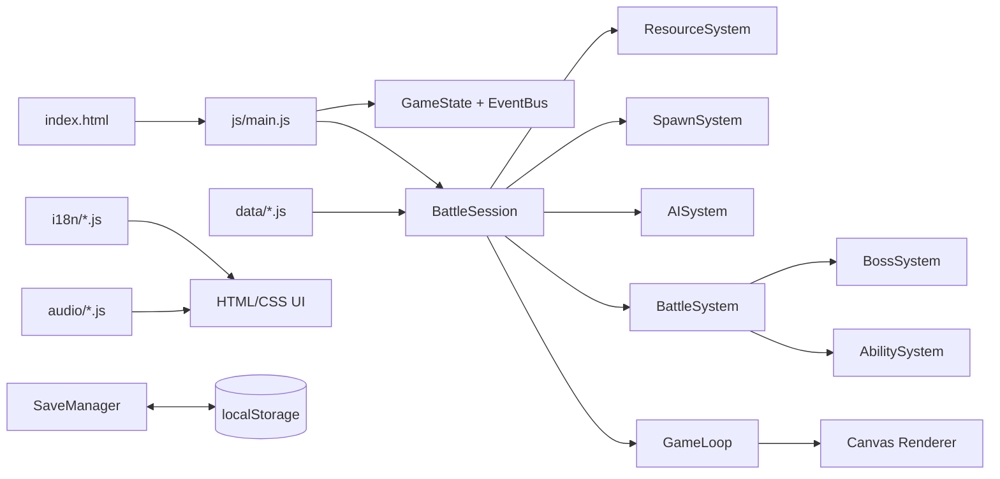

<a id="top"></a>

# Tug of War TD 🎮⚔️

A no-build, single-lane tug-of-war tower-defense game where a cat squad and a monster army deploy units, manage energy, and fight automatically toward each other’s castle.

## 🌍 Opening Summary

### 🇬🇧 English

Tug of War TD is a browser game built with native HTML5, CSS3, and vanilla JavaScript. The player commands a cat frontline, spends regenerating energy on thirteen unit definitions, counters attributes, survives Boss gates, and pushes through six open levels with unlimited battle time. The project includes responsive layouts, three languages, five themes, generated Web Audio music, local saves, and a focused Node-based unit-test suite.

### 🇯🇵 日本語

Tug of War TD は、ネイティブ HTML5・CSS3・Vanilla JavaScript で作られたブラウザゲームです。プレイヤーはねこ部隊を指揮し、時間で回復するエネルギーで13種類のユニットを出撃させ、属性相性を使い、Boss の防衛線を突破しながら、時間制限なしで自由に挑戦できる6ステージを進みます。レスポンシブ画面、3言語、5テーマ、Web Audio による音楽、ローカルセーブ、Node ベースのユニットテストを備えています。

### 🇹🇼 繁體中文

Tug of War TD 是以原生 HTML5、CSS3 與 Vanilla JavaScript 製作的瀏覽器遊戲。玩家指揮貓咪前線，使用會回復的能量召喚 13 種兵種，利用屬性相剋突破 Boss 防線，在 6 個可自由挑戰且沒有時間限制的關卡中推向敵方城堡。專案包含 RWD 版面、三種語言、五種主題、Web Audio 音樂、localStorage 存檔，以及 Node 單元測試套件。

[🇬🇧 English](#english) · [🇯🇵 日本語](#japanese) · [🇹🇼 繁體中文](#traditional-chinese)

## 🧭 Contents

- [English](#english)
  - [Game Introduction](#en-game-introduction)
  - [Feature Overview](#en-feature-overview)
  - [Gameplay & Usage](#en-gameplay)
  - [Quick Start](#en-quick-start)
  - [Program Overview](#en-program-overview)
  - [Code Organization](#en-code-organization)
  - [Supporting Systems](#en-supporting-systems)
  - [Testing](#en-testing)
  - [Status & Limitations](#en-status)
- [日本語](#japanese)
  - [ゲーム紹介](#ja-game-introduction)
  - [機能一覧](#ja-feature-overview)
  - [ゲームプレイと操作](#ja-gameplay)
  - [クイックスタート](#ja-quick-start)
  - [プログラム概要](#ja-program-overview)
  - [コード構成](#ja-code-organization)
  - [補助システム](#ja-supporting-systems)
  - [テスト](#ja-testing)
  - [現状と制限](#ja-status)
- [繁體中文](#traditional-chinese)
  - [遊戲介紹](#zh-game-introduction)
  - [功能總覽](#zh-feature-overview)
  - [遊戲玩法與操作](#zh-gameplay)
  - [快速開始](#zh-quick-start)
  - [程式總覽](#zh-program-overview)
  - [程式碼分類](#zh-code-organization)
  - [支援系統](#zh-supporting-systems)
  - [測試](#zh-testing)
  - [目前狀態與限制](#zh-status)
- [Development experience log](docs/DEVELOPMENT_EXPERIENCE.md)

## 🗺️ Neutral Architecture Map



<a id="english"></a>

## 🇬🇧 English

<a id="en-game-introduction"></a>

### 🎮 Game Introduction

Tug of War TD is an automatic one-lane battle. Both castles sit at opposite ends of a 1000 × 560 game world. The player chooses when and what to deploy; units move, acquire the nearest living opponent, attack on cooldown, and advance only when the opposing frontline is clear.

<a id="en-feature-overview"></a>

### ✨ Feature Overview

| Feature | Implemented behavior |
| --- | --- |
| 🧵 One shared lane | Player and enemy units meet on one animated path; living opponents hold position until defeated, with no backward collision shove. |
| 🐱 Unit roster | 13 regular/special deployable definitions, including 5 special-ability units, plus an enemy-only Boss definition. |
| 👑 Boss gates | Normal stages spawn a Boss at or below 30% enemy-castle HP; Stage 6 spawns one at every 10% threshold from 90% to 10%, with later Boss tiers growing stronger. |
| 🔥 Endless pressure | Stage 6 accelerates enemy wave intervals after 8 seconds and unlocks higher-tier enemy pools every 18 seconds, making the Crown Endless Line increasingly difficult. |
| 🛡️ Frontline rules | Units do not receive knockback. A living opponent holds the line until defeated, and living Bosses block castle victory. |
| 🔋 Energy economy | Energy regenerates faster for the player (`1.24×` level rate); LV1–LV5 upgrades increase both the cap and production rate, while deployable costs use a rounded `0.8×` discount. |
| 🌐 Presentation | Chinese, English, and Japanese localization; cute-pink, ocean, forest, sunset, and night themes; responsive desktop/mobile layouts. |
| 🎵 Persistence | Web Audio music/SFX, scene cleanup, volume and mute controls, local battle snapshots, and stars; battles have unlimited time. |

<a id="en-gameplay"></a>

### ⚔️ Gameplay & Usage

#### Objective and battle loop

1. Choose any of the six levels from the level map; all level IDs are currently available directly.
2. Wait for energy to regenerate, then click or tap a unit card to deploy it.
3. Build a frontline with cheap units, protect fragile ranged/support units, and use attributes to improve damage.
4. Upgrade energy production when the cost is available; the upgrade button shows the current level and cost.
5. Defeat living opponents before your units can move farther down the lane.
6. Defeat every living Boss before the enemy castle can be finished.
7. In Stage 6, survive the accelerating enemy waves and stronger late Boss tiers.

#### Controls and interactions

| Context | Interaction | Result |
| --- | --- | --- |
| Main menu | Start | Clears the current run after confirmation and opens the level map. |
| Main menu | Continue | Restores the active battle snapshot when one exists. |
| Main menu | How to Play | Opens five tabs: basics, resources, units, matchups, and victory rules. |
| Main menu | Settings | Opens audio, theme, language, and save-management controls. |
| Battle | Unit card | Spends the listed energy cost and deploys the unit if its cooldown is ready. |
| Battle | Energy upgrade | Buys the next player energy level, up to LV5. Costs are 21, 39, 56, and 74 energy after a rounded 30% reduction. |
| Battle | Pause | Stops the game loop; Resume continues, while Save & main menu stores a snapshot and returns to the menu. |
| Mobile battle | Summon handle / quick controls | Collapses or opens the summon panel and exposes pause, summon, and energy-upgrade actions without covering the canvas. |

#### Energy progression

The level data defines the raw cap and base rate. New player sessions apply the current `playerEnergyRateMultiplier` of `1.24`; enemy production keeps its own level rate so the balance adjustment accelerates the player economy without accelerating both armies at once. All deployable cards use `unitCostMultiplier: 0.8`, rounded to a minimum cost of 1; the enemy-only Boss remains free.

| Level | Battle time | Castle HP | Energy cap | Raw rate | Current player base rate |
| ---: | ---: | ---: | ---: | ---: | ---: |
| 1 | Unlimited | 1000 | 100 | 2.05/s | 2.542/s |
| 2 | Unlimited | 1120 | 110 | 2.15/s | 2.666/s |
| 3 | Unlimited | 1240 | 120 | 2.25/s | 2.790/s |
| 4 | Unlimited | 1380 | 130 | 2.35/s | 2.914/s |
| 5 | Unlimited | 1550 | 140 | 2.50/s | 3.100/s |
| 6 | Unlimited | 2200 | 160 | 2.70/s | 3.348/s |

Each player energy upgrade raises production by 28% relative to the base rate and raises the cap by 18% of the level’s base cap. Upgrade costs are multiplied by `0.7` and rounded to whole energy: `21`, `39`, `56`, `74`. The cap and rate are visible in the HUD and persisted in battle snapshots.

#### Unit roster

| ID | Role / ability | Cost | Gameplay identity |
| --- | --- | ---: | --- |
| `basic` | Frontline | 6 | Cheap, reliable body for filling the lane. |
| `ranger` | Ranged | 13 | Long-range damage with low HP. |
| `tank` | Heavy | 21 | High HP, slow movement, low attack. |
| `striker` | Burst | 30 | Expensive diver with a high-impact hit. |
| `healer` | Support | 24 | Restores a hurt ally within range. |
| `scout` | Speed | 8 | Fast, inexpensive melee vanguard. |
| `guard` | Guard | 16 | Mid-weight defensive frontline. |
| `catapult` | Siege / ranged | 23 | Slow long-range artillery. |
| `berserker` | Special / rage | 27 | Deals more damage below half HP. |
| `frostMage` | Special / frost | 29 | Ranged attack that slows the target. |
| `thunderMage` | Special / chain | 35 | Ranged attack that chains 36% damage to nearby enemies. |
| `guardian` | Special / barrier | 32 | Periodically gives nearby allies a damage-absorbing barrier. |
| `summoner` | Special / summon | 40 | Periodically free-summons a Basic unit after warming up. |

The listed costs are effective player/enemy deployment costs after the `0.8×` multiplier. A normal Boss and the first Stage-6 Boss tier have `2200 HP`, `156 attack`, `40% defense`, 48 range, and a 2.3-second attack cooldown. In Stage 6, each tier step adds `18%` of base HP, `12%` of base attack, and `0.04` defense, reaching tier 9 at the 10% threshold. Player defensive units (`basic`, `tank`, `guard`, and `guardian`) receive `+20%` max HP and `+20` percentage points of damage reduction; enemy copies keep their base stats. The five special units are `berserker`, `frostMage`, `thunderMage`, `guardian`, and `summoner`.

Stage 6 starts with the starter enemy pool. After 18 seconds, it unlocks `striker` / `healer` / `berserker`, after 36 seconds it adds `frostMage` / `thunderMage` / `guardian`, and after 54 seconds it adds `summoner`. The enemy spawn interval begins accelerating after 8 seconds and reaches a `0.35×` floor.

#### Attributes and damage

| Attacker attribute | Counters | Damage result |
| --- | --- | --- |
| Red | Angel | ×2 |
| Angel | Demon | ×2 |
| Demon | Metal | ×2 |
| Metal | Red | ×2 |
| Normal | None | ×1 |

When the defender has the advantage over the attacker, the attacker receives the defensive `0.72` multiplier. Enemy ranged attacks additionally use `enemyRangedDamageMultiplier: .8`, a 20% reduction, against both units and castles; player ranged damage is unchanged.

#### Win, loss, and scoring rules

- Destroying the enemy castle wins only when no living Boss remains.
- Reducing your own castle to zero is a defeat.
- Battles have unlimited time; there is no timer-based defeat, draw, or star condition.
- Victories award three stars at 80% or more player-castle HP, two stars at 45% or more, and one star otherwise.

<a id="en-quick-start"></a>

### 🚀 Quick Start

#### Play in a browser

1. Open the project folder in a recent Chrome, Edge, Firefox, or Safari browser.
2. Open `index.html` directly; the project has no package manager, build step, CDN, or runtime server dependency.
3. Click **Start**, choose a level, and click the screen once if the browser asks for an audio gesture.
4. Use the unit cards and energy upgrade button to command the frontline.

The scripts are loaded with classic relative `<script>` tags rather than modules or `fetch()` so the game can run as a static folder. If a browser applies stricter local-file policies, serve the same folder with any static file server; no project-specific server setup is required.

#### Run the tests

```text
node tests/unit.test.js
```

<a id="en-program-overview"></a>

### 🧩 Program Overview

- `index.html` is the only page entry point. It imports `css/main.css` and JavaScript files in dependency order.
- Modules use IIFEs and the `window.TugOfWar` namespace so the classic-script loading model remains compatible with direct static-file launching.
- `BattleSession` in `js/engine/gameLoop.js` owns the current level, castles, units, resources, effects, simulation clock, result, and snapshot state; elapsed time is not a battle limit.
- `GameLoop` uses `requestAnimationFrame`, caps frame delta at `Config.maxDelta`, updates systems, then asks `Renderer` to draw the canvas and the HUD to refresh the DOM.
- `GameState` tracks `loading`, `menu`, `levels`, `howto`, `settings`, `battle`, `paused`, and `result`; `EventBus` lets UI, audio, and gameplay modules communicate without direct circular calls.
- The canvas world is 1000 × 560 and `Renderer.resize()` scales it to the responsive battle stage with a device-pixel-ratio cap of 2.

<a id="en-code-organization"></a>

### 🗂️ Code Organization

| Path | Responsibility | Representative files |
| --- | --- | --- |
| `index.html` | Screen markup and ordered script loading | `index.html` |
| `css/` | Reset, typography, variables, themes, components, screens, and responsive layout | `css/main.css`, `css/layout/responsive.css` |
| `data/` | Level tuning, unit stats, attributes, and roster order | `data/levels.js`, `data/unitsData.js` |
| `js/core/` | Configuration, state transitions, events, and local persistence | `config.js`, `gameState.js`, `eventBus.js`, `saveManager.js` |
| `js/engine/` | Frame loop, canvas drawing, path geometry, and nearest-opponent lookup | `gameLoop.js`, `renderer.js`, `pathManager.js`, `collision.js` |
| `js/entities/` | Unit collections and castle/unit state models | `Unit.js`, `PlayerUnits.js`, `EnemyUnits.js`, `Base.js` |
| `js/systems/` | Resource, spawning, AI, battle, abilities, Bosses, and level cards | `resourceSystem.js`, `battleSystem.js`, `bossSystem.js` |
| `js/audio/` | Generated music patterns, SFX recipes, gain, limiter, and scene cleanup | `audioConfig.js`, `audioManager.js` |
| `js/i18n/` | Dictionaries, interpolation, fallback, and language switching | `i18nManager.js`, `lang-zh.js`, `lang-en.js`, `lang-ja.js` |
| `js/ui/` | Menu, settings, guide, battle HUD, mobile controls, and themes | `mainMenu.js`, `battleHUD.js`, `mobileControls.js` |
| `tests/` | Node/vm unit tests for gameplay and audio seams | `tests/unit.test.js` |
| `docs/` | Development knowledge captured from the implementation | `docs/DEVELOPMENT_EXPERIENCE.md` |
| `.agents/skills/` | Project-local maintenance workflow and gameplay invariants | `.agents/skills/tug-of-war-td-maintainer/SKILL.md` |
| `Tug_of_War_TD_spec.md` | Original Chinese specification and design requirements | `Tug_of_War_TD_spec.md` |

<a id="en-supporting-systems"></a>

### 🔧 Supporting Systems

| System | Current behavior |
| --- | --- |
| 🌐 Localization | `zh`, `en`, and `ja` dictionaries are loaded locally; missing translations fall back to Chinese, and `{level}` / `{max}` variables are interpolated. |
| 💾 Persistence | `SaveManager` stores settings, stars, and an active battle in `localStorage` under `tug-of-war-td-save-v1`; active battles autosave every five seconds. Legacy best-time fields are discarded during migration. |
| 🎵 Audio | `AudioManager` synthesizes piano-like patterns and SFX with Web Audio API gain nodes and dynamics-compressor limiters. BGM/SFX sliders support 0–150%, plus mute. |
| 🔁 Scene cleanup | Menu, battle, victory, and defeat scenes stop scheduled sources before starting another track, preventing overlapping music. |
| 🎨 Themes | `cute-pink`, `ocean`, `forest`, `sunset`, and `night` are CSS-variable themes stored in settings. |
| 📱 Responsive UI | CSS media queries rearrange the battle HUD, energy rail, summon panel, and mobile quick controls for portrait and landscape layouts. |
| ♿ Basic semantics | Buttons, labels, hidden panels, `aria-selected`, `aria-expanded`, `aria-live`, and dialog attributes are used throughout the HTML UI. |
| 🧹 Performance guard | Free summons are capped by `Config.lowPerformanceUnitLimit * 2` for non-Boss units; normal Boss spawning is allowed to take priority. |

<a id="en-testing"></a>

### 🧪 Testing

The test runner is intentionally dependency-light and uses Node’s built-in `assert`, `fs`, `path`, and `vm` modules. It loads the gameplay IIFEs into a test context and checks observable rules instead of browser-only rendering details.

```text
node tests/unit.test.js
```

The latest verified run reports **19 unit tests passed**, covering the roster, levels, Boss defenses and thresholds, escalating Stage-6 Boss stats and snapshot restoration, time-based enemy wave ramps and tier unlocks, music scene cleanup, resource upgrades and 30% cheaper upgrade costs, discounted unit costs, player defensive bonuses, legacy save migration, no-knockback combat for every deployable role, frontline locking, special abilities, castle blocking, and unlimited-time outcomes.

For a syntax-only pass across JavaScript files:

```powershell
$failed = $false
$files = rg --files -g '*.js'
foreach ($file in $files) {
  node --check $file
  if ($LASTEXITCODE -ne 0) { $failed = $true }
}
if ($failed) { exit 1 }
```

The repository does not include a browser automation runner. Manual browser checks should still cover starting a battle, changing language/theme, switching audio scenes, pausing, saving, resuming, using the mobile summon panel, and completing a Boss gate.

<a id="en-status"></a>

### 📌 Status & Limitations

- Configuration and footer identify the current release as `1.0.0` / `v1.0`.
- There is no `package.json`, bundler, or npm script; Node is used for tests only.
- The `assets/` tree currently contains `.gitkeep` placeholders. The playable visuals are drawn with canvas, CSS, and emoji-like unit icons; no external image or audio download is required.
- `Tug_of_War_TD_spec.md` remains the requirements reference. This README describes the implementation that exists today, not every idea listed in the specification.
- Browser compatibility is designed around modern Web Audio, Canvas, CSS, and localStorage APIs, but an exhaustive browser/device matrix is not part of the automated test suite.
- Development decisions and reusable lessons are recorded in [docs/DEVELOPMENT_EXPERIENCE.md](docs/DEVELOPMENT_EXPERIENCE.md); repeatable maintenance rules live in [.agents/skills/tug-of-war-td-maintainer/SKILL.md](.agents/skills/tug-of-war-td-maintainer/SKILL.md).

<a id="japanese"></a>

## 🇯🇵 日本語

<a id="ja-game-introduction"></a>

### 🎮 ゲーム紹介

Tug of War TD は自動進行する一車線バトルです。1000 × 560 のゲームワールドの両端に城があり、プレイヤーは出撃のタイミングと部隊を選びます。ユニットは自動で進み、最も近い生存敵を探してクールダウンごとに攻撃し、敵の前線が空いたときだけ先へ進みます。

<a id="ja-feature-overview"></a>

### ✨ 機能一覧

| 機能 | 実装内容 |
| --- | --- |
| 🧵 共有一車線 | プレイヤーと敵が1本の動く道で戦い、生存中の敵を倒すまで前線を止めます。後退させる衝突分離はありません。 |
| 🐱 部隊名簿 | 13種類の通常・特殊ユニット、5種類の特殊能力ユニット、敵専用Bossを実装しています。 |
| 👑 Bossゲート | 通常ステージは敵城HPが30%以下でBossを出し、Stage 6は90%から10%まで10%ごとにBossを出します。後半のBossほど強くなります。 |
| 🔥 無限の圧力 | Stage 6は8秒後から敵の出撃間隔が短くなり、18秒ごとに高位ユニットを解放するため、時間とともに難しくなります。 |
| 🛡️ 前線ルール | ノックバックはなく、生存している敵を倒すまで前線は止まります。生存Bossがいる間は城を落とせません。 |
| 🔋 エネルギー経済 | プレイヤーのエネルギーはレベル速度の `1.24倍` で回復し、LV1〜LV5の強化で上限と生産速度が上がります。出撃コストは丸めた `0.8倍` です。 |
| 🌐 表示 | 中国語・英語・日本語、5テーマ、デスクトップとモバイルのレスポンシブ画面に対応します。 |
| 🎵 保存と音 | Web Audioの音楽・効果音、シーン切替、音量とミュート、戦闘スナップショット、星を実装しています。戦闘時間は無制限です。 |

<a id="ja-gameplay"></a>

### ⚔️ ゲームプレイと操作

#### 目的とループ

1. レベルマップから6ステージのどれかを選びます。現在は全レベルを直接選べます。
2. エネルギーが回復したら、ユニットカードをクリックまたはタップして出撃させます。
3. 安価なユニットで前線を作り、後衛の遠距離・支援ユニットを守り、属性相性でダメージを伸ばします。
4. コストを払えるときにエネルギー生産を強化します。ボタンにはレベルとコストが表示されます。
5. 生存している敵を倒すまで、味方ユニットは前線を越えて進みません。
6. 敵城を落とすには、生存しているBossをすべて倒す必要があります。
7. Stage 6では加速する敵の波と後半の強化Bossに耐えます。

#### 操作とインタラクション

| 場面 | 操作 | 結果 |
| --- | --- | --- |
| メインメニュー | Start | 確認後に現在のランを消去し、レベルマップを開きます。 |
| メインメニュー | Continue | 保存された戦闘スナップショットがあれば復元します。 |
| メインメニュー | How to Play | 基本、資源、ユニット、相性、勝利条件の5タブを開きます。 |
| メインメニュー | Settings | 音声、テーマ、言語、セーブ管理を開きます。 |
| バトル | ユニットカード | コストを払い、クールダウンが終わっていれば出撃します。 |
| バトル | エネルギー強化 | LV5までプレイヤーのエネルギーを強化します。30%減額後のコストは21、39、56、74です。 |
| バトル | Pause | ループを停止します。Resumeで再開し、Save & main menuで保存して戻ります。 |
| モバイル | サモンバー / クイック操作 | キャンバスを隠さず、出撃パネル、停止、召喚、強化を操作できます。 |

#### エネルギーの進行

レベルデータが基本上限と基本速度を定義します。新しいプレイヤー戦闘には `playerEnergyRateMultiplier` の `1.24` が適用されます。敵側の生産速度は元のレベル速度を使うため、プレイヤー側だけ経済テンポが上がります。出撃可能なユニットには `unitCostMultiplier: 0.8` を適用し、最小コストは1、敵専用Bossは無料です。

| レベル | 戦闘時間 | 城HP | エネルギー上限 | 基本速度 | 現在のプレイヤー基本速度 |
| ---: | ---: | ---: | ---: | ---: | ---: |
| 1 | 無制限 | 1000 | 100 | 2.05/秒 | 2.542/秒 |
| 2 | 無制限 | 1120 | 110 | 2.15/秒 | 2.666/秒 |
| 3 | 無制限 | 1240 | 120 | 2.25/秒 | 2.790/秒 |
| 4 | 無制限 | 1380 | 130 | 2.35/秒 | 2.914/秒 |
| 5 | 無制限 | 1550 | 140 | 2.50/秒 | 3.100/秒 |
| 6 | 無制限 | 2200 | 160 | 2.70/秒 | 3.348/秒 |

各強化は基本速度を28%ずつ増やし、基本上限の18%を上限へ加えます。強化コストには `0.7` 倍を適用し、整数の `21`、`39`、`56`、`74` に丸めます。上限と速度はHUDに表示され、戦闘スナップショットに保存されます。

#### ユニット名簿

| ID | 役割 / 能力 | コスト | ゲーム内の役割 |
| --- | --- | ---: | --- |
| `basic` | 前衛 | 6 | 安価で前線を埋める基本兵。 |
| `ranger` | 遠距離 | 13 | 射程が長くHPが低い攻撃役。 |
| `tank` | 重装 | 21 | HPが高く、遅く、攻撃が低い盾。 |
| `striker` | バースト | 30 | 高コストで一撃が強い突撃役。 |
| `healer` | 支援 | 24 | 射程内の傷ついた味方を回復。 |
| `scout` | 高速 | 8 | 速くて安い近接先鋒。 |
| `guard` | 守備 | 16 | 中量級の前線防御役。 |
| `catapult` | 攻城 / 遠距離 | 23 | 遅いが射程の長い砲撃役。 |
| `berserker` | 特殊 / rage | 27 | HP半分未満で攻撃力が上がる。 |
| `frostMage` | 特殊 / frost | 29 | 遠距離攻撃で対象を減速。 |
| `thunderMage` | 特殊 / chain | 35 | 近くの敵へ36%ダメージを連鎖。 |
| `guardian` | 特殊 / barrier | 32 | 近くの味方にダメージ吸収バリア。 |
| `summoner` | 特殊 / summon | 40 | 準備後、基本兵を無料召喚。 |

表のコストは `0.8倍` 適用後の実際の出撃コストです。通常BossとStage 6の第1階層Bossは `2200 HP`、`156攻撃`、`40%防御`、射程48、攻撃クールダウン2.3秒を持ちます。Stage 6では後続階層ごとに基準値へHP `+18%`、攻撃 `+12%`、防御 `+0.04` を加え、10%門檻で第9階層に達します。プレイヤーの防御型ユニット（`basic`、`tank`、`guard`、`guardian`）には最大HP `+20%` とダメージ軽減 `+20` ポイントを適用し、敵側は基本値のままです。5種類の特殊ユニットは `berserker`、`frostMage`、`thunderMage`、`guardian`、`summoner` です。

Stage 6は初期ユニットプールから始まり、18秒後に `striker` / `healer` / `berserker`、36秒後に `frostMage` / `thunderMage` / `guardian`、54秒後に `summoner` を解放します。敵の出撃間隔は8秒後から加速し、最終的に `0.35倍` まで短縮されます。

#### 属性とダメージ

| 攻撃属性 | 有利な相手 | ダメージ |
| --- | --- | --- |
| Red | Angel | ×2 |
| Angel | Demon | ×2 |
| Demon | Metal | ×2 |
| Metal | Red | ×2 |
| Normal | なし | ×1 |

防御側が攻撃側より有利な属性なら、攻撃側には防御倍率 `0.72` が適用されます。敵の遠距離攻撃には20%軽減となる `enemyRangedDamageMultiplier: .8` がユニットと城の両方へ適用され、プレイヤーの遠距離攻撃は変わりません。

#### 勝敗とスコア

- 敵城HPがゼロでも、生存Bossがいれば勝利になりません。
- 自分の城HPがゼロになると敗北です。
- 戦闘時間は無制限で、時間切れによる敗北・引き分け・星判定はありません。
- 自分の城HPが80%以上なら3星、45%以上なら2星、それ以外は1星です。

<a id="ja-quick-start"></a>

### 🚀 クイックスタート

1. プロジェクトフォルダーを新しい Chrome、Edge、Firefox、Safari で開きます。
2. `index.html` を直接開きます。パッケージマネージャー、ビルド、CDN、専用サーバーは必要ありません。
3. **Start** を押してレベルを選び、音声の許可が表示されたら画面を一度クリックします。
4. ユニットカードとエネルギー強化で前線を指揮します。

依存関係のあるクラシックスクリプトを相対 `<script>` で読み込むため、静的フォルダーとして動作します。ブラウザのローカルファイル制限がある場合は、任意の静的ファイルサーバーで同じフォルダーを配信できますが、専用設定はありません。

テスト実行：

```text
node tests/unit.test.js
```

<a id="ja-program-overview"></a>

### 🧩 プログラム概要

- `index.html` が唯一の入口で、`css/main.css` と依存順のJavaScriptを読み込みます。
- IIFEと `window.TugOfWar` 名前空間を使い、直接静的ファイルを開くクラシックスクリプト方式に対応します。
- `js/engine/gameLoop.js` の `BattleSession` が、レベル、城、ユニット、資源、エフェクト、シミュレーション時計、結果、スナップショットを管理します。経過時間は制限時間ではありません。
- `GameLoop` は `requestAnimationFrame` で更新し、`Config.maxDelta` でフレーム差分を制限してから、システム、Canvas Renderer、HUDを更新します。
- `GameState` は `loading`、`menu`、`levels`、`howto`、`settings`、`battle`、`paused`、`result` を管理し、`EventBus` がUI・音声・ゲームプレイをつなぎます。
- キャンバスのワールドは1000 × 560で、`Renderer.resize()` が表示領域とデバイスピクセル比（最大2）に合わせます。

<a id="ja-code-organization"></a>

### 🗂️ コード構成

| パス | 責任 | 代表ファイル |
| --- | --- | --- |
| `index.html` | 画面マークアップとスクリプト順序 | `index.html` |
| `css/` | リセット、文字、変数、テーマ、コンポーネント、画面、レスポンシブ | `css/main.css`, `css/layout/responsive.css` |
| `data/` | レベル、ユニット、属性、名簿順 | `data/levels.js`, `data/unitsData.js` |
| `js/core/` | 設定、状態、イベント、ローカル保存 | `config.js`, `gameState.js`, `eventBus.js`, `saveManager.js` |
| `js/engine/` | フレーム、Canvas、経路、最近敵の検索 | `gameLoop.js`, `renderer.js`, `pathManager.js`, `collision.js` |
| `js/entities/` | ユニット群と城・ユニット状態 | `Unit.js`, `PlayerUnits.js`, `EnemyUnits.js`, `Base.js` |
| `js/systems/` | 資源、出撃、AI、戦闘、能力、Boss、レベルカード | `resourceSystem.js`, `battleSystem.js`, `bossSystem.js` |
| `js/audio/` | 音楽パターン、効果音、ゲイン、Limiter、シーン停止 | `audioConfig.js`, `audioManager.js` |
| `js/i18n/` | 辞書、補間、フォールバック、言語切替 | `i18nManager.js`, `lang-zh.js`, `lang-en.js`, `lang-ja.js` |
| `js/ui/` | メニュー、設定、ガイド、HUD、モバイル操作、テーマ | `mainMenu.js`, `battleHUD.js`, `mobileControls.js` |
| `tests/` | Node/vmによるゲームプレイと音声境界のテスト | `tests/unit.test.js` |
| `docs/` | 実装から得た開発知識 | `docs/DEVELOPMENT_EXPERIENCE.md` |
| `.agents/skills/` | プロジェクト内の保守手順とゲーム不変条件 | `.agents/skills/tug-of-war-td-maintainer/SKILL.md` |
| `Tug_of_War_TD_spec.md` | 中国語の仕様・設計要件 | `Tug_of_War_TD_spec.md` |

<a id="ja-supporting-systems"></a>

### 🔧 補助システム

| システム | 現在の動作 |
| --- | --- |
| 🌐 多言語 | `zh`、`en`、`ja` をローカル読込し、未翻訳キーは中国語へフォールバックします。`{level}` や `{max}` も置換します。 |
| 💾 保存 | `SaveManager` が `tug-of-war-td-save-v1` のlocalStorageへ設定、星、戦闘スナップショットを保存し、5秒ごとに戦闘を自動保存します。旧ベスト時間フィールドは移行時に破棄します。 |
| 🎵 音声 | Web Audio APIのゲインノードとDynamics Compressor Limiterでピアノ風パターンと効果音を生成します。音量は0〜150%、ミュートもあります。 |
| 🔁 シーン整理 | メニュー、戦闘、勝利、敗北の切替前に予約済み音源を停止し、音楽の重なりを防ぎます。 |
| 🎨 テーマ | `cute-pink`、`ocean`、`forest`、`sunset`、`night` を設定へ保存します。 |
| 📱 レスポンシブ | メディアクエリでHUD、エネルギー欄、召喚パネル、モバイル操作を縦横画面に再配置します。 |
| ♿ 基本セマンティクス | ボタン、ラベル、非表示パネル、`aria-selected`、`aria-expanded`、`aria-live`、ダイアログ属性を使います。 |
| 🧹 パフォーマンス | Boss以外の無料召喚は `Config.lowPerformanceUnitLimit * 2` で上限を設け、Boss生成は優先します。 |

<a id="ja-testing"></a>

### 🧪 テスト

テストランナーはNode標準の `assert`、`fs`、`path`、`vm` のみを使用します。ゲームプレイのIIFEをテストコンテキストへ読み込み、ブラウザ描画ではなく観測可能なルールを検証します。

```text
node tests/unit.test.js
```

最新の検証結果は **19 unit tests passed** です。名簿、レベル、Bossの防御と門檻、Stage 6のBoss階層強化とスナップショット復元、時間経過による敵波と高位ユニット解放、音楽シーン整理、資源強化と30%安い強化コスト、コスト割引、プレイヤー防御型ユニット強化、旧セーブ移行、全出撃役割のノックバックなし、前線停止、特殊能力、城の封鎖、無制限時間を確認しています。

JavaScriptの構文チェックには `node --check` を全ファイルへ実行し、変更差分には `git diff --check` を使います。ブラウザ自動化ランナーは含まれていないため、起動、言語・テーマ、音声シーン、Pause、保存と再開、モバイルパネル、Bossゲートはブラウザで手動確認してください。

<a id="ja-status"></a>

### 📌 現状と制限

- 設定とフッターは現在のリリースを `1.0.0` / `v1.0` と示します。
- `package.json`、Bundler、npmスクリプトはありません。Nodeはテスト専用です。
- `assets/` には現在 `.gitkeep` のプレースホルダーがあります。プレイ中の画面はCanvas、CSS、絵文字風アイコンで描画され、外部画像・音声ダウンロードは不要です。
- `Tug_of_War_TD_spec.md` は要件資料です。このREADMEは仕様書の全アイデアではなく、現在存在する実装を説明します。
- 現代的なWeb Audio、Canvas、CSS、localStorageを前提に設計していますが、全ブラウザ・端末の検証は自動テストに含まれません。
- 開発判断と再利用できる知識は [docs/DEVELOPMENT_EXPERIENCE.md](docs/DEVELOPMENT_EXPERIENCE.md) に、反復保守ルールは [.agents/skills/tug-of-war-td-maintainer/SKILL.md](.agents/skills/tug-of-war-td-maintainer/SKILL.md) にまとめています。

<a id="traditional-chinese"></a>

## 🇹🇼 繁體中文

<a id="zh-game-introduction"></a>

### 🎮 遊戲介紹

Tug of War TD 是自動推進的單線戰鬥遊戲。1000 × 560 的遊戲世界兩端各有一座城堡，玩家決定出兵時機與兵種。角色會自動前進、尋找最近的存活敵人，依冷卻時間攻擊；只有敵方前線清空後才能繼續往前。

<a id="zh-feature-overview"></a>

### ✨ 功能總覽

| 功能 | 目前實作 |
| --- | --- |
| 🧵 單線戰場 | 玩家與敵人共用一條會動的路徑；存活對手未被擊敗前會卡住戰線，不會因碰撞把角色往後推。 |
| 🐱 兵種名冊 | 13 種常駐/特殊可出擊角色、5 種特殊能力兵種，以及敵方專用 Boss。 |
| 👑 Boss 門檻 | 一般關卡在敵方城堡 30% 以下時出 Boss；第 6 關從 90% 到 10% 每少 10% 出一隻，且後期 Boss 會越來越強。 |
| 🔥 無限壓力 | 第 6 關在 8 秒後會加快敵方出兵間隔，並每 18 秒解鎖更高階兵種，讓王冠無限防線越打越難。 |
| 🛡️ 前線規則 | 所有角色都不能擊退；存活敵人未被擊敗前會卡住戰線，存活 Boss 也會阻擋攻城勝利。 |
| 🔋 能量經濟 | 玩家能量以關卡速度的 `1.24 倍` 回復；LV1～LV5 升級會同時提高上限與生產速度，出兵費用套用四捨五入後的 `0.8 倍`。 |
| 🌐 顯示 | 支援中文、英文、日文、五種主題，以及桌機/手機 RWD 版面。 |
| 🎵 保存與音效 | Web Audio 音樂/音效、切頁清理、音量與靜音、戰鬥快照與星級保存；戰鬥時間無限制。 |

<a id="zh-gameplay"></a>

### ⚔️ 遊戲玩法與操作

#### 目標與戰鬥循環

1. 從關卡地圖選擇 6 關中的任一關；目前所有關卡都能直接挑戰。
2. 等待能量回復，點擊或觸控兵種卡片出兵。
3. 用低成本角色穩住前線，保護遠程/支援後排，並利用屬性相剋增加傷害。
4. 能量足夠時購買生產升級；按鈕會顯示目前等級與費用。
5. 必須擊敗存活敵人，自己的角色才能繼續向前推進。
6. 必須擊敗所有存活 Boss，才能真正摧毀敵方城堡。
7. 第 6 關要撐過逐漸加速的敵軍波次與後期強化 Boss。

#### 操作與互動

| 場景 | 操作 | 結果 |
| --- | --- | --- |
| 主選單 | 開始遊戲 | 確認後清除目前戰局並開啟關卡地圖。 |
| 主選單 | 繼續遊戲 | 有進行中的戰鬥快照時還原戰局。 |
| 主選單 | 遊戲說明 | 開啟基本操作、資源、單位、相剋、勝利條件五個頁籤。 |
| 主選單 | 設定 | 開啟音訊、主題、語言與存檔管理。 |
| 戰鬥 | 兵種卡片 | 消耗卡片費用，且冷卻完成後出兵。 |
| 戰鬥 | 能量升級 | 購買玩家下一級能量，最高 LV5；降低 30% 後費用依序為 21、39、56、74。 |
| 戰鬥 | 暫停 | 停止遊戲迴圈；繼續戰鬥會恢復，保存並返回主畫面會保存快照後離開。 |
| 手機戰鬥 | 召喚面板/快速按鈕 | 收合或展開出兵面板，並提供暫停、召喚、能量升級，不遮住 Canvas。 |

#### 能量成長

關卡資料定義基礎上限與原始速度。新的玩家戰局會套用 `playerEnergyRateMultiplier` 的 `1.24`，敵方則保留自己的關卡產能，讓玩家經濟節奏加快而不會兩邊同時加速。所有可出擊兵種會套用 `unitCostMultiplier: 0.8`，四捨五入後最低為 1；敵方專用 Boss 維持免費。

| 關卡 | 戰鬥時間 | 城堡 HP | 能量上限 | 原始速度 | 目前玩家基礎速度 |
| ---: | ---: | ---: | ---: | ---: | ---: |
| 1 | 無限 | 1000 | 100 | 2.05/秒 | 2.542/秒 |
| 2 | 無限 | 1120 | 110 | 2.15/秒 | 2.666/秒 |
| 3 | 無限 | 1240 | 120 | 2.25/秒 | 2.790/秒 |
| 4 | 無限 | 1380 | 130 | 2.35/秒 | 2.914/秒 |
| 5 | 無限 | 1550 | 140 | 2.50/秒 | 3.100/秒 |
| 6 | 無限 | 2200 | 160 | 2.70/秒 | 3.348/秒 |

每次玩家能量升級會以基礎速度的 28% 增加產能，並把關卡基礎上限的 18% 加到上限。升級費用套用 `0.7` 倍並四捨五入為 `21`、`39`、`56`、`74`；上限與速度會顯示在 HUD，並保存到戰鬥快照。

#### 兵種名冊

| ID | 定位 / 能力 | 費用 | 遊戲功能 |
| --- | --- | ---: | --- |
| `basic` | 前排 | 6 | 便宜可靠，用來填滿戰線。 |
| `ranger` | 遠程 | 13 | 射程長但血量低的輸出。 |
| `tank` | 重裝 | 21 | 高血量、移動慢、攻擊低的盾牌。 |
| `striker` | 爆發 | 30 | 高成本、高爆發的突擊角色。 |
| `healer` | 支援 | 24 | 治療射程內受傷的夥伴。 |
| `scout` | 高速 | 8 | 快速又便宜的近戰先鋒。 |
| `guard` | 守衛 | 16 | 中型前線防守角色。 |
| `catapult` | 攻城 / 遠程 | 23 | 攻速慢、射程長的砲擊。 |
| `berserker` | 特殊 / 狂暴 | 27 | HP 低於一半時提高攻擊。 |
| `frostMage` | 特殊 / 冰霜 | 29 | 遠程攻擊會讓目標減速。 |
| `thunderMage` | 特殊 / 鏈雷 | 35 | 對附近敵人連鎖造成 36% 傷害。 |
| `guardian` | 特殊 / 護盾 | 32 | 週期性給附近盟友吸收傷害的護盾。 |
| `summoner` | 特殊 / 召喚 | 40 | 暖機後免費召喚一名基礎兵。 |

表格費用是套用 `0.8 倍` 後的實際出兵費用。一般 Boss 與第 6 關第 1 階 Boss 擁有 `2200 HP`、`156 攻擊`、`40% 防禦`、48 射程與 2.3 秒攻擊冷卻。第 6 關後續階級會依基準值逐階增加 HP `+18%`、攻擊 `+12%`、防禦 `+0.04`，在敵方血量 10% 門檻達到第 9 階。我方防守型兵種（`basic`、`tank`、`guard`、`guardian`）會獲得最大 HP `+20%` 與減傷 `+20` 個百分點；敵方同名角色維持基礎數值。5 種特殊兵種是 `berserker`、`frostMage`、`thunderMage`、`guardian`、`summoner`。

第 6 關一開始只會從初始兵池出兵；18 秒後解鎖 `striker`／`healer`／`berserker`，36 秒後加入 `frostMage`／`thunderMage`／`guardian`，54 秒後加入 `summoner`。敵方出兵間隔在 8 秒後開始加速，最短縮至 `0.35 倍`。

#### 屬性與傷害

| 攻擊屬性 | 克制 | 傷害結果 |
| --- | --- | --- |
| 紅色 | 天使 | ×2 |
| 天使 | 惡魔 | ×2 |
| 惡魔 | 金屬 | ×2 |
| 金屬 | 紅色 | ×2 |
| 一般 | 無 | ×1 |

如果防守方屬性克制攻擊方，攻擊方會套用防守倍率 `0.72`。敵方遠程攻擊現在套用 `enemyRangedDamageMultiplier: .8`，也就是降低 20%，而且同時作用於角色與城堡；玩家遠程傷害維持不變。

#### 勝負與評分

- 敵方城堡 HP 歸零，且沒有存活 Boss，才算勝利。
- 我方城堡 HP 歸零就是戰敗。
- 戰鬥時間無限制，不會因時間到而戰敗、平局或影響星級。
- 我方城堡剩餘 HP 達 80% 以上得 3 星、45% 以上得 2 星，其餘得 1 星。

<a id="zh-quick-start"></a>

### 🚀 快速開始

1. 用近期版本的 Chrome、Edge、Firefox 或 Safari 開啟專案資料夾。
2. 直接開啟 `index.html`；專案沒有套件管理器、建置步驟、CDN 或專用伺服器依賴。
3. 點擊 **開始遊戲**、選擇關卡；若瀏覽器要求音訊手勢，點一下畫面即可開始音效。
4. 使用兵種卡片與能量升級指揮戰線。

專案透過相對路徑的傳統 `<script>` 載入依賴，因此可以當作靜態資料夾使用。若瀏覽器對本地檔案套用較嚴格限制，可用任意靜態檔案伺服器提供同一個資料夾，但不需要專案專屬設定。

測試指令：

```text
node tests/unit.test.js
```

<a id="zh-program-overview"></a>

### 🧩 程式總覽

- `index.html` 是唯一入口，依相依順序載入 `css/main.css` 與 JavaScript。
- 模組使用 IIFE 與 `window.TugOfWar` 命名空間，維持直接開啟靜態檔案的傳統腳本模式。
- `js/engine/gameLoop.js` 的 `BattleSession` 管理關卡、城堡、角色、資源、特效、模擬時鐘、結果與戰鬥快照；經過時間不是戰鬥限制。
- `GameLoop` 使用 `requestAnimationFrame` 更新，先以 `Config.maxDelta` 限制幀間隔，再更新各系統、Canvas Renderer 與 HUD。
- `GameState` 管理 `loading`、`menu`、`levels`、`howto`、`settings`、`battle`、`paused`、`result`；`EventBus` 負責 UI、音效與遊戲邏輯間的事件溝通。
- Canvas 世界尺寸為 1000 × 560，`Renderer.resize()` 依顯示區域與最高 2 倍的裝置像素比縮放。

<a id="zh-code-organization"></a>

### 🗂️ 程式碼分類

| 路徑 | 職責 | 代表檔案 |
| --- | --- | --- |
| `index.html` | 畫面標記與腳本載入順序 | `index.html` |
| `css/` | Reset、字體、變數、主題、元件、畫面與 RWD | `css/main.css`、`css/layout/responsive.css` |
| `data/` | 關卡調整、兵種數值、屬性與名冊順序 | `data/levels.js`、`data/unitsData.js` |
| `js/core/` | 設定、狀態轉換、事件與本地存檔 | `config.js`、`gameState.js`、`eventBus.js`、`saveManager.js` |
| `js/engine/` | 遊戲迴圈、Canvas、路徑幾何與最近敵人查找 | `gameLoop.js`、`renderer.js`、`pathManager.js`、`collision.js` |
| `js/entities/` | 角色集合與城堡/角色狀態模型 | `Unit.js`、`PlayerUnits.js`、`EnemyUnits.js`、`Base.js` |
| `js/systems/` | 資源、出兵、AI、戰鬥、能力、Boss 與關卡卡片 | `resourceSystem.js`、`battleSystem.js`、`bossSystem.js` |
| `js/audio/` | 音樂模式、音效、增益、Limiter 與切頁清理 | `audioConfig.js`、`audioManager.js` |
| `js/i18n/` | 字典、變數插值、fallback 與語言切換 | `i18nManager.js`、`lang-zh.js`、`lang-en.js`、`lang-ja.js` |
| `js/ui/` | 主選單、設定、說明、HUD、手機操作與主題 | `mainMenu.js`、`battleHUD.js`、`mobileControls.js` |
| `tests/` | Node/vm 遊戲規則與音訊邊界測試 | `tests/unit.test.js` |
| `docs/` | 從實作整理出的開發經驗 | `docs/DEVELOPMENT_EXPERIENCE.md` |
| `.agents/skills/` | 專案內維護流程與遊戲不變條件 | `.agents/skills/tug-of-war-td-maintainer/SKILL.md` |
| `Tug_of_War_TD_spec.md` | 中文規格與設計需求 | `Tug_of_War_TD_spec.md` |

<a id="zh-supporting-systems"></a>

### 🔧 支援系統

| 系統 | 目前行為 |
| --- | --- |
| 🌐 多語系 | 本地載入 `zh`、`en`、`ja`，缺少翻譯時 fallback 到中文，並支援 `{level}`、`{max}` 變數。 |
| 💾 存檔 | `SaveManager` 將設定、星級與戰鬥快照存進 `tug-of-war-td-save-v1` 的 localStorage；戰鬥每 5 秒自動保存，舊的最佳時間欄位會在移轉時丟棄。 |
| 🎵 音訊 | `AudioManager` 使用 Web Audio API 增益節點與 Dynamics Compressor Limiter 產生鋼琴風格音樂與音效；音量支援 0～150%，也可靜音。 |
| 🔁 切頁清理 | 主選單、戰鬥、勝利、戰敗場景切換前會停止排程中的音源，避免音樂重疊。 |
| 🎨 主題 | `cute-pink`、`ocean`、`forest`、`sunset`、`night` 五種 CSS 變數主題會保存到設定。 |
| 📱 響應式 | Media query 會依手機直向/橫向重排 HUD、能量欄、召喚面板與手機快速操作。 |
| ♿ 基本語意 | HTML 使用按鈕、標籤、隱藏面板、`aria-selected`、`aria-expanded`、`aria-live` 與 dialog 屬性。 |
| 🧹 效能保護 | 非 Boss 免費召喚受 `Config.lowPerformanceUnitLimit * 2` 限制，Boss 生成仍可優先。 |

<a id="zh-testing"></a>

### 🧪 測試

測試執行器只使用 Node 內建的 `assert`、`fs`、`path`、`vm`。它把遊戲 IIFE 載入測試環境，檢查可觀察的遊戲規則，而不是只測瀏覽器畫面。

```text
node tests/unit.test.js
```

最近一次驗證結果為 **19 unit tests passed**，涵蓋兵種、關卡、Boss 防禦與門檻、第 6 關 Boss 階級強化與快照還原、隨時間加速的敵軍波次與高階兵種解鎖、音樂切頁清理、能量升級與費用降低 30%、費用折扣、我方防守型兵種加成、舊存檔移轉、所有出擊角色不後退、前線鎖定、特殊能力、城堡封鎖與無限時間規則。

JavaScript 語法檢查會對所有檔案執行 `node --check`，修改差異會用 `git diff --check` 檢查。專案沒有瀏覽器自動化 runner，因此仍應在瀏覽器手動確認開戰、語言/主題、音樂切換、暫停、保存/繼續、手機面板與 Boss 門檻。

<a id="zh-status"></a>

### 📌 目前狀態與限制

- 設定與頁尾目前標示版本為 `1.0.0` / `v1.0`。
- 沒有 `package.json`、Bundler 或 npm script；Node 只用於測試。
- `assets/` 目前是 `.gitkeep` 佔位目錄，遊戲畫面主要由 Canvas、CSS 與 emoji 風格圖示繪製，不需要下載外部圖片或音檔。
- `Tug_of_War_TD_spec.md` 是需求參考；本 README 只描述目前存在的實作，不把規格內所有構想當成已完成。
- 程式以現代 Web Audio、Canvas、CSS 與 localStorage API 為目標，但完整瀏覽器/裝置矩陣不在自動測試範圍。
- 開發判斷與可重複使用的經驗整理在 [docs/DEVELOPMENT_EXPERIENCE.md](docs/DEVELOPMENT_EXPERIENCE.md)，反覆維護規則則整理在 [.agents/skills/tug-of-war-td-maintainer/SKILL.md](.agents/skills/tug-of-war-td-maintainer/SKILL.md)。

## 🌅 Closing Summary

### 🇬🇧 English

The project is ready to play as a self-contained static web game: deploy units, stabilize the one-lane frontline, invest in energy, counter attributes, and defeat every Boss before the castle falls. The code and tests keep balance rules, persistence, audio cleanup, and UI responsibilities separated so future tuning can stay readable and verifiable.

### 🇯🇵 日本語

このプロジェクトは自己完結した静的Webゲームとして遊べます。ユニットを出撃させ、一車線の前線を安定させ、エネルギーへ投資し、属性相性を使い、城が落ちる前にすべてのBossを倒してください。コードとテストはバランス、保存、音声整理、UIの責任を分離しているため、今後の調整も読みやすく検証できます。

### 🇹🇼 繁體中文

本專案已可作為自包含的靜態網頁遊戲遊玩：派出兵種、穩住單線前線、投資能量、利用屬性相剋，並在城堡倒下前擊敗所有 Boss。程式與測試已將平衡規則、存檔、音效清理與 UI 職責分開，後續調整能維持可讀、可維護、可驗證。

[🔝 Back to top](#top)
