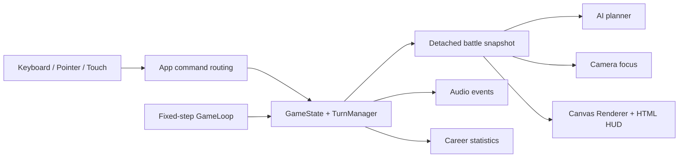
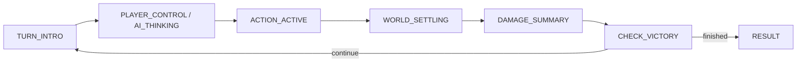
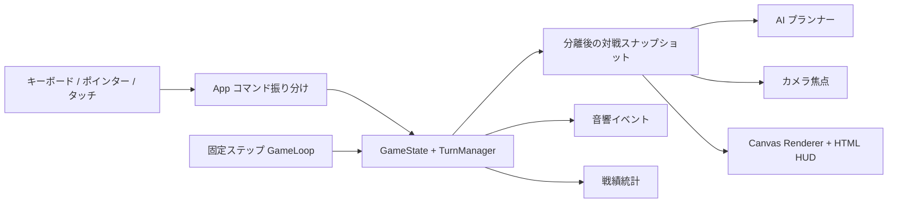
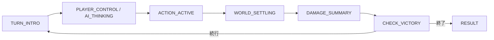
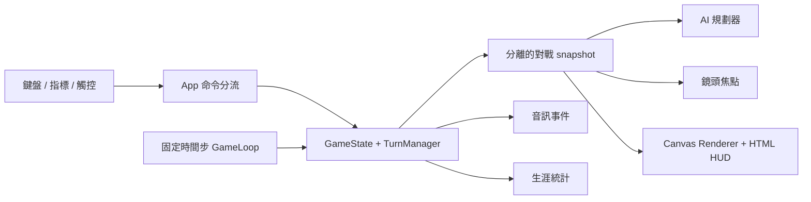
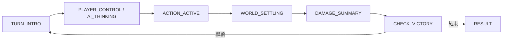

<a id="top"></a>

# 💥 Wormy Boom Squad · 蟲蟲轟轟隊 · ワーム・ボム隊

An offline, single-player, turn-based artillery game built with HTML5, CSS3, Vanilla JavaScript, and Canvas 2D.

## 🌈 Opening Summary

### 🇬🇧 English

Lead a three-worm squad across colorful destructible islands, read the wind, select the right weapon, and outplay a seeded AI team. Wormy Boom Squad runs directly from `index.html`, keeps its runtime dependency-free, and combines deterministic physics with responsive keyboard, pointer, and touch controls.

### 🇯🇵 日本語

3 匹のワーム部隊を指揮し、壊れるカラフルな島で風を読み、武器を選び、シード化された AI チームに勝利しましょう。Wormy Boom Squad は `index.html` から直接起動でき、実行時依存を持たず、再現可能な物理演算とキーボード、ポインター、タッチ操作を組み合わせています。

### 🇹🇼 繁體中文

帶領三隻蟲蟲組成的小隊，在色彩鮮明、可破壞的島嶼上判斷風向、選擇武器，與固定種子驅動的 AI 隊伍鬥智。Wormy Boom Squad 可直接由 `index.html` 啟動，執行時零依賴，並整合可重現的物理演算與鍵盤、指標、觸控操作。

[🇬🇧 English](#english) · [🇯🇵 日本語](#japanese) · [🇹🇼 繁體中文](#traditional-chinese)

## 🧭 Contents

- [🇬🇧 English](#english)
  - [🎮 Game Introduction](#english-game)
  - [🕹️ Gameplay and Controls](#english-gameplay)
  - [🚀 Quick Start](#english-start)
  - [🧠 Program Overview](#english-program)
  - [🗂️ Code Organization](#english-code)
  - [🧰 Supporting Systems](#english-systems)
  - [🧪 Testing](#english-testing)
  - [📌 Status and Limitations](#english-status)
- [🇯🇵 日本語](#japanese)
  - [🎮 ゲーム紹介](#japanese-game)
  - [🕹️ 遊び方と操作](#japanese-gameplay)
  - [🚀 クイックスタート](#japanese-start)
  - [🧠 プログラム概要](#japanese-program)
  - [🗂️ コード構成](#japanese-code)
  - [🧰 支援システム](#japanese-systems)
  - [🧪 テスト](#japanese-testing)
  - [📌 現状と制限](#japanese-status)
- [🇹🇼 繁體中文](#traditional-chinese)
  - [🎮 遊戲介紹](#traditional-chinese-game)
  - [🕹️ 玩法與操作](#traditional-chinese-gameplay)
  - [🚀 快速開始](#traditional-chinese-start)
  - [🧠 程式概觀](#traditional-chinese-program)
  - [🗂️ 程式碼分類](#traditional-chinese-code)
  - [🧰 支援系統](#traditional-chinese-systems)
  - [🧪 測試](#traditional-chinese-testing)
  - [📌 專案狀態與限制](#traditional-chinese-status)
- [🎵 Music Acknowledgement](#music-acknowledgement)
- [🎉 Closing Summary](#closing-summary)

<a id="english"></a>

## 🇬🇧 English

<a id="english-game"></a>

### 🎮 Game Introduction

Wormy Boom Squad is a cute 3-vs-3 artillery battle between the player's squad and an AI squad. Each living worm takes a turn moving, aiming, and performing one weapon action while wind, gravity, deformable terrain, water, explosions, and fall damage shape the battlefield.

Key features include:

- 🏝️ Three seeded map themes: Candy Island, Forest Picnic, and Ice Cream Tundra.
- 🤖 Easy, Normal, and Hard AI levels with progressively tighter aiming error and deeper candidate searches.
- 💣 Ten weapons: Bazooka, Grenade, Shotgun, Bat, Mine, Banana Bomb, Airstrike, Sheep Bomb, Holy Grenade, and Teleport.
- 🌋 Pixel-mask terrain that can be carved by explosions and can remove support beneath worms.
- 🎥 A bounded camera that follows projectiles, moving weapons, effects, impacts, and settling damage before returning to the next active worm.
- 🏆 A four-step tutorial, match results, rematch choices, and persistent career statistics.

<a id="english-gameplay"></a>

### 🕹️ Gameplay and Controls

Choose an AI difficulty, map theme, 20/30/45-second turn timer, team name, and team color. Eliminate all three enemy worms to win; if both teams are eliminated together, the match is a draw. After ten minutes, sudden death sets every survivor to 1 HP and raises the water by 18 world pixels after each completed turn.

The core loop is:

1. Read the wind and inspect the destructible terrain.
2. Move the active worm, choose one of ten weapons, and aim or select a legal target.
3. Fire, then watch the camera follow the complete attack through impact, terrain changes, falling, and damage summary.
4. Continue with the next living worm until one team remains or both teams are eliminated.

| Action | Keyboard | Pointer / touch |
| --- | --- | --- |
| Move | `A` / `D` or `←` / `→` | On-screen left/right controls |
| Jump / backflip | `W` / `S` | On-screen jump/backflip controls |
| Aim | `↑` / `↓` | Drag from the active worm or use aim controls |
| Charge and fire | Hold and release `Space` | Drag and release, or hold/release the fire control |
| Previous / next weapon | `Q` / `E` | Open the weapon grid and select an icon |
| Weapon grid | `R` | Backpack control |
| Targeted weapon | Select a legal point, then confirm it | Tap/click the legal point again to confirm |
| Camera | `F` returns to the worm | Middle/right drag to pan; wheel or pinch to zoom |
| Pause | `Esc` | Pause button |

The pause panel supports resume, restart, and quit. The result screen supports a same-map rematch, a new-map rematch, setup changes, or returning to the main menu. Career statistics track matches, wins, losses, draws, shots, damage, weapon uses, and the favorite weapon; there is no separate in-match score.

<a id="english-start"></a>

### 🚀 Quick Start

No installation or local server is required for play.

1. Download or clone the repository.
2. Open `Worms/index.html` in a current desktop or mobile browser.
3. Select **Start Battle**, configure the match, and launch.

To run the automated checks, install Node.js with npm and run:

```text
cd Worms
npm test
```

<a id="english-program"></a>

### 🧠 Program Overview

The game uses ordered classic scripts and a shared `window.WormsGame` namespace so the browser can load it directly from disk. Reusable modules also expose guarded CommonJS exports for the Node test suite. `App` coordinates screens and input, `GameLoop` advances the deterministic simulation at `1/120` second per step, `GameState` owns battle mutations, and detached snapshots feed the renderer, HUD, camera, and AI.





<a id="english-code"></a>

### 🗂️ Code Organization

| Path | Responsibility |
| --- | --- |
| `index.html` | Accessible screen structure, forms, battle HUD, dialogs, canvas elements, and ordered script loading |
| `css/` | Base tokens, screens, HUD, touch controls, responsive layouts, safe areas, and reduced-motion behavior |
| `js/core/` | Fixed-step loop, turn lifecycle, mutable battle state, damage, actions, and results |
| `js/physics/` + `js/terrain/` | Projectile and character physics, collision, fall damage, seeded map generation, and terrain carving |
| `js/weapons/` + `js/ai/` | Immutable weapon registry, ammo and targeting helpers, plus the seeded tactical planner |
| `js/render/` | Bounded camera, attack-focus policy, coordinate conversion, and Canvas 2D rendering |
| `js/input/` + `js/ui/` | Semantic input commands, screen orchestration, tutorial, HUD, dialogs, and responsive controls |
| `js/audio/` + `assets/` | Menu/battle/result BGM, procedural Web Audio effects, and local SVG weapon icons |
| `js/data/` + `js/storage/` | Three-language text, fallback handling, validated settings, and career statistics |
| `tests/` | Node tests for individual systems, browser compatibility, and integrated battle behavior |
| `spec.md` | Requirements map; implementation and tests remain the source of truth for shipped behavior |
| `.agents/skills/` | Project-local maintenance, README, browser-validation, and commit workflows |

<a id="english-systems"></a>

### 🧰 Supporting Systems

- **Localization:** Complete `zh-Hant`, `en`, and `ja` dictionaries with Traditional Chinese fallback and key-parity checks.
- **Persistence:** `wormy_boom_squad_save_v1` stores validated settings, the previous match setup, tutorial completion, and career statistics; it safely falls back to memory if storage fails.
- **Audio:** Local MP3 tracks cover menu, battle, and result screens. Procedural Web Audio produces interface, movement, weapon, explosion, and result effects. Playback unlocks after user interaction and pauses with page visibility.
- **Accessibility:** Semantic buttons and forms, keyboard navigation, visible focus, `aria-live` announcements, labelled canvas/tools, and a reduced-motion setting are built in.
- **Responsive behavior:** The UI supports a 320 CSS-pixel minimum width, safe-area insets, coarse-pointer touch controls in landscape, and a portrait rotation prompt during battle.
- **Performance and offline use:** Fixed-step simulation is separated from rendering; terrain uses a collision mask, and all runtime scripts, icons, and audio are local with no CDN or network fetch.

<a id="english-testing"></a>

### 🧪 Testing

Run `npm test` from `Worms/`. On 2026-08-06, all **46 tests passed**. Coverage includes deterministic AI, the classic browser bundle, attack-camera focus, game-state integration, i18n parity, fixed-step physics, safe storage recovery, source structure, generated and fallback terrain, turn and sudden-death rules, and all ten weapons.

<a id="english-status"></a>

### 📌 Status and Limitations

Version 1.0 is a complete local player-vs-AI experience. It has no online multiplayer, backend, account system, or active-match save; only preferences, previous setup, tutorial status, and career statistics persist. Browser autoplay rules may keep BGM silent until the first user interaction, and the audio manager intentionally treats unavailable BGM as non-fatal.

<a id="japanese"></a>

## 🇯🇵 日本語

<a id="japanese-game"></a>

### 🎮 ゲーム紹介

Wormy Boom Squad は、プレイヤーのワーム隊と AI 隊が戦う、かわいい3 対 3 の砲撃ゲームです。生存しているワームが順番に移動、照準、武器アクションを行い、風、重力、変形する地形、水、爆発、落下ダメージが戦場を変えます。

主な特徴：

- 🏝️ シードで再現できる 3 テーマ：キャンディ島、森のピクニック、アイス雪原。
- 🤖 照準誤差と候補探索量が段階的に変わる「かんたん」「ふつう」「むずかしい」AI。
- 💣 バズーカ、グレネード、ショットガン、バット、地雷、バナナボム、空爆、ひつじボム、ホーリーグレネード、テレポートの 10 武器。
- 🌋 爆発で削れ、ワームの足場も失われるピクセルマスク地形。
- 🎥 飛翔中の弾、移動武器、エフェクト、着弾点、ダメージ処理を追跡し、次のワームに戻る制限付きカメラ。
- 🏆 4 ステップのチュートリアル、対戦結果、再戦選択、永続的な戦績統計。

<a id="japanese-gameplay"></a>

### 🕹️ 遊び方と操作

AI 難易度、マップテーマ、20/30/45 秒のターン時間、チーム名、チーム色を選びます。敵の 3 匹をすべて倒せば勝利で、両チームが同時に全滅すると引き分けです。10 分後にサドンデスが始まると全生存者が 1 HP になり、ターン完了ごとに水位がワールド座標で 18 ピクセル上昇します。

基本ループ：

1. 風を読み、壊れる地形を確認する。
2. アクティブなワームを移動し、10 武器から選び、照準または有効な目標地点を指定する。
3. 発射後、着弾、地形変化、落下、ダメージ表示が終わるまでカメラで攻撃を見届ける。
4. どちらかのチームが残るか、両方が全滅するまで次の生存ワームで続ける。

| アクション | キーボード | ポインター / タッチ |
| --- | --- | --- |
| 移動 | `A` / `D` または `←` / `→` | 画面上の左右ボタン |
| ジャンプ / バックフリップ | `W` / `S` | 画面上のジャンプ / フリップボタン |
| 照準 | `↑` / `↓` | アクティブなワームからドラッグ、または照準ボタン |
| チャージと発射 | `Space` を押して離す | ドラッグして離す、または発射ボタンを押して離す |
| 前 / 次の武器 | `Q` / `E` | 武器グリッドを開いてアイコンを選択 |
| 武器グリッド | `R` | バックパックボタン |
| 地点指定武器 | 有効な地点を選び再確認 | 同じ有効地点を再度タップ / クリック |
| カメラ | `F` でワームに戻る | 中/右ドラッグで移動、ホイールまたはピンチで拡大縮小 |
| ポーズ | `Esc` | ポーズボタン |

ポーズ画面では再開、リスタート、対戦終了を選べます。結果画面から同じマップで再戦、新しいマップで再戦、設定変更、メインメニューへの復帰ができます。戦績には対戦数、勝敗、引き分け、射撃、ダメージ、武器使用数、お気に入り武器が記録され、対戦中の別スコアはありません。

<a id="japanese-start"></a>

### 🚀 クイックスタート

プレイにインストールやローカルサーバーは必要ありません。

1. リポジトリをダウンロードまたは clone する。
2. 現行のデスクトップまたはモバイルブラウザーで `Worms/index.html` を開く。
3. **対戦開始**を選び、条件を設定して開始する。

自動チェックには Node.js と npm を用意し、次を実行します。

```text
cd Worms
npm test
```

<a id="japanese-program"></a>

### 🧠 プログラム概要

ゲームは順序付きの従来型スクリプトと共通の `window.WormsGame` 名前空間を使い、ファイルから直接読み込みます。再利用可能なモジュールは Node テスト向けのガード付き CommonJS export も提供します。`App` が画面と入力を調停し、`GameLoop` が `1/120` 秒刻みで再現可能なシミュレーションを進め、`GameState` が対戦データを更新し、分離されたスナップショットを描画、HUD、カメラ、AI に渡します。





<a id="japanese-code"></a>

### 🗂️ コード構成

| パス | 役割 |
| --- | --- |
| `index.html` | アクセシブルな画面構造、フォーム、対戦 HUD、ダイアログ、Canvas、スクリプト読み込み順 |
| `css/` | 基本トークン、画面、HUD、タッチ操作、レスポンシブ配置、セーフエリア、動きの低減 |
| `js/core/` | 固定ステップループ、ターン進行、可変の対戦状態、ダメージ、アクション、結果 |
| `js/physics/` + `js/terrain/` | 弾丸とキャラクターの物理、衝突、落下ダメージ、シード地形、地形破壊 |
| `js/weapons/` + `js/ai/` | 不変の武器レジストリ、弾数とターゲット用ヘルパー、シード式戦術プランナー |
| `js/render/` | 制限付きカメラ、攻撃追跡ルール、座標変換、Canvas 2D 描画 |
| `js/input/` + `js/ui/` | 意味単位の入力コマンド、画面制御、チュートリアル、HUD、ダイアログ、レスポンシブ操作 |
| `js/audio/` + `assets/` | メニュー/対戦/結果 BGM、Web Audio 効果音、ローカル SVG 武器アイコン |
| `js/data/` + `js/storage/` | 3 言語テキスト、フォールバック、検証済み設定、戦績統計 |
| `tests/` | 個別システム、ブラウザー互換性、統合対戦動作の Node テスト |
| `spec.md` | 要件マップ。公開済み挙動は実装とテストを正とする |
| `.agents/skills/` | プロジェクト内のメンテナンス、README、ブラウザー検証、コミット手順 |

<a id="japanese-systems"></a>

### 🧰 支援システム

- **多言語化:** `zh-Hant`、`en`、`ja` の完全な辞書、繁体字中国語へのフォールバック、キー同一性チェックを備えます。
- **保存:** `wormy_boom_squad_save_v1` に検証済み設定、前回の対戦設定、チュートリアル完了、戦績を保存し、ストレージ失敗時はメモリーに安全に退避します。
- **音響:** ローカル MP3 をメニュー、対戦、結果に使い、Web Audio で UI、移動、武器、爆発、結果の効果音を生成します。ユーザー操作後に再生を解除し、ページ非表示時は一時停止します。
- **アクセシビリティ:** 意味的なボタンとフォーム、キーボード操作、見えるフォーカス、`aria-live`、ラベル付き Canvas/ツール、動きを抑える設定を含みます。
- **レスポンシブ:** 最小 320 CSS ピクセル幅、セーフエリア、横向きの粗いポインター向け操作、対戦中の縦向き回転案内に対応します。
- **パフォーマンスとオフライン:** 固定ステップ演算と描画を分離し、地形衝突マスクを使います。スクリプト、アイコン、音声はすべてローカルで、CDN やネットワーク取得はありません。

<a id="japanese-testing"></a>

### 🧪 テスト

`Worms/` で `npm test` を実行します。2026-08-06 時点で **46 テストすべて合格**しました。再現可能な AI、従来型ブラウザーバンドル、攻撃カメラ、GameState 統合、翻訳キー同一性、固定ステップ物理、安全な保存復旧、ソース構成、生成/代替地形、ターンとサドンデス規則、10 武器を検証します。

<a id="japanese-status"></a>

### 📌 現状と制限

Version 1.0 はローカルで完結するプレイヤー対 AI 体験です。オンライン対戦、バックエンド、アカウント、進行中の対戦保存はありません。保存されるのは設定、前回の対戦条件、チュートリアル状態、戦績です。ブラウザーの自動再生制限により最初の操作まで BGM が無音の場合があり、BGM が使えなくてもゲームは継続します。

<a id="traditional-chinese"></a>

## 🇹🇼 繁體中文

<a id="traditional-chinese-game"></a>

### 🎮 遊戲介紹

Wormy Boom Squad 是一款可愛風格的 3 對 3 回合制砲術對戰遊戲，由玩家小隊對抗 AI 小隊。每隻存活的蟲蟲會依序移動、瞄準並執行一次武器行動，風力、重力、可變形地形、水面、爆炸與墜落傷害會持續改變戰場。

核心特色包含：

- 🏝️ 三種可依種子重現的地圖主題：糖果島、森林野餐與冰淇淋雪原。
- 🤖 簡單、普通、困難三種 AI，難度越高瞄準誤差越小、搜尋的候選解越多。
- 💣 十種武器：火箭筒、手榴彈、霰彈槍、棒球棍、地雷、香蕉炸彈、空襲、綿羊炸彈、神聖手榴彈與瞬間移動。
- 🌋 能被爆炸削除、也會讓蟲蟲失去支撐的像素遮罩地形。
- 🎥 有邊界的鏡頭會追蹤飛行物、移動武器、特效、衝擊點與傷害結算，之後才回到下一隻行動蟲蟲。
- 🏆 四階段新手教學、對戰結果、重賽選項與持久化的生涯統計。

<a id="traditional-chinese-gameplay"></a>

### 🕹️ 玩法與操作

玩家可選擇 AI 難度、地圖主題、20/30/45 秒回合時間、隊名與隊伍顏色。擊敗全部三隻敵方蟲蟲即獲勝；若雙方同時全灭則為平手。對戰進行十分鐘後會進入驟死戰，所有存活者變為 1 HP，且每完成一個回合，水面就會上升 18 個世界像素。

核心循環為：

1. 判斷風力，觀察可破壞的地形。
2. 移動當前蟲蟲，從十種武器中做出選擇，進行瞄準或選取合法目標。
3. 發射後由鏡頭追蹤完整攻擊，直到衝擊、地形變化、墜落與傷害總結全數完成。
4. 由下一隻存活蟲蟲繼續，直到只剩一隊，或雙方同時全灭。

| 行動 | 鍵盤 | 指標 / 觸控 |
| --- | --- | --- |
| 移動 | `A` / `D` 或 `←` / `→` | 畫面上的左右控制鍵 |
| 跳躍 / 後空翻 | `W` / `S` | 畫面上的跳躍／後空翻控制鍵 |
| 瞄準 | `↑` / `↓` | 從當前蟲蟲拖曳，或使用瞄準控制鍵 |
| 蓄力與發射 | 按住後放開 `Space` | 拖曳後放開，或按住後放開發射鍵 |
| 上一個 / 下一個武器 | `Q` / `E` | 開啟武器網格後點選圖示 |
| 武器網格 | `R` | 背包控制鍵 |
| 指定目標武器 | 選擇合法位置後再次確認 | 再次點擊／點選同一個合法位置 |
| 鏡頭 | `F` 回到蟲蟲 | 中／右鍵拖曳平移，滾輪或雙指縮放 |
| 暫停 | `Esc` | 暫停按鈕 |

暫停面板提供繼續、重新開始與退出對戰；結果畫面則可選擇同地圖重賽、新地圖重賽、返回對戰設定或主選單。生涯統計會記錄對戰數、勝敗、平手、發射、傷害、武器使用數與最愛武器；對戰中沒有獨立分數。

<a id="traditional-chinese-start"></a>

### 🚀 快速開始

遊玩不需安裝依賴，也不需本機伺服器。

1. 下載或 clone 這個儲存庫。
2. 使用現代桌面或行動瀏覽器開啟 `Worms/index.html`。
3. 點選**開始對戰**，完成對戰設定後出發。

若要執行自動化檢查，請安裝 Node.js 與 npm，並執行：

```text
cd Worms
npm test
```

<a id="traditional-chinese-program"></a>

### 🧠 程式概觀

遊戲使用依序載入的傳統 script 與共用 `window.WormsGame` 命名空間，因此可直接由磁碟啟動。可重用模組同時保留受保護的 CommonJS export，供 Node 測試使用。`App` 協調畫面與輸入，`GameLoop` 以每步 `1/120` 秒推進可重現模擬，`GameState` 負責對戰變更，再將分離的 snapshot 交給繪圖器、HUD、鏡頭與 AI。





<a id="traditional-chinese-code"></a>

### 🗂️ 程式碼分類

| 路徑 | 職責 |
| --- | --- |
| `index.html` | 無障礙畫面結構、表單、戰鬥 HUD、對話框、Canvas 與 script 載入順序 |
| `css/` | 基礎設計變數、畫面、HUD、觸控、響應式佈局、安全區域與降低動態效果 |
| `js/core/` | 固定時間步循環、回合進程、可變對戰狀態、傷害、行動與結果 |
| `js/physics/` + `js/terrain/` | 飛行物與角色物理、碰撞、墜落傷害、種子地圖與地形挖除 |
| `js/weapons/` + `js/ai/` | 不可變武器注冊表、彈藥與選點輔助，以及種子驅動的戰術規劃器 |
| `js/render/` | 有邊界鏡頭、攻擊追蹤策略、座標轉換與 Canvas 2D 繪圖 |
| `js/input/` + `js/ui/` | 語意化輸入命令、畫面協調、教學、HUD、對話框與響應式控制 |
| `js/audio/` + `assets/` | 主選單／對戰／結果 BGM、Web Audio 程序生成音效與本地 SVG 武器圖示 |
| `js/data/` + `js/storage/` | 三語文字、後備處理、驗證後的設定與生涯統計 |
| `tests/` | 針對各系統、瀏覽器相容性與整合對戰行為的 Node 測試 |
| `spec.md` | 需求地圖；已發佈行為以實作與測試為事實來源 |
| `.agents/skills/` | 專案內建的維護、README、瀏覽器驗證與 commit 流程 |

<a id="traditional-chinese-systems"></a>

### 🧰 支援系統

- **多語系統：** 完整的 `zh-Hant`、`en`、`ja` 字典，具備繁體中文後備文字與鍵值一致性檢查。
- **持久化：** `wormy_boom_squad_save_v1` 會儲存驗證後的設定、上次對戰設定、教學完成狀態與生涯統計；儲存失敗時會安全退回記憶體模式。
- **音訊：** 主選單、對戰、結果使用本地 MP3，介面、移動、武器、爆炸與結果音效由 Web Audio 程序產生。第一次使用者互動後解鎖音訊，頁面隱藏時暫停。
- **無障礙：** 語意化按鈕與表單、鍵盤導覽、明顯焦點、`aria-live` 播報、有標示的 Canvas／工具，以及降低動態效果設定。
- **響應式介面：** 支援最小 320 CSS 像素寬度、安全區域、橫向粗略指標觸控，以及對戰中的直向旋轉提示。
- **效能與離線執行：** 固定時間步模擬與繪圖彼此分離，地形使用碰撞遮罩；所有 script、圖示與音訊都在本地，不使用 CDN 或網路擷取。

<a id="traditional-chinese-testing"></a>

### 🧪 測試

請在 `Worms/` 執行 `npm test`。截至 2026-08-06，**46 項測試全數通過**。涵蓋可重現 AI、傳統瀏覽器 script 組合、攻擊鏡頭、GameState 整合、翻譯鍵值一致性、固定時間步物理、安全儲存復原、原始碼結構、生成／後備地形、回合與驟死戰規則，以及全部十種武器。

<a id="traditional-chinese-status"></a>

### 📌 專案狀態與限制

Version 1.0 是完整的本地玩家對 AI 體驗。目前沒有線上多人、後端、帳號系統或進行中對戰存檔；只會保留偏好設定、上次對戰設定、教學狀態與生涯統計。由於瀏覽器自動播放限制，BGM 可能要到第一次使用者互動後才會播放；若 BGM 無法載入，遊戲仍會正常進行。

<a id="music-acknowledgement"></a>

## 🎵 Music Acknowledgement · 音楽の謝辞 · 音樂致謝

### 🇬🇧 English

Special thanks to **Suno** for the BGM that accompanies the menu, battle, and result scenes and gives the squad's adventure its musical energy.

### 🇯🇵 日本語

メニュー、対戦、結果シーンを彩り、ワーム隊の冒険に音楽のエネルギーを与えてくれた BGM について、**Suno** に心から感謝します。

### 🇹🇼 繁體中文

特別感謝 **Suno** 為主選單、對戰與結果畫面提供 BGM，讓蟲蟲小隊的冒險更有音樂活力。

<a id="closing-summary"></a>

## 🎉 Closing Summary

### 🇬🇧 English

Open the game, learn the wind, protect your squad, and enjoy every carefully tracked boom—with sincere appreciation to Suno for helping the battlefield sing.

### 🇯🇵 日本語

ゲームを開き、風を学び、仲間を守り、最後まで追跡される爆発を楽しんでください。戦場を音楽で彩ってくれた Suno に、改めて感謝します。

### 🇹🇼 繁體中文

開啟遊戲、學會觀風、保護小隊，並享受每一場被完整追蹤的轟炸。最後再次誠摯感謝 Suno，讓這個戰場擁有專屬的音樂生命。

[⬆️ Back to top](#top)
