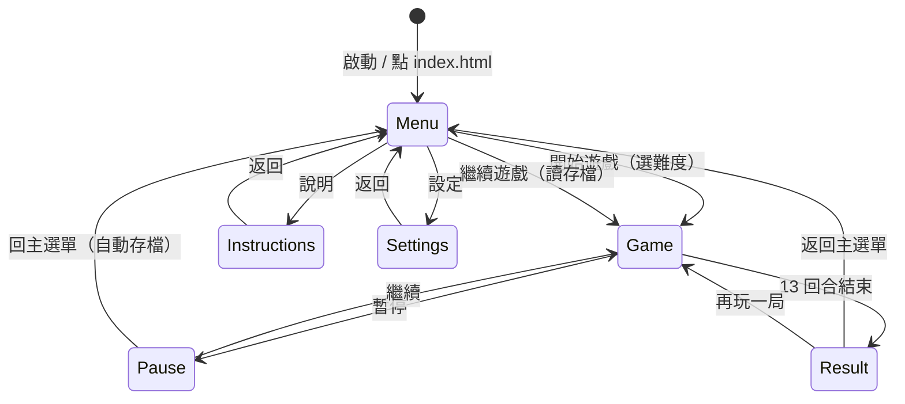

# 快艇骰子 Yahtzee 遊戲規格書

> 純前端、零建置、可離線執行的 Yahtzee（快艇骰子）單機遊戲。
> 玩家 vs AI（簡單 / 普通 / 困難），支援多國語系、多主題配色、豐富音效與完整 RWD。

---

## 目錄

1. [專案概述](#1-專案概述)
2. [需求對照總表](#2-需求對照總表)
3. [檔案與資料夾架構](#3-檔案與資料夾架構)
4. [index.html 載入策略（零建置關鍵）](#4-indexhtml-載入策略零建置關鍵)
5. [遊戲規則規格](#5-遊戲規則規格)
6. [畫面流程與狀態機](#6-畫面流程與狀態機)
7. [主選單規格](#7-主選單規格)
8. [遊戲畫面規格](#8-遊戲畫面規格)
9. [AI 規格（三難度）](#9-ai-規格三難度)
10. [多國語系規格 i18n](#10-多國語系規格-i18n)
11. [視覺設計規格（字體、配色、對比）](#11-視覺設計規格字體配色對比)
12. [RWD 響應式規格](#12-rwd-響應式規格)
13. [音訊規格（BGM／音效／5 倍音量／跨畫面持續播放）](#13-音訊規格bgm音效5-倍音量跨畫面持續播放)
14. [說明頁面規格](#14-說明頁面規格)
15. [設定頁面規格](#15-設定頁面規格)
16. [存檔規格（繼續遊戲）](#16-存檔規格繼續遊戲)
17. [開發里程碑](#17-開發里程碑)
18. [附錄：素材清單與命名規範](#18-附錄素材清單與命名規範)

---

## 1. 專案概述

| 項目 | 內容 |
|---|---|
| 遊戲名稱 | 快艇骰子 Yahtzee |
| 類型 | 回合制骰子計分遊戲（單機） |
| 對戰模式 | 玩家 vs AI（簡單／普通／困難） |
| 執行方式 | 直接以瀏覽器開啟 `index.html`，**不需任何 build 或 server** |
| 目標平台 | 桌面瀏覽器 + 行動裝置瀏覽器（手機 / 平板） |
| 核心技術 | 原生 HTML5 + CSS3 + Vanilla JavaScript（無框架、無打包工具） |
| 資料儲存 | `localStorage`（用於「繼續遊戲」與設定保存） |
| 支援語系 | 繁體中文、English、日本語 |

### 設計目標

- **零門檻執行**：使用者雙擊 `index.html` 即可遊玩，毋須安裝 Node、毋須開 server。
- **行動優先**：手機直向操作流暢，按鍵不遮擋遊戲畫面。
- **高可讀性**：大字體、高對比配色，絕不出現「看不見的文字／元件」。
- **沉浸感**：多樣 BGM 與音效，切換畫面時音樂不中斷。

---

## 2. 需求對照總表

下表將你提出的 13 項需求逐一對應到本文件章節，方便驗收追蹤。

| # | 需求摘要 | 對應章節 | 關鍵做法 |
|---|---|---|---|
| 1 | 純前端，點 index.html 即可玩，免 build／server | §4 | 使用 classic `<script>`／`<link>` 標籤 + 命名空間模式，**不使用 ES Module `import`**（避免 file:// 的 CORS 限制） |
| 2 | RWD 做好，手機與網頁皆順暢 | §12 | Mobile-first、斷點設計、橫直向佈局切換 |
| 3 | 字體一律大且明確、可選多種配色 | §11 | 全域大字級系統 + 主題切換（CSS 變數） |
| 4 | CSS／JS 分類到各資料夾，index 用引入方式 | §3、§4 | `css/` 與 `js/` 多層分類，index 透過多個 link／script 引入 |
| 5 | 主畫面有開始／繼續／說明／設定 | §7 | 主選單四大按鈕，繼續鍵依存檔狀態啟用 |
| 6 | 豐富音樂音效，切畫面時 BGM 持續播放 | §13 | App 級單例 AudioManager，跨畫面共用、交叉淡入 |
| 7 | 遊戲中 BGM 音量放大為原來 5 倍 | §13 | Web Audio API `GainNode.gain = 5.0` |
| 8 | RWD 行動按鍵不要擋到遊戲畫面 | §8、§12 | 安全區（safe-area）佈局、底部固定操作列、內容避讓 |
| 9 | 多國語系（日／英／中） | §10 | 語系 JSON 表 + `data-i18n` 綁定 + 即時切換 |
| 10 | 說明頁乾淨、富圖示、好閱讀 | §14 | 卡片式分區 + Emoji／SVG 圖示 + 範例骰面 |
| 11 | 畫面豐富有趣、配色優化、無看不見情況 | §11 | 對比度 ≥ WCAG AA、主題色彩驗證 |
| 12 | 設定排版乾淨、按鍵與調音選項好看 | §15 | 分組卡片 + 自訂滑桿與開關元件 |
| 13 | 玩家 vs AI，分簡單／普通／困難 | §9 | 三套 AI 決策策略 |

---

## 3. 檔案與資料夾架構

```text
yahtzee/
├── index.html                  # 唯一入口；以 link/script 引入所有資源
│
├── css/
│   ├── base/
│   │   ├── reset.css           # 瀏覽器樣式重置
│   │   ├── variables.css       # 全域 CSS 變數（字級、間距、預設色）
│   │   └── typography.css      # 大字體系統（標題／內文／數字字級）
│   ├── layout/
│   │   ├── app.css             # 整體版面與畫面切換容器
│   │   ├── main-menu.css       # 主選單版面
│   │   ├── game.css            # 遊戲畫面版面
│   │   ├── instructions.css    # 說明頁版面
│   │   └── settings.css        # 設定頁版面
│   ├── components/
│   │   ├── buttons.css         # 通用按鈕（含大尺寸點擊區）
│   │   ├── dice.css            # 骰子外觀與動畫
│   │   ├── scorecard.css       # 計分表
│   │   ├── modal.css           # 彈窗／對話框
│   │   ├── slider.css          # 音量滑桿
│   │   └── toggle.css          # 開關按鈕
│   ├── themes/
│   │   ├── theme-ocean.css     # 海洋藍主題
│   │   ├── theme-sunset.css    # 夕陽橘主題
│   │   ├── theme-forest.css    # 森林綠主題
│   │   ├── theme-grape.css     # 葡萄紫主題
│   │   └── theme-dark.css      # 暗黑高對比主題
│   └── responsive/
│       └── responsive.css      # 斷點與行動裝置調整
│
├── js/
│   ├── core/
│   │   ├── constants.js        # 常數（分類鍵、骰子數、回合數…）
│   │   ├── dice.js             # 骰子模型與擲骰邏輯
│   │   ├── scoring.js          # 13 個計分項與獎勵計算
│   │   ├── game-engine.js      # 回合流程／勝負判定
│   │   └── state-manager.js    # 全域遊戲狀態（單例）
│   ├── ai/
│   │   ├── ai-base.js          # AI 共用介面
│   │   ├── ai-easy.js          # 簡單：隨機／貪婪
│   │   ├── ai-normal.js        # 普通：期望值評估
│   │   └── ai-hard.js          # 困難：含上段獎勵與 Yahtzee 規劃
│   ├── ui/
│   │   ├── screen-manager.js   # 畫面切換控制器（含 BGM 通知）
│   │   ├── main-menu.js        # 主選單互動
│   │   ├── game-ui.js          # 遊戲畫面渲染與互動
│   │   ├── instructions-ui.js  # 說明頁渲染
│   │   ├── settings-ui.js      # 設定頁渲染
│   │   └── effects.js          # 過場、骰子滾動等視覺特效
│   ├── audio/
│   │   ├── audio-manager.js    # 音訊單例：BGM、SFX、GainNode（5x）
│   │   └── audio-assets.js     # 音檔清單對照表
│   ├── i18n/
│   │   ├── i18n.js             # 語系載入、切換、套用
│   │   ├── lang-zh.js          # 繁中字串
│   │   ├── lang-en.js          # 英文字串
│   │   └── lang-ja.js          # 日文字串
│   ├── storage/
│   │   └── save-manager.js     # localStorage 存讀檔
│   └── main.js                 # 啟動入口：初始化各模組、綁定事件
│
├── assets/
│   ├── audio/
│   │   ├── bgm/                # 背景音樂（主選單、遊戲、勝利…）
│   │   └── sfx/                # 音效（擲骰、選格、得分…）
│   ├── images/
│   │   ├── dice/               # 骰面圖（或以 CSS 繪製，二擇一）
│   │   ├── icons/              # 說明頁／設定頁 SVG 圖示
│   │   └── bg/                 # 背景圖
│   └── fonts/                  # 自帶字型（確保離線可用）
│
└── README.md                   # 執行說明
```

### 分類原則

- **CSS 四層**：`base`（基礎）→ `layout`（版面）→ `components`（元件）→ `themes`/`responsive`（主題與響應）。
- **JS 依職責分模組**：`core`（規則）、`ai`（電腦）、`ui`（畫面）、`audio`、`i18n`、`storage`，最後由 `main.js` 串接。
- 每個 JS 檔只負責單一職責，方便維護與除錯。

---

## 4. index.html 載入策略（零建置關鍵）

> ⚠️ **重點**：需求 1 要求「直接點 index.html 就能玩、免 server」。
> 若使用 ES Module（`<script type="module">` + `import`），瀏覽器在 `file://` 協定下會因 CORS 政策**拒絕載入模組**，導致雙擊開檔失敗。
> 因此本專案**一律使用 classic script 標籤**，並以「全域命名空間」整合各檔案。

### 4.1 引入順序（載入有相依性，順序不可亂）

```html
<!doctype html>
<html lang="zh-Hant">
<head>
  <meta charset="utf-8" />
  <meta name="viewport"
        content="width=device-width, initial-scale=1, viewport-fit=cover" />
  <title>快艇骰子 Yahtzee</title>

  <!-- ① 基礎樣式 -->
  <link rel="stylesheet" href="css/base/reset.css" />
  <link rel="stylesheet" href="css/base/variables.css" />
  <link rel="stylesheet" href="css/base/typography.css" />

  <!-- ② 版面 -->
  <link rel="stylesheet" href="css/layout/app.css" />
  <link rel="stylesheet" href="css/layout/main-menu.css" />
  <link rel="stylesheet" href="css/layout/game.css" />
  <link rel="stylesheet" href="css/layout/instructions.css" />
  <link rel="stylesheet" href="css/layout/settings.css" />

  <!-- ③ 元件 -->
  <link rel="stylesheet" href="css/components/buttons.css" />
  <link rel="stylesheet" href="css/components/dice.css" />
  <link rel="stylesheet" href="css/components/scorecard.css" />
  <link rel="stylesheet" href="css/components/modal.css" />
  <link rel="stylesheet" href="css/components/slider.css" />
  <link rel="stylesheet" href="css/components/toggle.css" />

  <!-- ④ 主題（預設載入，之後由 JS 切換 body class） -->
  <link rel="stylesheet" href="css/themes/theme-ocean.css" />
  <link rel="stylesheet" href="css/themes/theme-sunset.css" />
  <link rel="stylesheet" href="css/themes/theme-forest.css" />
  <link rel="stylesheet" href="css/themes/theme-grape.css" />
  <link rel="stylesheet" href="css/themes/theme-dark.css" />

  <!-- ⑤ 響應式（最後載入，覆寫桌面樣式） -->
  <link rel="stylesheet" href="css/responsive/responsive.css" />
</head>
<body class="theme-ocean">

  <!-- 各畫面以 section 形式存在，由 screen-manager 控制顯示/隱藏 -->
  <main id="app">
    <section id="screen-menu"          class="screen is-active">…</section>
    <section id="screen-game"          class="screen">…</section>
    <section id="screen-instructions"  class="screen">…</section>
    <section id="screen-settings"      class="screen">…</section>
  </main>

  <!-- ⑥ JS：先載入底層，再載入上層，最後 main.js 啟動 -->
  <script src="js/core/constants.js"></script>
  <script src="js/i18n/lang-zh.js"></script>
  <script src="js/i18n/lang-en.js"></script>
  <script src="js/i18n/lang-ja.js"></script>
  <script src="js/i18n/i18n.js"></script>

  <script src="js/core/dice.js"></script>
  <script src="js/core/scoring.js"></script>
  <script src="js/core/state-manager.js"></script>
  <script src="js/core/game-engine.js"></script>

  <script src="js/ai/ai-base.js"></script>
  <script src="js/ai/ai-easy.js"></script>
  <script src="js/ai/ai-normal.js"></script>
  <script src="js/ai/ai-hard.js"></script>

  <script src="js/audio/audio-assets.js"></script>
  <script src="js/audio/audio-manager.js"></script>

  <script src="js/storage/save-manager.js"></script>

  <script src="js/ui/effects.js"></script>
  <script src="js/ui/screen-manager.js"></script>
  <script src="js/ui/main-menu.js"></script>
  <script src="js/ui/game-ui.js"></script>
  <script src="js/ui/instructions-ui.js"></script>
  <script src="js/ui/settings-ui.js"></script>

  <script src="js/main.js"></script>
</body>
</html>
```

### 4.2 命名空間模式（取代 import／export）

每個 JS 檔案掛載到單一全域物件 `YZ`（Yahtzee 縮寫），避免污染與名稱衝突：

```js
// js/core/dice.js
window.YZ = window.YZ || {};
YZ.Dice = (function () {
  function roll() { return Math.floor(Math.random() * 6) + 1; }
  function rollSet(count) { return Array.from({length: count}, roll); }
  return { roll, rollSet };
})();
```

```js
// js/main.js — 啟動時所有模組都已存在於 YZ 命名空間
document.addEventListener('DOMContentLoaded', () => {
  YZ.I18n.init();          // 套用語系
  YZ.Audio.init();         // 初始化音訊（待使用者互動後 resume）
  YZ.Settings.load();      // 載入設定（主題、音量、難度、語系）
  YZ.ScreenManager.init(); // 顯示主選單
});
```

> ✅ 結論：以「classic script + 命名空間」即可在 `file://` 直接執行，完全符合需求 1 與需求 4。

---

## 5. 遊戲規則規格

### 5.1 基本流程

- 使用 **5 顆骰子**，共進行 **13 個回合**（對應 13 個計分項）。
- 每回合玩家最多擲骰 **3 次**：
  1. 第一次擲全部 5 顆。
  2. 之後兩次可自由選擇要保留／重擲哪些骰子。
  3. 三次內可隨時提前結算。
- 回合結束時必須選擇一個**尚未使用**的計分項填入分數（即使是 0 分也要選一格）。
- 13 個項目全部填滿後，**總分高者獲勝**。

### 5.2 計分項與規則

#### 上段（Upper Section）

| 項目 | i18n key | 計分規則 |
|---|---|---|
| 一點 Ones | `score.ones` | 所有「1」的點數總和 |
| 二點 Twos | `score.twos` | 所有「2」的點數總和 |
| 三點 Threes | `score.threes` | 所有「3」的點數總和 |
| 四點 Fours | `score.fours` | 所有「4」的點數總和 |
| 五點 Fives | `score.fives` | 所有「5」的點數總和 |
| 六點 Sixes | `score.sixes` | 所有「6」的點數總和 |

> **上段獎勵（Upper Bonus）**：若上段六項合計 **≥ 63 分**，額外加 **35 分**。

#### 下段（Lower Section）

| 項目 | i18n key | 條件 | 得分 |
|---|---|---|---|
| 三條 Three of a Kind | `score.threeKind` | 至少 3 顆相同 | 五顆骰子總和 |
| 四條 Four of a Kind | `score.fourKind` | 至少 4 顆相同 | 五顆骰子總和 |
| 葫蘆 Full House | `score.fullHouse` | 3 顆相同 + 2 顆相同 | 固定 25 分 |
| 小順 Small Straight | `score.smallStraight` | 4 顆連續（如 1-2-3-4） | 固定 30 分 |
| 大順 Large Straight | `score.largeStraight` | 5 顆連續（1-5 或 2-6） | 固定 40 分 |
| 快艇 Yahtzee | `score.yahtzee` | 5 顆全相同 | 固定 50 分 |
| 機會 Chance | `score.chance` | 無條件 | 五顆骰子總和 |

#### 快艇獎勵（Yahtzee Bonus）

- 已在 `Yahtzee` 格填入 50 分後，若再次擲出 5 顆相同，**每次額外加 100 分**。
- 此時該回合須將分數填入其他合適格（依「百搭規則」可填其他項）。

### 5.3 計分資料結構

```js
// state-manager.js 內保存的計分狀態
const scoreState = {
  player: {
    ones: null, twos: null, threes: null, fours: null, fives: null, sixes: null,
    threeKind: null, fourKind: null, fullHouse: null,
    smallStraight: null, largeStraight: null, yahtzee: null, chance: null,
    yahtzeeBonus: 0,
  },
  ai: { /* 同上結構 */ },
};
// null 代表尚未填寫；填寫後存入該項實得分數（可為 0）
```

### 5.4 總分計算

```text
上段小計 = ones + ... + sixes
上段獎勵 = (上段小計 >= 63) ? 35 : 0
下段小計 = threeKind + ... + chance
總分    = 上段小計 + 上段獎勵 + 下段小計 + yahtzeeBonus
```

---

## 6. 畫面流程與狀態機

### 6.1 畫面狀態圖



### 6.2 畫面切換規則

- 所有畫面皆為 DOM 中的 `<section class="screen">`，透過切換 `is-active` class 顯示／隱藏（**不重新載入頁面**）。
- `ScreenManager.show(screenId)` 為唯一切換入口,並在切換時通知 `AudioManager` 該播放哪一首 BGM(見 §13)。
- 離開遊戲畫面（回主選單／暫停回選單）時，自動呼叫 `SaveManager.save()`。

---

## 7. 主選單規格

### 7.1 版面

```text
┌─────────────────────────────┐
│        🎲 快艇骰子           │   ← 大標題 + Logo
│      （遊戲副標／版本）        │
│                             │
│      ▶  開始遊戲             │   ← 主按鈕（大）
│      ⏵  繼續遊戲             │   ← 有存檔才可點，否則灰階禁用
│      📖 說明                 │
│      ⚙  設定                 │
│                             │
│   🌐 語言   🎨 主題（快捷）   │   ← 右下角快捷切換（可選）
└─────────────────────────────┘
```

### 7.2 功能定義

| 按鈕 | 行為 | 狀態邏輯 |
|---|---|---|
| 開始遊戲 | 彈出「選擇難度」對話框（簡單／普通／困難）→ 建立新局 → 進入遊戲畫面 | 開始新局前若已有存檔，提示「將覆蓋進度」 |
| 繼續遊戲 | 讀取 `localStorage` 存檔 → 還原至上次回合 → 進入遊戲畫面 | **無存檔時禁用**（按鈕灰階 + `disabled`） |
| 說明 | 進入說明頁面 | 隨時可用 |
| 設定 | 進入設定頁面 | 隨時可用 |

### 7.3 繼續鍵狀態判定

```js
// main-menu.js
const hasSave = YZ.Save.exists();           // 檢查 localStorage
continueBtn.disabled = !hasSave;
continueBtn.classList.toggle('is-disabled', !hasSave);
```

---

## 8. 遊戲畫面規格

### 8.1 版面分區（桌面）

```text
┌───────────────────────────────────────────────┐
│  ⏸暫停   玩家 120 分  ·  AI 95 分   第 7/13 回合 │ ← 頂部資訊列
├──────────────────────────┬────────────────────┤
│                          │   計分表             │
│        🎲🎲🎲🎲🎲          │   一點 …  ✔        │
│      （可點擊保留骰子）     │   二點 …            │
│                          │   葫蘆 …            │
│   〔  擲骰 (剩 2 次)  〕   │   ...               │
│                          │   （點空格填分）      │
└──────────────────────────┴────────────────────┘
```

### 8.2 版面分區（手機，直向）

```text
┌─────────────────────┐
│ ⏸  玩家120 AI95  7/13│ ← 精簡資訊列（固定頂部）
├─────────────────────┤
│                     │
│   計分表（可捲動）     │ ← 主要內容區
│   ...               │
│                     │
├─────────────────────┤
│   🎲🎲🎲🎲🎲          │ ← 骰子區
│                     │
│ 〔 擲骰 (剩 2 次) 〕  │ ← 底部固定操作列（safe-area）
└─────────────────────┘
```

> **需求 8（行動按鍵不擋畫面）做法**：
> - 底部操作列使用 `position: sticky` / `fixed`，並以 `env(safe-area-inset-bottom)` 留白避開瀏覽器列與瀏海。
> - 主內容容器加上 `padding-bottom`，高度等於操作列高度，**確保最後一列計分項不被遮住**、可完整捲動到底。
> - 暫停鍵置於頂部資訊列，不浮在內容上方。

### 8.3 骰子互動

| 動作 | 行為 | 對應音效 |
|---|---|---|
| 點擊「擲骰」 | 未保留的骰子滾動動畫 → 顯示新點數；剩餘次數 −1 | `sfx.diceRoll` |
| 點擊單顆骰子 | 切換「保留／不保留」狀態（保留有明顯外框與圖示） | `sfx.diceHold` |
| 擲骰次數用盡或主動結算 | 鎖定骰子，等待玩家選計分格 | — |
| 點擊計分格 | 即時預覽該格可得分數（hover/長按）→ 確認填入 | `sfx.scoreSelect` |
| 填分完成 | 切換到 AI 回合 | `sfx.turnEnd` |

### 8.4 計分表即時預覽

- 骰子鎖定後，計分表中**所有尚未使用的格子**顯示「若選此格可得幾分」的淡色預覽數字。
- 已使用的格子顯示實得分數並標記 ✔，不可再點。
- 最佳選項可用高亮提示（可在設定中關閉，避免影響高手體驗）。

### 8.5 AI 回合呈現

- 進入 AI 回合時，畫面上方顯示「🤖 AI 思考中…」。
- AI 的擲骰與選格以動畫呈現（速度可在設定調整），讓玩家看得到過程。
- AI 完成後自動回到玩家回合。

---

## 9. AI 規格（三難度）

所有 AI 共用介面 `YZ.AI.decide(diceState, scoreState, rollsLeft)`，回傳：
- `keep`: 要保留的骰子索引陣列（用於下一次擲骰）
- `category`: 最終要填入的計分項（次數用盡時）

### 9.1 簡單（Easy）

- **保留策略**：偏隨機 — 隨機保留 0~2 顆相同點數的骰子。
- **選格策略**：貪婪 — 從尚未使用的格子中，選**當下立即得分最高**者，不考慮未來。
- 不規劃上段獎勵、不保留 Yahtzee 機會。
- 約 30% 機率做出明顯次佳選擇，營造「容易擊敗」的手感。

### 9.2 普通（Normal）

- **保留策略**：依目前骰面選擇最有潛力的組合（例如已有 3 顆相同 → 保留追四條／Yahtzee）。
- **選格策略**：以**期望值**評估每個可填格的長期價值，而非只看當下分數。
- 會基本考慮上段（盡量湊滿 63 拿獎勵）。
- 不做深度模擬，決策快速。

### 9.3 困難（Hard）

- **保留策略**：對每種「保留組合」估算下一次擲骰後的期望得分（可用機率表或蒙地卡羅取樣），挑期望值最高者。
- **選格策略**：
  - 綜合考量「上段獎勵 35 分」的達成進度，必要時犧牲短期分數佈局。
  - 主動保留 Yahtzee 機會以爭取 50 分與後續 100 分獎勵。
  - 在中後期會避免浪費高價值格（如把好骰面填進 Chance）。
- 決策最接近最佳策略，提供高挑戰性。

### 9.4 難度設定

- 難度於「開始遊戲」時選擇，並寫入存檔；繼續遊戲時沿用。
- 設定頁可設定「預設難度」（下次開新局的預設值）。

---

## 10. 多國語系規格 i18n

### 10.1 支援語系

| 語系 | 代碼 | 檔案 |
|---|---|---|
| 繁體中文 | `zh` | `js/i18n/lang-zh.js` |
| English | `en` | `js/i18n/lang-en.js` |
| 日本語 | `ja` | `js/i18n/lang-ja.js` |

### 10.2 語系檔格式

```js
// js/i18n/lang-zh.js
window.YZ = window.YZ || {};
YZ.LANG = YZ.LANG || {};
YZ.LANG.zh = {
  "menu.title": "快艇骰子",
  "menu.start": "開始遊戲",
  "menu.continue": "繼續遊戲",
  "menu.instructions": "說明",
  "menu.settings": "設定",
  "difficulty.easy": "簡單",
  "difficulty.normal": "普通",
  "difficulty.hard": "困難",
  "game.roll": "擲骰",
  "game.rollsLeft": "剩 {n} 次",
  "game.aiThinking": "AI 思考中…",
  "score.ones": "一點", "score.twos": "二點", "score.threes": "三點",
  "score.fours": "四點", "score.fives": "五點", "score.sixes": "六點",
  "score.threeKind": "三條", "score.fourKind": "四條",
  "score.fullHouse": "葫蘆", "score.smallStraight": "小順",
  "score.largeStraight": "大順", "score.yahtzee": "快艇", "score.chance": "機會",
  "result.win": "你贏了！", "result.lose": "AI 獲勝", "result.draw": "平手",
  "common.back": "返回", "common.confirm": "確定", "common.cancel": "取消",
  // …其餘字串
};
```

> `lang-en.js`、`lang-ja.js` 使用**相同的 key**，僅替換文字內容，確保切換時不缺字。

### 10.3 綁定與套用

HTML 以 `data-i18n` 標記需翻譯的元素：

```html
<button data-i18n="menu.start">開始遊戲</button>
<span data-i18n="game.rollsLeft" data-i18n-args='{"n":2}'>剩 2 次</span>
```

```js
// js/i18n/i18n.js
YZ.I18n = (function () {
  let current = 'zh';
  function t(key, args) {
    let str = (YZ.LANG[current] && YZ.LANG[current][key]) || key;
    if (args) for (const k in args) str = str.replace(`{${k}}`, args[k]);
    return str;
  }
  function apply(root = document) {
    root.querySelectorAll('[data-i18n]').forEach(el => {
      const key = el.getAttribute('data-i18n');
      const args = el.getAttribute('data-i18n-args');
      el.textContent = t(key, args ? JSON.parse(args) : null);
    });
  }
  function set(lang) {
    current = lang;
    document.documentElement.lang =
      lang === 'ja' ? 'ja' : lang === 'en' ? 'en' : 'zh-Hant';
    apply();
    YZ.Save.savePref('lang', lang);
  }
  function init() {
    const saved = YZ.Save.loadPref('lang');
    set(saved || detectBrowserLang() || 'zh');
  }
  return { t, apply, set, init };
})();
```

### 10.4 切換時機

- 設定頁切換語言 → 立即 `apply()` 重繪當前畫面所有文字（**毋須重整頁面**）。
- 動態產生的內容（如計分表、結算畫面）渲染時一律走 `t()`，確保切語言即時生效。

---

## 11. 視覺設計規格（字體、配色、對比）

### 11.1 大字體系統（需求 3）

於 `css/base/variables.css` 定義字級階梯，全站套用，確保「字大且明確」：

```css
:root {
  /* 以 clamp 同時兼顧手機與桌面，最小值偏大 */
  --fs-display: clamp(2.2rem, 6vw, 4rem);   /* 主標題 */
  --fs-h1:      clamp(1.8rem, 4.5vw, 3rem);
  --fs-h2:      clamp(1.4rem, 3.5vw, 2.2rem);
  --fs-body:    clamp(1.1rem, 2.6vw, 1.4rem); /* 內文：最小約 17.6px */
  --fs-button:  clamp(1.2rem, 3vw, 1.6rem);   /* 按鈕字 */
  --fs-score:   clamp(1.3rem, 3.2vw, 1.8rem); /* 計分數字 */

  --font-main: "Noto Sans TC", "Noto Sans JP", system-ui, sans-serif;
  --tap-min: 48px;        /* 最小點擊區，符合行動裝置可用性 */
  --radius:  14px;
  --space:   clamp(8px, 2vw, 16px);
}
body { font-family: var(--font-main); font-size: var(--fs-body); line-height: 1.6; }
```

- 字型自帶於 `assets/fonts/`，避免離線時抓不到 Web Font。
- 內文最小字級不低於約 16–18px；數字（分數、骰面）再加大以利辨識。

### 11.2 多主題配色（需求 3、11）

採 **CSS 變數 + body class** 機制；每個主題定義同一組語意變數,切換只改 `body` 的 class:

```css
/* css/themes/theme-ocean.css */
body.theme-ocean {
  --c-bg:        #0e2a47;   /* 背景 */
  --c-surface:   #16395f;   /* 卡片面 */
  --c-primary:   #ffd166;   /* 主要按鈕／重點 */
  --c-on-primary:#0e2a47;   /* 主按鈕上的文字 */
  --c-text:      #f2f7ff;   /* 主要文字 */
  --c-text-dim:  #b9c9de;   /* 次要文字 */
  --c-accent:    #06d6a0;   /* 強調（成功／高亮） */
  --c-danger:    #ef476f;   /* 警示 */
  --c-dice:      #ffffff;   /* 骰面 */
  --c-dice-dot:  #16395f;   /* 骰子點 */
}
```

> 主題清單（至少 5 種，供需求「多樣色彩」）：
> 🌊 海洋藍 `ocean`、🌅 夕陽橘 `sunset`、🌲 森林綠 `forest`、🍇 葡萄紫 `grape`、🌙 暗黑高對比 `dark`。

### 11.3 對比與「不可看不見」規範（需求 11）

- 所有「文字 vs 背景」對比度 **≥ WCAG AA**（一般文字 4.5:1、大字 3:1）。
- 主按鈕、被選中骰子、已填分格皆需與背景有明顯區隔（外框 + 底色 + 圖示三重提示，不單靠顏色）。
- **禁止**淺色文字配淺色背景、同色系低對比疊放。
- 每個主題上線前需通過對比檢核（可用工具或人工核對清單），確保任何主題下所有元件皆清晰可見。
- 重要狀態（保留中、可得最高分、AI 回合）除顏色外，另以圖示／外框／文字標示，避免色弱使用者看不出差異。

---

## 12. RWD 響應式規格

### 12.1 斷點

| 斷點 | 寬度 | 主要佈局 |
|---|---|---|
| 手機直向 | `< 600px` | 單欄垂直堆疊；骰子與操作列固定底部 |
| 手機橫向 / 小平板 | `600–900px` | 骰子與計分表左右並排（精簡） |
| 平板 / 桌面 | `> 900px` | 左骰子右計分表，資訊列置頂 |

### 12.2 Mobile-first 原則

- 預設樣式以手機為基準撰寫，於 `responsive.css` 用 `min-width` media query 往上加強桌面樣式。
- 觸控優先：所有可點元素點擊區 ≥ `--tap-min`（48px）。

### 12.3 行動按鍵避讓（需求 8，重申）

```css
/* css/responsive/responsive.css */
@media (max-width: 600px) {
  .game-actionbar {
    position: fixed;
    left: 0; right: 0; bottom: 0;
    padding-bottom: calc(12px + env(safe-area-inset-bottom));
    background: var(--c-surface);
    z-index: 30;
  }
  /* 內容區預留操作列高度，避免最後一列被遮住 */
  .game-content {
    padding-bottom: calc(120px + env(safe-area-inset-bottom));
    overflow-y: auto;
  }
}
```

- 操作列與內容**分層**，內容可獨立捲動到底。
- 暫停／設定等次要鍵收進頂部列或選單，不浮貼在遊戲畫面中央。
- 直向時骰子區固定可見、計分表可捲動；橫向時兩者並排，避免操作列過高。

---

## 13. 音訊規格（BGM／音效／5 倍音量／跨畫面持續播放）

### 13.1 架構：App 級單例 AudioManager

> **核心設計（解決需求 6 切畫面 BGM 持續播放）**：
> AudioManager 為**全域單例**，BGM 的 `<audio>` 元素與 `AudioContext` 都掛在 App 層級，**不歸屬於任何單一畫面**。
> 切換畫面只改變 DOM 顯示，**不會重建或停止音訊**；同一首 BGM 在共用畫面間持續播放，不同 BGM 之間以交叉淡入切換。

### 13.2 5 倍音量做法（需求 7）

> HTML5 `<audio>` 的 `.volume` 上限為 1.0（100%），無法放大。
> 要達到「原來 5 倍」必須走 **Web Audio API 的 `GainNode`**，並以 `<audio>` 元素作為來源（此法在 `file://` 下也能讀取本機音檔）。

```js
// js/audio/audio-manager.js
YZ.Audio = (function () {
  let ctx, bgmEl, bgmSource, bgmGain, compressor;
  let masterBgmVolume = 1.0; // 設定頁的 BGM 音量（0~1）
  const GAME_BGM_BOOST = 5.0; // 需求 7：遊戲中放大 5 倍

  function init() {
    ctx = new (window.AudioContext || window.webkitAudioContext)();

    bgmEl = new Audio();
    bgmEl.loop = true;
    bgmEl.crossOrigin = 'anonymous';

    bgmSource = ctx.createMediaElementSource(bgmEl);
    bgmGain   = ctx.createGain();

    // 5 倍增益易破音，串一個壓縮器當作軟限幅，保護耳朵與喇叭
    compressor = ctx.createDynamicsCompressor();

    bgmSource.connect(bgmGain);
    bgmGain.connect(compressor);
    compressor.connect(ctx.destination);
  }

  // 因瀏覽器自動播放政策，需在第一次使用者互動後呼叫
  function unlock() { if (ctx && ctx.state === 'suspended') ctx.resume(); }

  // boost 由畫面決定：遊戲畫面傳 5，其它畫面傳 1
  function playBgm(src, { boost = 1.0, fade = 800 } = {}) {
    if (bgmEl.src.endsWith(src) && !bgmEl.paused) {
      // 同一首已在播 → 僅調整增益，不重頭播（達成跨畫面持續播放）
      applyGain(boost, fade);
      return;
    }
    crossfadeTo(src, boost, fade);
  }

  function applyGain(boost, fade) {
    const target = masterBgmVolume * boost; // 例：遊戲中 = 1.0 * 5.0
    const now = ctx.currentTime;
    bgmGain.gain.cancelScheduledValues(now);
    bgmGain.gain.setValueAtTime(bgmGain.gain.value, now);
    bgmGain.gain.linearRampToValueAtTime(target, now + fade / 1000);
  }

  function setBgmVolume(v) {           // 設定頁滑桿（0~1）
    masterBgmVolume = v;
    applyGain(currentBoost, 200);
  }

  return { init, unlock, playBgm, setBgmVolume, /* …SFX 介面見下 */ };
})();
```

- **遊戲畫面**呼叫 `playBgm('game.mp3', { boost: 5 })` → 增益 = 設定音量 × 5。
- **主選單／說明／設定**呼叫 `playBgm('menu.mp3', { boost: 1 })`。
- ⚠️ 5 倍增益會明顯偏大且可能破音，故串接 `DynamicsCompressor` 做軟限幅；實測各裝置音量後可微調 boost 或壓縮參數。

### 13.3 BGM 與畫面對應

| 畫面 | BGM | 切換行為 |
|---|---|---|
| 主選單 / 說明 / 設定 | `bgm/menu.mp3` | 三畫面共用，互切時**不換曲、不中斷** |
| 遊戲中 | `bgm/game.mp3` | 進入遊戲交叉淡入；音量套用 5× boost |
| 結算（勝） | `bgm/win.mp3` | 短曲，可單次播放後接回主選單曲 |
| 結算（負／平） | `bgm/lose.mp3` | 同上 |

> 從主選單 → 說明 → 設定 之間切換時，`menu.mp3` **持續無縫播放**（符合需求 6）。

### 13.4 音效（SFX）清單

SFX 走獨立 GainNode（與 BGM 音量分離，各自可調）。

| 事件 | key | 檔案建議 |
|---|---|---|
| 擲骰 | `sfx.diceRoll` | `sfx/dice-roll.mp3` |
| 保留／取消保留骰子 | `sfx.diceHold` | `sfx/dice-hold.mp3` |
| 選取計分格 | `sfx.scoreSelect` | `sfx/score-select.mp3` |
| 得分（一般） | `sfx.score` | `sfx/score.mp3` |
| 高分／Yahtzee | `sfx.yahtzee` | `sfx/yahtzee-fanfare.mp3` |
| 上段獎勵達成 | `sfx.bonus` | `sfx/bonus.mp3` |
| 回合結束 | `sfx.turnEnd` | `sfx/turn-end.mp3` |
| 按鈕點擊 | `sfx.click` | `sfx/click.mp3` |
| 畫面切換 | `sfx.transition` | `sfx/whoosh.mp3` |
| 勝利 | `sfx.win` | `sfx/win.mp3` |
| 失敗 | `sfx.lose` | `sfx/lose.mp3` |

> 「音效越多樣越好」：可為擲骰、得分等高頻事件準備 2–3 個變體隨機播放，避免單調。

### 13.5 自動播放政策處理

- 多數瀏覽器禁止「無使用者互動」就自動播放有聲音訊。
- 解法：在主選單**第一次任何點擊**（含進入遊戲）時呼叫 `YZ.Audio.unlock()` 來 `resume()` AudioContext 並啟動 BGM。
- 設定頁提供「靜音」總開關與 BGM／SFX 個別音量。

---

## 14. 說明頁面規格

> 需求 10：乾淨、富圖示、好閱讀。採**卡片式分區 + 圖示**，避免長段純文字。

### 14.1 內容分區（每區一張卡片，配圖示）

| 卡片 | 圖示 | 內容重點 |
|---|---|---|
| 🎯 遊戲目標 | 🎯 | 13 回合結束總分高者勝，玩家對戰 AI |
| 🎲 怎麼玩 | 🎲 | 每回合擲 3 次、可保留骰子、最後選一格填分（圖解保留示意） |
| 🔢 上段計分 | 🔢 | 一～六點規則 + 「滿 63 加 35」獎勵說明 |
| 🃏 下段計分 | 🃏 | 三條／四條／葫蘆／小順／大順／快艇／機會，**每項附範例骰面圖** |
| ⭐ 快艇與獎勵 | ⭐ | Yahtzee 50 分與額外 100 分獎勵 |
| 🤖 對手難度 | 🤖 | 簡單／普通／困難差異簡述 |
| 💡 小技巧 | 💡 | 何時保留、上段獎勵策略等新手提示 |

### 14.2 範例骰面呈現

- 每個下段項目旁顯示一組「達成該項」的骰面小圖，例如：
  - 葫蘆：🎲⚄⚄⚄ ⚁⚁（3+2）
  - 大順：⚀⚁⚂⚃⚄
- 以 CSS 繪製骰面或用 `assets/images/dice/`，確保各主題下清晰。

### 14.3 排版規範

- 卡片之間留足夠間距（`var(--space)` 倍數），標題用 `--fs-h2`、內文 `--fs-body`。
- 重點數字（35、25、30、40、50、100）以強調色 `--c-accent` 標示。
- 手機上單欄垂直捲動；桌面可雙欄並排。
- 圖示與標題對齊，視覺一致；每張卡片可摺疊展開（手機節省高度）。

---

## 15. 設定頁面規格

> 需求 12：排版乾淨簡單，按鈕與調音選項好看。採**分組卡片** + 自訂滑桿／開關。

### 15.1 設定分組

```text
┌─ 🔊 音訊 ──────────────────┐
│ 總靜音            〔開關〕   │
│ 背景音樂 BGM   ▁▁▇▇▇▁▁ 70%  │ ← 自訂滑桿
│ 音效 SFX       ▁▁▇▇▇▇▁ 80%  │
└───────────────────────────┘

┌─ 🎨 外觀 ──────────────────┐
│ 主題  🌊 🌅 🌲 🍇 🌙        │ ← 色塊點選，選中有外框
│ 字體大小  〔小〕〔中〕〔大〕  │ ← 可選（預設大）
└───────────────────────────┘

┌─ 🌐 語言 ──────────────────┐
│ 〔繁體中文〕〔English〕〔日本語〕│
└───────────────────────────┘

┌─ 🎮 遊戲 ──────────────────┐
│ 預設難度 〔簡單〕〔普通〕〔困難〕│
│ AI 動畫速度  ▁▁▇▇▇▁▁        │
│ 顯示最佳提示       〔開關〕   │
└───────────────────────────┘

      〔 返回主選單 〕
```

### 15.2 自訂元件樣式

- **滑桿（slider.css）**：加大軌道高度與拖鈕尺寸（拖鈕直徑 ≥ 28px），數值即時顯示於右側，主題色填充已選範圍。
- **開關（toggle.css）**：圓角膠囊樣式，開／關有顏色與位置變化，並加文字或圖示輔助（不只靠顏色）。
- **色塊選擇**：以實際主題色呈現，選中者加粗外框 + ✔，方便辨識。

### 15.3 即時生效與儲存

- 任何設定變更**即時套用**（調音量馬上聽得到、換主題馬上變色、換語言馬上換字）。
- 變更後立即寫入 `localStorage`（`SaveManager.savePref`），下次開啟自動還原。

```js
// settings-ui.js 範例
bgmSlider.addEventListener('input', e => {
  const v = e.target.value / 100;
  YZ.Audio.setBgmVolume(v);
  YZ.Save.savePref('vol.bgm', v);
});
themeSwatch.addEventListener('click', e => {
  const theme = e.currentTarget.dataset.theme;
  document.body.className = `theme-${theme}`;
  YZ.Save.savePref('theme', theme);
});
```

---

## 16. 存檔規格（繼續遊戲）

### 16.1 儲存內容

| 鍵 | 內容 |
|---|---|
| `yz.save.game` | 當前牌局狀態（見下方結構） |
| `yz.pref.lang` | 語系 |
| `yz.pref.theme` | 主題 |
| `yz.pref.vol.bgm` / `yz.pref.vol.sfx` | 音量 |
| `yz.pref.mute` | 總靜音 |
| `yz.pref.difficulty` | 預設難度 |
| `yz.pref.fontScale` | 字體大小偏好 |

### 16.2 牌局存檔結構

```js
const gameSave = {
  version: 1,
  difficulty: "normal",
  round: 7,                 // 第幾回合（1~13）
  turn: "player",           // 'player' | 'ai'
  rollsLeft: 2,
  dice: [3, 3, 5, 2, 6],
  held: [true, true, false, false, false],
  score: { player: { /* … */ }, ai: { /* … */ } },
  savedAt: 1718000000000,
};
```

### 16.3 存讀時機

- **存檔**：每回合結束、暫停回主選單、離開遊戲畫面時自動 `save()`。
- **讀檔**：主選單點「繼續遊戲」時 `load()` → 還原狀態 → 進遊戲畫面。
- **清檔**：開始新局並確認覆蓋、或整局結束後可清除 `yz.save.game`（設定保留）。
- 讀檔時若 `version` 不符，提示存檔不相容並安全略過。

---

## 17. 開發里程碑

| 階段 | 內容 | 驗收重點 |
|---|---|---|
| M1 骨架 | 資料夾結構、index 引入、畫面切換 | 雙擊 index.html 可在四個畫面間切換（需求 1、4、5） |
| M2 核心規則 | 骰子、計分、回合流程、勝負 | 玩家可完整玩完 13 回合（需求 13 之 PvP 基礎） |
| M3 AI | 三難度決策 | 三難度行為明顯不同（需求 13） |
| M4 視覺與 RWD | 大字體、多主題、響應式、按鍵避讓 | 手機／桌面皆順暢、無遮擋、無看不見元件（需求 2、3、8、11） |
| M5 音訊 | BGM／SFX、5× 音量、跨畫面持續播放 | 切畫面不中斷、遊戲 BGM 明顯放大（需求 6、7） |
| M6 i18n | 中／英／日切換 | 即時切換不缺字（需求 9） |
| M7 說明與設定 | 圖示化說明頁、設定頁元件 | 易讀、調整即時生效並保存（需求 10、12） |
| M8 存檔與收尾 | 繼續遊戲、整體測試 | 關閉後重開可續玩、跨裝置實機測試 |

---

## 18. 附錄：素材清單與命名規範

### 18.1 音訊素材

```text
assets/audio/bgm/
  menu.mp3        # 主選單／說明／設定共用
  game.mp3        # 遊戲中（套 5× 音量）
  win.mp3         # 勝利
  lose.mp3        # 失敗／平手
assets/audio/sfx/
  dice-roll.mp3 / dice-roll-2.mp3 / dice-roll-3.mp3   # 變體
  dice-hold.mp3
  score-select.mp3 / score.mp3
  yahtzee-fanfare.mp3 / bonus.mp3
  turn-end.mp3 / click.mp3 / whoosh.mp3
  win.mp3 / lose.mp3
```

> 建議使用可商用、授權清楚的免費音源；檔案格式以 `.mp3`（相容性佳）或加備 `.ogg`。

### 18.2 命名規範

- 檔名一律小寫、以連字號 `-` 分隔（kebab-case）。
- JS 命名空間統一掛 `YZ.*`；i18n key 用 `區塊.名稱`（如 `menu.start`、`score.fullHouse`）。
- CSS 類別用語意命名（如 `.dice--held`、`.scorecard__row.is-used`），狀態以 `is-` / `has-` 前綴。
- CSS 顏色一律用主題語意變數（`--c-*`），**禁止**在元件中寫死色碼，以確保換主題全面生效。

### 18.3 相容性與測試清單

- [ ] `file://` 直接開啟可正常執行（Chrome / Edge / Safari / Firefox）
- [ ] iOS Safari、Android Chrome 實機測試（含瀏海避讓）
- [ ] 直向／橫向切換版面正常
- [ ] 五種主題對比度全數通過、無看不見元件
- [ ] 切畫面 BGM 不中斷；遊戲 BGM 明顯放大且不嚴重破音
- [ ] 中／英／日切換即時且無缺字
- [ ] 關閉瀏覽器後重開可「繼續遊戲」

---

> 本規格書為實作藍圖，實際開發時各模組介面可依需要微調，但須維持：**零建置可執行、資料夾分類、需求 1–13 全數覆蓋**三大原則。
